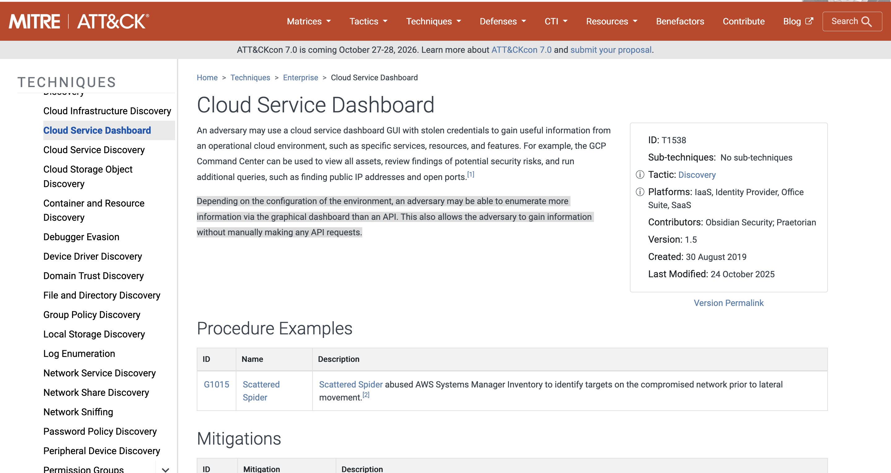
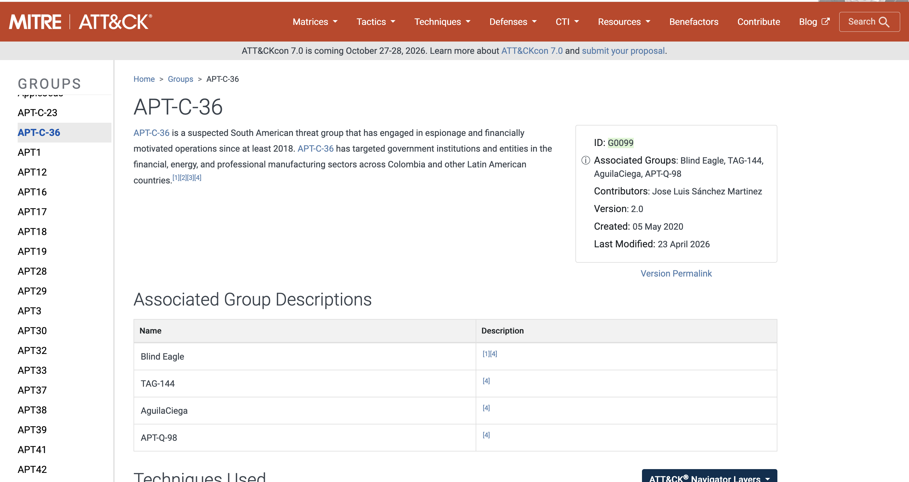
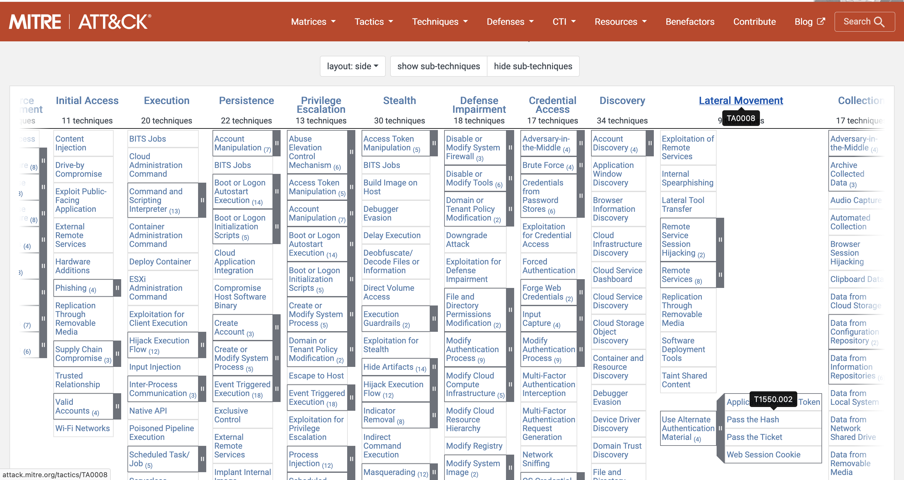
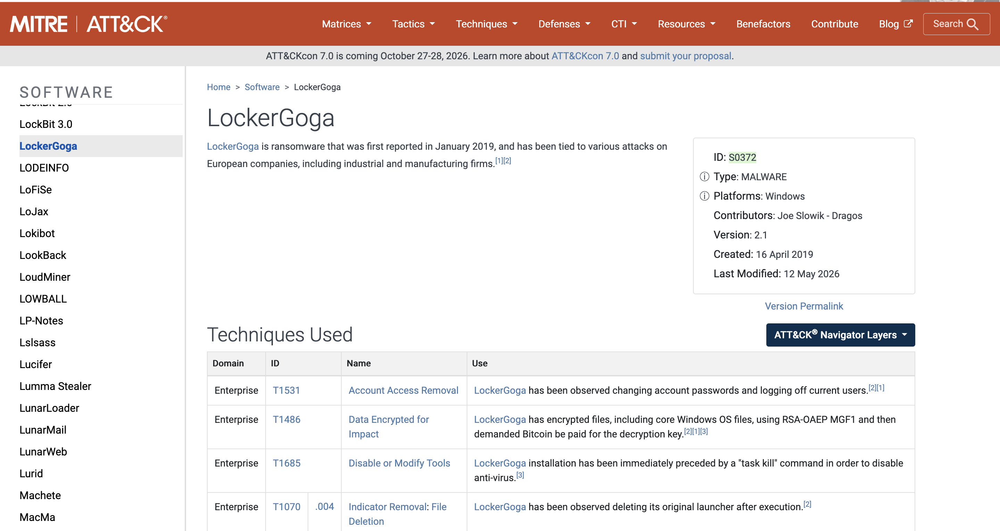
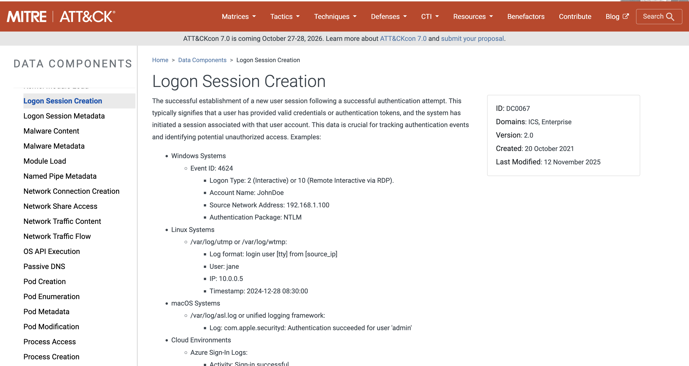

# ATT&CK — BTLO

> **Platform:** Blue Team Labs Online  
> **Category:** Threat Intelligence  
> **Difficulty:** Easy  
> **Status:** ✅ Completed  
> **Date:** 2026-06-01  
> **Time Spent:** ~1 jam  

---

## 📌 Prolog

Challenge ini mengharuskan kita berperan sebagai anggota Blue Team yang ditugaskan untuk melakukan threat intelligence. Fokusnya adalah bagaimana mengoperasionalkan MITRE ATT&CK framework untuk menyelesaikan skenario-skenario berbasis ancaman nyata.

---

## 🎯 Scenario

Kamu dipekerjakan sebagai anggota Blue Team di sebuah perusahaan dengan tugas melakukan threat intelligence. Lihat bagaimana kamu bisa mengoperasionalkan MITRE ATT&CK framework untuk menyelesaikan skenario-skenario berbasis ancaman berikut.

---

## ❓ Questions

1. Your company heavily relies on cloud services like Azure AD, and Office 365 publicly. What technique should you focus on mitigating, to prevent an attacker performing Discovery activities if they have obtained valid credentials? (Hint: Not using an API to interact with the cloud environment!)
2. You were analyzing a log and found uncommon data flow on port 4050. What APT group might this be?
3. The framework has a list of 9 techniques that falls under the tactic to try to get into your network. What is the tactic ID?
4. A software prohibits users from accessing their account by deleting, locking the user account, changing password etc. What such software has been documented by the framework?
5. Using 'Pass the Hash' technique to enter and control remote systems on a network is common. How would you detect it in your company?

---

## 🔍 Answer & Walkthrough

### 1. Cloud Service Dashboard — T1538

Pertanyaan ini mengarah ke teknik Discovery yang memanfaatkan GUI cloud dashboard, bukan API. Jika attacker sudah punya valid credentials, mereka bisa login ke portal seperti Azure AD atau Office 365 dan secara manual menjelajahi environment — melihat resource, users, permission, dan konfigurasi — tanpa perlu memanggil API sama sekali.

Teknik yang dimaksud adalah **T1538 - Cloud Service Dashboard**: tactic Discovery, berlaku di platform IaaS, Identity Provider, Office Suite, dan SaaS.

**Jawaban:** `T1538`

---

### 2. APT-C-36 — G0099

Port 4050 merupakan salah satu indikator traffic yang dikaitkan dengan **APT-C-36**, kelompok ancaman asal Amerika Selatan yang beroperasi sejak setidaknya 2018. Grup ini dikenal menarget institusi pemerintah, sektor energi, keuangan, dan manufaktur di Kolombia dan negara-negara Latin America lainnya.

Di ATT&CK, APT-C-36 terdaftar dengan ID **G0099**, juga dikenal dengan alias Blind Eagle, TAG-144, AquilaCiega, dan APT-Q-98.

**Jawaban:** `G0099`

---

### 3. Lateral Movement — TA0008

Taktik yang dimaksud adalah **Lateral Movement (TA0008)** — upaya attacker untuk bergerak dan masuk ke sistem-sistem lain di dalam jaringan setelah mendapat initial access. Pada saat challenge ini dibuat, terdapat 9 teknik yang terdaftar di bawah taktik ini.

Di ATT&CK Navigator bisa dilihat dengan jelas bahwa TA0008 memiliki jumlah teknik yang sesuai dengan clue soal.

**Jawaban:** `TA0008`

---

### 4. LockerGoga — S0372

Software yang dimaksud adalah **LockerGoga**, ransomware yang pertama kali dilaporkan pada Januari 2019 dan dikaitkan dengan serangan terhadap perusahaan industri dan manufaktur di Eropa. LockerGoga secara spesifik dikenal memblokir akses user dengan mengganti password akun (T1531 - Account Access Removal), mengenkripsi file (T1486), dan menonaktifkan antivirus sebelum eksekusi penuh.

ATT&CK mendokumentasikannya sebagai software dengan ID **S0372**, tipe MALWARE, platform Windows.

**Jawaban:** `S0372`

---

### 5. Deteksi Pass the Hash — Logon Session Creation

> ⚠️ **Disclaimer:** Teks deteksi spesifik untuk teknik Pass the Hash (T1550.002) di MITRE ATT&CK telah diperbarui pada versi terbaru framework — guidance yang dimaksud di soal ini sudah tidak muncul dengan kata-kata yang sama. Jawaban di bawah merujuk pada dokumentasi versi sebelumnya yang ditemukan melalui referensi writeup lain.

Untuk mendeteksi Pass the Hash, pendekatan yang direkomendasikan ATT&CK adalah memonitor **newly created logons** dan credentials yang digunakan dalam events, lalu review untuk discrepancies. Secara teknis ini merujuk ke Data Component **DC0067 - Logon Session Creation**: memantau Event ID 4624 dengan Logon Type 3 (Network) dan Authentication Package NTLM, kemudian identifikasi anomali seperti akun yang login ke banyak sistem dalam waktu singkat tanpa aktivitas yang wajar.

**Jawaban:** `Monitor newly created logons and credentials used in events and review for discrepancies`

---

## 🚨 Key Findings / IOCs

| Tipe | Value | Keterangan |
|------|-------|------------|
| Technique | `T1538` | Cloud Service Dashboard — Discovery via cloud GUI |
| Threat Group | `G0099` | APT-C-36 / Blind Eagle — port 4050 |
| Tactic | `TA0008` | Lateral Movement — 9 teknik |
| Software | `S0372` | LockerGoga — ransomware, account impairment |
| Data Component | `DC0067` | Logon Session Creation — deteksi Pass the Hash |

---

## 🗺️ MITRE ATT&CK Mapping

| Tactic | Technique / ID | Keterangan |
|--------|----------------|------------|
| Discovery | T1538 — Cloud Service Dashboard | Eksplorasi cloud env via GUI dengan stolen credentials |
| Lateral Movement | TA0008 | Taktik pergerakan internal jaringan, 9 teknik |
| Lateral Movement | T1550.002 — Pass the Hash | Autentikasi ke remote system menggunakan hash NTLM |
| Impact | T1531 — Account Access Removal | LockerGoga: ganti password, kunci akun user |
| Impact | T1486 — Data Encrypted for Impact | LockerGoga: enkripsi file untuk tebusan |

---

## 📋 Summary — Attacker Behavior & Todo

### Attacker Behavior

Challenge ini memotret lima skenario ancaman berbeda yang semuanya bisa dianalisis lewat ATT&CK framework:

- Attacker dengan **valid credentials** di cloud environment tidak perlu API — cukup pakai dashboard GUI (T1538) untuk reconnaissance diam-diam.
- **APT-C-36 (G0099)** adalah contoh threat group yang bisa diidentifikasi dari network anomaly seperti traffic di port tidak lazim (4050), bukan hanya dari signature malware.
- **Lateral Movement (TA0008)** adalah taktik kritis yang perlu diprioritaskan dalam monitoring jaringan internal — 9 teknik di bawahnya mencakup berbagai cara attacker berpindah sistem.
- **LockerGoga (S0372)** menunjukkan bahwa ransomware modern tidak hanya mengenkripsi file, tapi juga secara aktif memblokir akses akun untuk mempersulit respons.
- **Pass the Hash** bisa terdeteksi dari anomali logon session — NTLM auth ke banyak sistem tanpa pola wajar adalah red flag yang bisa ditangkap dari Event ID 4624.

### Todo / Follow-up

- [ ] Pelajari TTP lengkap APT-C-36 dan buat threat profile sederhana
- [ ] Coba buat detection rule di Splunk/ELK untuk Event ID 4624 Logon Type 3 + NTLM
- [ ] Jelajahi ATT&CK Navigator untuk visualisasi coverage deteksi Pass the Hash
- [ ] Review perubahan detection guidance di ATT&CK v16/v17 untuk T1550.002
- [ ] Eksplorasi teknik-teknik lain di bawah TA0008 Lateral Movement

---

## 📚 References

- [MITRE ATT&CK — T1538 Cloud Service Dashboard](https://attack.mitre.org/techniques/T1538/)
- [MITRE ATT&CK — G0099 APT-C-36](https://attack.mitre.org/groups/G0099/)
- [MITRE ATT&CK — TA0008 Lateral Movement](https://attack.mitre.org/tactics/TA0008/)
- [MITRE ATT&CK — S0372 LockerGoga](https://attack.mitre.org/software/S0372/)
- [MITRE ATT&CK — T1550.002 Pass the Hash](https://attack.mitre.org/techniques/T1550/002/)
- [MITRE ATT&CK Navigator](https://mitre-attack.github.io/attack-navigator/)

---

*Writeup ini dibuat sebagai bagian dari perjalanan belajar Blue Team / SOC Analyst.*
