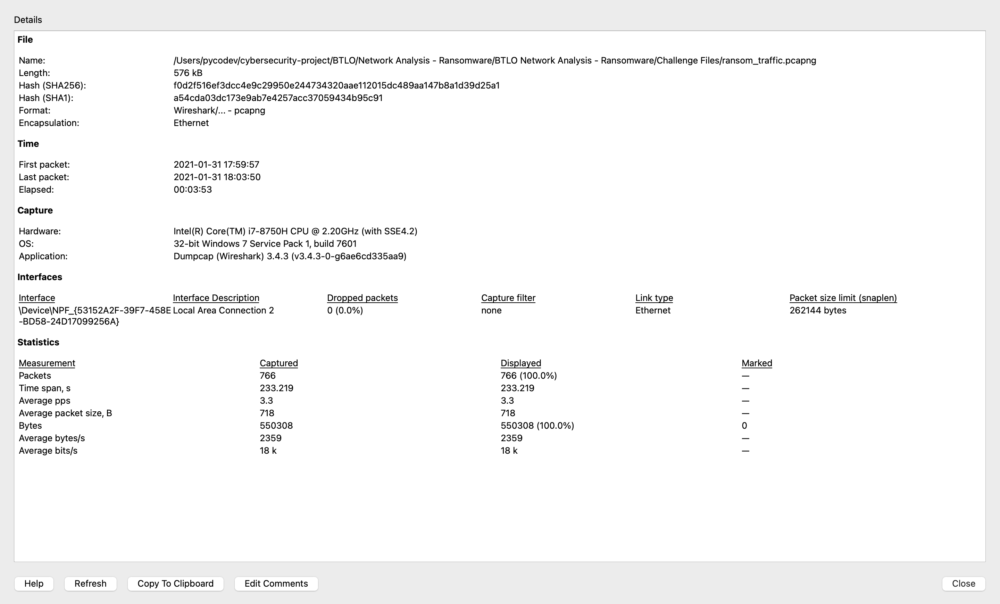
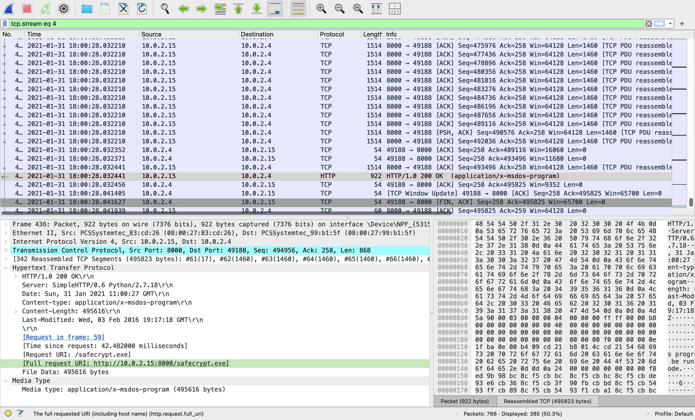
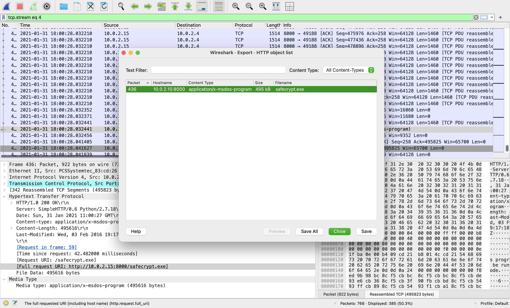
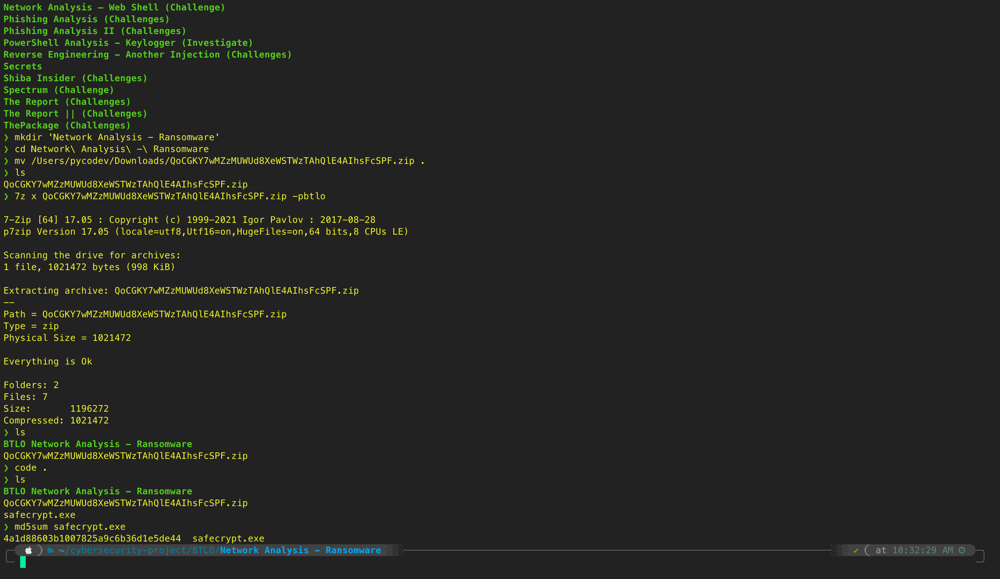
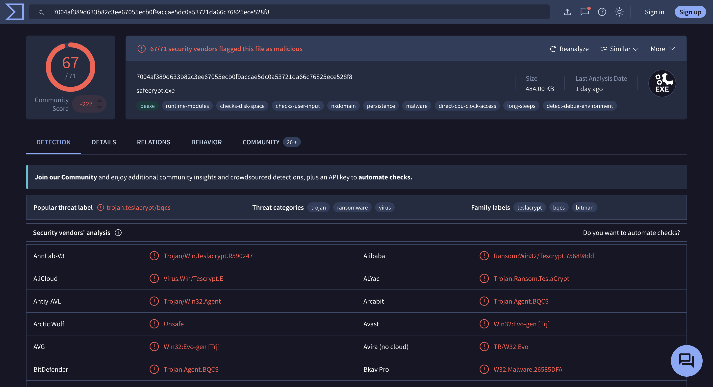
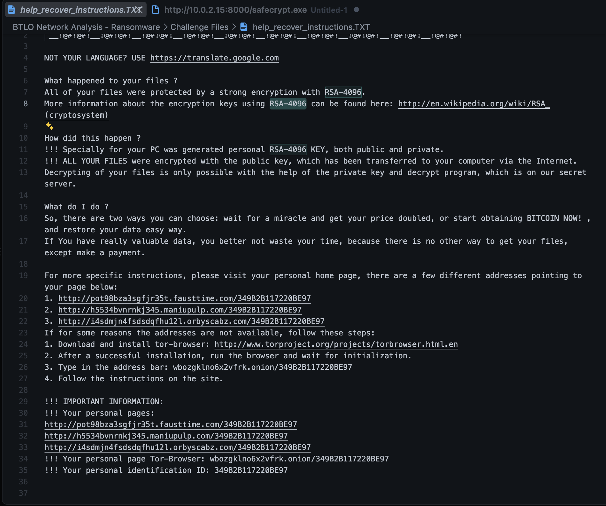
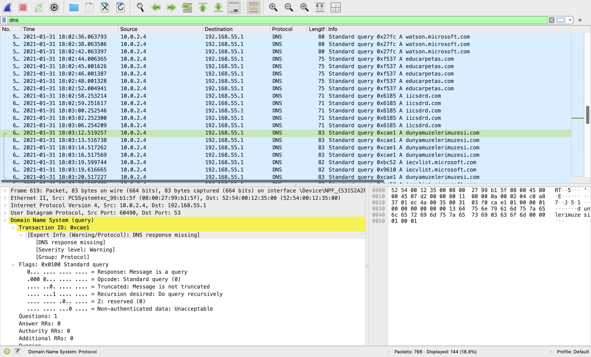
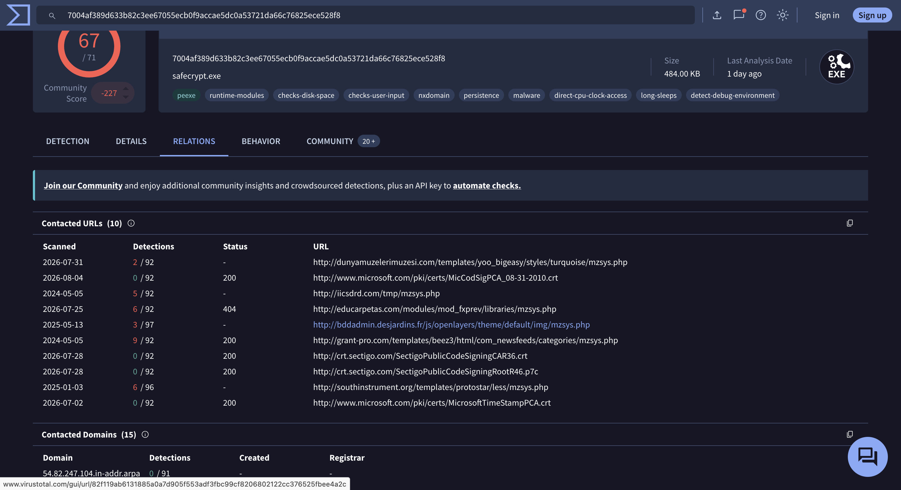
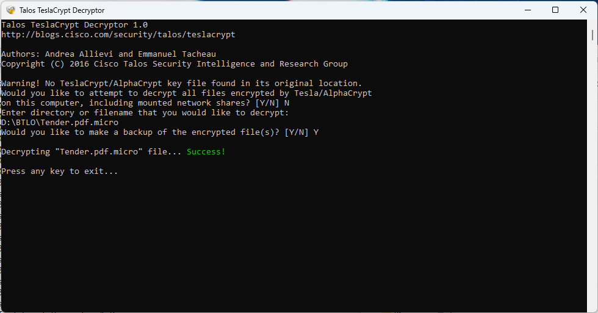
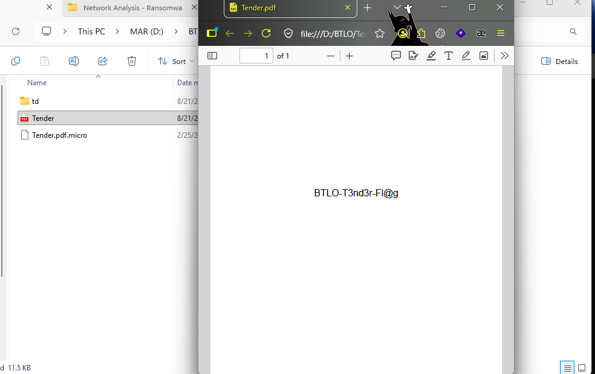

# Network Analysis - Ransomware — BTLO

> **Platform:** Blue Team Labs Online
> **Category:** Network Forensics / PCAP Analysis
> **Difficulty:** Medium
> **Status:** ✅ Completed
> **Date:** 2026-08-21
> **Time Spent:** ~3 jam

---

## 📌 Prolog

ABC Industries kerja siang malam selama sebulan buat nyiapin tender document untuk proyek besar yang bakal amankan masa depan finansial perusahaan mereka. Sialnya, perusahaan kena serangan ransomware — diduga dilakukan kompetitor — dan versi final dari tender document tersebut ke-encrypt. Sekarang mereka butuh expert yang bisa decrypt dokumen krusial ini. Yang tersedia cuma network traffic, ransom note, dan encrypted tender document itu sendiri.

Tools yang dipakai: Wireshark / TShark / TCPDump.

---

## 🎯 Scenario

ABC Industries kerja siang malam selama sebulan buat nyiapin tender document untuk proyek prestisius yang bakal amankan masa depan finansial perusahaan. Perusahaan kena serangan ransomware, diduga dilakukan oleh kompetitor, dan versi final dari tender document tersebut ter-encrypt. Saat ini mereka butuh expert yang bisa decrypt dokumen kritis ini. Artifact yang tersedia: network traffic, ransom note, dan encrypted tender document.

---

## ❓ Questions

1. What is the operating system of the host from which the network traffic was captured? (Look at Capture File Properties, copy the details exactly)
2. What is the full URL from which the ransomware executable was downloaded?
3. Name the ransomware executable file?
4. What is the MD5 hash of the ransomware?
5. What is the name of the ransomware?
6. What is the encryption algorithm used by the ransomware, according to the ransom note?
7. What is the domain beginning with 'd' that is related to ransomware traffic?
8. Decrypt the Tender document and submit the flag

---

## 🔍 Answer & Walkthrough

### 1. Operating system host capture

Buka `Statistics > Capture File Properties` di Wireshark, cek bagian `Capture > OS` — di situ tercatat detail environment yang dipakai buat capture traffic-nya.

**Jawaban:** `32-bit Windows 7 Service Pack 1, build 7601`

---

### 2. Full URL download ransomware executable

Filter `ip.addr==10.0.2.4 && ip.addr==10.0.2.15` buat fokus ke traffic antara dua host ini, lalu follow TCP stream-nya (`tcp.stream eq 4`). Ketemu response `HTTP/1.0 200 OK` dari `10.0.2.15:8000` ke `10.0.2.4`, dengan `Content-Type: application/x-msdos-program`. Detail `Full request URI` di packet detail langsung nunjukin sumber file-nya.

**Jawaban:** `http://10.0.2.15:8000/safecrypt.exe`

---

### 3. Nama file ransomware

Masih di stream yang sama, extract objek-nya lewat `File > Export Objects > HTTP`. Muncul satu entry: file `safecrypt.exe` (495 KB) yang di-serve dari `10.0.2.15:8000`.

**Jawaban:** `safecrypt.exe`

---

### 4. MD5 hash ransomware

Save file hasil export-nya, lalu hash pakai `md5sum safecrypt.exe`.

**Jawaban:** `4a1d88603b1007825a9c6b36d1e5de44`

---

### 5. Nama ransomware

Submit hash-nya ke VirusTotal. 67 dari 71 vendor flag file ini sebagai malicious, dengan popular threat label `trojan.teslacrypt/bqcs` dan family labels `teslacrypt`, `bqcs`, `bitman`.

**Jawaban:** `TeslaCrypt`

---

### 6. Algoritma enkripsi

Baca ransom note `help_recover_instructions.TXT` yang ikut disertakan di artifact. Di note-nya jelas disebutkan file di-protect pakai enkripsi `RSA-4096` (public/private key pair yang di-generate khusus buat korban).

**Jawaban:** `RSA-4096`

---

### 7. Domain berawalan 'd' yang terkait traffic ransomware

Filter `dns` di Wireshark. Kelihatan host `10.0.2.4` ngirim beberapa DNS query ke gateway `192.168.55.1`, salah satunya buat `dunyamuzelerimuzesi.com`. Cross-check ke tab **Relations** VirusTotal untuk `safecrypt.exe`, domain yang sama muncul juga di Contacted URLs (`dunyamuzelerimuzesi.com/templates/yoo_bigeasy/styles/turquoise/mzsys.php`) — jadi domain ini memang confirmed related ke ransomware, bukan cuma noise.

**Jawaban:** `dunyamuzelerimuzesi.com`

---

### 8. Decrypt Tender document

Karena ransomware-nya udah teridentifikasi sebagai TeslaCrypt, dipakai tool decryptor khusus dari Cisco Talos: [Talos TeslaCrypt Decryptor](https://github.com/Cisco-Talos/TeslaDecrypt). Jalanin tool-nya dan arahin ke file yang ter-encrypt (`Tender.pdf.micro`).

Setelah proses decrypt sukses, `Tender.pdf` bisa dibuka lagi dan isinya nunjukin flag-nya.

**Jawaban:** `BTLO-T3nd3r-Fl@g`

---

## 🚨 Key Findings / IOCs

| Tipe | Value | Keterangan |
|------|-------|------------|
| IP Address | `10.0.2.15` | Host yang serve ransomware executable via Python SimpleHTTP di port 8000 |
| IP Address | `10.0.2.4` | Host yang men-download `safecrypt.exe` dan (diduga) mengeksekusinya |
| URL | `http://10.0.2.15:8000/safecrypt.exe` | Sumber download ransomware executable |
| File | `safecrypt.exe` | Ransomware executable (TeslaCrypt) |
| File Hash (MD5) | `4a1d88603b1007825a9c6b36d1e5de44` | Hash dari `safecrypt.exe` |
| File | `Tender.pdf.micro` | Tender document yang ter-encrypt (ekstensi `.micro` khas TeslaCrypt) |
| Domain | `dunyamuzelerimuzesi.com` | Domain terkait traffic ransomware, confirmed via VirusTotal relations |
| Domain (related) | `bddadmin.desjardins.fr`, `iicsdrd.com`, `educarpetas.com`, `grant-pro.com`, `southinstrument.org` | Domain lain yang juga contacted oleh sample yang sama di VirusTotal — kemungkinan compromised site yang jadi bagian infrastruktur delivery/C2 |

---

## 🗺️ MITRE ATT&CK Mapping

| Tactic | Technique | ID | Keterangan |
|--------|-----------|----|------------|
| Execution | User Execution: Malicious File | T1204.002 | Ransomware executable (`safecrypt.exe`) dijalankan di host korban |
| Command and Control | Application Layer Protocol: Web Protocols | T1071.001 | Delivery file lewat HTTP dari staging server internal (`10.0.2.15:8000`) |
| Command and Control | Application Layer Protocol: DNS | T1071.004 | DNS query berulang ke domain-domain terkait ransomware setelah eksekusi |
| Impact | Data Encrypted for Impact | T1486 | File korban (termasuk `Tender.pdf`) di-encrypt pakai RSA-4096, diganti ekstensi `.micro` |

---

## 📋 Summary — Attacker Behavior & Todo

### Attacker Behavior

Kedua host yang relevan ada di subnet internal `10.0.2.x`. Host `10.0.2.15` berperan sebagai staging/delivery server — dia jalanin Python SimpleHTTP server di port 8000 buat serve `safecrypt.exe`. Host `10.0.2.4` yang melakukan GET request dan men-download file tersebut.

Artifact ini nggak menyertakan memory dump, jadi eksekusi ransomware di `10.0.2.4` nggak bisa dikonfirmasi langsung dari proses — analisis ini murni network-based. Tapi indikatornya cukup kuat: setelah file di-download, `10.0.2.4` mulai ngirim DNS query ke gateway `192.168.55.1` buat resolve beberapa domain, salah satunya `dunyamuzelerimuzesi.com`. VirusTotal mengonfirmasi domain ini related ke `safecrypt.exe` (contacted URL `dunyamuzelerimuzesi.com/templates/yoo_bigeasy/styles/turquoise/mzsys.php`), bareng beberapa domain lain yang juga related seperti `bddadmin.desjardins.fr` dan `iicsdrd.com`. Pola ini konsisten sama check-in traffic khas TeslaCrypt.

Ransom note (`help_recover_instructions.TXT`) menyatakan file di-encrypt pakai RSA-4096. Untuk recovery, dipakai tool decryptor open-source dari Cisco Talos ([TeslaDecrypt](https://github.com/Cisco-Talos/TeslaDecrypt)) yang memang didesain khusus buat menangani skema enkripsi TeslaCrypt/AlphaCrypt. Hasilnya, `Tender.pdf.micro` berhasil di-decrypt balik jadi `Tender.pdf`, dan flag-nya ketemu di dalam dokumen tersebut.

### Todo / Follow-up

- [ ] Pelajari lebih dalam soal kelemahan key generation TeslaCrypt yang bikin tool decryptor seperti Talos bisa recover private key tanpa perlu bayar ransom
- [ ] Cross-reference domain-domain terkait (`bddadmin.desjardins.fr`, `iicsdrd.com`, `educarpetas.com`, dll) buat mapping infrastruktur campaign ini lebih luas
- [ ] Coba build timeline lengkap dari delivery sampai encryption pakai Wireshark IO Graph

---

## 📚 References

- [Talos TeslaCrypt Decryptor — Cisco Talos](https://github.com/Cisco-Talos/TeslaDecrypt)
- [RSA (cryptosystem) — Wikipedia](https://en.wikipedia.org/wiki/RSA_(cryptosystem))

---

*Writeup ini dibuat sebagai bagian dari perjalanan belajar Blue Team / SOC Analyst.*
