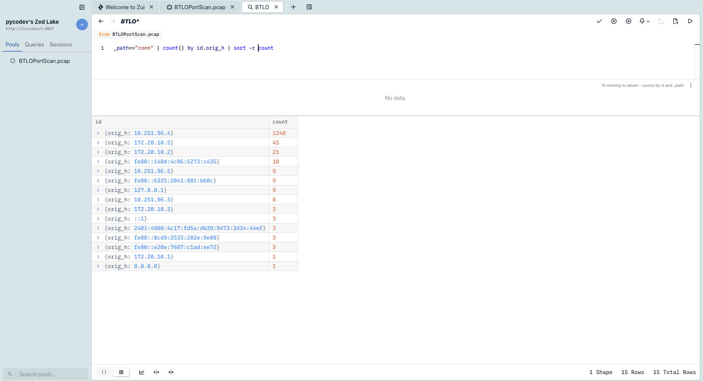
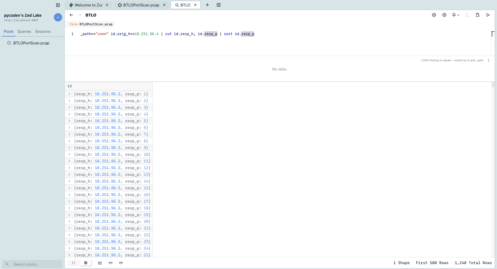
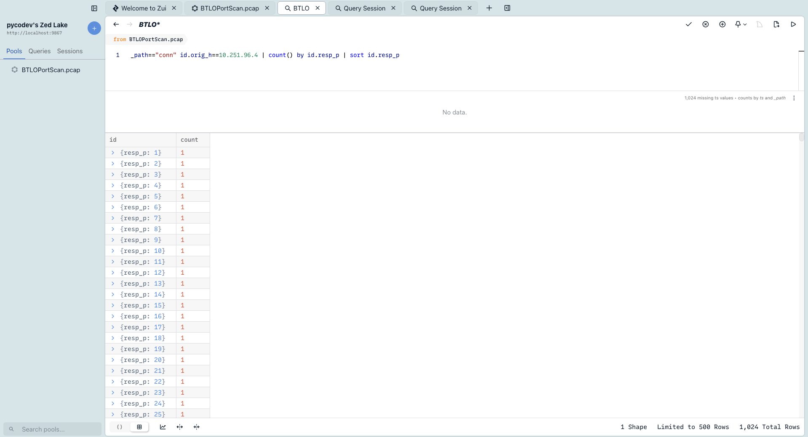
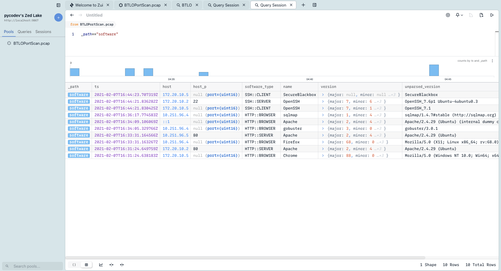
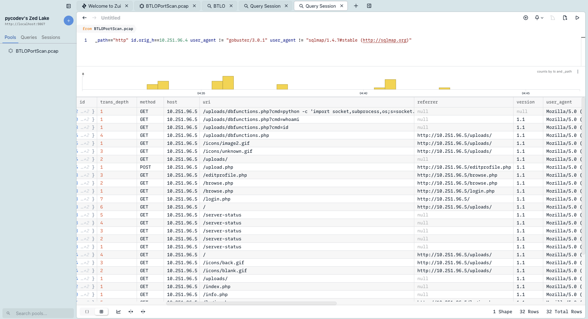
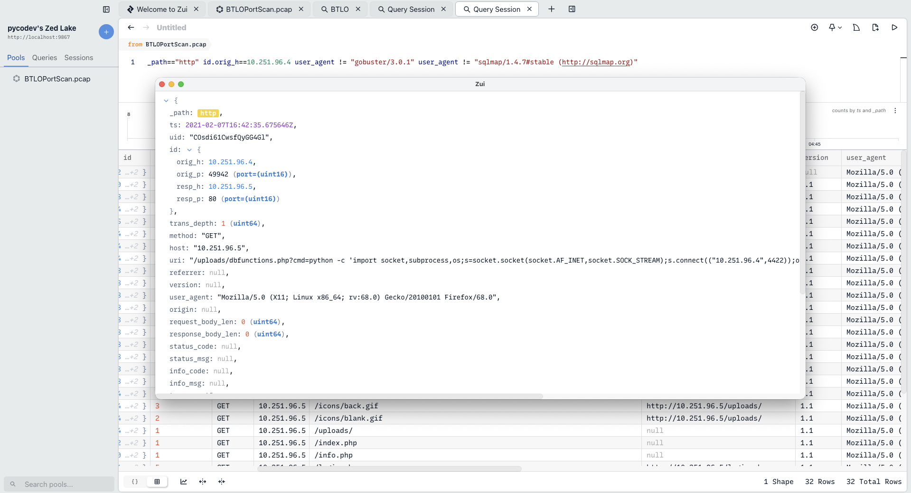

# Network Analysis - Web Shell — BTLO

> **Platform:** Blue Team Labs Online  
> **Category:** Network Forensics / PCAP Analysis  
> **Difficulty:** Easy  
> **Status:** ✅ Completed  
> **Date:** 2026-06-18  
> **Time Spent:** ~2 jam  

---

## 📌 Prolog

SOC menerima alert dari SIEM untuk aktivitas *'Local to Local Port Scanning'* — sebuah IP internal mulai melakukan scanning ke sistem internal lainnya. Challenge ini meminta kita untuk menginvestigasi apakah aktivitas tersebut memang berbahaya, menggunakan tools seperti Wireshark, TCPDump, atau TShark.

Saya memilih menggunakan **Brim (Zui)** sebagai tool utama karena query Zed-nya memudahkan filtering dan agregasi data PCAP secara efisien.

---

## 🎯 Scenario

SOC menerima alert di SIEM mereka untuk aktivitas *'Local to Local Port Scanning'*, di mana sebuah IP private internal mulai melakukan scanning ke sistem internal lain. Investigasi dan tentukan apakah aktivitas ini berbahaya atau tidak. Artifact yang diberikan berupa file PCAP untuk dianalisis menggunakan tools pilihan.

---

## ❓ Questions

1. What is the IP responsible for conducting the port scan activity?
2. What is the port range scanned by the suspicious host?
3. What is the type of port scan conducted?
4. Two more tools were used to perform reconnaissance against open ports, what were they?
5. What is the name of the php file through which the attacker uploaded a web shell?
6. What is the name of the web shell that the attacker uploaded?
7. What is the parameter used in the web shell for executing commands?
8. What is the first command executed by the attacker?
9. What is the type of shell connection the attacker obtains through command execution?
10. What is the port he uses for the shell connection?

---

## 🔍 Answer & Walkthrough

### Langkah Awal — Kenali Struktur PCAP di Brim

Pertama, cek `_path` yang tersedia untuk tahu kategori packet apa saja yang ada di PCAP ini:

```
count() by _path | sort -r count
```



Dari sini terlihat ada kategori `conn`, `http`, dan `files`. Fokus investigasi di tiga kategori itu — terutama `conn` dan `http`.

---

### 1. What is the IP responsible for conducting the port scan activity?

Cek akumulasi koneksi per source IP dari log `conn`:

```
_path=="conn" | count() by id.orig_h | sort -r count
```



Hasil agregasi:

| IP | Count |
|----|-------|
| `10.251.96.4` | 1240 |
| `172.20.10.5` | 54 |
| `172.20.10.2` | 21 |
| `10.251.96.5` | 9 |
| `10.251.96.3` | 8 |
| `172.20.10.3` | 3 |
| `172.20.10.1` | 1 |

`10.251.96.4` jauh di atas yang lain dengan 1240 koneksi — jelas anomali.

**Jawaban:** `10.251.96.4`

---

### 2. What is the port range scanned by the suspicious host?

Filter koneksi dari IP tersebut, lalu lihat distribusi destination port:

```
_path=="conn" | id.orig_h==10.251.96.4 | count() by id.resp_p | sort id.resp_p
```



Port yang di-hit berurutan mulai dari 1 hingga 1024.

**Jawaban:** `1-1024`

---

### 3. What is the type of port scan conducted?

Cek `conn_state` untuk lihat karakteristik koneksi:

```
_path=="conn" | id.orig_h==10.251.96.4 | count() by conn_state
```

| conn_state | Count |
|------------|-------|
| `REJ` | 1022 |
| `SF` | 212 |
| `S0` | 3 |
| `RSTO` | 2 |
| `S2` | 1 |

Mayoritas `REJ` — scanner mengirim SYN, target membalas RST/ACK karena port closed. Ini ciri khas **TCP SYN Scan** (half-open scan): handshake tidak pernah diselesaikan.

**Jawaban:** `TCP SYN`

---

### 4. Two more tools were used to perform reconnaissance against open ports, what were they?

Pindah ke log `http` untuk melihat User-Agent dari request yang masuk:

```
_path=="http" | id.orig_h==10.251.96.4 | cut user_agent | sort user_agent
```



Dua tool recon terdeteksi dari User-Agent:

- `gobuster/3.0.1` — directory/file enumeration
- `sqlmap/1.4.7` — SQL injection scanner

**Jawaban:** `gobuster, sqlmap`

---

### 5. What is the name of the php file through which the attacker uploaded a web shell?

Filter HTTP request method POST untuk menemukan aktivitas upload:

```
_path=="http" | id.orig_h==10.251.96.4 | method=="POST" | cut uri
```



Upload dilakukan melalui endpoint PHP yang memiliki fitur file upload.

**Jawaban:** `editprofile.php`

---

### 6. What is the name of the web shell that the attacker uploaded?

Dari request POST ke `editprofile.php`, lihat nama file yang di-upload — bisa dicek dari log `files` atau detail HTTP body di Brim.

**Jawaban:** `dbfunctions.php`

---

### 7. What is the parameter used in the web shell for executing commands?

Setelah web shell terupload, attacker mengaksesnya dengan mengirim perintah melalui parameter GET/POST. Dari HTTP log terlihat request ke `dbfunctions.php` menggunakan parameter tertentu untuk eksekusi command.

**Jawaban:** `cmd`

---

### 8. What is the first command executed by the attacker?

Command pertama yang dikirim attacker melalui web shell — umumnya digunakan untuk reconnaissance awal (cek privilege/user saat ini).

**Jawaban:** `id`

---

### 9. What is the type of shell connection the attacker obtains through command execution?

Dari request selanjutnya, attacker menjalankan command Python untuk membuat koneksi balik ke mesin attacker.

**Jawaban:** `reverse shell`

---

### 10. What is the port he uses for the shell connection?



Command Python reverse shell yang dieksekusi attacker mengarah ke port spesifik di `10.251.96.4`.

**Jawaban:** `4422`

---

## 🚨 Key Findings / IOCs

| Tipe | Value | Keterangan |
|------|-------|------------|
| IP Address | `10.251.96.4` | Attacker — melakukan port scan dan eksploitasi |
| IP Address | `10.251.96.5` | Target — web server yang diserang |
| File | `editprofile.php` | Entry point upload web shell |
| File | `dbfunctions.php` | Web shell yang diupload attacker |
| Port | `4422` | Port reverse shell callback |
| Tool | `gobuster/3.0.1` | Digunakan untuk directory enumeration |
| Tool | `sqlmap/1.4.7` | Digunakan untuk SQL injection scanning |

---

## 🗺️ MITRE ATT&CK Mapping

| Tactic | Technique | ID | Keterangan |
|--------|-----------|----|------------|
| Discovery | Network Service Discovery | T1046 | Port scan 1-1024 menggunakan TCP SYN |
| Reconnaissance | Active Scanning: Wordlist Scanning | T1595.003 | Gobuster & sqlmap untuk enumerasi web |
| Persistence | Server Software Component: Web Shell | T1505.003 | Upload `dbfunctions.php` via `editprofile.php` |
| Command and Control | — | — | Reverse shell ke `10.251.96.4:4422` |

---

## 📋 Summary — Attacker Behavior & Todo

### Attacker Behavior

`10.251.96.4` adalah device yang telah terkompromi dan digunakan sebagai pivot untuk menyerang `10.251.96.5`. Alur serangan berjalan dari discovery, recon web, eksploitasi file upload, hingga persistent access via reverse shell:

1. **Discovery** — Attacker melakukan TCP SYN scan ke port 1–1024 pada target `10.251.96.5` untuk memetakan service yang berjalan.
2. **Web Recon** — Setelah menemukan port HTTP terbuka, attacker menggunakan `gobuster` untuk enumerasi direktori/file dan `sqlmap` untuk mencari celah SQL injection.
3. **Web Shell Upload** — Attacker menemukan celah file upload di `editprofile.php` dan berhasil mengupload web shell `dbfunctions.php`.
4. **Command Execution** — Web shell diakses menggunakan parameter `cmd`. Command pertama yang dijalankan adalah `id` untuk mengecek privilege.
5. **Reverse Shell** — Attacker mengeksekusi Python reverse shell yang connect kembali ke `10.251.96.4` pada port `4422`, memberikan akses shell interaktif ke target.

### Todo / Follow-up

- [ ] Pelajari cara deteksi web shell upload di level network — pattern apa yang bisa dijadikan Snort/Suricata rule
- [ ] Explore `files` log di Brim/Zui lebih dalam — bisa extract file yang diupload langsung dari PCAP
- [ ] Pelajari Python reverse shell one-liner yang umum dipakai attacker dan cara deteksinya
- [ ] Buat Sigma rule untuk deteksi pola User-Agent scanning tool (gobuster, sqlmap, nikto)

---

## 📚 References

- [Wireshark Documentation](https://www.wireshark.org/docs/)
- [Zui / Brim Documentation](https://zui.brimdata.io/docs/)
- [MITRE ATT&CK — Network Service Scanning (T1046)](https://attack.mitre.org/techniques/T1046/)
- [MITRE ATT&CK — Active Scanning: Wordlist Scanning (T1595.003)](https://attack.mitre.org/techniques/T1595/003/)
- [MITRE ATT&CK — Web Shell (T1505.003)](https://attack.mitre.org/techniques/T1505/003/)

---

*Writeup ini dibuat sebagai bagian dari perjalanan belajar Blue Team / SOC Analyst.*
