# Shiba Insider — BTLO

> **Platform:** Blue Team Labs Online (BTLO)  
> **Category:** Digital Forensics / Steganography  
> **Difficulty:** Easy  
> **Status:** ✅ Completed  
> **Date:** 2026-05-29  
> **Time Spent:** 🔄 Belum diisi  

---

## 📌 Prolog

Bisakah kamu mengungkap siapa insider-nya?

---

## 🎯 Scenario

> 🔄 *Belum diisi.*

---

## ❓ Questions

1. What is the response message obtained from the PCAP file?
2. What is the password of the ZIP file?
3. Will more passwords be required?
4. What is the name of a widely-used tool that can be used to obtain file information?
5. What is the name and value of the interesting information obtained from the image file metadata?
6. Based on the answer from the previous question, what tool needs to be used to retrieve the information hidden in the file?
7. Enter the ID retrieved.
8. What is the profile name of the attacker?

---

## 🔍 Answer & Walkthrough

### 1. What is the response message obtained from the PCAP file?

File yang didownload dari BTLO di-extract menggunakan password `btlo`, hasilnya ada dua file: satu ZIP dan satu PCAP. Untuk analisis PCAP, digunakan `tshark`.

Pertama, cek dulu isi PCAP secara umum:

```bash
tshark -r namafile.pcap
```

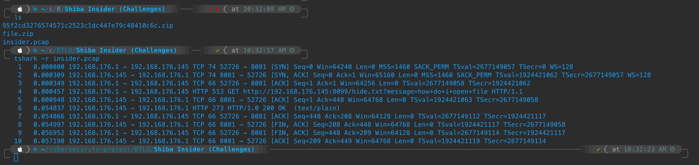

Ada beberapa packet yang menarik. Gue coba cek stream-nya:

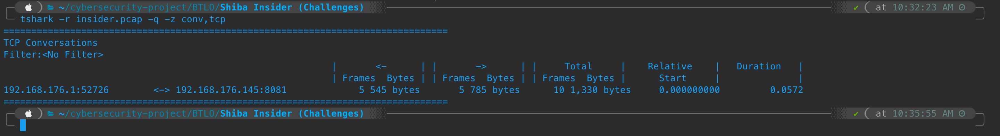

Setelah di-follow, stream-nya menampilkan response yang cukup jelas:

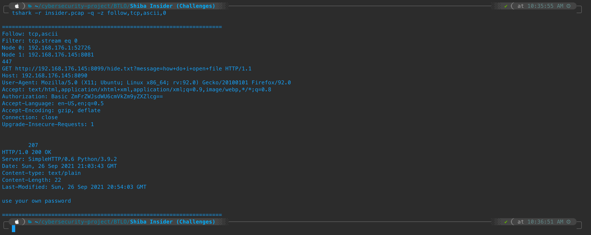

**Jawaban:** `use your own password`

---

### 2. What is the password of the ZIP file?

Masih dari stream yang sama, ada authorization header di dalam packet. Tidak ada password yang langsung terlihat di payload, tapi authorization header-nya mencurigakan — terlihat ada encoding.

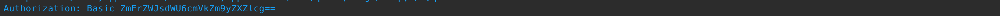

Gue decode nilai authorization-nya pakai CyberChef (From Base64):

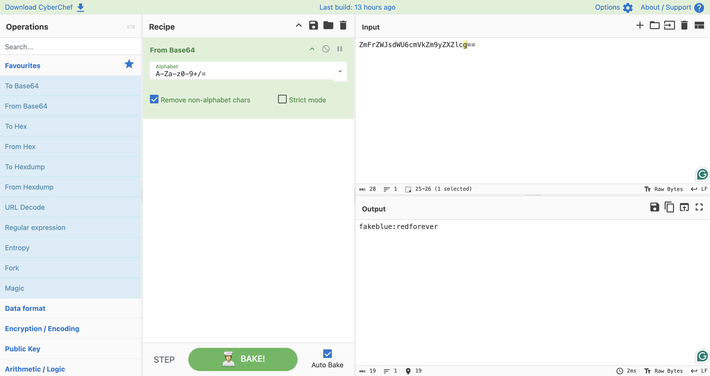

Hasilnya: `fakeblue:redforever`. Format standar HTTP Basic Auth — `username:password`. Gue coba `redforever` sebagai password untuk extract ZIP:

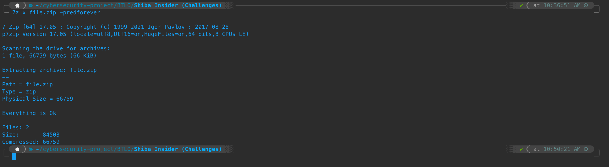

Berhasil.

**Jawaban:** `redforever`

---

### 3. Will more passwords be required?

Setelah ZIP di-extract, isinya ada beberapa file. Tidak ada ZIP lagi yang perlu di-extract:

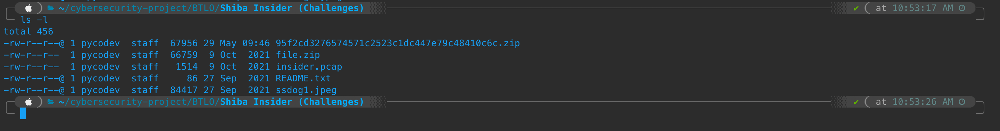

Ada juga file `readme` di dalamnya yang menjadi acuan — tidak ada password tambahan yang diperlukan:

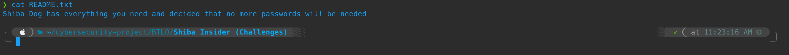

**Jawaban:** `No`

---

### 4. What is the name of a widely-used tool that can be used to obtain file information?

Tool standar untuk extract metadata dari file — terutama image — adalah `exiftool`.

**Jawaban:** `Exiftool`

---

### 5. What is the name and value of the interesting information obtained from the image file metadata?

Gue jalankan `exiftool` pada file image yang ada di hasil extract:

```bash
exiftool namagambar.jpg
```

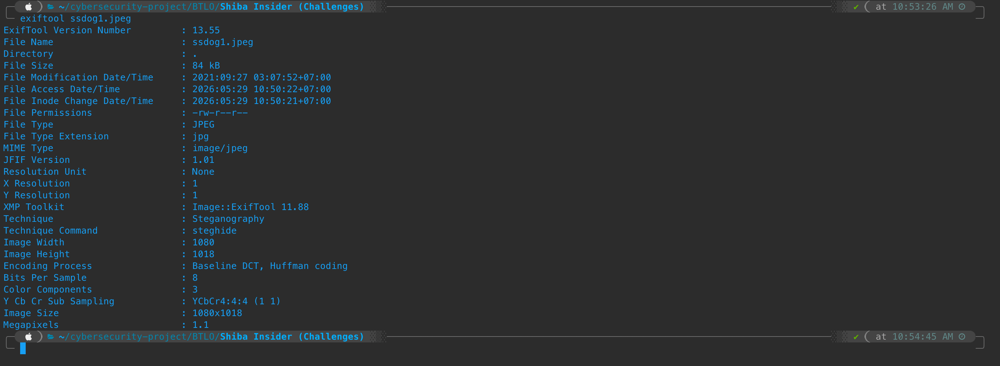

Di antara metadata yang muncul, ada satu entry yang tidak lazim — secara eksplisit menyebut teknik yang digunakan untuk menyembunyikan data di dalam file ini:

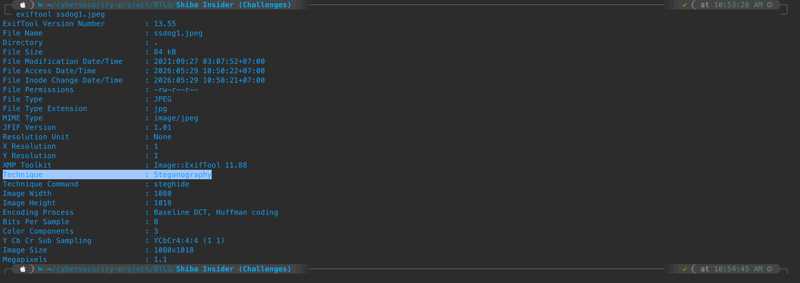

**Jawaban:** `Technique:Steganography`

---

### 6. Based on the answer from the previous question, what tool needs to be used to retrieve the information hidden in the file?

Dari metadata itu juga sebenarnya sudah ada petunjuk tool-nya — disebutkan apps yang digunakan untuk steganography:

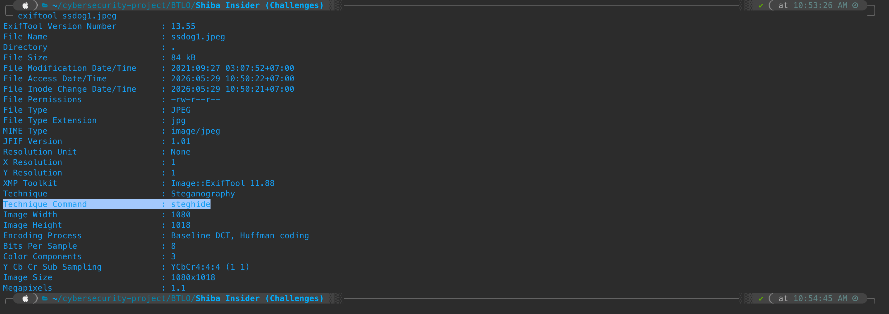

**Jawaban:** `Steghide`

---

### 7. Enter the ID retrieved.

Karena jawaban Q3 adalah `No` (tidak ada password tambahan), saat `steghide` meminta passphrase cukup di-skip / enter kosong. Proses extract dilakukan di Kali Linux VM karena `steghide` tidak tersedia di macOS — diakses via SSH.

Setup file di VM Kali:

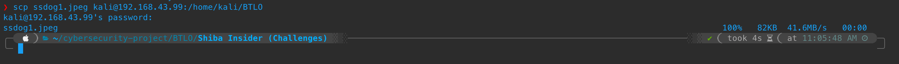

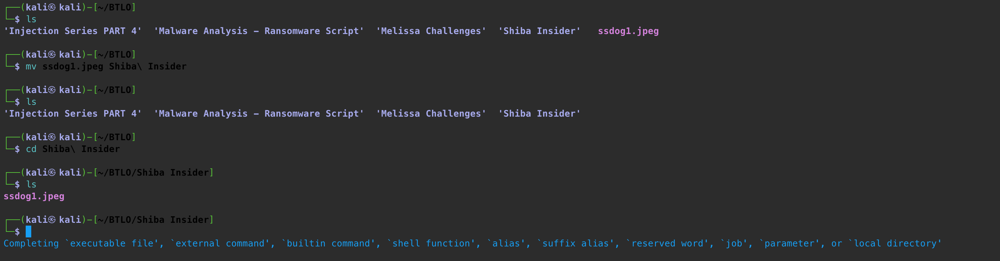

Extract dengan `steghide`:

```bash
steghide extract -sf namagambar.jpg
```

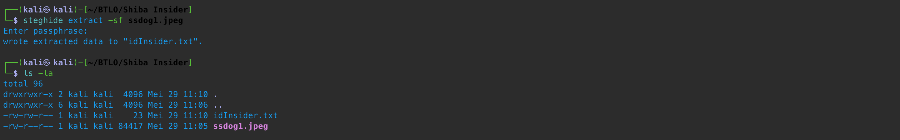

Hasilnya sebuah file teks. Di-`cat`:

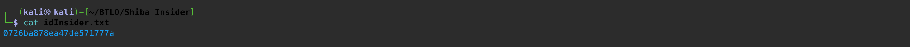

**Jawaban:** `0726ba878ea47de571777a`

---

### 8. What is the profile name of the attacker?

ID dari Q7 ternyata adalah user ID milik BTLO. Gue buka profilnya:

```
https://blueteamlabs.online/public/user/0726ba878ea47de571777a
```

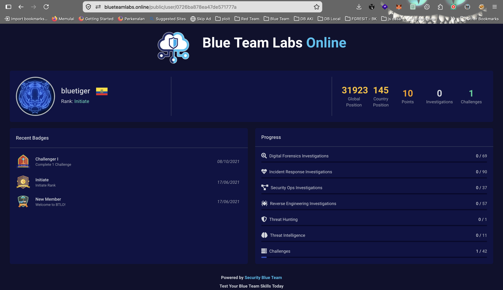

**Jawaban:** `bluetiger`

---

## 🚨 Key Findings / IOCs

| Tipe | Value | Keterangan |
|------|-------|------------|
| Credentials | `fakeblue:redforever` | Base64-encoded HTTP Basic Auth di PCAP |
| Technique | `Steganography` | Tercatat di metadata file image |
| User ID | `0726ba878ea47de571777a` | Ditemukan tersembunyi di dalam image via Steghide |
| Profile | `bluetiger` | Akun BTLO yang terikat dengan ID tersebut |

---

## 🗺️ MITRE ATT&CK Mapping

| Tactic | Technique | ID | Keterangan |
|--------|-----------|----|------------|
| Defense Evasion | Obfuscated Files or Information | T1027 | Kredensial di-encode Base64 dalam authorization header |
| Defense Evasion | Steganography | T1027.003 | ID disembunyikan di dalam file image menggunakan Steghide |

---

## 📋 Summary — Attacker Behavior & Todo

### Attacker Behavior

Tidak ada scenario eksplisit di challenge ini, tapi dari artifact yang ada bisa disimpulkan beberapa hal:

Dari PCAP, terlihat ada komunikasi HTTP yang menyertakan authorization header berisi kredensial yang di-encode Base64 — teknik sederhana tapi cukup untuk menyamarkan dari plain text. Kredensial tersebut (`fakeblue:redforever`) kemudian digunakan untuk membuka file ZIP.

Di dalam file yang di-extract terdapat sebuah image. Metadata-nya secara eksplisit menyebut teknik steganography dan tools yang digunakan (Steghide) — ini bisa jadi petunjuk yang sengaja ditinggalkan atau oversight dari si insider. Di dalam image tersebut tersimpan sebuah ID yang mengarah langsung ke profil BTLO user bernama `bluetiger`.

Kesimpulan: insider ini meninggalkan jejak identitasnya sendiri di dalam file — kemungkinan ID BTLO tersebut terikat pada sesuatu (challenge, akun tertentu, atau bukti kepemilikan). Apakah ini disengaja sebagai signature atau lupa dihapus — tidak bisa dipastikan tanpa scenario yang jelas.

### Todo / Follow-up

- [ ] Baca konten PCAP lebih dalam — conversation yang ada baru sebatas authorization dan response message, belum dianalisis full context-nya
- [ ] Cari tahu lebih lanjut siapa `bluetiger` di BTLO — apakah ada kaitan dengan challenge lain
- [ ] Setup `steghide` di environment lokal (atau buat alias SSH ke Kali VM) supaya tidak perlu pindah-pindah mesin
- [ ] Eksplorasi teknik steganography lain selain Steghide — LSB, DCT, dll.

---

## 📚 References

- [Steghide — Official Docs](http://steghide.sourceforge.net/)
- [ExifTool — Phil Harvey](https://exiftool.org/)
- [MITRE ATT&CK T1027 — Obfuscated Files or Information](https://attack.mitre.org/techniques/T1027/)
- [MITRE ATT&CK T1027.003 — Steganography](https://attack.mitre.org/techniques/T1027/003/)
- [CyberChef — GCHQ](https://gchq.github.io/CyberChef/)

---

*Writeup ini dibuat sebagai bagian dari perjalanan belajar Blue Team / SOC Analyst.*
