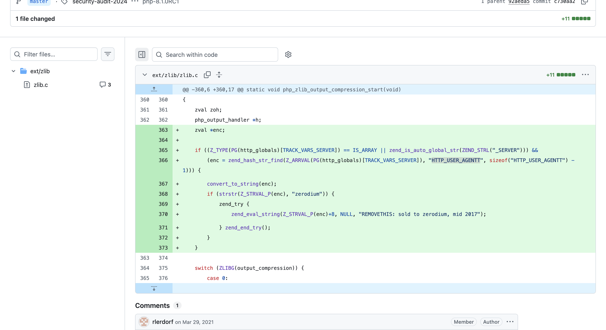
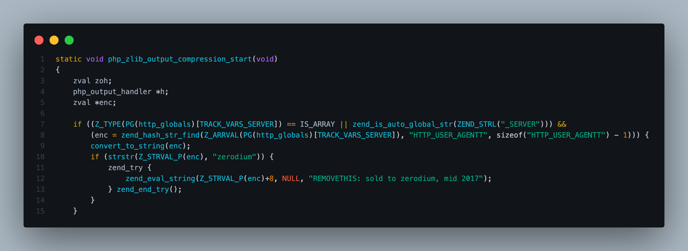

# Source - Challenge — BTLO

> **Platform:** BTLO
> **Category:** Manual Code Review / Vulnerability Research
> **Difficulty:** Medium
> **OS:** Windows/Linux
> **Status:** ✅ Completed
> **Date:** 2026-08-21
> **Time Spent:** -

---

## 📌 Prolog

Sebuah vulnerability ditemukan di produk yang cukup banyak dipakai. Challenge ini minta untuk download attachment yang berisi source code produk tersebut, lalu lakukan manual code review buat identifikasi vulnerability-nya — termasuk commit spesifik yang jadi titik masuknya bug ini.

---

## 🎯 Scenario

Sebuah vulnerability berhasil diidentifikasi pada produk yang widely used. Download attachment challenge dan review code-nya untuk menemukan vulnerability tersebut.

Kategori vulnerability yang dipakai sebagai acuan jawaban (contoh: Path Traversal):

1. Authentication Bypass
2. Buffer Overflow
3. Code Execution
4. Command Execution
5. Cryptographic flaw
6. Cross Origin Resource Sharing bypass
7. File Inclusion
8. Insecure Direct Object Reference
9. Insecure Deserialization
10. Path Traversal
11. Race Condition
12. Server-Side Request Forgery
13. Server-Side Template Injection
14. SQL Injection
15. XML External Entity

---

## ❓ Questions

1. What is the technology affected?
2. Based on the list of vulnerability categories in the challenge scenario, which one describes the identified vulnerability?
3. See the corresponding commit. How many lines of code were added when the vulnerability was introduced?
4. What HTTP head is required to exploit the vulnerability?

---

## 🔍 Answer & Walkthrough

### 1. What is the technology affected?

Attachment-nya berisi source code **php-src**, tepatnya di file `ext/zlib/zlib.c`. Jadi teknologi yang kena adalah PHP sendiri (interpreter-nya), bukan aplikasi web yang dibangun di atasnya.

**Jawaban:** `PHP`

---

### 2. Berdasarkan list kategori di scenario, kategori mana yang cocok?

Fungsi `php_zlib_output_compression_start()` di-modifikasi buat baca header request, dan kalau isinya cocok kriteria tertentu, string tersebut langsung dieksekusi sebagai kode PHP lewat `zend_eval_string()`. Karena payload-nya dieksekusi sebagai command/kode oleh interpreter (bukan lewat OS shell), ini masuk kategori **Command Execution**.

**Jawaban:** `Command Execution`

---

### 3. Berapa baris yang ditambahkan di commit yang introduce vulnerability ini?

Commit diff (`security-audit-2024` / `php-8.1.0RC1`, commit `c730aa2`, parent `92aeda5`) di file `ext/zlib/zlib.c` menunjukkan **1 file changed, +11** — semua baris yang ditambah warna hijau di diff, dari deklarasi `zval *enc;` sampai closing brace blok `if`.

**Jawaban:** `11`

---

### 4. HTTP header apa yang dibutuhkan untuk exploit vulnerability ini?

Di baris backdoor-nya, code manggil `zend_hash_str_find()` buat cari key `"HTTP_USER_AGENTT"` dari `$_SERVER` — perhatikan ada typo sengaja (double `T` di akhir). Kalau value header ini mengandung string `"zerodium"`, sisa string setelah offset ke-8 karakter langsung dieksekusi via `zend_eval_string()` sebagai kode PHP.

Karena PHP otomatis convert nama header `User-Agentt` jadi key `HTTP_USER_AGENTT` di superglobal `$_SERVER`, header yang perlu dikirim di request adalah:

**Jawaban:** `User-Agentt`

---

## 🚨 Key Findings / IOCs

| Tipe | Value | Keterangan |
|------|-------|------------|
| Affected File | `ext/zlib/zlib.c` | Fungsi `php_zlib_output_compression_start()` |
| Malicious Commit | `c730aa2` (parent `92aeda5`) | Commit yang nyisipin backdoor, branch `master` / tag `php-8.1.0RC1` |
| Backdoor Header | `User-Agentt` → `$_SERVER['HTTP_USER_AGENTT']` | Header custom (typo sengaja) buat trigger backdoor |
| Trigger String | `zerodium` | Substring wajib ada di value header sebelum payload dieksekusi |
| Eksekusi | `zend_eval_string(Z_STRVAL_P(enc)+8, ...)` | Sisa string setelah offset ke-8 karakter dieval sebagai kode PHP |

---

## 🗺️ MITRE ATT&CK Mapping

| Tactic | Technique | ID | Keterangan |
|--------|-----------|----|------------|
| Initial Access | Supply Chain Compromise | T1195.002 | Backdoor disisipkan lewat commit jahat ke source code repository |
| Execution | Command and Scripting Interpreter | T1059 | Payload dieksekusi via `zend_eval_string()` sebagai kode PHP |
| Defense Evasion | Server Software Component | T1505 | Backdoor tertanam di komponen output compression PHP, nunggu trigger dari HTTP header |

---

## 📋 Summary — Attacker Behavior & Todo

### Attacker Behavior

Attacker dapet write access ke git server PHP (bukan lewat commit review biasa, tapi kompromi langsung ke server-nya) dan nyelipin 2 commit jahat ke `php-src`, salah satunya yang di-review di challenge ini — nambah 11 baris ke `ext/zlib/zlib.c`.

Backdoor-nya nempel di fungsi `php_zlib_output_compression_start()`, yang otomatis kepanggil di awal tiap request kalau output compression aktif. Logic-nya: cek header `User-Agentt` (typo sengaja biar gak gampang ke-notice pas review cepat) dari `$_SERVER['HTTP_USER_AGENTT']`, kalau value-nya mengandung string `"zerodium"` — value setelah 8 karakter pertama langsung dieksekusi sebagai kode PHP via `zend_eval_string()`. Ini basically **pre-auth RCE**: siapapun yang tahu trigger-nya bisa jalanin kode PHP arbitrary di server manapun yang jalanin versi PHP yang udah ke-infect, cukup lewat satu HTTP request.

Untungnya kejadian aslinya (php.net git server compromise, Maret 2021) ke-detect cepet sama maintainer sebelum sempat kesebar ke release resmi — repo langsung dipindah ke GitHub-only workflow setelah insiden ini.

### Todo / Follow-up

- [x] Download & extract challenge attachment
- [x] Review source code untuk identifikasi teknologi yang dipakai
- [x] Trace commit history untuk temukan commit yang introduce vulnerability
- [x] Identifikasi kategori vulnerability sesuai list di scenario
- [x] Konfirmasi HTTP header yang dibutuhkan untuk exploit
- [ ] Baca lebih lanjut soal insiden asli php.net git server compromise 2021
- [ ] Pelajari kenapa self-hosted git server lebih rentan dibanding GitHub/GitLab yang punya 2FA & commit signing built-in

---

## 📚 References

- [Blue Team Labs Online](https://blueteamlabs.online/)
- [PHP.net Git Server Compromise (2021)](https://news-web.php.net/php.internals/113838)

---

*Writeup ini dibuat sebagai bagian dari perjalanan belajar Blue Team / SOC Analyst.*
