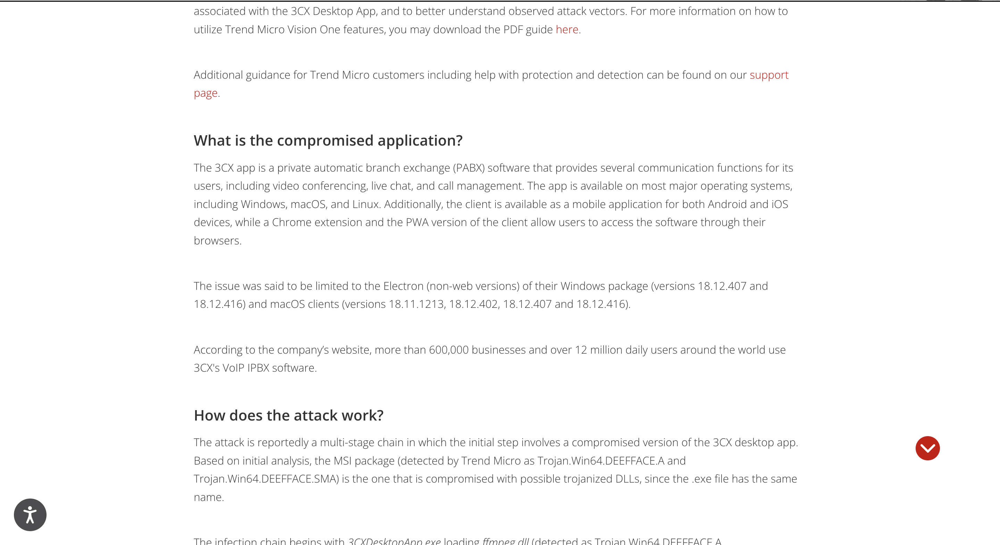
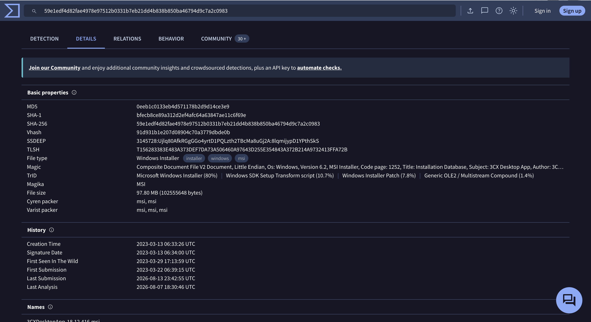
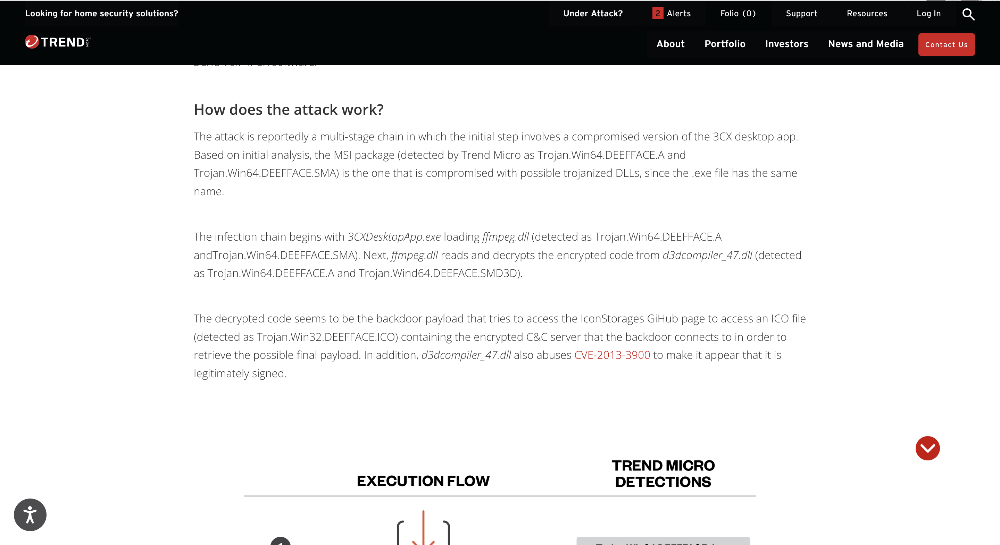
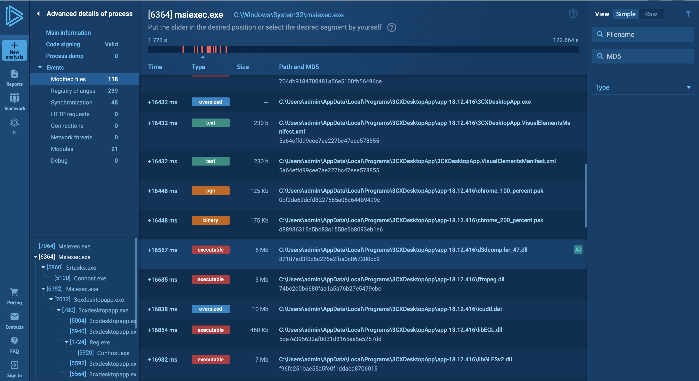
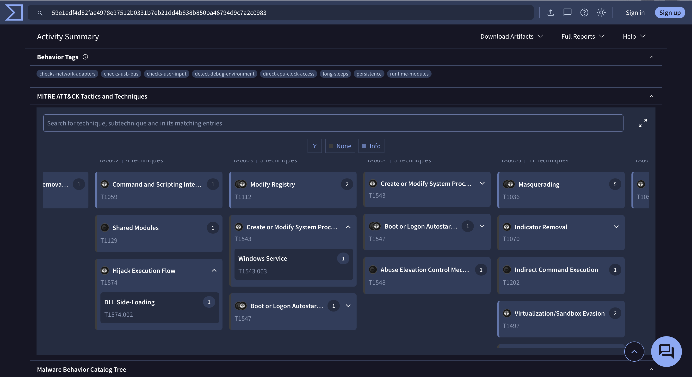
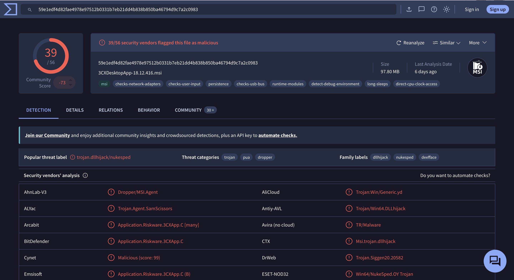
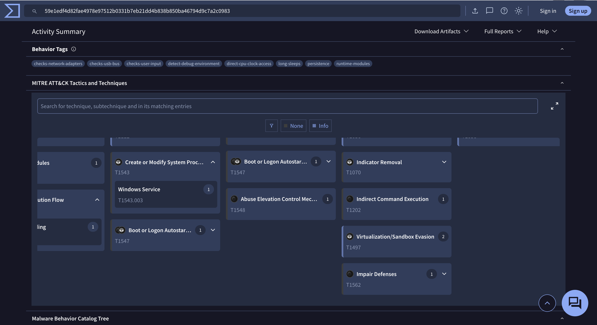
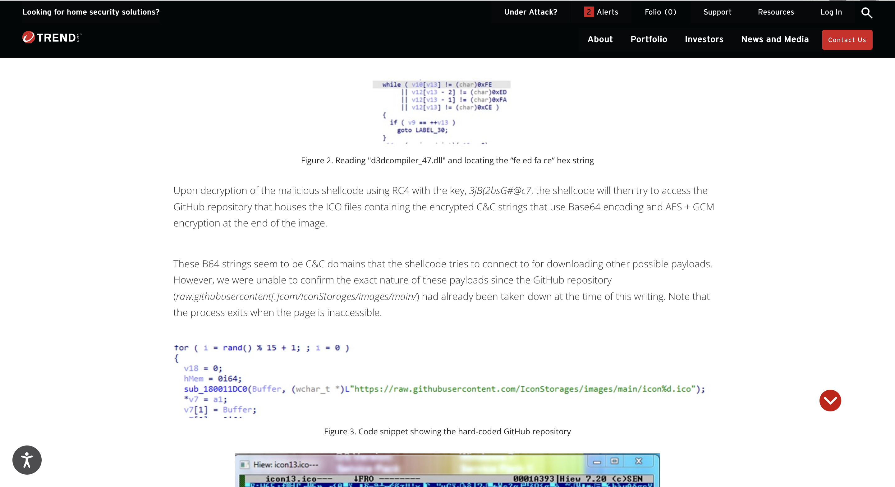
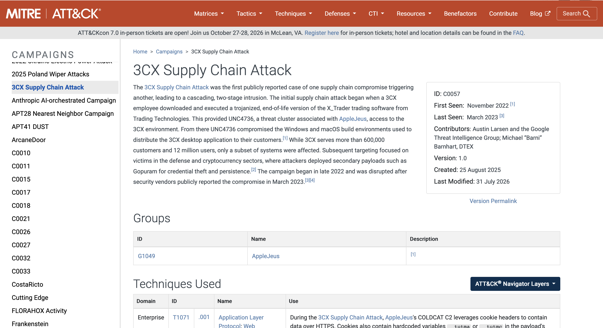
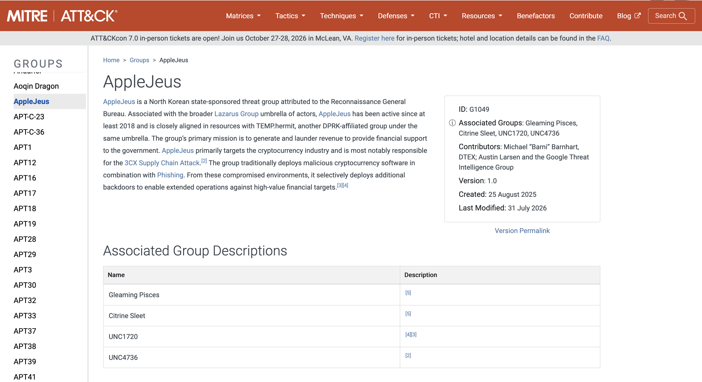

# 3CX Supply Chain Lab — CyberDefenders

> **Platform:** CyberDefenders
> **Category:** Threat Intelligence
> **Difficulty:** Easy
> **Status:** ✅ Completed
> **Date:** 2026-08-14
> **Time Spent:** ~1.5 jam

---

## 📌 Prolog

Merekonstruksi 3CX supply chain attack dengan menganalisis compromised MSI dan DLL artifact buat identifikasi TTPs dan atribusi insiden ke threat actor.

**Tools:** VirusTotal

**Tactics yang tercakup:** Execution | Stealth | Discovery

**Catatan:** lab ini berstatus *Retired* di platform CyberDefenders.

---

## 🎯 Scenario

Sebuah perusahaan multinasional besar sangat bergantung sama software 3CX buat komunikasi telepon, jadi ini komponen krusial dalam operasional bisnis mereka. Setelah update terbaru ke 3CX Desktop App, antivirus alert nunjukkin beberapa instance software ini ke-wipe di sebagian workstation, sementara yang lain nggak kena. Tim IT awalnya nganggep ini false positive dan skip alert-nya, sampai akhirnya nyadar ada performance yang menurun dan network traffic aneh ke server yang nggak dikenal. Karyawan mulai lapor masalah di app 3CX, dan tim IT security ngidentifikasi pola komunikasi nggak wajar yang terkait sama update software terbaru.

Sebagai threat intelligence analyst, tugas lo adalah investigasi kemungkinan supply chain attack ini. Objektif lo: ungkap gimana caranya attacker berhasil compromise app 3CX, identifikasi threat actor yang terlibat, dan assess seberapa luas dampak insiden ini.

---

## ❓ Questions

1. Understanding the scope of the attack and identifying which versions exhibit malicious behavior is crucial for making informed decisions if these compromised versions are present in the organization. How many versions of 3CX running on Windows have been flagged as malware?
2. Determining the age of the malware can help assess the extent of the compromise and track the evolution of malware families and variants. What's the UTC creation time of the .msi malware?
3. Executable files (.exe) are frequently used as primary or secondary malware payloads, while dynamic link libraries (.dll) often load malicious code or enhance malware functionality. Analyzing files deposited by the Microsoft Software Installer (.msi) is crucial for identifying malicious files and investigating their full potential. Which malicious DLLs were dropped by the .msi file?
4. Recognizing the persistence techniques used in this incident is essential for current mitigation strategies and future defense improvements. What is the MITRE Technique ID employed by the .msi files to load the malicious DLL?
5. Recognizing the malware type (threat category) is essential to your investigation, as it can offer valuable insight into the possible malicious actions you'll be examining. What is the threat category of the two malicious DLLs?
6. As a threat intelligence analyst conducting dynamic analysis, it's vital to understand how malware can evade detection in virtualized environments or analysis systems. This knowledge will help you effectively mitigate or address these evasive tactics. What is the MITRE ID for the virtualization/sandbox evasion techniques used by the two malicious DLLs?
7. When conducting malware analysis and reverse engineering, understanding anti-analysis techniques is vital to avoid wasting time. Which hypervisor is targeted by the anti-analysis techniques in the ffmpeg.dll file?
8. Identifying the cryptographic method used in malware is crucial for understanding the techniques employed to bypass defense mechanisms and execute its functions fully. What encryption algorithm is used by the ffmpeg.dll file?
9. As an analyst, you've recognized some TTPs involved in the incident, but identifying the APT group responsible will help you search for their usual TTPs and uncover other potential malicious activities. Which group is responsible for this attack?

---

## 🔍 Answer & Walkthrough

### 1. Berapa versi 3CX di Windows yang keflag sebagai malware?

Cek artikel Trend Micro soal insiden ini — di situ disebutin scope-nya cuma kena di Electron (non-web) package buat Windows, yaitu versi `18.12.407` dan `18.12.416`. Versi macOS kena juga tapi itu di luar pertanyaan ini.

**Jawaban:** `2`

---

### 2. UTC creation time dari .msi malware

Upload/search hash MSI-nya (`59e1edf4d82fae4978e97512b0331b7eb21dd4b838b850ba46794d9c7a2c0983` — file `3CXDesktopApp-18.12.416.msi`) ke VirusTotal, buka tab **Details → History**. Field `Creation Time` nunjukkin kapan file MSI-nya di-compile/dibuat.

**Jawaban:** `2023-03-13 06:33:26 UTC`

---

### 3. DLL malicious apa aja yang di-drop sama file .msi?

Dari infection chain di artikel Trend Micro: `3CXDesktopApp.exe` loading `ffmpeg.dll`, terus `ffmpeg.dll` baca & decrypt encrypted code dari `d3dcompiler_47.dll`. Dikonfirmasi juga lewat process monitoring di any.run — `msiexec.exe` keliatan drop kedua file itu langsung ke folder instalasi `app-18.12.416\`.

**Jawaban:** `ffmpeg.dll, d3dcompiler_47.dll`

---

### 4. MITRE Technique ID buat persistence/loading DLL malicious

Buka VirusTotal tab **Behavior → MITRE ATT&CK Tactics and Techniques**. Di kategori Persistence/Privilege Escalation muncul **Hijack Execution Flow (T1574)** dengan sub-technique **DLL Side-Loading (T1574.002)** — ini match sama pola `3CXDesktopApp.exe` yang load `ffmpeg.dll` trojanized alih-alih DLL asli.

**Compare analysis — VirusTotal vs MITRE ATT&CK terkini:**

VT nge-tag behavior sample ini pakai ID **T1574.002 (DLL Side-Loading)**, dan secara teknik ini emang paling akurat ngedeskripsiin apa yang kejadian: `3CXDesktopApp.exe` (aplikasi legit yang di-sign) di-trick buat nge-load `ffmpeg.dll` versi trojanized yang ditaro di folder yang sama — bukan hijack search order biasa, tapi sideloading langsung ke aplikasi yang emang expect nge-load DLL itu.

Tapi pas dicek langsung ke halaman resmi `attack.mitre.org`, **T1574.002 sebagai ID berdiri sendiri udah nggak ada**. MITRE re-organize sub-technique `T1574.001` — namanya disederhanain jadi cuma **"DLL"**, dan cakupannya digabung meliputi dua konsep sekaligus: *DLL Search Order Hijacking* dan *DLL Side-Loading*, sebagai dua subsection di dalam satu technique yang sama. Nggak ada catatan resmi "deprecated/merged from .002" di halamannya, tapi dari struktur sub-technique list yang sekarang (`.001, .004–.014`, tanpa `.002` dan `.003`), jelas konsolidasi ini yang kejadian.

Gap ini nunjukkin hal yang penting buat analyst: **taxonomy mapping di tools pihak ketiga (VT, EDR, SIEM) nggak selalu real-time sync** ke perubahan terbaru MITRE ATT&CK. VT kemungkinan masih pakai snapshot data lama pas nge-generate behavior tag ini. Jadi kalau lo mau cross-reference technique ID ke MITRE Navigator atau bikin detection rule berbasis ATT&CK ID, selalu double-check ke source resmi dulu — jangan langsung percaya ID yang keluar dari vendor tool tanpa validasi.

**Jawaban:** `T1574` — sesuai apa yang ditampilkan VT saat behavior analysis ini dijalankan. Kalau mengacu ke taksonomi MITRE ATT&CK yang berlaku sekarang, technique yang sama sekarang tercakup di bawah **T1574.001 (DLL)**.

---

### 5. Threat category dari dua DLL malicious tersebut

Balik ke tab **Detection** di VirusTotal buat hash MSI-nya — bagian **Threat categories** nunjukkin `trojan`, `pua`, `dropper`, dengan popular threat label `trojan.dllhijack/nukesped`. Kategori utamanya trojan.

**Jawaban:** `Trojan`

---

### 6. MITRE ID buat teknik virtualization/sandbox evasion

Masih di tab **Behavior → MITRE ATT&CK**, di kolom Defense Evasion ada entry **Virtualization/Sandbox Evasion (T1497)** dengan 2 sub-technique kedetect.

**Jawaban:** `T1497`

---

### 7. Hypervisor apa yang jadi target anti-analysis di ffmpeg.dll

> ⚠️ **Catatan jujur:** buat pertanyaan ini gue nggak nemu analysis report spesifik yang eksplisit nunjukkin string/artifact VMware check-nya (nggak ke-capture di screenshot VT/any.run/Trend Micro yang ada). Jawaban `VMware` didapat dari diskusi & nyoba jawab langsung di platform CyberDefenders, bukan dari evidence yang terdokumentasi di sini. Kalau nanti nemu report yang confirm detailnya (misal dari strings dump atau reverse engineering report pihak ketiga), update section ini.

**Jawaban:** `VMware`

---

### 8. Algoritma enkripsi yang dipakai ffmpeg.dll

Trend Micro reverse-engineer `d3dcompiler_47.dll` dan nemuin shellcode-nya di-decrypt pakai **RC4** dengan key `3jB(2bsG#@c7`. Hasil decrypt-nya dipakai buat akses GitHub repo yang nyimpen encrypted C2 string (Base64 + AES-GCM, di-embed di ekor file ICO — teknik steganography).

**Jawaban:** `RC4`

---

### 9. Threat actor/APT group yang bertanggung jawab

Cek MITRE ATT&CK — grup **AppleJeus (G1049)**, threat actor North Korea state-sponsored di bawah payung **Lazarus Group**, secara eksplisit disebut bertanggung jawab atas 3CX Supply Chain Attack (campaign **C0057**). Cluster teknis yang eksekusi serangan ini dilacak sebagai **UNC4736**, terasosiasi ke AppleJeus.

**Jawaban:** `Lazarus` (via subgroup AppleJeus / cluster UNC4736)

---

## 🚨 Key Findings / IOCs

| Tipe | Value | Keterangan |
|------|-------|------------|
| File Hash (SHA-256) | `59e1edf4d82fae4978e97512b0331b7eb21dd4b838b850ba46794d9c7a2c0983` | `3CXDesktopApp-18.12.416.msi` — MSI installer trojanized |
| File Hash (MD5) | `0eeb1c0133eb4d571178b2d9d14ce3e9` | MD5 dari MSI di atas |
| File Name | `ffmpeg.dll` | Trojanized DLL — di-load duluan oleh `3CXDesktopApp.exe`, decrypt shellcode via RC4 |
| File Name | `d3dcompiler_47.dll` | Trojanized DLL — nyimpen encrypted shellcode, abuse CVE-2013-3900 biar keliatan legitimately signed |
| Domain/Repo | `raw.githubusercontent[.]com/IconStorages/images/main/` | GitHub repo (udah takedown) — host file ICO berisi encrypted C2 string (steganography, Base64 + AES-GCM) |
| Software Version | `3CXDesktopApp 18.12.407, 18.12.416` (Windows) | Versi yang terkonfirmasi kena compromise |
| Encryption Key | `3jB(2bsG#@c7` | RC4 key buat decrypt shellcode di `d3dcompiler_47.dll` |

---

---

## 🗺️ MITRE ATT&CK Mapping

| Tactic | Technique | ID | Keterangan |
|--------|-----------|----|------------|
| Persistence / Privilege Escalation | Hijack Execution Flow: DLL Side-Loading | T1574.002 | `3CXDesktopApp.exe` load `ffmpeg.dll` trojanized menggantikan DLL asli |
| Defense Evasion | Virtualization/Sandbox Evasion | T1497 | Shellcode ngecek environment VMware sebelum lanjut eksekusi, biar nggak ke-analisa di sandbox |
| Defense Evasion | Masquerading | T1036 | Binary & DLL trojanized tetap pakai nama file dan (sebagian) valid code signing dari 3CX asli |
| Command and Control | Application Layer Protocol | T1071.001 | C2 string di-embed & di-fetch dari file ICO di GitHub repo (steganography) |

---

---

## 📋 Summary — Attacker Behavior & Todo

### Attacker Behavior

Threat actor (AppleJeus/UNC4736, di bawah payung Lazarus Group) berhasil masuk ke build environment 3CX dan nyisipin trojanized DLL ke installer resmi. Dua versi Windows Electron client (`18.12.407` dan `18.12.416`) yang kena — user yang install/update jadi korban tanpa sadar karena binary-nya tetap kelihatan legit (signed).

Alur eksekusinya: `3CXDesktopApp.exe` load `ffmpeg.dll` (trojanized) → `ffmpeg.dll` baca & decrypt shellcode yang disimpan di `d3dcompiler_47.dll` pakai RC4 → sebelum lanjut, shellcode ngecek dulu apakah environment-nya VMware (anti-sandbox/anti-analysis check, T1497) → kalau lolos, shellcode akses GitHub repo (`IconStorages`) buat ambil file ICO yang nyimpen encrypted C2 string (Base64 + AES-GCM, disisipin di ekor file gambar) → connect ke C2 buat retrieve payload tahap berikutnya.

Dampaknya: performance degradation di workstation korban dan network traffic mencurigakan ke server yang nggak dikenal — sesuai laporan awal tim IT di scenario. Repo GitHub yang jadi C2 delivery channel-nya udah di-takedown pas insiden ini dianalisis, jadi payload final belum sepenuhnya terkonfirmasi publik.

### Todo / Follow-up

- [ ] Cari analysis report/reverse engineering writeup yang eksplisit confirm string/artifact VMware check di `ffmpeg.dll` (jawaban #7 masih based on guess, belum ada evidence terdokumentasi)
- [ ] Pelajari lebih lanjut soal Gopuram backdoor — payload sekunder yang disebut MITRE campaign page buat credential theft & persistence
- [ ] Baca full MITRE Campaign C0057 buat ngerti kaitan sama X_Trader trading software supply chain compromise (initial access ke environment 3CX)

---

## 📚 References

- [CyberDefenders — 3CX Supply Chain Lab](https://cyberdefenders.org/)
- [Trend Micro — Information on Attacks Involving 3CX Desktop App](https://www.trendmicro.com/en_us/research/23/c/information-on-attacks-involving-3cx-desktop-app.html)
- [VirusTotal — MSI Installer Analysis](https://www.virustotal.com/gui/file/59e1edf4d82fae4978e97512b0331b7eb21dd4b838b850ba46794d9c7a2c0983/detection)
- [any.run — Sandbox Analysis](https://app.any.run/tasks/2856878d-d3e6-48ab-9691-d3c77fdc1145)
- [MITRE ATT&CK — AppleJeus (G1049)](https://attack.mitre.org/groups/G1049/)
- [MITRE ATT&CK — 3CX Supply Chain Attack (C0057)](https://attack.mitre.org/campaigns/C0057/)

---

*Writeup ini dibuat sebagai bagian dari perjalanan belajar Blue Team / SOC Analyst.*
