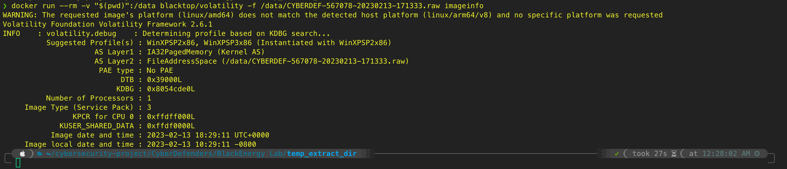
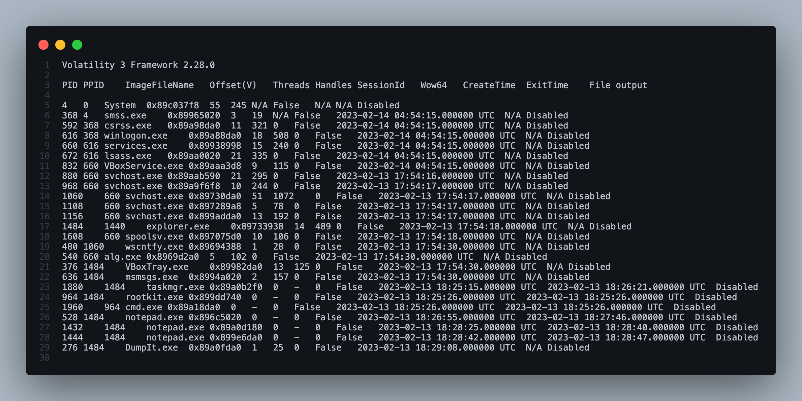
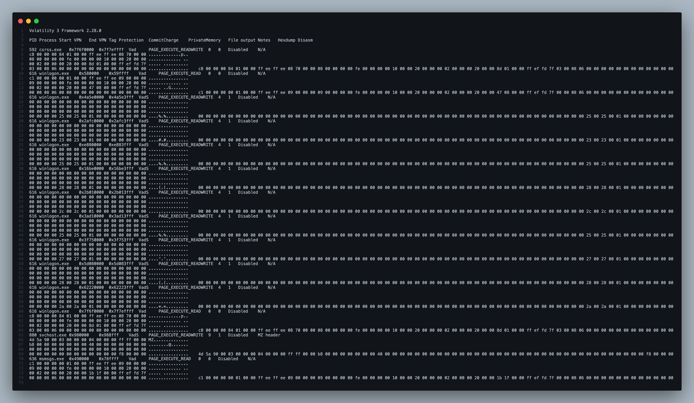
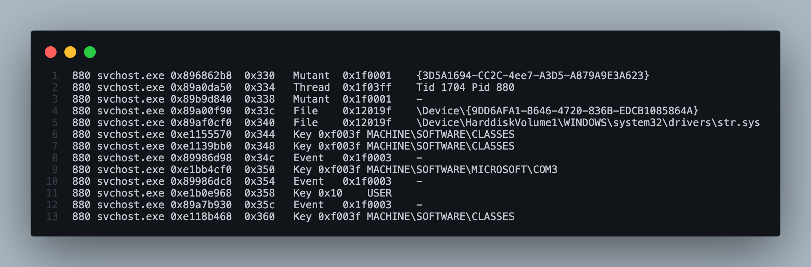
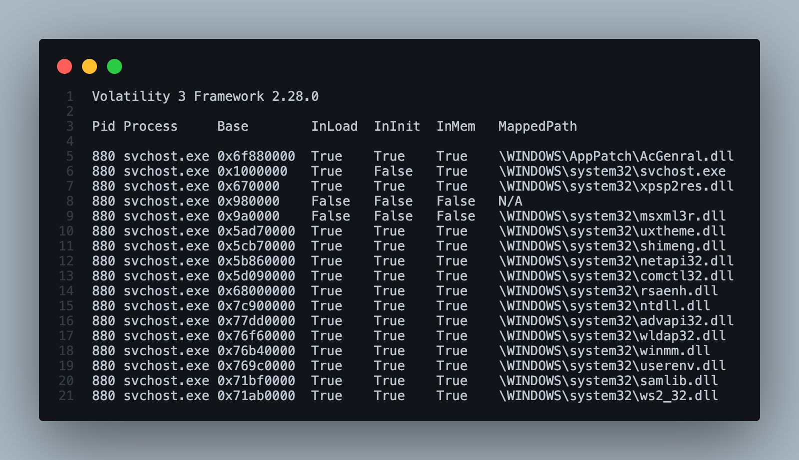

# BlackEnergy Lab — CyberDefenders

> **Platform:** CyberDefenders
> **Category:** Endpoint Forensics
> **Difficulty:** Medium
> **Status:** ✅ Completed
> **Date:** 2026-08-15
> **Time Spent:** ~2 jam

---

## 📌 Prolog

Ngembangin practical skills soal Windows memory forensics pakai Volatility, dengan cara detect malware indicators, analisis suspicious process, dan identifikasi code injection serta unauthorized DLL di compromised system.

**Tools:** Volatility 2, Volatility 3

**Tactics yang tercakup:** Privilege Escalation | Stealth

**Catatan:** lab ini berstatus *Retired* di platform CyberDefenders.

---

## 🎯 Scenario

Sebuah perusahaan multinasional kena cyber attack yang berujung ke pencurian sensitive data. Serangan ini pakai varian **BlackEnergy v2** malware yang belum pernah keliatan sebelumnya (previously unseen variant). Tim security perusahaan udah dapetin memory dump dari mesin yang terinfeksi, dan butuh keahlian lo sebagai SOC analyst buat analisis dump tersebut biar ngerti scope dan impact dari serangan ini.

---

## ❓ Questions

1. Which volatility profile would be best for this machine?
2. How many processes were running when the image was acquired?
3. What is the process ID of cmd.exe?
4. What is the name of the most suspicious process?
5. Which process shows the highest likelihood of code injection?
6. There is an odd file referenced in the recent process. Provide the full path of that file.
7. What is the name of the injected DLL file loaded from the recent process?
8. What is the base address of the injected DLL?

---

## 🔍 Answer & Walkthrough

### 1. Which volatility profile would be best for this machine?

Awalnya coba `windows.info` di Volatility 3, tapi profile OS-nya susah ditebak dari situ. Akhirnya switch ke Volatility 2 buat manfaatin plugin `imageinfo`, yang memang didesain khusus buat nebak profile dari raw memory image berdasarkan KDBG search.

```bash
docker run --rm -v "$(pwd)":/data blacktop/volatility -f /data/CYBERDEF-567078-20230213-171333.raw imageinfo
```



Hasilnya kasih **Suggested Profile(s): WinXPSP2x86, WinXPSP3x86**, dan otomatis di-instantiate dengan `WinXPSP2x86`.

**Jawaban:** `WinXPSP2x86`

---

### 2. How many processes were running when the image was acquired?

Balik ke Volatility 3, cek process list pakai `windows.pstree`.

```bash
vol -f CYBERDEF-567078-20230213-171333.raw windows.pstree
```



Total ada 25 process yang tercatat di memory dump. Tapi 6 di antaranya (`taskmgr.exe`, `rootkit.exe`, `cmd.exe`, dan 3x `notepad.exe`) udah punya nilai `ExitTime` — artinya proses-proses itu udah selesai/exit sebelum image di-acquire. Jadi yang beneran masih *running* pas dump diambil: `25 - 6 = 19`.

**Jawaban:** `19`

---

### 3. What is the process ID of cmd.exe?

Masih dari output `windows.pstree` yang sama — `cmd.exe` muncul sebagai child process dari `rootkit.exe` (PID 964).

**Jawaban:** `1960`

---

### 4. What is the name of the most suspicious process?

Dari process tree yang sama, satu proses langsung mencolok cuma dari namanya sendiri: `rootkit.exe` (PID 964). Dia juga jadi parent dari `cmd.exe` (PID 1960) — kombinasi nama file yang eksplisit + spawn command shell ini classic red flag buat malware behavior.

**Jawaban:** `rootkit.exe`

---

### 5. Which process shows the highest likelihood of code injection?

Lanjut scan pakai `malfind`, buat nemuin memory region yang executable tapi punya karakteristik mencurigakan (permission RWX, gak ada file backing, ada PE header nyempil di tengah heap).

```bash
vol -f CYBERDEF-567078-20230213-171333.raw windows.malfind
```



Ketemu satu region yang jelas banget mencurigakan di `svchost.exe` PID 880 — VAD `0x980000–0x988fff`, protection `PAGE_EXECUTE_READWRITE` (RWX, red flag klasik), dan hex dump-nya diawali `4d 5a 90 00 03 00 00 00`, yaitu **MZ header** (magic bytes awal file PE/EXE Windows). Kolom Notes bahkan udah eksplisit nulis "MZ header".

Cross-check ke `pstree`: PID 880 itu `svchost.exe` yang dijalanin dengan command line `svchost -k DcomLaunch` — command line-nya sendiri kelihatan normal, gak ada tanda aneh. Justru itu yang bikin berbahaya: `svchost.exe` itu trusted process bawaan Windows, jadi kalau ada malicious code nempel di sini, dia bakal lolos dari banyak deteksi berbasis reputasi nama proses.

**Jawaban:** `svchost.exe` (PID 880)

---

### 6. There is an odd file referenced in the recent process. Provide the full path of that file.

Setelah konfirmasi ada injection di PID 880, langkah selanjutnya adalah cek **handles** yang dipegang proses itu — buat liat resource apa aja (file, registry key, mutex, dll) yang dia akses.

```bash
vol -f CYBERDEF-567078-20230213-171333.raw windows.handles --pid 880
```

Karena Volatility 3 gak punya filter `-t` kayak Volatility 2, hasilnya di-cross-check manual, dan dikonfirmasi ulang pakai Volatility 2 yang masih support `-t file`:

```bash
docker run --rm -v "$(pwd)":/data blacktop/volatility -f /data/temp_extract_dir/CYBERDEF-567078-20230213-171333.raw --profile WinXPSP2x86 handles -p 880 -t file
```




Di antara ratusan handle yang wajar dipegang `svchost.exe` (registry key, named pipe, event object, semaphore — semua ini normal buat proses service Windows), ada satu `File` handle yang nyolok:

```
\Device\HarddiskVolume1\WINDOWS\system32\drivers\str.sys
```

**Kenapa ini janggal:** handle type `File` di sini nunjukin `svchost.exe` (PID 880) — proses yang sebelumnya udah kekonfirmasi kena code injection — punya akses langsung ke sebuah file **driver** (`.sys`). Driver jalan di kernel-mode dengan privilege tinggi, dan biasanya cuma dibuka sama Service Control Manager atau proses driver loader resmi, bukan proses service biasa kayak `svchost.exe -k DcomLaunch`. Nama `str.sys` juga bukan driver bawaan Windows XP yang umum dikenal (beda sama `tcpip.sys`, `disk.sys`, dll bawaan OS). Kombinasi proses yang udah ke-inject + akses langsung ke file driver di path system ini jadi indikasi kuat kalau `str.sys` adalah **kernel-mode rootkit component** dari BlackEnergy, kemungkinan dipakai buat persistence atau stealth di level kernel.

**Jawaban:** `C:\WINDOWS\System32\drivers\str.sys`

---

### 7 & 8. Injected DLL name & base address

Terakhir, buat confirm nama dan lokasi persis dari DLL yang di-inject, jalanin `ldrmodules`. Plugin ini cross-check semua module yang ke-mapped di VAD (Virtual Address Descriptor) process, dibandingin sama 3 linked list di PEB (`InLoad`, `InInit`, `InMem`) yang normalnya dipakai Windows buat nge-track DLL yang di-load resmi lewat `LoadLibrary`.

```bash
vol -f CYBERDEF-567078-20230213-171333.raw windows.ldrmodules --pid 880
```



Hampir semua baris punya `InLoad`/`InInit`/`InMem` = `True` semua (DLL legit yang di-load normal). Tapi ada 2 baris berdekatan yang ketiga kolomnya `False` semua — artinya module ini sengaja **di-unlink** dari PEB list:

```
0x980000    False    False    False    N/A
0x9a0000    False    False    False    \WINDOWS\system32\msxml3r.dll
```

Baris `0x980000` persis sama alamat yang ketemu di `malfind` (MZ header, RWX) — konfirmasi kalau region ini emang raw injected code tanpa file backing yang sah. Baris sebelahnya, `0x9a0000`, ke-tag sebagai `msxml3r.dll` (DLL resource legit bawaan Windows XP), tapi karena statusnya juga unlinked, ini kemungkinan besar dipakai sebagai **masquerading** — injected code-nya nyamar pakai nama DLL Windows asli biar analyst yang cuma liat nama file di permukaan gak curiga.

**Jawaban Q7 (nama DLL):** `msxml3r.dll`
**Jawaban Q8 (base address):** `0x980000`

---

## 🚨 Key Findings / IOCs

| Tipe | Value | Keterangan |
|------|-------|------------|
| Process | `rootkit.exe` (PID 964) | Proses paling mencurigakan, jadi parent dari `cmd.exe` |
| Process | `cmd.exe` (PID 1960) | Di-spawn oleh `rootkit.exe`, indikasi command execution |
| Process (Injected) | `svchost.exe` (PID 880) | Proses legit Windows yang jadi target code injection |
| Memory Region | `0x980000` (PID 880) | Raw injected code (MZ header, RWX, unlinked dari PEB) |
| Masquerading DLL | `msxml3r.dll` @ `0x9a0000` (PID 880) | Nama DLL Windows asli, dipakai buat nyamarin injected code, unlinked dari PEB |
| File | `C:\WINDOWS\System32\drivers\str.sys` | Kernel-mode driver mencurigakan, direference langsung oleh proses yang terinfeksi |

---

## 🗺️ MITRE ATT&CK Mapping

| Tactic | Technique | ID | Keterangan |
|--------|-----------|----|------------|
| Execution | Command and Scripting Interpreter: Windows Command Shell | T1059.003 | `rootkit.exe` spawn `cmd.exe` (PID 1960) |
| Defense Evasion / Privilege Escalation | Process Injection: Dynamic-link Library Injection | T1055.001 | Injected code di-tanam ke `svchost.exe` (PID 880) buat blending in ke trusted process |
| Defense Evasion | Masquerading: Match Legitimate Name or Location | T1036.005 | Injected module dinamain `msxml3r.dll`, nyamar sebagai DLL Windows asli |
| Defense Evasion / Persistence | Rootkit | T1014 | `str.sys` — kernel-mode driver buat stealth/persistence |

---

## 📋 Summary — Attacker Behavior & Todo

### Attacker Behavior

Attacker eksekusi `rootkit.exe` (PID 964) di mesin korban, yang langsung spawn `cmd.exe` (PID 1960) buat command execution di awal intrusion. Dari titik ini, malware ngelakuin **process injection** ke `svchost.exe` (PID 880) — proses trusted bawaan Windows yang dipilih spesifik biar aktivitas malicious-nya blend in dan lolos dari deteksi berbasis reputasi nama proses.

Injected code-nya (raw PE dengan MZ header, region `0x980000`, permission RWX) sengaja di-unlink dari PEB module list, dan di sebelahnya ditanam module tambahan yang nyamar pakai nama `msxml3r.dll` — DLL resource legit bawaan Windows — sebagai teknik masquerading biar analyst yang cuma cek nama file gak langsung curiga.

Sebagai komponen tambahan buat persistence/stealth di level yang lebih dalam, malware juga drop kernel-mode driver `str.sys` di `C:\WINDOWS\System32\drivers\`, yang direference langsung oleh `svchost.exe` yang udah terinfeksi. Kombinasi user-mode process injection + kernel-mode rootkit driver ini konsisten sama karakteristik **BlackEnergy v2**, dan bikin malware lebih sulit dideteksi AV/EDR konvensional yang cuma ngandelin process list atau loaded module standar.

### Todo / Follow-up

- [ ] Dump `str.sys` (pakai `dumpfiles`) buat static analysis — cek kapabilitas rootkit-nya (hook SSDT, hidden process/file, dll)
- [ ] Dump memory region `0x980000` di PID 880 buat static analysis payload injected code-nya
- [ ] Cross-check network artifact (`netscan`/`connscan`) buat cari indikasi C2 dari proses `svchost.exe` yang terinfeksi
- [ ] Pelajari lebih dalam teknik unlink PEB module list (mirip DKOM) sebagai referensi deteksi kasus serupa ke depan
- [ ] Cari tau apakah `rootkit.exe` punya persistence mechanism sendiri (registry run key, scheduled task, service)

---

## 📚 References

- [CyberDefenders — BlackEnergy Lab](https://cyberdefenders.org/)

---

*Writeup ini dibuat sebagai bagian dari perjalanan belajar Blue Team / SOC Analyst.*
