# DanaBot — CyberDefenders

> **Platform:** CyberDefenders  
> **Category:** Network Forensics  
> **Tactics:** Execution, Command and Control  
> **Tools:** Wireshark, VirusTotal, ANY.RUN, Network Miner  
> **Difficulty:** Medium  
> **Status:** ✅ Completed  
> **Date:** 2026-06-10  
> **Time Spent:** ~2 jam  

---

## 📌 Prolog

Lab ini berfokus pada analisis network traffic menggunakan Wireshark untuk mengidentifikasi initial access DanaBot, deobfuscate malicious JavaScript, dan mengekstrak IOCs seperti IP address, file hash, dan execution process.

---

## 🎯 Scenario

Tim SOC mendeteksi aktivitas mencurigakan di network traffic yang menunjukkan bahwa sebuah mesin telah ter-compromise. Informasi sensitif perusahaan telah dicuri. Tugas kamu adalah menggunakan file Network Capture (PCAP) dan Threat Intelligence untuk menginvestigasi insiden ini dan menentukan bagaimana breach terjadi.

---

## ❓ Questions

1. Which IP address was used by the attacker during the initial access?
2. What is the name of the malicious file used for initial access?
3. What is the SHA-256 hash of the malicious file used for initial access?
4. Which process was used to execute the malicious file?
5. What is the file extension of the second malicious file utilized by the attacker?
6. What is the MD5 hash of the second malicious file?

---

## 🔍 Answer & Walkthrough

### 1. Which IP address was used by the attacker during the initial access?

Mulai dengan export HTTP objects dari PCAP untuk melihat file apa saja yang di-transfer.

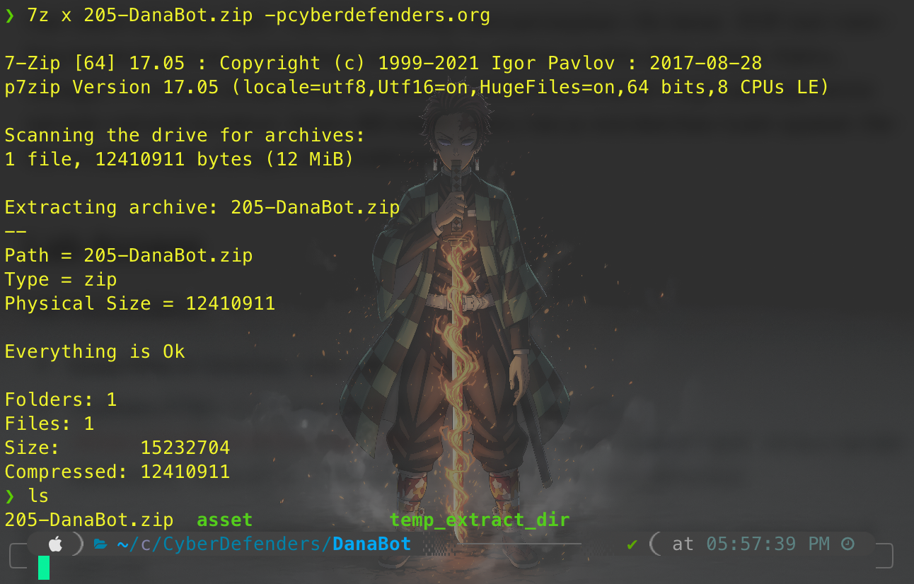

Hasil export menampilkan beberapa file yang perlu diinvestigasi lebih lanjut.

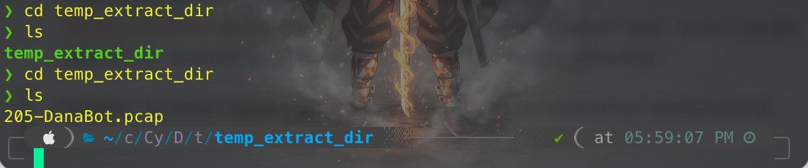

Cek protocol hierarchy untuk gambaran besar traffic yang ada di PCAP.

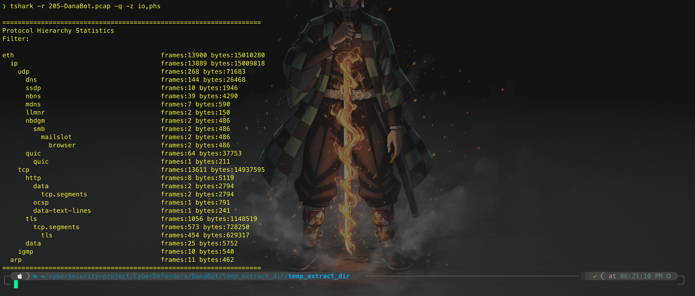

Selanjutnya buka **Statistics → Conversations** untuk melihat semua IP yang berkomunikasi. Ada beberapa IP mencurigakan karena tidak memiliki DNS resolution: `195.133.88.98`, `91.201.67.85`, `20.10.31.115`, `62.173.146.41` — tapi keempat IP ini menggunakan HTTPS (port 443), jadi tunda dulu kecurigaan.

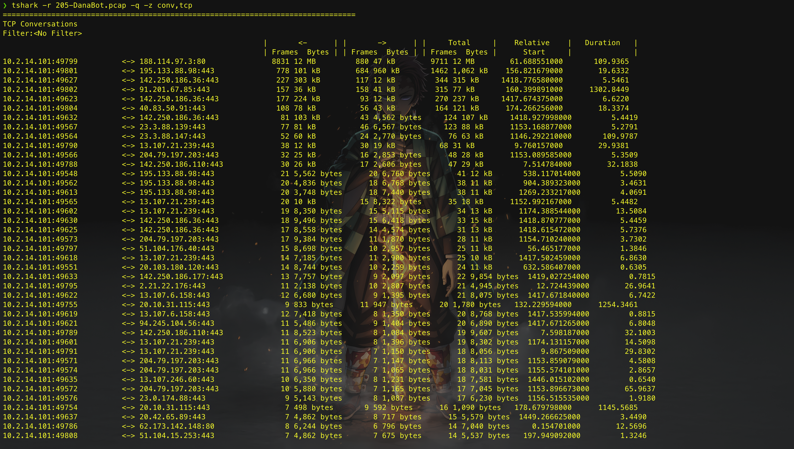

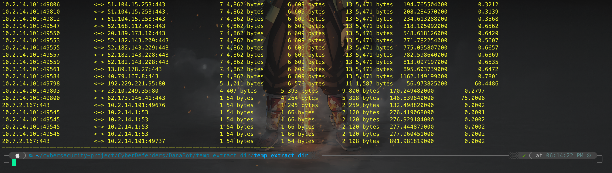

Fokus ke HTTP port 80. Ada 4 IP yang aktif di port tersebut:

| IP | DNS |
|----|-----|
| `188.114.97.3:80` | `soundata.top` |
| `62.173.142.148:80` | `portfolio.serveirc.com` |
| `192.229.221.95:80` | `www.msftconnecttest.com` |
| `23.10.249.35:80` | `ocsp.digicert.com` |

`msftconnecttest.com` dan `digicert.com` adalah domain legitimate — langsung dibuang dari list. Sisa dua domain dicek di VirusTotal.

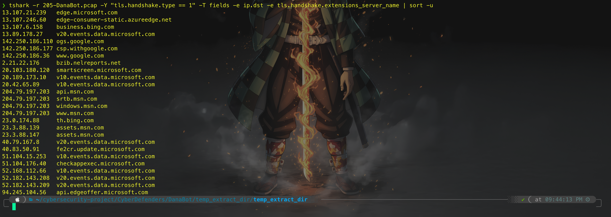

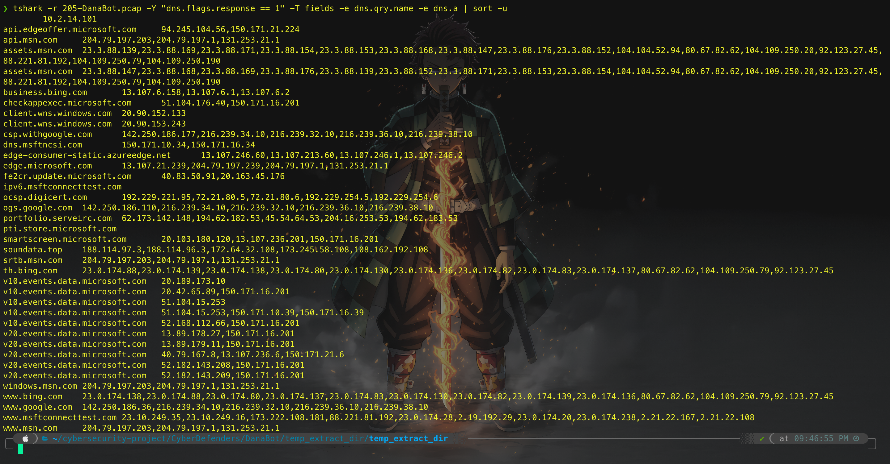

`soundata[.]top` langsung muncul sebagai domain DanaBot di VirusTotal.

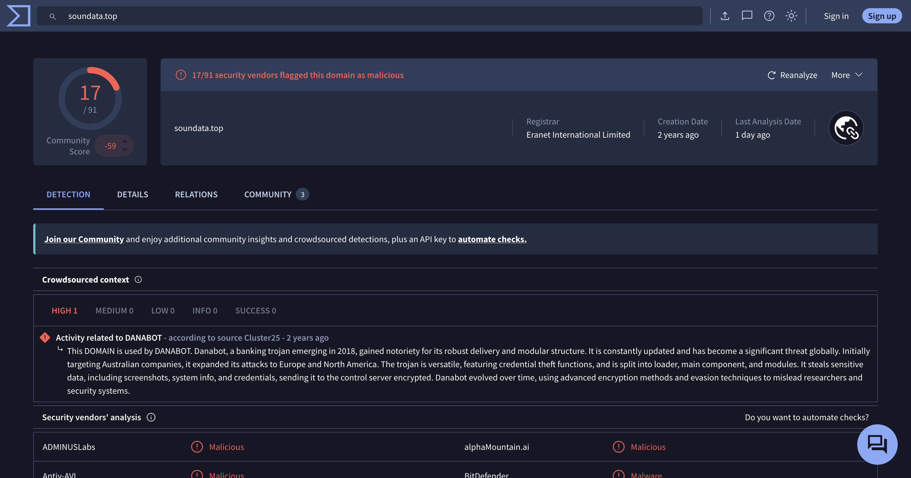

`portfolio.serveirc.com` juga dapat 5/91 flag sebagai malicious — ini adalah domain initial access sebelum DanaBot di-drop.

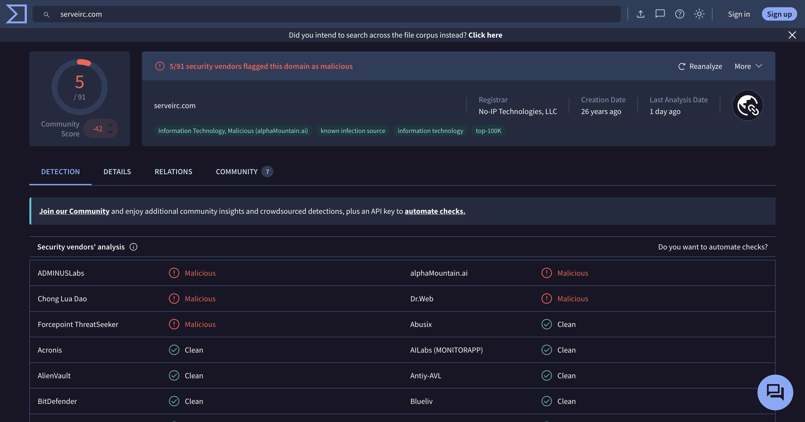

Follow HTTP stream dari IP `62.173.142.148` untuk konfirmasi.

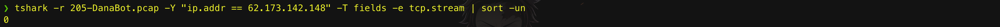

Stream menunjukkan victim diarahkan ke `login.php` via teknik **HTML Smuggling** (T1027.006), yang secara otomatis men-trigger download file malicious.

**Jawaban:** `62.173.142.148`

---

### 2. What is the name of the malicious file used for initial access?

Dari analisis stream di atas, file yang di-download via HTML Smuggling sudah terlihat namanya secara langsung.

**Jawaban:** `allegato_708.js`

---

### 3. What is the SHA-256 hash of the malicious file used for initial access?

File `allegato_708.js` di-export dari PCAP lalu dicek hash-nya — bisa via `sha256sum` atau langsung upload ke VirusTotal untuk verifikasi.

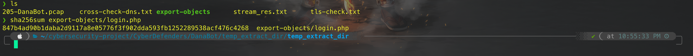

**Jawaban:** `847b4ad90b1daba2d9117a8e05776f3f902dda593fb1252289538acf476c4268`

---

### 4. Which process was used to execute the malicious file?

Dari hasil analisis PCAP dan ANY.RUN, file `.js` di-execute menggunakan Windows Script Host — sebuah LoLBin yang sering dipakai untuk menjalankan script tanpa trigger AV.

**Jawaban:** `WScript.exe`

---

### 5. What is the file extension of the second malicious file utilized by the attacker?

Masih dari gambar yang sama — setelah `allegato_708.js` berjalan, script menghubungi `soundata[.]top` untuk download payload DanaBot berikutnya, yaitu file dengan ekstensi `.dll`.

**Jawaban:** `.dll`

---

### 6. What is the MD5 hash of the second malicious file?

File `.dll` yang di-download (`resources.dll`) di-deobfuscate dari JS script untuk mendapatkan URL download-nya, kemudian hash-nya diekstrak.

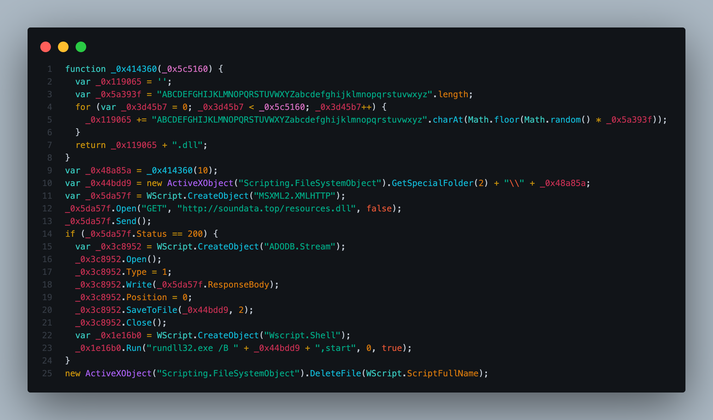

**Jawaban:** `e758e07113016aca55d9eda2b0ffeebe`

---

## 🚨 Key Findings / IOCs

| Tipe | Value | Keterangan |
|------|-------|------------|
| IP Address | `62.173.142.148` | Initial access IP — portfolio.serveirc.com |
| IP Address | `188.114.97.3` | DanaBot C2 — soundata.top |
| IP Address | `195.133.88.98` | Suspicious — no DNS, HTTPS |
| IP Address | `91.201.67.85` | Suspicious — no DNS, HTTPS |
| IP Address | `20.10.31.115` | Suspicious — no DNS, HTTPS |
| IP Address | `62.173.146.41` | Suspicious — no DNS, HTTPS |
| Domain | `soundata[.]top` | DanaBot C2 domain |
| Domain | `portfolio.serveirc.com` | Malicious redirect domain (5/91 VT) |
| File | `allegato_708.js` | Initial access payload |
| Hash (SHA-256) | `847b4ad90b1daba2d9117a8e05776f3f902dda593fb1252289538acf476c4268` | allegato_708.js |
| File | `resources.dll` | DanaBot payload |
| Hash (MD5) | `e758e07113016aca55d9eda2b0ffeebe` | resources.dll |

---

## 🗺️ MITRE ATT&CK Mapping

| Tactic | Technique | ID | Keterangan |
|--------|-----------|----|------------|
| Initial Access | Phishing: Spearphishing Link | T1566.002 | Victim diarahkan ke link berbahaya yang trigger download JS |
| Defense Evasion | Obfuscated Files or Information: HTML Smuggling | T1027.006 | File JS di-smuggle via HTML untuk bypass email gateway |
| Execution | Command and Scripting Interpreter: JavaScript | T1059.007 | allegato_708.js di-execute via WScript.exe |
| Execution | System Binary Proxy Execution: Rundll32 | T1218.011 | resources.dll di-load via Rundll32 |
| Defense Evasion | Hide Artifacts | T1564 | DanaBot menyembunyikan aktivitasnya |
| Defense Evasion | Masquerading | T1036 | File dan proses menyamar sebagai aktivitas legitimate |
| Defense Evasion | Indicator Removal: File Deletion | T1070.004 | File JS dihapus setelah DLL di-execute |

---

## 📋 Summary — Attacker Behavior & Todo

### Attacker Behavior

Victim menerima Spearphishing Link yang mengarahkan ke `portfolio.serveirc.com`. Halaman tersebut menggunakan teknik **HTML Smuggling** untuk meng-embed file `allegato_708.js` dan secara otomatis men-trigger download-nya ke mesin korban.

File JS kemudian di-execute menggunakan `WScript.exe` (LoLBin), yang lalu menghubungi `soundata[.]top` untuk mengunduh payload DanaBot berupa `resources.dll`. DLL tersebut dijalankan menggunakan `Rundll32` (LoLBin kedua). Sebagai langkah terakhir, file JS dihapus dari sistem untuk menghilangkan jejak initial access.

### Todo / Follow-up

- [ ] Pelajari lebih dalam teknik HTML Smuggling — cara kerja, cara deteksi, dan tool untuk decode-nya
- [ ] Deobfuscate `allegato_708.js` secara manual untuk pahami alur C2 communication-nya
- [ ] Investigasi 4 IP HTTPS tanpa DNS (`195.133.88.98`, `91.201.67.85`, `20.10.31.115`, `62.173.146.41`) — bisa jadi C2 secondary atau exfiltration channel
- [ ] Pelajari DanaBot malware family secara lebih mendalam — capabilities dan known TTPs-nya
- [ ] Eksplorasi cara deteksi WScript.exe dan Rundll32 abuse via Sysmon event ID

---

## 📚 References

- [DanaBot Malware Analysis — ANY.RUN](https://any.run/malware-trends/danabot)
- [MITRE ATT&CK — DanaBot](https://attack.mitre.org/software/S0385/)
- [MITRE ATT&CK — HTML Smuggling T1027.006](https://attack.mitre.org/techniques/T1027/006/)
- [MITRE ATT&CK — Rundll32 T1218.011](https://attack.mitre.org/techniques/T1218/011/)

---

*Writeup ini dibuat sebagai bagian dari perjalanan belajar Blue Team / SOC Analyst.*
