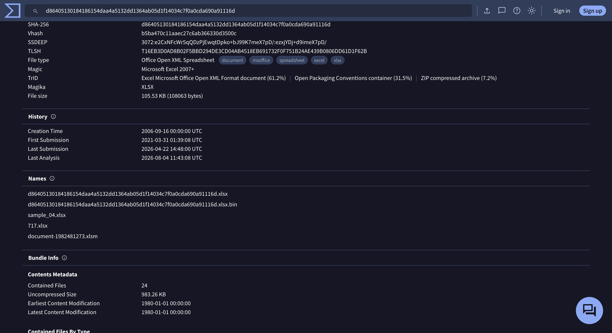
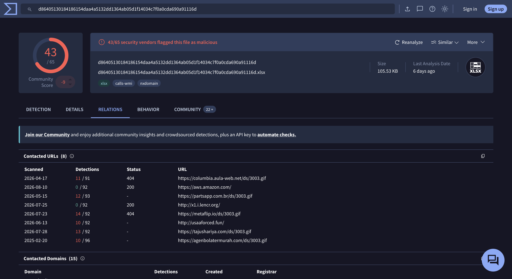
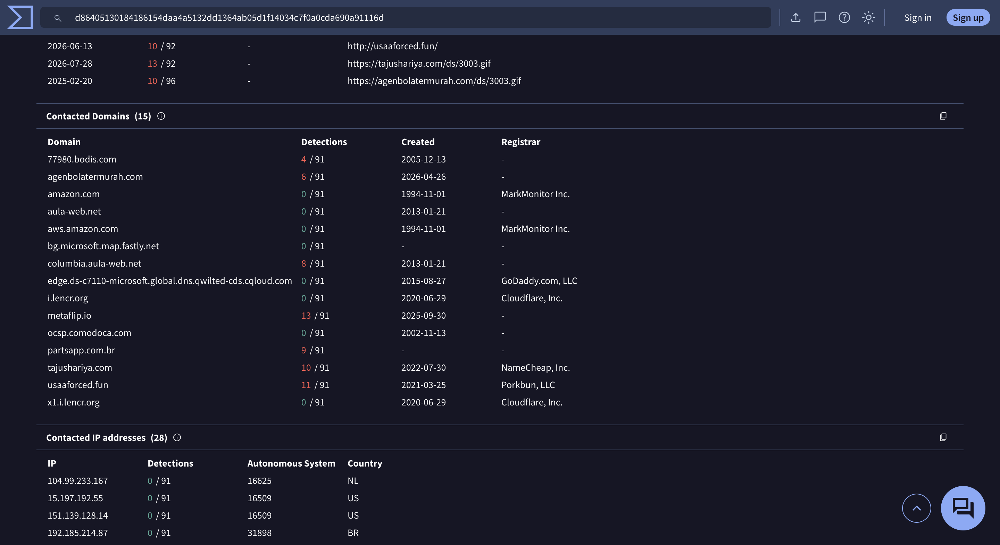
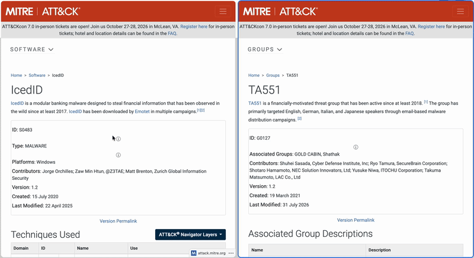
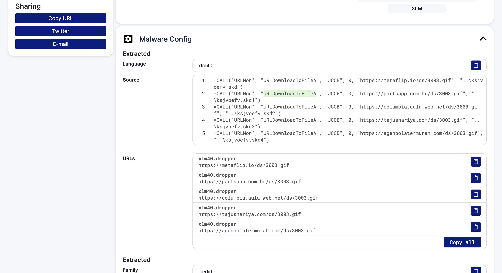

# IcedID Lab — CyberDefenders

> **Platform:** CyberDefenders
> **Category:** Threat Intelligence
> **Difficulty:** Easy
> **Status:** ✅ Completed
> **Date:** 2026-08-11
> **Time Spent:** ~30 menit

---

## 📌 Prolog

Investigasi malware IcedID menggunakan VirusTotal dan platform threat intelligence lain untuk mengidentifikasi IOC, threat actor terkait, dan mekanisme eksekusinya.

**Tools:** VirusTotal | Malpedia | X (Twitter) | Tria.ge | ANY.RUN

### Sekilas Tentang IcedID

IcedID (a.k.a BokBot) adalah modular banking trojan yang udah beredar sejak 2017, awalnya dipakai buat mencuri kredensial finansial lewat web injection, tapi sekarang lebih sering dipakai sebagai loader buat drop payload tahap lanjut (ransomware, Cobalt Strike, dsb). Vektor awal yang paling umum adalah phishing document — Word/Excel dengan macro (VBA atau XLM4.0) — atau lewat ISO/LNK file. Setelah macro dieksekusi, malware bakal manggil fungsi Windows API kayak `URLDownloadToFileA` buat narik payload tambahan dari beberapa domain yang udah di-hardcode sebagai fallback, lalu load payload itu pakai teknik `rundll32.exe`/`msiexec.exe` supaya proses yang jalan kelihatan legit.

---

## 🎯 Scenario

Sebuah threat group teridentifikasi menjalankan kampanye phishing secara masif untuk mendistribusikan payload berbahaya lanjutan. Payload yang paling sering ditemukan adalah IcedID. Diberikan hash dari sample IcedID untuk dianalisis guna memonitor aktivitas dari advanced persistent threat (APT) group ini.

---

## ❓ Questions

1. What is the name of the file associated with the given hash?
2. Can you identify the filename of the GIF file that was deployed?
3. How many domains does the malware look to download the additional payload file in Q2?
4. From the domains mentioned in Q3, a DNS registrar was predominantly used by the threat actor to host their harmful content, enabling the malware's functionality. Can you specify the Registrar INC?
5. Could you specify the threat actor linked to the sample provided?
6. In the Execution phase, what function does the malware employ to fetch extra payloads onto the system?

---

## 🔍 Answer & Walkthrough

### Starting Point — Lookup Hash di VirusTotal

Lab ngasih SHA256 hash (`d86405130184186154daa4a5132dd1364ab05d1f14034c7f0a0cda690a91116d`) buat dianalisis. Search hash ini di VirusTotal — 43 dari 65 vendor security langsung flag sebagai malicious.

---

### 1. Name of the file associated with the given hash?

Di tab **Details**, section **Names** nunjukkin semua nama file yang pernah dipakai buat sample ini di berbagai submission — mulai dari nama generic (`sample_04.xlsx`, `717.xlsx`) sampai nama asli yang dipakai attacker waktu didistribusikan: `document-1982481273.xlsm`.

**Jawaban:** `document-1982481273.xlsm`

---

### 2. Filename of the GIF file that was deployed?

Pindah ke tab **Relations**, section **Contacted URLs** nunjukkin file ini nyoba konek ke beberapa URL yang semuanya berujung sama — path `/ds/3003.gif`. Padahal ekstensinya `.gif`, ini bukan gambar beneran, cuma disguise buat payload tahap berikutnya (teknik masquerading biar lolos dari network filtering).

**Jawaban:** `3003.gif`

---

### 3. How many domains does the malware look to download the additional payload file?

Dari 8 URL yang tercatat di **Contacted URLs**, yang beneran ngarah ke path `/ds/3003.gif` ada di 5 domain berbeda: `columbia.aula-web.net`, `partsapp.com.br`, `metaflip.io`, `tajushariya.com`, dan `agenbolatermurah.com`. Sisanya (`aws.amazon.com`, `x1.i.lencr.org`, `usaaforced.fun`) adalah traffic pendukung (CDN/CA check), bukan tujuan download payload.

**Jawaban:** `5`

---

### 4. Predominant DNS registrar used by the threat actor?

Masih di tab **Relations**, scroll ke section **Contacted Domains** — ada kolom **Registrar** buat tiap domain. Dari 5 domain di Q3, `tajushariya.com` terdaftar di **NameCheap, Inc.** — dan pattern ini konsisten sama beberapa domain pendukung lain di list yang sama (`usaaforced.fun` di Porkbun, sisanya nggak ada info registrar), jadi NameCheap yang paling menonjol dipakai buat host domain-domain payload ini.

**Jawaban:** `NameCheap, Inc.`

---

### 5. Threat actor linked to the sample provided?

Cross-reference hash-nya ke Tria.ge ([sandbox report](https://tria.ge/210330-gbdr6k9jxx)) dan MITRE ATT&CK. Dari behavior report, sample ini di-tag sebagai family `icedid`. Cek halaman [IcedID (S0483)](https://attack.mitre.org/software/S0483/) di MITRE ATT&CK, salah satu grup yang tercatat menggunakan IcedID adalah [TA551 (G0127)](https://attack.mitre.org/groups/G0127/) — grup finansial-motivated yang aktif sejak 2018, dikenal juga dengan alias **GOLD CABIN** dan Shathak.

**Jawaban:** `Gold Cabin` (TA551)

---

### 6. Function used by the malware to fetch extra payloads (Execution phase)?

Di Tria.ge, section **Malware Config** nunjukkin macro XLM4.0 yang jadi source code si dropper. Isinya lima baris `CALL()` yang manggil `URLMon` dan fungsi `URLDownloadToFileA` buat narik `3003.gif` dari tiap domain fallback, lalu nyimpennya sebagai `.skd` file lokal.

**Jawaban:** `URLDownloadToFileA`

---

## 🚨 Key Findings / IOCs

| Tipe | Value | Keterangan |
|------|-------|------------|
| File Hash (SHA256) | `d86405130184186154daa4a5132dd1364ab05d1f14034c7f0a0cda690a91116d` | Sample XLSM dropper IcedID |
| File Name | `document-1982481273.xlsm` | Nama file asli saat didistribusikan |
| Dropped/Fake File | `3003.gif` | Payload tahap 2, disamarkan sebagai GIF, disimpan sebagai `ksjvoefv.skd*` |
| Domain | `columbia.aula-web.net` | Host payload `/ds/3003.gif` |
| Domain | `partsapp.com.br` | Host payload `/ds/3003.gif` |
| Domain | `metaflip.io` | Host payload `/ds/3003.gif` |
| Domain | `tajushariya.com` | Host payload `/ds/3003.gif`, registrar NameCheap, Inc. |
| Domain | `agenbolatermurah.com` | Host payload `/ds/3003.gif` |
| Malware Family | IcedID (BokBot) | Modular banking trojan / loader |
| Threat Actor | TA551 / GOLD CABIN / Shathak | Distributor kampanye phishing IcedID |

---

## 🗺️ MITRE ATT&CK Mapping

| Tactic | Technique | ID | Keterangan |
|--------|-----------|----|------------|
| Initial Access | Phishing: Spearphishing Attachment | T1566.001 | Distribusi awal lewat attachment `document-1982481273.xlsm` |
| Execution | User Execution: Malicious File | T1204.002 | Korban buka & enable macro di file XLSM |
| Execution | Command and Scripting Interpreter: Visual Basic | T1059.005 | Macro XLM4.0 jalanin `CALL()` ke `URLDownloadToFileA` |
| Execution | Windows Management Instrumentation | T1047 | IcedID pakai WMI buat eksekusi binary |
| Defense Evasion | Masquerading: Match Legitimate Resource Name | T1036.005 | Payload tahap 2 disamarkan pakai ekstensi `.gif` |
| Command and Control | Ingress Tool Transfer | T1105 | Download payload tambahan dari 5 domain fallback |
| Command and Control | Application Layer Protocol: Web Protocols | T1071.001 | Komunikasi C2 via HTTP/HTTPS |

---

## 📋 Summary — Attacker Behavior & Todo

### Attacker Behavior

Kampanye ini dimulai dari phishing document `document-1982481273.xlsm` yang didistribusikan oleh TA551 (GOLD CABIN/Shathak) — grup finansial-motivated yang aktif sejak 2018 dan spesialisasinya bikin phishing lure yang meyakinkan (kadang reply-chain dari mailbox korban sebelumnya).

Begitu korban buka file dan enable macro, XLM4.0 macro langsung jalan dan eksekusi lima `CALL()` statement berurutan ke `URLMon`/`URLDownloadToFileA`, masing-masing nyoba download file `3003.gif` dari domain yang berbeda (`metaflip.io`, `partsapp.com.br`, `columbia.aula-web.net`, `tajushariya.com`, `agenbolatermurah.com`) — pola fallback klasik biar tetap jalan walau salah satu domain udah di-takedown. File yang keliatannya GIF ini sebenarnya payload IcedID tahap berikutnya, disimpen lokal sebagai `ksjvoefv.skd*`.

Dari titik ini, IcedID lanjut ke fase discovery (system info, network config, domain trust) dan siap buat lateral movement atau drop payload lanjutan (ransomware/Cobalt Strike) tergantung tujuan operasi. Karena payload awal cuma macro dropper yang ringan, deteksi paling efektif ada di layer network (blokir domain fallback & pattern `/ds/*.gif`) dan email gateway (macro-enabled attachment dari sender nggak dikenal).

### Todo / Follow-up

- [ ] Pelajari behavior report lengkap di [Tria.ge](https://tria.ge/210330-gbdr6k9jxx) — cek proses child yang di-spawn setelah `.skd` file di-load
- [ ] Cross-check apakah 5 domain fallback ini overlap dengan campaign TA551 lain (via Malpedia/OTX)
- [ ] Latihan bikin detection rule (Sigma/YARA) buat pola `URLDownloadToFileA` di macro XLM4.0 + fallback multi-domain
- [ ] Baca lebih lanjut soal teknik XLM4.0 macro vs VBA macro — kenapa attacker makin sering pindah ke XLM4.0

---

## 📚 References

- [VirusTotal — Sample Analysis](https://www.virustotal.com/gui/file/d86405130184186154daa4a5132dd1364ab05d1f14034c7f0a0cda690a91116d/relations)
- [Tria.ge — Sandbox Report](https://tria.ge/210330-gbdr6k9jxx)
- [MITRE ATT&CK — IcedID (S0483)](https://attack.mitre.org/software/S0483/)
- [MITRE ATT&CK — TA551 (G0127)](https://attack.mitre.org/groups/G0127/)

---

*Writeup ini dibuat sebagai bagian dari perjalanan belajar Blue Team / SOC Analyst.*
