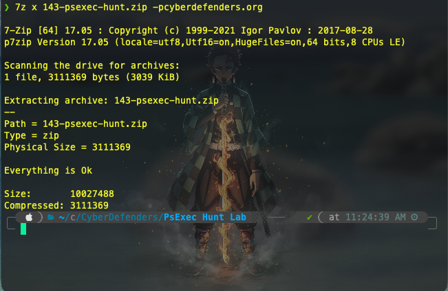
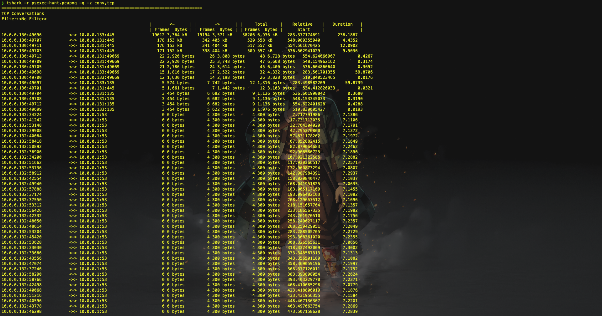
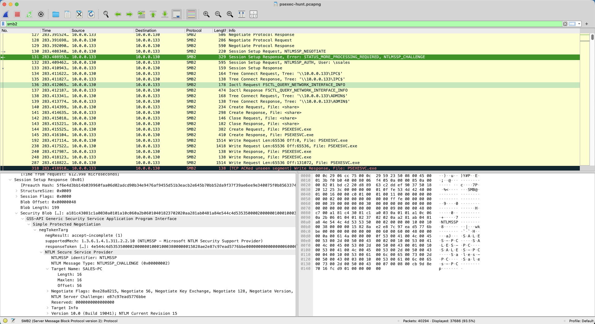
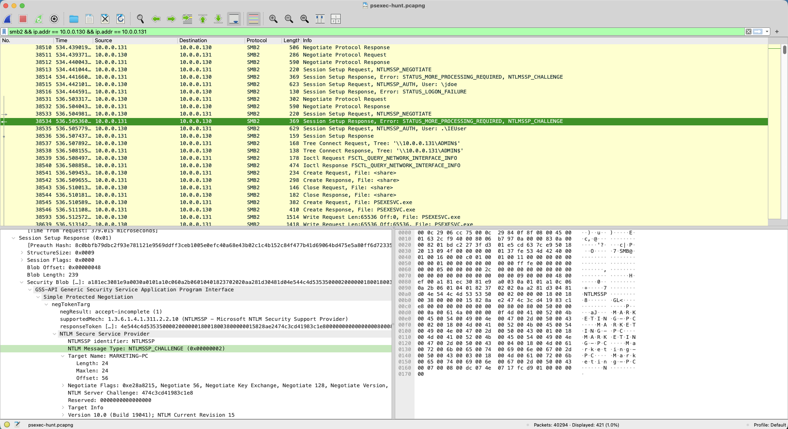

# PsExec Hunt Lab — CyberDefenders

> **Platform:** [CyberDefenders](https://cyberdefenders.org/blueteam-ctf-challenges/psexec-hunt/)  
> **Category:** Network Forensics  
> **Difficulty:** Easy  
> **Status:** ✅ Completed  
> **Date:** 2026-06-26  
> **Time Spent:** ~30 menit  
> **Tags:** `PsExec` `SMB` `Lateral Movement` `Wireshark` `PCAP Analysis`  
> **Tactics:** Execution, Defense Evasion, Discovery, Lateral Movement

---

## 📌 Prolog

Analyze SMB traffic in a PCAP file using Wireshark to identify PsExec lateral movement, compromised systems, user credentials, dan administrative shares. Challenge ini bagus untuk memahami bagaimana PsExec terlihat di level network — mulai dari authentication SMB, penggunaan administrative share, hingga instalasi service secara remote.

---

## 🎯 Scenario

Alert dari Intrusion Detection System (IDS) menandai aktivitas lateral movement yang mencurigakan menggunakan PsExec. Ini mengindikasikan kemungkinan unauthorized access dan pergerakan di dalam network. Sebagai SOC Analyst, tugas kita adalah menginvestigasi file PCAP yang tersedia untuk melacak aktivitas attacker — mengidentifikasi entry point, mesin yang menjadi target, sejauh mana breach terjadi, dan indikator kritis yang mengungkap taktik serta tujuan mereka di dalam environment yang sudah dikompromise.

---

## ❓ Questions

1. To effectively trace the attacker's activities within our network, can you identify the IP address of the machine from which the attacker initially gained access?
2. To fully understand the extent of the breach, can you determine the machine's hostname to which the attacker first pivoted?
3. Knowing the username of the account the attacker used for authentication will give us insights into the extent of the breach. What is the username utilized by the attacker for authentication?
4. After figuring out how the attacker moved within our network, we need to know what they did on the target machine. What's the name of the service executable the attacker set up on the target?
5. We need to know how the attacker installed the service on the compromised machine to understand the attacker's lateral movement tactics. This can help identify other affected systems. Which network share was used by PsExec to install the service on the target machine?
6. We must identify the network share used to communicate between the two machines. Which network share did PsExec use for communication?
7. Now that we have a clearer picture of the attacker's activities on the compromised machine, it's important to identify any further lateral movement. What is the hostname of the second machine the attacker targeted to pivot within our network?

---

## 🔍 Answer & Walkthrough

### Orientasi Awal — Endpoint dan Port

Buka PCAP di Wireshark, cek `Statistics → Endpoints → IPv4`. Ada 4 IP aktif di network:

| IP | Keterangan |
|----|------------|
| `10.0.0.1` | Gateway / infrastructure |
| `10.0.0.130` | **Attacker host** |
| `10.0.0.131` | Target kedua (MARKETING-PC) |
| `10.0.0.132` | Host lain di network |
| `10.0.0.133` | Target pertama (sales-PC) |

Port yang terlibat: `445` (SMB), `135` (RPC), `53` (DNS), `80` (HTTP), `49669` (dynamic RPC).



---

### 1. IP address of the machine from which the attacker initially gained access?



Dari analisis traffic, `10.0.0.130` memiliki byte transfer besar ke `10.0.0.133` dan merupakan sumber dari seluruh rangkaian SMB negotiation, authentication, dan file transfer `PSEXESVC.exe`. IP ini adalah host yang sudah dikompromise dan digunakan attacker sebagai jumping point.

**Jawaban:** `10.0.0.130`

---

### 2. Hostname of the machine to which the attacker first pivoted?

Filter SMB traffic ke target pertama:

```
ip.src == 10.0.0.133 && smb2
```


Dari SMB session setup, ditemukan target name mesin di `10.0.0.133` adalah `sales-PC`.

**Jawaban:** `sales-PC`

---

### 3. Username utilized by the attacker for authentication?

Lihat SMB2 Session Setup Request dari `10.0.0.130`. Di dalam NTLMSSP Authentication packet, username yang digunakan:

```
NTLMSSP_AUTH, User: ssales
```

**Jawaban:** `ssales`

---

### 4. Name of the service executable the attacker set up on the target?

Setelah authentication berhasil, attacker melakukan SMB Write ke share `ADMIN$`. Nama file yang di-transfer terlihat jelas di packet detail:

```
SMB2 Write Request → \\ADMIN$\PSEXESVC.exe
```

**Jawaban:** `PSEXESVC.exe`

---

### 5. Network share used by PsExec to install the service?

Dari packet SMB2 Tree Connect sebelum file transfer, attacker melakukan connect ke share `ADMIN$` — administrative share default Windows yang digunakan PsExec untuk mendrop service executable.

**Jawaban:** `ADMIN$`

---

### 6. Network share used by PsExec for communication?

Setelah instalasi service, PsExec membuka named pipe untuk komunikasi command/response via share `IPC$`. Terlihat dari SMB2 Tree Connect ke `\\sales-PC\IPC$` dan pembuatan pipe `PSEXESVC-HR-PC-7980-stdin/stdout/stderr`.

**Jawaban:** `IPC$`

---

### 7. Hostname of the second machine the attacker targeted?

Setelah selesai dengan `sales-PC`, attacker melakukan lateral movement serupa ke IP `10.0.0.131`. Dari SMB session ke IP tersebut, hostname target terbaca sebagai `MARKETING-PC`.



**Jawaban:** `MARKETING-PC`

---

## 🚨 Key Findings / IOCs

| Tipe | Value | Keterangan |
|------|-------|------------|
| IP Address | `10.0.0.130` | Attacker source (host yang dikompromise) |
| IP Address | `10.0.0.133` | Target pertama — sales-PC |
| IP Address | `10.0.0.131` | Target kedua — MARKETING-PC |
| Hostname | `sales-PC` | First pivot target |
| Hostname | `MARKETING-PC` | Second pivot target |
| Username | `ssales` | Akun yang digunakan attacker untuk auth SMB |
| File | `PSEXESVC.exe` | Service executable PsExec |
| SMB Share | `ADMIN$` | Share untuk drop dan install service |
| SMB Share | `IPC$` | Share untuk komunikasi command/response |
| Named Pipe | `PSEXESVC-HR-PC-7980-stdin/stdout/stderr` | Pipe komunikasi PsExec session |
| Key File | `PSEXEC-HR-PC-1C6C5D14.key` | Symmetric encryption key untuk session |
| Timestamp | `2023-10-11 14:42:08` | Awal serangan ke sales-PC |
| Timestamp | `2023-10-11 14:46:19` | Lateral movement ke MARKETING-PC |

---

## 🗺️ MITRE ATT&CK Mapping

| Tactic | Technique | ID | Keterangan |
|--------|-----------|----|------------|
| Lateral Movement | Remote Services: SMB/Windows Admin Shares | T1021.002 | PsExec menggunakan SMB admin share untuk lateral movement |
| Execution | System Services: Service Execution | T1569.002 | PsExec menginstall dan menjalankan service di target |
| Defense Evasion | Masquerading | T1036 | Service PsExec menyamar sebagai proses legitimate |
| Discovery | Network Share Discovery | T1135 | Attacker enumerate network share di target machine |

---

## 📋 Summary — Attacker Behavior & Todo

### Attacker Behavior

PCAP ini tidak mencakup initial access — file hanya merekam aktivitas dari host yang sudah dikompromise (`10.0.0.130`). Tidak diketahui bagaimana attacker pertama kali masuk ke host tersebut, maupun dari mana kredensial `ssales` didapat (kemungkinan phishing atau credential dumping sebelumnya).

Serangan dimulai pada `2023-10-11 14:42:08`. Attacker dari `10.0.0.130` melakukan TCP handshake ke `10.0.0.133`, diikuti SMB Negotiate dan Session Setup menggunakan akun `ssales`. Setelah authenticated, attacker mengakses `IPC$` untuk RPC, lalu `ADMIN$` untuk men-drop `PSEXESVC.exe`. Setelah file ter-transfer, PsExec mengatur symmetric encryption session via file `PSEXEC-HR-PC-1C6C5D14.key` dan membuka named pipe `PSEXESVC-HR-PC-7980-stdin/stdout/stderr` via `FSCTL_PIPE_TRANSCEIVE` untuk command execution — `stdin` sebagai input, `stdout` sebagai response, `stderr` untuk error. Target mesin `10.0.0.133` ini bernama `sales-PC`.

Setelah selesai melakukan discovery di `sales-PC`, pada `2023-10-11 14:46:19` attacker mengulangi proses yang sama terhadap `10.0.0.131` (`MARKETING-PC`) — TCP handshake → SMB Negotiate → auth → drop PSEXESVC → named pipe session.

### Todo / Follow-up

- [ ] Pelajari lebih dalam cara kerja PsExec di level protokol SMB — TCP handshake → SMB Negotiate → auth → ADMIN$ → IPC$ → named pipe
- [ ] Eksplorasi detection rule untuk PsExec lateral movement di Sysmon (Event ID 7045 — service install)
- [ ] Latihan filter Wireshark untuk SMB traffic: `smb2`, `smb`, `dcerpc`, `ntlmssp`
- [ ] Buat Sigma rule untuk mendeteksi PsExec berdasarkan pola named pipe `PSEXESVC-*`
- [ ] Investigasi lebih lanjut: bagaimana attacker mendapatkan akun `ssales` dan initial access ke `10.0.0.130`

---

## 📚 References

- [MITRE ATT&CK — T1021.002 SMB/Windows Admin Shares](https://attack.mitre.org/techniques/T1021/002/)
- [MITRE ATT&CK — T1569.002 Service Execution](https://attack.mitre.org/techniques/T1569/002/)
- [CyberDefenders — PsExec Hunt Lab](https://cyberdefenders.org/blueteam-ctf-challenges/psexec-hunt/)

---

*Writeup ini dibuat sebagai bagian dari perjalanan belajar Blue Team / SOC Analyst.*
