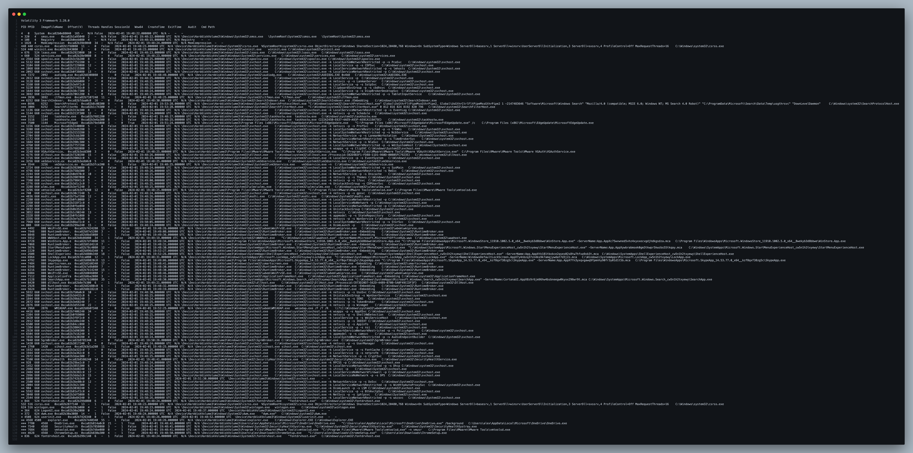
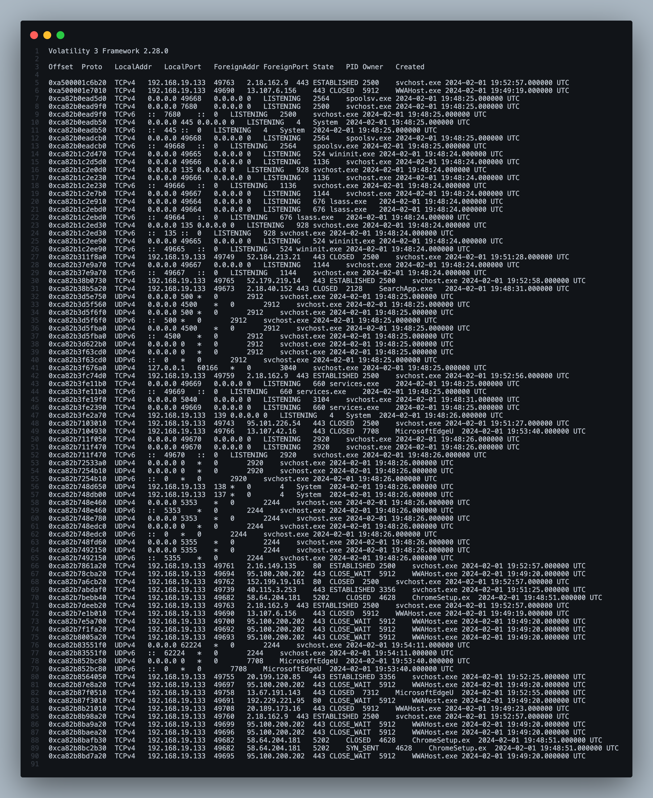
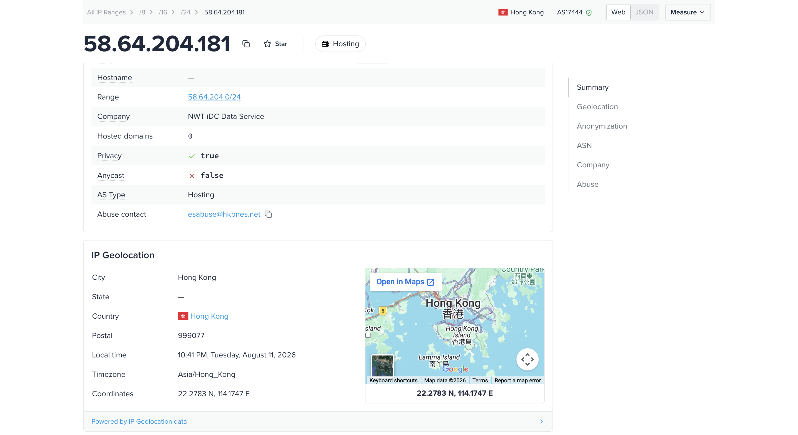
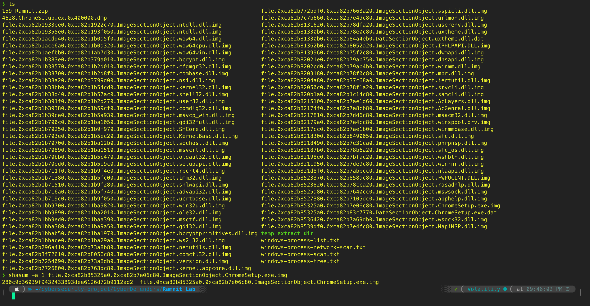
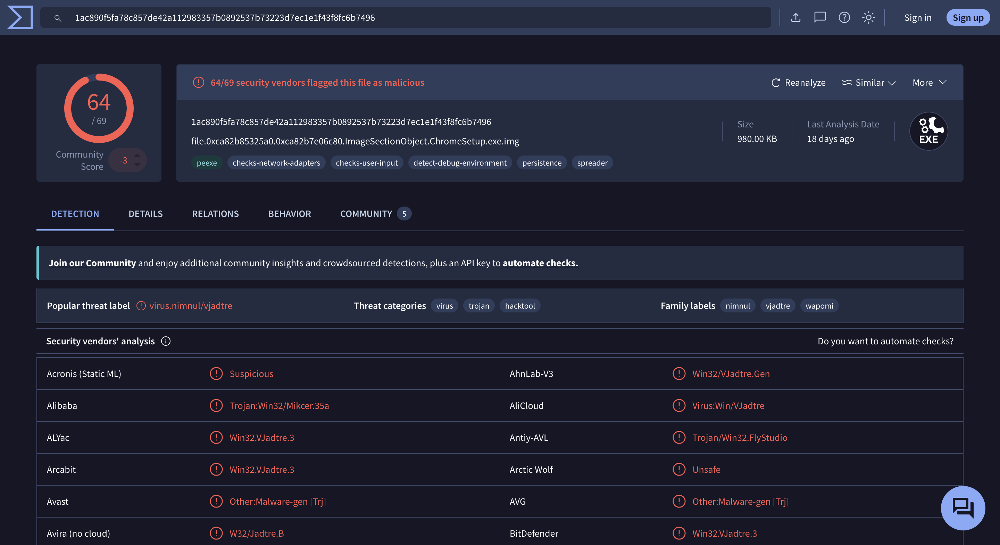
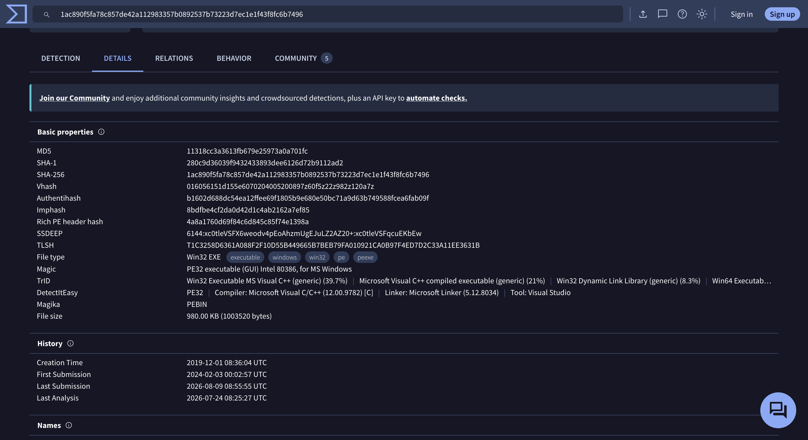
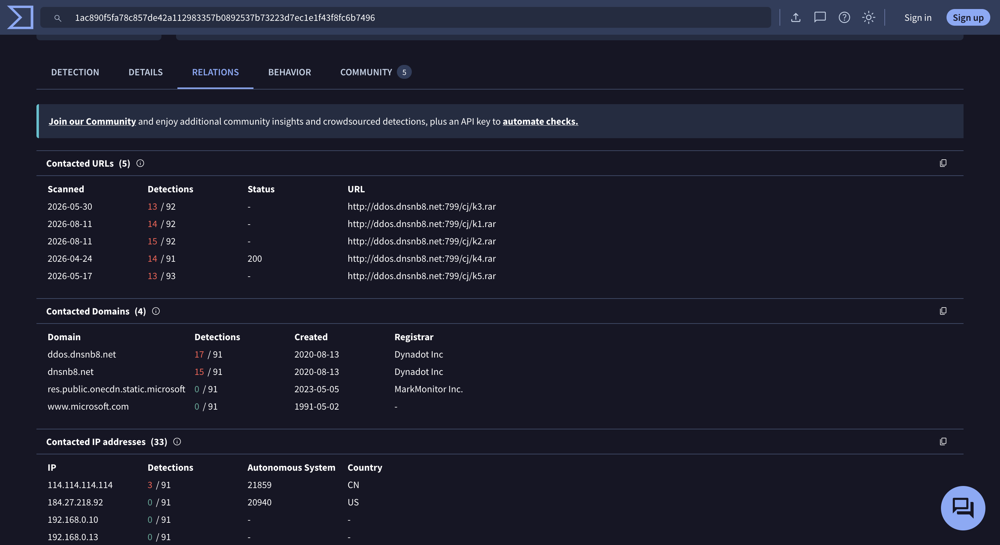

# Ramnit Lab — CyberDefenders

> **Platform:** CyberDefenders
> **Category:** Endpoint Forensics
> **Difficulty:** Easy
> **Status:** ✅ Completed
> **Date:** 2026-08-11
> **Time Spent:** ~30 menit

---

## 📌 Prolog

Menganalisis memory dump pakai Volatility untuk mengidentifikasi proses berbahaya, mengekstrak network IOC, file hash, dan compilation timestamp, lalu meng-korelasikannya dengan threat intelligence eksternal.

**Tools:** Volatility 3 | VirusTotal

---

## 🎯 Scenario

Intrusion detection system kita mendeteksi behavior mencurigakan di sebuah workstation, mengarah ke kemungkinan intrusi malware. Memory dump dari sistem ini udah diambil untuk dianalisis. Tugasnya adalah menganalisis dump ini, menelusuri aksi malware, dan melaporkan temuan-temuan kunci.

---

## ❓ Questions

1. What is the name of the process responsible for the suspicious activity?
2. What is the exact path of the executable for the malicious process?
3. Identifying network connections is crucial for understanding the malware's communication strategy. What IP address did the malware attempt to connect to?
4. To determine the specific geographical origin of the attack, which city is associated with the IP address the malware communicated with?
5. Hashes serve as unique identifiers for files, assisting in the detection of similar threats across different machines. What is the SHA1 hash of the malware executable?
6. Examining the malware's development timeline can provide insights into its deployment. What is the compilation timestamp for the malware?
7. Identifying the domains associated with this malware is crucial for blocking future malicious communications and detecting any ongoing interactions with those domains within our network. Can you provide the domain connected to the malware?

---

## 🔍 Answer & Walkthrough

### Starting Point — Process Tree dengan Volatility 3

Lab kasih memory dump Windows. Langkah pertama: cek process tree pakai `windows.pstree` buat lihat parent-child relationship semua proses.

```bash
vol -f <dump> windows.pstree
```



Dari hasilnya, ada 4 child process dari `explorer.exe` (PID 4568): `OneDrive.exe`, `SecurityHealthSystray.exe`, `vmtoolsd.exe`, dan `ChromeSetup.exe` (PID 4628). Tiga proses pertama itu proses legit bawaan sistem/VM. Yang paling mencurigakan adalah `ChromeSetup.exe` — jalan dari `C:\Users\alex\Downloads\`, yang berarti hasil download manual user, bukan proses sistem.

---

### 1 & 2. Nama proses & path executable yang mencurigakan?

Masih dari output `windows.pstree`, baris proses PID 4628 nunjukkin nama file, full command line, dan path-nya sekaligus.

**Jawaban #1:** `ChromeSetup.exe`
**Jawaban #2:** `C:\Users\alex\Downloads\ChromeSetup.exe`

---

### 3. IP address yang dihubungi malware?

Jalanin `windows.netscan` buat nangkep semua koneksi network yang tercatat di memory:

```bash
vol -f <dump> windows.netscan
```



Ketemu 2 entry TCP dari PID 4628 (`ChromeSetup.ex`) yang konek ke port 5202 (state `CLOSED` dan `SYN_SENT`) — port nggak umum, indikasi C2 custom, bukan traffic web biasa.

**Jawaban:** `58.64.204.181`

---

### 4. Kota/geolocation dari IP tersebut?

Cek IP `58.64.204.181` di layanan IP geolocation — hosting provider-nya NWT iDC Data Service, AS17444.



**Jawaban:** `Hong Kong`

---

### 5. SHA1 hash malware executable?

Buat validasi lebih lanjut, dump file `ChromeSetup.exe` dari memory pakai `windows.dumpfiles` dengan filter PID:

```bash
vol -f <dump> windows.dumpfiles --pid 4628
```

Hasilnya nemu file `file.0xca82b85325a0.0xca82b7e06c80.ImageSectionObject.ChromeSetup.exe.img` — lalu hash manual pakai `shasum`:

```bash
shasum -a 1 file.0xca82b85325a0.0xca82b7e06c80.ImageSectionObject.ChromeSetup.exe.img
```



**Jawaban:** `280c9d36039f9432433893dee6126d72b9112ad2`

---

### 6. Compilation timestamp malware?

Hash SHA1 di atas di-cross-check ke VirusTotal — 64 dari 69 vendor security flag file ini sebagai malicious, dengan popular threat label `virus.nimnul/vjadtre` dan family labels `nimnul`, `vjadtre`, `wapomi` (alias dari malware family **Ramnit**).



Di tab **Details**, section **History** nunjukkin Creation Time PE header-nya.



**Jawaban:** `2019-12-01 08:36`

---

### 7. Domain yang terhubung dengan malware?

Pindah ke tab **Relations** VirusTotal — ada 5 Contacted URLs yang semuanya mengarah ke pattern yang sama: `http://ddos.dnsnb8.net:799/cj/k{1-5}.rar`. Ini kemungkinan besar stager buat download payload tambahan. Domain induknya, `dnsnb8.net`, terdaftar sejak 2020-08-13 di registrar Dynadot Inc.



**Jawaban:** `dnsnb8.net`

---

## 🚨 Key Findings / IOCs

| Tipe | Value | Keterangan |
|------|-------|------------|
| Process Name | `ChromeSetup.exe` (PID 4628) | Child process dari `explorer.exe`, disamarkan sebagai installer Chrome |
| File Path | `C:\Users\alex\Downloads\ChromeSetup.exe` | Lokasi executable di disk |
| File Hash (SHA1) | `280c9d36039f9432433893dee6126d72b9112ad2` | Hash malware, 64/69 vendor VirusTotal flag malicious |
| File Hash (MD5) | `11318cc3a3613fb679e25973a0a701fc` | Dari VirusTotal Details |
| File Hash (SHA256) | `1ac890f5fa78c857de42a112983357b0892537b73223d7ec1e1f43f8fc6b7496` | Dari VirusTotal Details |
| IP Address | `58.64.204.181` | Koneksi TCP port 5202 (custom C2), hosting NWT iDC Data Service, Hong Kong (AS17444) |
| Domain | `dnsnb8.net` / `ddos.dnsnb8.net` | Host stager payload `/cj/k{1-5}.rar`, registrar Dynadot Inc, terdaftar 2020-08-13 |
| Compilation Timestamp | `2019-12-01 08:36:04 UTC` | Waktu compile PE header malware |
| Malware Family | Ramnit (alias: Nimnul, Vjadtre, Wapomi) | Worm/trojan modular, sering menyamar sebagai installer |

---

## 🗺️ MITRE ATT&CK Mapping

| Tactic | Technique | ID | Keterangan |
|--------|-----------|----|------------|
| Initial Access | Drive-by Compromise / User-downloaded software | T1189 | Malware disamarkan sebagai `ChromeSetup.exe`, di-download manual ke folder Downloads |
| Execution | User Execution: Malicious File | T1204.002 | User menjalankan installer palsu yang di-download |
| Defense Evasion | Masquerading: Match Legitimate Name or Location | T1036.005 | Nama file meniru installer Google Chrome resmi |
| Command and Control | Non-Standard Port | T1571 | Komunikasi ke `58.64.204.181` lewat port custom 5202 |
| Command and Control | Ingress Tool Transfer | T1105 | Stager `/cj/k{1-5}.rar` di `ddos.dnsnb8.net` untuk narik payload tambahan |

---

## 📋 Summary — Attacker Behavior & Todo

### Attacker Behavior

Korban men-download file `ChromeSetup.exe` ke folder Downloads — kelihatan legit sebagai installer Google Chrome, padahal itu adalah malware family **Ramnit** (alias Nimnul/Vjadtre/Wapomi). Begitu dijalankan, proses ini muncul sebagai child process dari `explorer.exe`, di antara proses-proses legit lain (OneDrive, SecurityHealthSystray, vmtoolsd) — sekilas nggak mencolok kalau cuma dilihat dari process list biasa.

Dari network activity di memory, proses ini mencoba koneksi TCP ke `58.64.204.181` (Hong Kong) lewat port 5202 — port non-standar yang mengindikasikan custom C2 channel, bukan trafik web umum (80/443). Cross-reference hash file ke VirusTotal mengonfirmasi domain command yang dipakai, `dnsnb8.net`, dengan stager URL berpola `http://ddos.dnsnb8.net:799/cj/k{1-5}.rar` — kemungkinan dipakai buat narik payload tahap berikutnya begitu koneksi ke C2 utama berhasil.

Compilation timestamp PE header (2019-12-01) jauh lebih tua dari waktu proses ini dijalankan di memory dump (2024-02-01), mengindikasikan sample-nya udah beredar cukup lama sebelum insiden ini — kemungkinan reused/recompiled dari builder yang sama oleh operator berbeda.

### Todo / Follow-up

- [x] ~~Coba plugin `windows.malfind` buat cek apakah ada proses lain yang di-inject Ramnit~~ — udah dicoba, hasilnya nggak ada temuan terkait Ramnit. Region RWX yang ke-flag cuma di proses legit (`SearchApp.exe`, `RuntimeBroker.exe`, `smartscreen.exe`, `OneDrive.exe`, `WWAHost.exe`) — kemungkinan besar false positive (JIT/CFG trampoline), bukan indikasi injeksi
- [ ] Pelajari lebih lanjut mekanisme persistence khas Ramnit (registry run key, autorun.inf di removable drive)
- [ ] Cross-check 5 URL stager (`k1.rar` s/d `k5.rar`) — apakah masing-masing payload beda atau redundant/fallback
- [ ] Latihan bikin Sigma rule buat deteksi proses bernama installer browser tapi jalan dari folder Downloads dengan child process aneh

---

## 📚 References

- [Volatility 3 — Memory Forensics Framework](https://github.com/volatilityfoundation/volatility3)
- [VirusTotal — Sample Analysis](https://www.virustotal.com/gui/file/1ac890f5fa78c857de42a112983357b0892537b73223d7ec1e1f43f8fc6b7496)
- [MITRE ATT&CK](https://attack.mitre.org/)

---

*Writeup ini dibuat sebagai bagian dari perjalanan belajar Blue Team / SOC Analyst.*
