# Red Stealer Lab — CyberDefenders

> **Platform:** CyberDefenders
> **Category:** Threat Intelligence
> **Difficulty:** Easy
> **Status:** ✅ Completed
> **Date:** 2026-08-12
> **Time Spent:** ~30 menit

---

## 📌 Prolog

Investigasi executable mencurigakan menggunakan VirusTotal dan MalwareBazaar untuk ekstrak IOC, identifikasi infrastruktur C2, mapping MITRE ATT&CK technique, dan mekanisme privilege escalation yang dipakai malware.

**Tools:** Whois | VirusTotal | MalwareBazaar | ThreatFox | ANY.RUN

**Tactics yang tercakup:** Execution | Persistence | Privilege Escalation | Stealth | Defense Impairment | Discovery | Collection | Impact

---

## 🎯 Scenario

Lo bagian dari tim Threat Intelligence di SOC (Security Operations Center). Sebuah file executable ditemukan di komputer rekan kerja, dan dicurigai berhubungan dengan Command and Control (C2) server — indikasi kemungkinan infeksi malware.

Tugas lo adalah investigasi executable ini dengan menganalisis hash-nya. Tujuannya adalah mengumpulkan dan menganalisis data yang berguna buat anggota SOC lain, termasuk tim Incident Response, supaya bisa merespons perilaku mencurigakan ini secara efisien.

---

## ❓ Questions

1. Categorizing malware enables a quicker and clearer understanding of its unique behaviors and attack vectors. What category has Microsoft identified for that malware in VirusTotal?
2. Clearly identifying the name of the malware file improves communication among the SOC team. What is the file name associated with this malware? (Don't include the file extension in the name.)
3. Knowing the exact timestamp of when the malware was first observed can help prioritize response actions. Newly detected malware may require urgent containment and eradication compared to older, well-documented threats. What is the UTC timestamp of the malware's first submission to VirusTotal?
4. Understanding the techniques used by malware helps in strategic security planning. What is the MITRE ATT&CK technique ID for the malware's data collection from the system before exfiltration?
5. Following execution, which social media-related domain names did the malware resolve via DNS queries?
6. Once the malicious IP addresses are identified, network security devices such as firewalls can be configured to block traffic to and from these addresses. Can you provide the IP address and destination port the malware communicates with?
7. YARA rules are designed to identify specific malware patterns and behaviors. Using MalwareBazaar, what's the name of the YARA rule created by "Varp0s" that detects the identified malware?
8. Understanding which malware families are targeting the organization helps in strategic security planning for the future and prioritizing resources based on the threat. Can you provide the different malware alias associated with the malicious IP address according to ThreatFox?
9. By identifying the malware's imported DLLs, we can configure security tools to monitor for the loading or unusual usage of these specific DLLs. Can you provide the DLL utilized by the malware for privilege escalation?

---

## 🔍 Answer & Walkthrough

### Starting Point — Lookup Hash di VirusTotal

Lab ngasih SHA256 hash (`248fcc901aff4e4b4c48c91e4d78a939bf681c9a1bc24addc3551b32768f907b`) buat dianalisis. Search hash ini di VirusTotal — 60 dari 71 vendor security langsung flag sebagai malicious, dengan popular threat label `trojan.crifi/stealer` dan family labels `crifi`, `stealer`, `redline`.

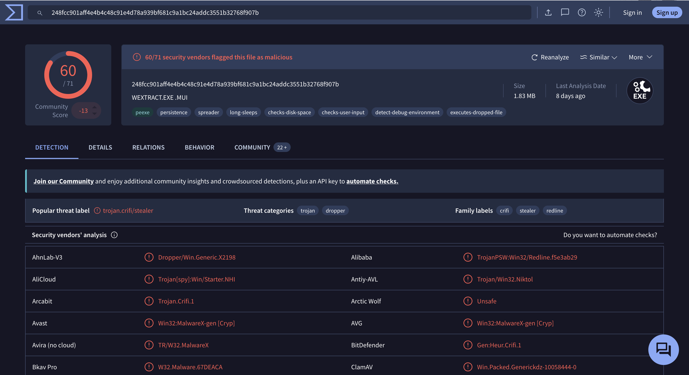

---

### 1. Category yang diidentifikasi Microsoft di VirusTotal?

Masih di tab **Detection**, section **Threat categories** langsung nunjukkin `trojan, dropper`. Cross-check ke baris deteksi Microsoft sendiri di list vendor — hasilnya `Trojan:Win32/Redline!rfn`, konsisten sama kategori Trojan.

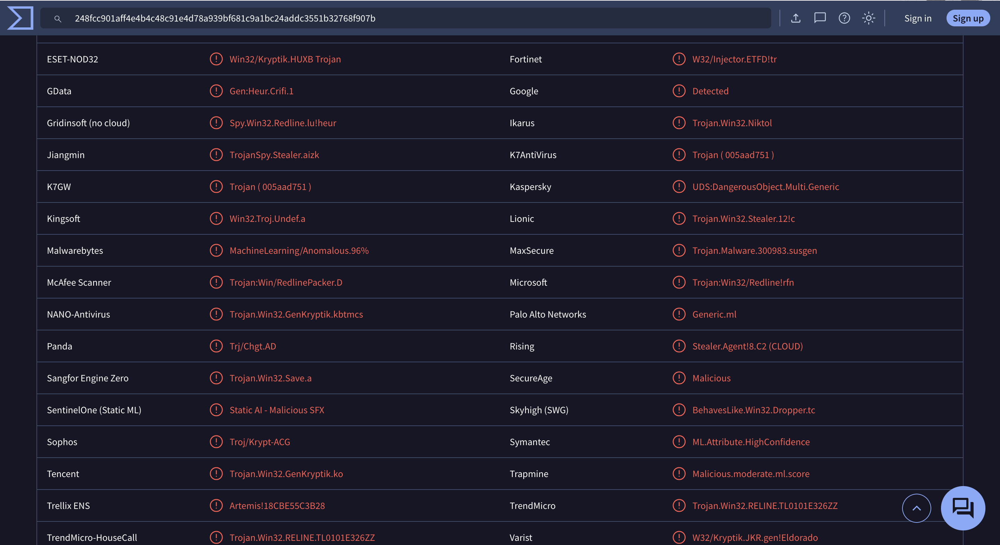

**Jawaban:** `Trojan`

---

### 2. File name (tanpa ekstensi)?

Header sample di tab Detection nunjukkin nama `WEXTRACT.EXE .MUI`. Konfirmasi lagi di tab **Details** section **Names** — nama yang paling relevan dan konsisten adalah `Wextract`. Menariknya, `wextract.exe` sebenernya nama binary legit bawaan Windows (CAB self-extractor) yang di-abuse attacker buat nge-drop payload RedLine — teknik living-off-the-land biar nggak langsung mencurigakan.

**Jawaban:** `WEXTRACT`

---

### 3. UTC timestamp first submission ke VirusTotal?

Masih di tab Details, section **History** nunjukkin:
- Creation Time: `2022-05-24 22:49:06 UTC`
- First Seen In The Wild: `2023-10-07 07:20:23 UTC`
- **First Submission: `2023-10-06 04:41:50 UTC`**

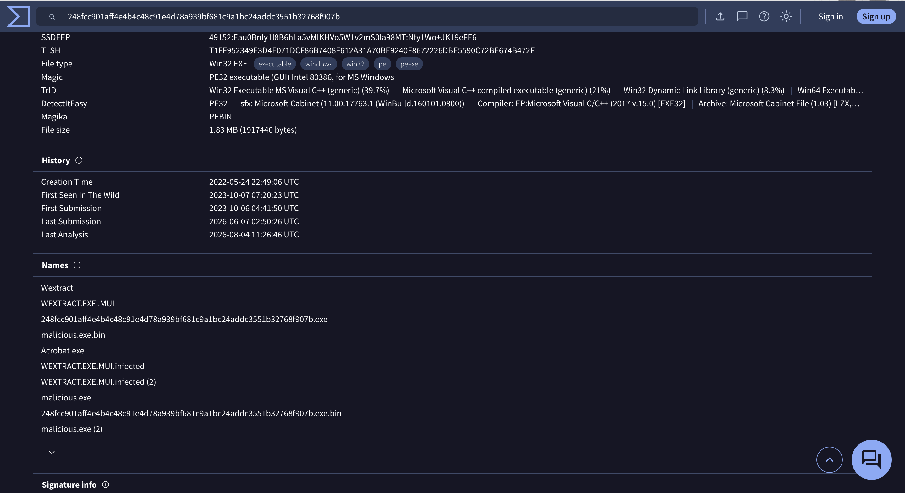

**Jawaban:** `2023-10-06 04:41 UTC`

---

### 4. MITRE technique ID untuk data collection sebelum exfiltration?

Pindah ke tab **Behavior**, section **MITRE ATT&CK Tactics and Techniques**. Di kolom **Collection (TA0009)**, ada technique `Data from Local System` dengan ID `T1005` — RedLine ngumpulin data lokal (browser data, credentials, system info) sebelum dikirim ke C2.

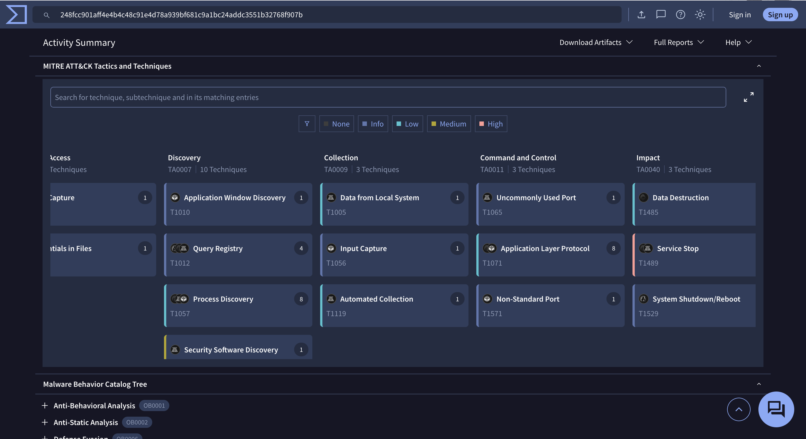

**Jawaban:** `T1005`

---

### 5. Domain media sosial yang di-resolve via DNS?

Dua bukti saling melengkapi:
- Di **ANY.RUN**, browser session interaktif nunjukkin sample ini otomatis buka `facebook.com/login` — indikasi RedLine nyoba grab session/cookie/credential Facebook dari browser korban.
- Di VirusTotal tab **Relations** → **Contacted URLs**, banyak entry yang ngarah ke domain Facebook: `facebook.com`, `fbsbx.com`, `static.xx.fbcdn.net`.

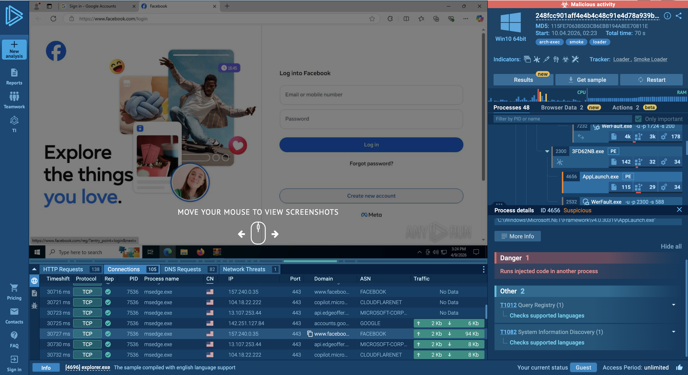
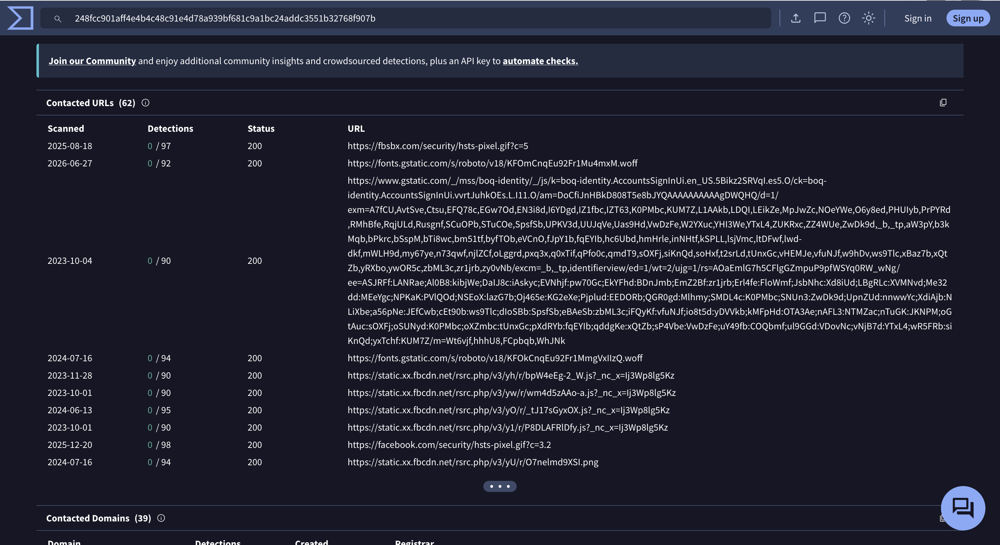

**Jawaban:** `facebook.com` (beserta subdomain terkait: `fbsbx.com`, `static.xx.fbcdn.net`)

---

### 6. IP address dan destination port malware?

Full report ANY.RUN, section **Malware configuration** nunjukkin config RedLine langsung ke-extract: C2 address, botnet ID (`front`), dan XOR key (`Soumings`) yang dipakai buat decode config.

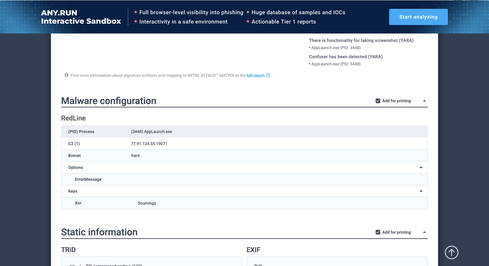

**Jawaban:** `77.91.124.55:19071`

---

### 7. YARA rule oleh "Varp0s" di MalwareBazaar?

Search hash yang sama di MalwareBazaar, section **YARA Signatures** nunjukkin beberapa rule yang match, salah satunya `detect_Redline_Stealer` dengan **Author: Varp0s**.

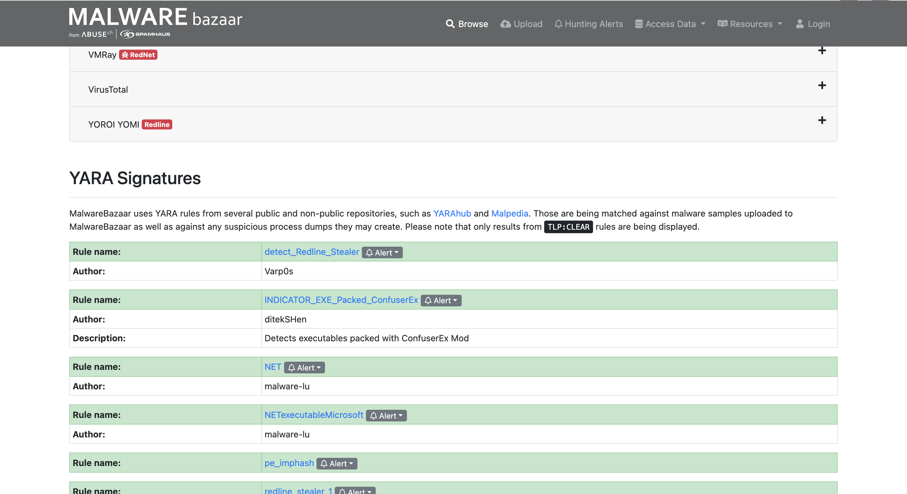
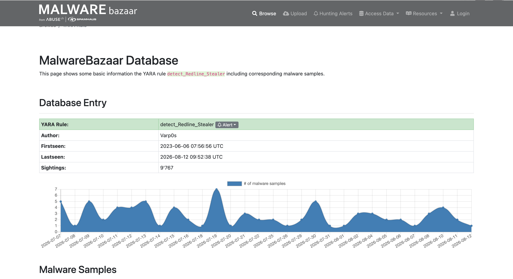

**Jawaban:** `detect_Redline_Stealer`

---

### 8. Malware alias di ThreatFox untuk IP malicious?

Search IOC (IP `77.91.124.55` / hash sample) di ThreatFox — Database Entry nunjukkin `Malware: RedLine Stealer` dengan `Malware alias: RECORDSTEALER`, konsisten juga di entry IOC individual (md5 hash payload) yang terasosiasi.

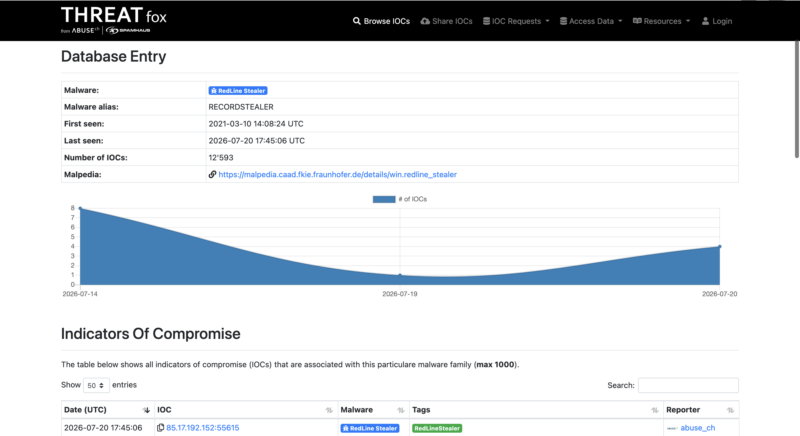
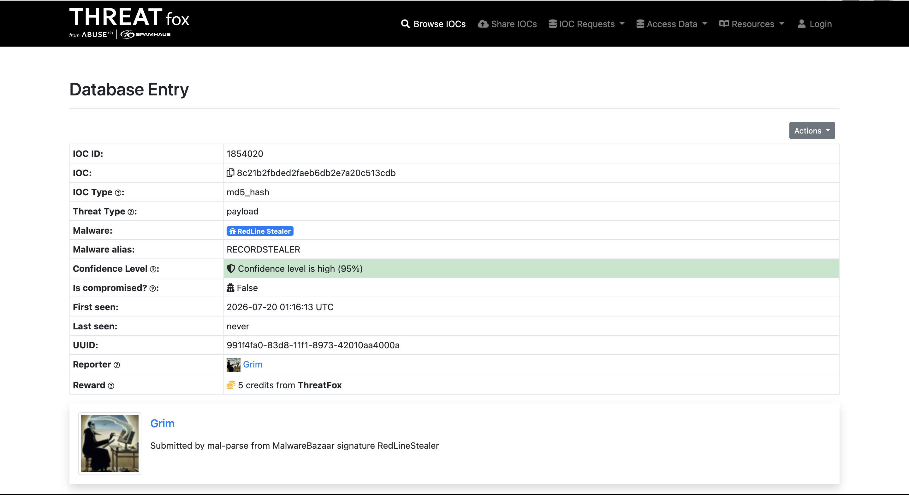

**Jawaban:** `RECORDSTEALER`

---

### 9. DLL yang dipakai untuk privilege escalation?

Balik ke VT tab Behavior, di kategori **Privilege Escalation** ada 6 technique yang match (T1055, T1134, T1543, T1547, T1548, T1053). Yang paling eksplisit nunjuk ke satu API call adalah `T1134 - Access Token Manipulation`, dengan match `api: AdjustTokenPrivileges`.

Buat pastiin DLL asal fungsi ini bukan cuma nebak dari nama API, cross-check ke tab **Details** → section **Imports** — expand `ADVAPI32.dll`, dan `AdjustTokenPrivileges` beneran ada di daftar importnya, bareng fungsi token-manipulation lain (`OpenProcessToken`, `LookupPrivilegeValueA`, `GetTokenInformation`).

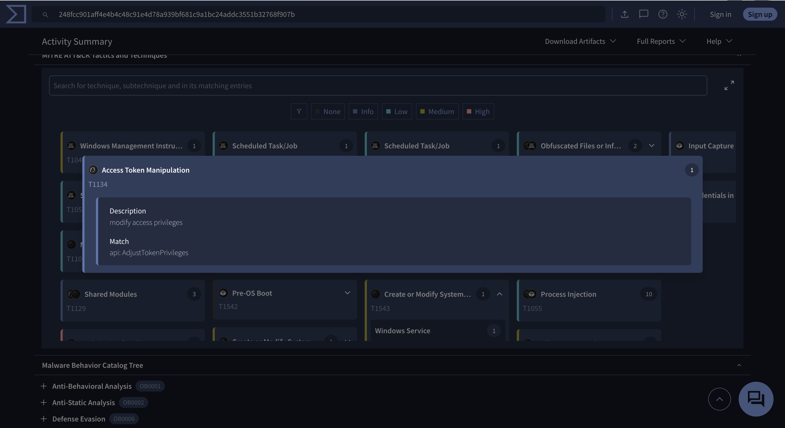
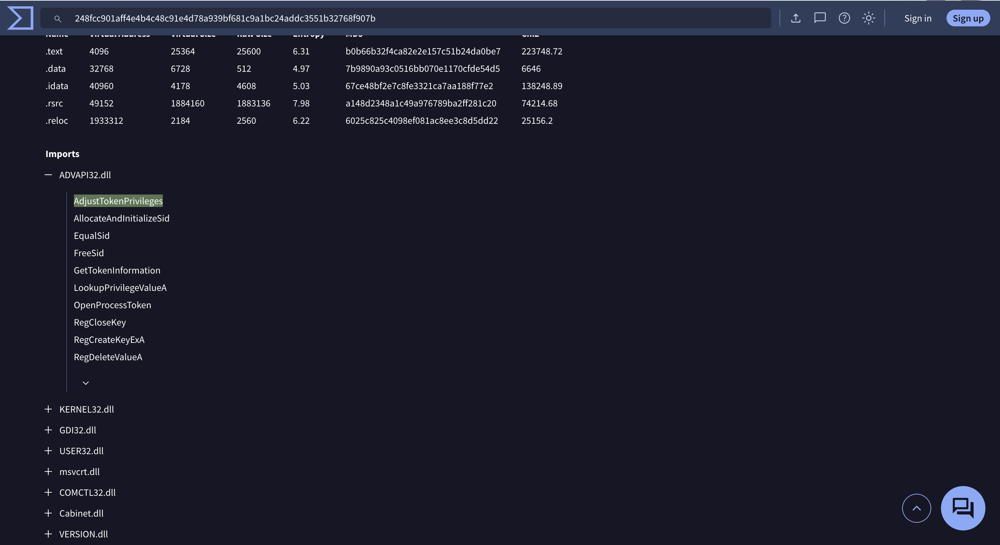

**Jawaban:** `ADVAPI32.dll`

---

## 🚨 Key Findings / IOCs

| Tipe | Value | Keterangan |
|------|-------|------------|
| File Hash (SHA256) | `248fcc901aff4e4b4c48c91e4d78a939bf681c9a1bc24addc3551b32768f907b` | Sample dropper, disamarkan sebagai `WEXTRACT.EXE .MUI` |
| File Hash (MD5) | `115FE7063B503CB6EBB194A8EE70811E` | Hash proses yang jalan di sandbox (AppLaunch.exe) |
| File Name | `WEXTRACT` | Nama binary legit Windows (CAB self-extractor) yang di-abuse |
| C2 IP:Port | `77.91.124.55:19071` | Non-standard port, protokol custom RedLine |
| Botnet ID | `front` | Identifier campaign/build RedLine |
| Domain | `facebook.com`, `fbsbx.com`, `static.xx.fbcdn.net` | Decoy/target credential & cookie theft |
| Malware Family | RedLine Stealer (alias `RECORDSTEALER`) | Info-stealer populer, jual data via Telegram/panel C2 |
| YARA Rule | `detect_Redline_Stealer` (Varp0s) | Signature detection di MalwareBazaar |
| DLL Privilege Escalation | `ADVAPI32.dll` (`AdjustTokenPrivileges`) | Dipanggil buat modify access token privileges |

---

## 🗺️ MITRE ATT&CK Mapping

| Tactic | Technique | ID | Keterangan |
|--------|-----------|----|------------|
| Privilege Escalation | Access Token Manipulation | T1134 | Panggil `AdjustTokenPrivileges` dari `ADVAPI32.dll` |
| Discovery | Query Registry | T1012 | Cek supported languages & konfigurasi sistem |
| Discovery | System Information Discovery | T1082 | Enumerasi info sistem korban |
| Collection | Data from Local System | T1005 | Kumpulin data lokal (browser, credential) sebelum exfiltration |
| Collection | Input Capture | T1056 | Capture input terkait credential login (mis. Facebook) |
| Command and Control | Application Layer Protocol | T1071 | Komunikasi ke C2 `77.91.124.55` |
| Command and Control | Non-Standard Port | T1571 | C2 pakai port non-standard `19071` |
| Defense Evasion | Masquerading | — | Payload nyamar sebagai `WEXTRACT.EXE` (binary legit Windows) |

---

## 📋 Summary — Attacker Behavior & Todo

### Attacker Behavior

Sample ini nyamar sebagai `WEXTRACT.EXE .MUI` — meniru nama binary legit CAB self-extractor bawaan Windows — padahal isinya dropper buat RedLine Stealer (alias RECORDSTEALER). Begitu dieksekusi, proses turunannya (`AppLaunch.exe`, dari path `.NET Framework`) langsung load RedLine di memory dan ke-flag ANY.RUN sebagai **"Runs injected code in another process"** — indikasi process injection buat sembunyi di balik proses legit.

Setelah aktif, malware langsung ngelakuin discovery ringan (query registry, cek bahasa sistem, system info discovery) sebelum masuk fase collection: ngumpulin data lokal dari sistem (`T1005`) dan browser (termasuk buka otomatis `facebook.com/login` buat capture credential/session/cookie korban — pola khas info-stealer yang nargetin akun media sosial buat dijual atau disalahgunakan). Sebelum data ini di-exfiltrate, RedLine juga manggil `AdjustTokenPrivileges` dari `ADVAPI32.dll` buat modifikasi access token privileges (`T1134`), naikin level akses proses biar bisa akses data yang lebih sensitif atau proses lain.

Data hasil curian dikirim ke C2 di `77.91.124.55:19071` — port non-standard, dengan botnet identifier `front`, dan config yang di-XOR pakai key `Soumings` biar nggak gampang ke-parse otomatis. RedLine juga punya kapabilitas destructive (Data Destruction, Service Stop, System Shutdown/Reboot) sesuai mapping MITRE di VirusTotal, meskipun di run ini fokus utamanya tetap credential/data theft, bukan destruksi.

### Todo / Follow-up

- [ ] Pelajari full report ANY.RUN lebih detail — cek proses child `AppLaunch.exe` dan indikator packer `ConfuserEx` (YARA hit: `INDICATOR_EXE_Packed_ConfuserEx`)
- [ ] Cross-check IOC `77.91.124.55:19071` ke ThreatFox/OTX buat lihat campaign lain yang overlap sama C2 ini
- [ ] Investigasi lebih lanjut kapabilitas destructive RedLine (Data Destruction/Service Stop/System Shutdown) — apakah build ini beneran punya fitur itu atau cuma anti-analysis check
- [ ] Latihan bikin Sigma rule buat pattern `ADVAPI32.dll!AdjustTokenPrivileges` dipanggil dari proses non-service yang baru spawn

---

## 📚 References

- [VirusTotal — Sample Analysis](https://www.virustotal.com/gui/file/248fcc901aff4e4b4c48c91e4d78a939bf681c9a1bc24addc3551b32768f907b/behavior)
- [MalwareBazaar — Sample Info](https://bazaar.abuse.ch/sample/248fcc901aff4e4b4c48c91e4d78a939bf681c9a1bc24addc3551b32768f907b/#file_info)
- [ANY.RUN — Sandbox Report](https://app.any.run/tasks/3fc45e52-c830-499f-b9f6-fd18a3f47897)
- [ThreatFox — RedLine Stealer](https://threatfox.abuse.ch/browse/malware/win.redline_stealer/)

---

*Writeup ini dibuat sebagai bagian dari perjalanan belajar Blue Team / SOC Analyst.*
