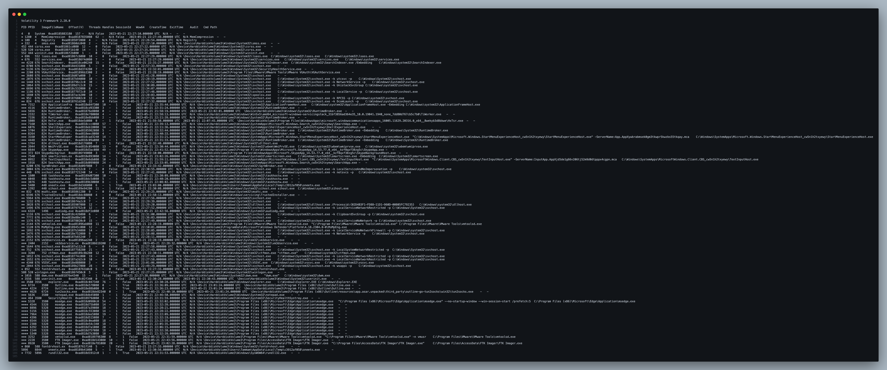
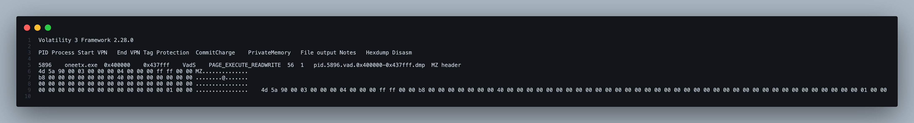
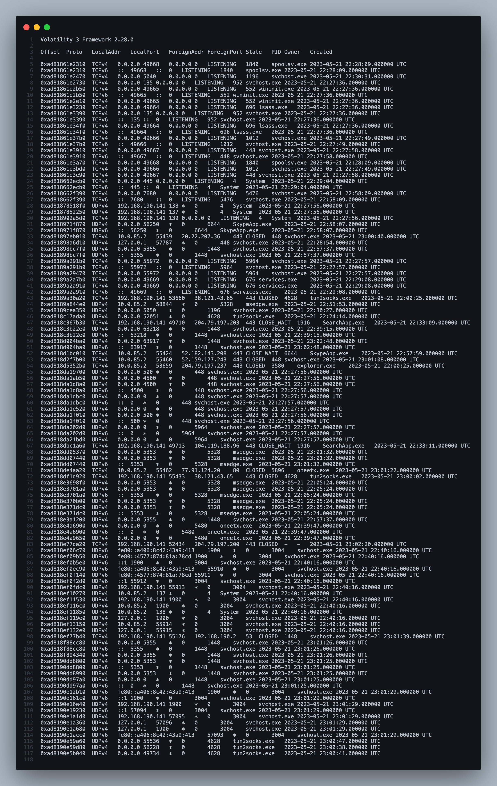
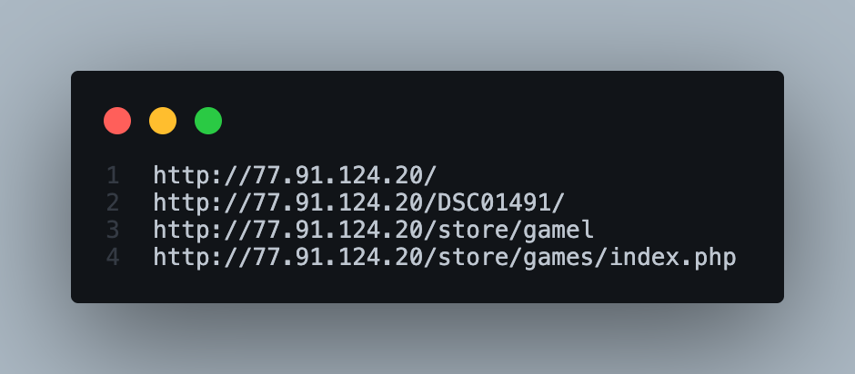

# RedLine Lab — CyberDefenders

> **Platform:** CyberDefenders
> **Category:** Endpoint Forensics
> **Difficulty:** Easy
> **Status:** ✅ Completed
> **Date:** 2026-08-12
> **Time Spent:** ~45 menit

---

## 📌 Prolog

Analisis memory dump pakai Volatility buat identifikasi proses mencurigakan, network IOC, memory protection, dan infrastruktur command-and-control attacker.

**Tools:** Volatility | Strings

**Tactics yang tercakup:** Privilege Escalation | Stealth | Command and Control

---

## 🎯 Scenario

Sebagai anggota tim Security Blue Team, tugas lo adalah menganalisis memory dump menggunakan tools Redline dan Volatility. Tujuannya adalah menelusuri langkah-langkah yang diambil attacker di mesin yang udah dikompromikan, dan menentukan gimana caranya mereka berhasil bypass Network Intrusion Detection System (NIDS).

Investigasi lo akan mengidentifikasi malware family spesifik yang dipakai dalam serangan ini beserta karakteristiknya. Selain itu, tugas lo juga mengidentifikasi dan memitigasi jejak yang ditinggalkan attacker.

---

## ❓ Questions

1. What is the name of the suspicious process?
2. What is the child process name of the suspicious process?
3. What is the memory protection applied to the suspicious process memory region?
4. What is the name of the process responsible for the VPN connection?
5. What is the attacker's IP address?
6. What is the full URL of the PHP file that the attacker visited?
7. What is the full path of the malicious executable?

---

## 🔍 Answer & Walkthrough

### 1. What is the name of the suspicious process?

Mulai dari `windows.pstree` buat liat process tree penuh:
```
vol -f memdump.mem windows.pstree
```


Satu proses langsung mencolok: `oneetx.exe` (PID 5896). Yang bikin curiga:
- **PPID `8844` udah nggak ada** di process tree — induknya sengaja/udah exit duluan, khas pola dropper yang buru-buru nutup parent-nya biar susah ditrace balik
- Path-nya `\Device\HarddiskVolume3\Users\Tammam\AppData\Local\Temp\c3912af058\oneetx.exe` — folder Temp dengan nama subfolder hash acak, nama file generic ("one" + string acak), pattern umum dropper malware

**Jawaban:** `oneetx.exe`

---

### 2. What is the child process name of the suspicious process?

Masih dari `pstree` yang sama, `oneetx.exe` (PID 5896) punya child process `rundll32.exe` (PID 7732) yang jalan dari `C:\Windows\SysWOW64\rundll32.exe`.

`rundll32.exe` adalah binary resmi Windows buat load & jalanin fungsi dari file `.dll`. Karena ini **LOLBin** (Living-Off-the-Land Binary) yang trusted oleh sistem, malware sering pakai buat proxy eksekusi payload biar nyamar jadi aktivitas normal dan lolos dari deteksi berbasis signature proses.

**Jawaban:** `rundll32.exe`

---

### 3. What is the memory protection applied to the suspicious process memory region?

Cek proses `oneetx.exe` pakai `malfind` buat nemuin memory region yang mencurigakan:
```
vol -f memdump.mem windows.malfind --pid 5896 --dump
```


Ketemu region di base address `0x400000 - 0x437fff`, tag `VadS`, dengan protection `PAGE_EXECUTE_READWRITE` (RWX). Hexdump-nya diawali `MZ` header lengkap — artinya ada **full PE file ter-embed** di address yang harusnya cuma nyimpen image module `oneetx.exe` sendiri.

Base address `0x400000` (default image base PE 32-bit) + protection RWX + MZ header di situ = indikasi kuat **process hollowing/self-injection**: payload asli di-unpack dan dieksekusi langsung di memory proses ini sendiri, ngehindarin deteksi AV berbasis static file scanning.

**Jawaban:** `PAGE_EXECUTE_READWRITE`

**Verifikasi tambahan:** file hasil dump `malfind` (`pid.5896.vad.0x400000-0x437fff.dmp`) dicek validitasnya:
```
file pid.5896.vad.0x400000-0x437fff.dmp
# PE32 executable (GUI) Intel 80386, for MS Windows

sha256sum pid.5896.vad.0x400000-0x437fff.dmp
# 0c4f8505f12acae6e1598a2f73e64cfa8c1d0ee19841f441e77c2d7d39711f77
```
Hash di-cross-check ke VirusTotal: **32/72 vendor flag sebagai malware**, dengan family label **Amadey**. Menarik — nama lab-nya "RedLine", tapi payload yang ke-hollow di memory ini identified sebagai Amadey (loader/botnet malware yang emang dikenal sering dipakai buat drop RedLine Stealer sebagai payload tahap berikutnya).

---

### 4. What is the name of the process responsible for the VPN connection?

Masih dari `pstree`, ada chain: `explorer.exe` (3556) → `Outline.exe` (6724) → `tun2socks.exe` (PID 4628) dari path `Outline\resources\app.asar.unpacked\third_party\outline-go-tun2socks\win32\tun2socks.exe`.

**Outline** adalah VPN client open-source, dan `tun2socks` adalah komponen yang bikin tunnel VPN-nya jalan (convert traffic dari TUN interface ke SOCKS proxy). Di `netscan`, PID 4628 ini juga owner beberapa koneksi keluar terenkripsi.

**Jawaban:** `Outline.exe`

---

### 5. What is the attacker's IP address?

Jalanin `netscan` buat lihat semua koneksi network:
```
vol -f memdump.mem windows.netscan
```


Cari koneksi dengan owner `oneetx.exe` (PID 5896) — ketemu:
```
10.0.85.2:55462 -> 77.91.124.20:80  CLOSED  5896  oneetx.exe
```

**Jawaban:** `77.91.124.20`

---

### 6. What is the full URL of the PHP file that the attacker visited?

`netscan` cuma kasih IP:port, jadi buat nemuin URL lengkap perlu extract string dari memory region proses `oneetx.exe`:
```
vol -f memdump.mem windows.memmap --pid 5896 --dump
strings -a pid.5896.dmp | grep -Eo 'https?://[^ "<>\\]+'
```


Ketemu beberapa varian URL yang ngarah ke IP attacker yang sama:
```
http://77.91.124.20/
http://77.91.124.20/DSC01491/
http://77.91.124.20/store/gamel
http://77.91.124.20/store/games/index.php
```
Yang paling lengkap dan relevan sebagai endpoint C2/exfiltration adalah yang terakhir.

**Jawaban:** `hxxp[://]77[.]91[.]124[.]20/store/games/index[.]php`

---

### 7. What is the full path of the malicious executable?

Dari `pstree`, path device `oneetx.exe` (PID 5896):
```
\Device\HarddiskVolume3\Users\Tammam\AppData\Local\Temp\c3912af058\oneetx.exe
```
Convert device path ke drive letter standar (`HarddiskVolume3` = `C:`):

**Jawaban:** `C:\Users\Tammam\AppData\Local\Temp\c3912af058\oneetx.exe`

---

## 🚨 Key Findings / IOCs

| Tipe | Value | Keterangan |
|------|-------|------------|
| Proses Mencurigakan | `oneetx.exe` (PID 5896) | Dropped ke folder Temp, PPID `8844` orphaned |
| Malware Family | `Amadey` | Konfirmasi VirusTotal — 32/72 vendor flag |
| File Hash (SHA256) | `0c4f8505f12acae6e1598a2f73e64cfa8c1d0ee19841f441e77c2d7d39711f77` | Hash region RWX yang di-dump dari `malfind` |
| Child Process | `rundll32.exe` (PID 7732) | LOLBin, dipakai proxy eksekusi |
| Memory Protection | `PAGE_EXECUTE_READWRITE` | Region `0x400000-0x437fff`, indikasi process hollowing |
| IP Address | `77.91.124.20` | C2 server attacker — satu `/24` subnet (`77.91.124.0/24`) sama C2 RedLine Stealer di [Red Stealer Lab](../Red%20Stealer%20Lab/) (`77.91.124.55:19071`), indikasi shared hosting infrastructure |
| URL | `hxxp[://]77[.]91[.]124[.]20/store/games/index[.]php` | Endpoint exfiltration data |
| File Path | `C:\Users\Tammam\AppData\Local\Temp\c3912af058\oneetx.exe` | Path lengkap payload malware |
| VPN Process | `Outline.exe` / `tun2socks.exe` (PID 4628) | Kemungkinan dipakai buat bypass NIDS |

---

## 🗺️ MITRE ATT&CK Mapping

| Tactic | Technique | ID | Keterangan |
|--------|-----------|----|------------|
| Defense Evasion | Process Injection: Process Hollowing | [T1055.012](https://attack.mitre.org/techniques/T1055/012/) | `oneetx.exe` region base image RWX berisi MZ header lengkap |
| Defense Evasion | System Binary Proxy Execution: Rundll32 | [T1218.011](https://attack.mitre.org/techniques/T1218/011/) | `oneetx.exe` men-spawn `rundll32.exe` |
| Command and Control | Application Layer Protocol: Web Protocols | [T1071.001](https://attack.mitre.org/techniques/T1071/001/) | Koneksi HTTP ke `77.91.124.20:80` |
| Command and Control / Defense Evasion | Protocol Tunneling | [T1572](https://attack.mitre.org/techniques/T1572/) | Traffic C2/exfil dibungkus tunnel Outline VPN — enkripsi bikin NIDS nggak bisa inspect isi paket, jadi berfungsi ganda sebagai C2 channel sekaligus evasion |
| Exfiltration | Exfiltration Over C2 Channel | [T1041](https://attack.mitre.org/techniques/T1041/) | Data dikirim ke endpoint `/store/games/index.php` |

---

## 📋 Summary — Attacker Behavior & Todo

### Attacker Behavior

Attacker men-drop payload bernama `oneetx.exe` ke folder Temp korban (`Users\Tammam\AppData\Local\Temp\c3912af058\`) — nama folder hash acak dan nama file generic, pola khas dropper/stager yang berusaha nyamar. Proses ini muncul di memory dengan PPID `8844` yang udah nggak ada lagi di process tree, artinya parent process-nya sengaja di-exit begitu payload berhasil di-drop dan dijalankan, biar rantai eksekusi susah ditrace balik.

Begitu jalan, `oneetx.exe` melakukan **process hollowing/self-injection** — region memory di base address `0x400000` (image base default-nya sendiri) di-mark `PAGE_EXECUTE_READWRITE` dan berisi PE lengkap (MZ header utuh), bukan cuma module image biasa. Dump region ini divalidasi PE32 valid dan cross-check hash ke VirusTotal ngonfirmasi **32/72 vendor flag sebagai malware dengan family label `Amadey`** — loader/botnet malware yang unpack & jalanin payload utamanya langsung di memory tanpa nulis executable final ke disk, ngehindarin deteksi AV berbasis static file scanning.

`oneetx.exe` juga men-spawn `rundll32.exe` sebagai child process — LOLBin resmi Windows yang disalahgunakan buat proxy eksekusi kode/DLL, teknik defense evasion supaya aktivitas malware nyampur sama proses sistem legit.

Untuk exfiltration/C2, malware konek keluar ke `77.91.124.20:80` dan (dari string dump memory) ngarah ke endpoint `hxxp[://]77[.]91[.]124[.]20/store/games/index[.]php` — pola URL umum Amadey buat check-in ke C2 panel dan kirim data hasil recon awal mesin korban via HTTP POST plaintext, bukan HTTPS. Amadey sendiri dikenal sebagai loader yang sering dipakai buat drop payload tahap berikutnya (termasuk stealer keluarga RedLine) begitu C2-nya nge-approve — cocok sama tema lab ini meski sample yang ke-hollow di memory ini identified sebagai Amadey, bukan RedLine Stealer-nya langsung.

IP C2 ini nggak ketemu entry spesifik di ThreatFox buat Amadey, tapi menariknya `77.91.124.20` satu `/24` subnet (`77.91.124.0/24`) sama C2 yang ditemuin di lab [Red Stealer Lab](../Red%20Stealer%20Lab/) — `77.91.124.55:19071`, yang confirmed **RedLine Stealer (alias RECORDSTEALER)**. Overlap subnet ini nguatin dugaan Amadey di lab ini emang bagian dari kill chain yang sama/terhubung sama operator RedLine — kemungkinan hosting block yang dipakai bareng oleh affiliate MaaS yang sama.

Menariknya, di mesin yang sama juga berjalan **Outline VPN client** (`Outline.exe` → `tun2socks.exe`) yang bikin tunnel terenkripsi keluar jaringan. Ini kemungkinan besar jadi cara traffic C2/exfiltration **bypass Network Intrusion Detection System (NIDS)** — request yang seharusnya kelihatan plaintext HTTP ke IP mencurigakan malah ke-wrap di dalam tunnel VPN terenkripsi, jadi signature-based NIDS yang cuma inspect traffic plaintext nggak nangkep pola request ke `77.91.124.20`.

### Todo / Follow-up

- [x] ~~Verifikasi hash `oneetx.exe` ke VirusTotal buat konfirmasi malware family~~ — hash `0c4f8505f1...11f77` (32/72 vendor), family confirmed **Amadey**
- [x] ~~Cross-check IP `77.91.124.20` ke ThreatFox~~ — nggak ada entry spesifik buat Amadey, tapi satu `/24` subnet sama C2 RedLine Stealer di [Red Stealer Lab](../Red%20Stealer%20Lab/) (`77.91.124.55:19071`)
- [ ] Cross-check IP `77.91.124.20` ke AbuseIPDB/Shodan buat cek riwayat abuse & cari IP lain di subnet `77.91.124.0/24` yang udah ke-flag
- [ ] Pelajari relasi Amadey → RedLine Stealer di kill chain ini — apakah ada payload tahap kedua yang belum ke-drop pas mem dump diambil, dan apakah shared subnet ini indikasi operator/affiliate yang sama
- [ ] Pelajari lebih lanjut kenapa Outline VPN terpasang di mesin ini — bagian dari inisial access attacker, atau tool korban yang disalahgunakan
- [ ] Cek registry Run key/scheduled task buat konfirmasi mekanisme persistence `oneetx.exe`

---

## 📚 References

- [CyberDefenders — RedLine Lab](https://cyberdefenders.org/)
- [MITRE ATT&CK — T1055.012 Process Hollowing](https://attack.mitre.org/techniques/T1055/012/)
- [LOLBAS — Rundll32](https://lolbas-project.github.io/lolbas/Binaries/Rundll32/)

---

*Writeup ini dibuat sebagai bagian dari perjalanan belajar Blue Team / SOC Analyst.*
