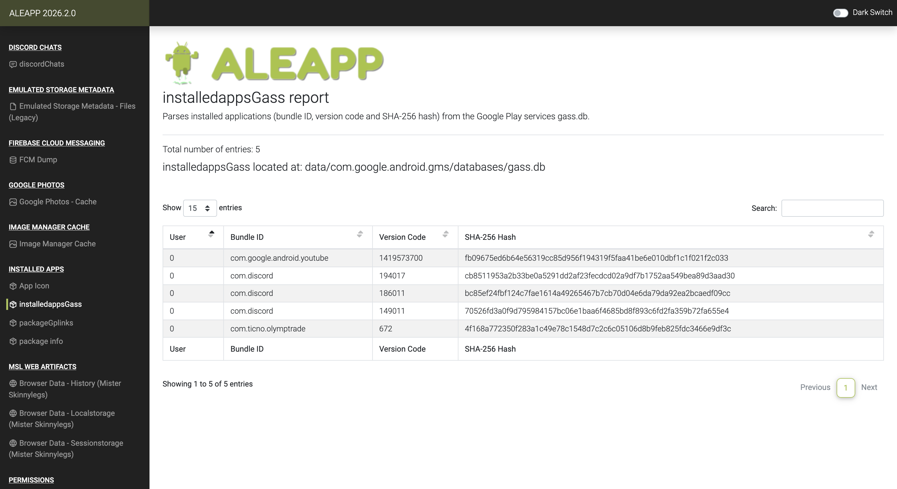
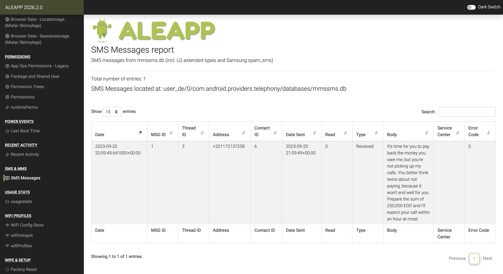
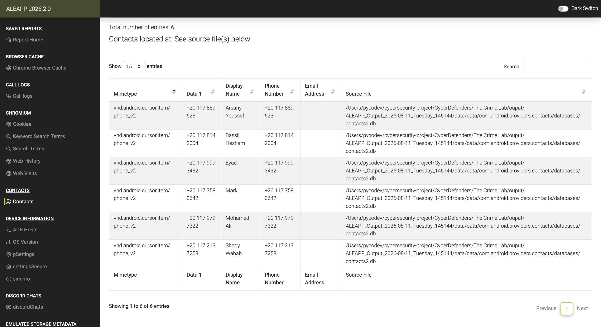
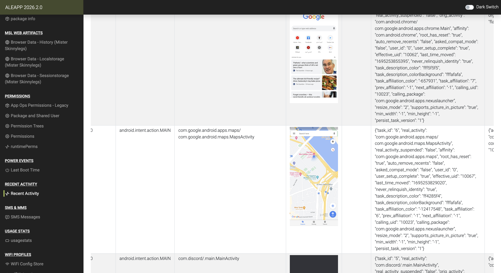
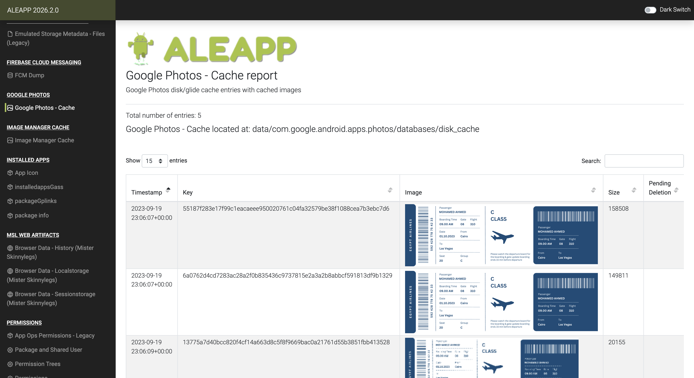
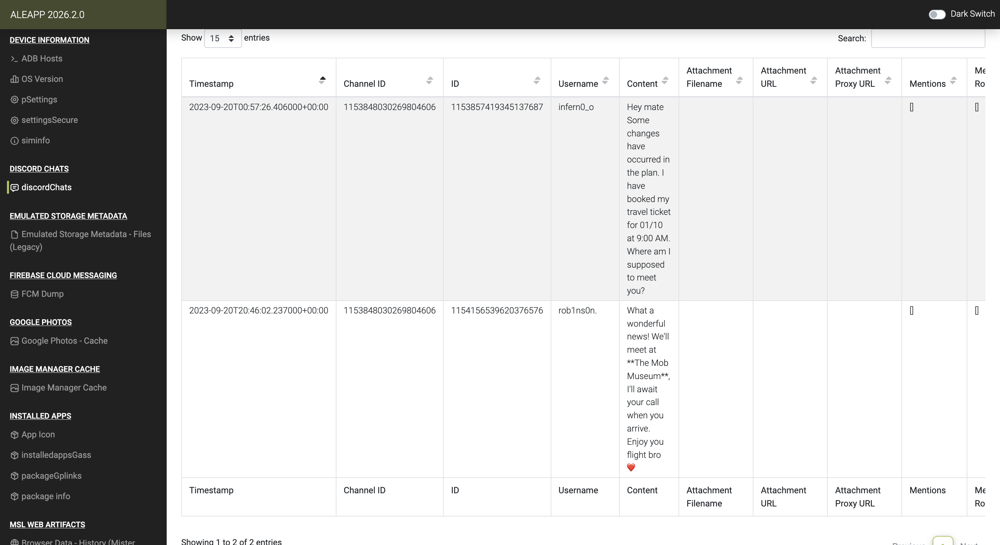

# The Crime Lab — CyberDefenders

> **Platform:** CyberDefenders
> **Category:** Endpoint Forensics
> **Difficulty:** Easy
> **Status:** ✅ Completed
> **Date:** 2026-08-11
> **Time Spent:** ~1 jam

---

## 📌 Prolog

Menggunakan ALEAPP untuk menganalisis artifact dari perangkat Android guna merekonstruksi detail finansial korban, pergerakannya, dan pola komunikasinya.

**Tools:** ALEAPP | DB Browser for SQLite

---

## 🎯 Scenario

Kita lagi menangani investigasi kasus pembunuhan, dan ponsel korban berhasil diamankan sebagai barang bukti kunci. Setelah melakukan wawancara dengan saksi dan orang-orang terdekat korban, tugasnya adalah menganalisis dengan teliti informasi yang udah dikumpulkan dan menelusuri bukti untuk menyusun rangkaian kejadian yang mengarah ke insiden ini.

---

## ❓ Questions

1. Based on the accounts of the witnesses and individuals close to the victim, it has become clear that the victim was interested in trading. This has led him to invest all of his money and acquire debt. Can you identify the SHA256 of the trading application the victim primarily used on his phone?
2. According to the testimony of the victim's best friend, he said, "While we were together, my friend got several calls he avoided. He said he owed the caller a lot of money but couldn't repay now". How much does the victim owe this person?
3. What is the name of the person to whom the victim owes money?
4. Based on the statement from the victim's family, they said that on September 20, 2023, he departed from his residence without informing anyone of his destination. Where was the victim located at that moment?
5. The detective continued his investigation by questioning the hotel lobby. She informed him that the victim had reserved the room for 10 days and had a flight scheduled thereafter. The investigator believes that the victim may have stored his ticket information on his phone. Look for where the victim intended to travel.
6. After examining the victim's Discord conversations, we discovered he had arranged to meet a friend at a specific location. Can you determine where this meeting was supposed to occur?

---

## 🔍 Answer & Walkthrough

### Starting Point — Extract Image dengan ALEAPP

Lab kasih akses ke image/dump ponsel Android korban. Extract dulu pakai [ALEAPP](https://github.com/abrignoni/ALEAPP) — output-nya berupa report static web dengan sidebar menu per kategori artifact (Installed Apps, SMS & MMS, Contacts, Recent Activity, Google Photos, Discord Chats, dll).

---

### 1. SHA256 dari trading app yang dipakai victim?

Buka sidebar **INSTALLED APPS** → **installedappsGass** — report ini parsing daftar aplikasi terinstall beserta SHA-256 hash-nya dari `gass.db`. Selain Discord dan YouTube, ada satu app trading: `com.ticno.olymptrade` (Olymp Trade).

**Jawaban:** `4f168a772350f283a1c49e78c1548d7c2c6c05106d8b9feb825fdc3466e9df3c`

---

### 2. Berapa jumlah utang victim ke penelepon tersebut?

Lanjut ke **SMS & MMS** → **SMS Messages**, ada satu pesan masuk dari `+201172137258` isinya ancaman: *"It's time for you to pay back the money you owe me, but you're not picking up my calls... Prepare the sum of 250,000 EGP, and I'll expect your call within an hour at most."*

**Jawaban:** `250,000 EGP`

---

### 3. Siapa nama orang yang victim berutang?

Nomor pengirim ancaman (`+201172137258`) di-cross-check ke **CONTACTS** — victim udah nyimpen nomor ini sebagai kontak dengan nama `Shady Wahab`.

**Jawaban:** `Shady Wahab`

---

### 4. Lokasi victim pada 20 September 2023?

Buka **RECENT ACTIVITY**, filter ke tanggal 20 sekitar jam 11 siang — ada 3 aktivitas app yang dibuka berurutan: Discord, Maps, dan Chrome. Task Google Maps nunjukkin thumbnail peta dengan pin location di **The Nile Ritz-Carlton**, Cairo.

**Jawaban:** `The Nile Ritz-Carlton`

---

### 5. Tujuan perjalanan victim (info tiket)?

Cek **GOOGLE PHOTOS** → **Google Photos - Cache**, ada beberapa cached image tanggal 19 September 2023 berupa boarding pass Egyptair atas nama Mohamed Ahmed — rute dari Cairo ke **Las Vegas**, tanggal keberangkatan 01.10.2023.

**Jawaban:** `Las Vegas`

---

### 6. Lokasi meeting yang disepakati di Discord?

Terakhir, buka **DISCORD CHATS** → **discordChats**. Percakapan antara `infern0_o` dan `rob1ns0n`: `infern0_o` (00:57, 20 Sept) ngabarin udah booking tiket buat 01/10 jam 9 pagi dan nanya lokasi ketemuan, dibalas `rob1ns0n` (20:46, 20 Sept — beda ~20 jam, indikasi beda timezone) yang mengonfirmasi mereka bakal ketemu di **The Mob Museum**.

**Jawaban:** `The Mob Museum`

---

## 🚨 Key Findings / IOCs

| Tipe | Value | Keterangan |
|------|-------|------------|
| File Hash (SHA256) | `4f168a772350f283a1c49e78c1548d7c2c6c05106d8b9feb825fdc3466e9df3c` | Trading app `com.ticno.olymptrade` (Olymp Trade) yang dipakai victim |
| Phone Number | `+201172137258` | Nomor penagih utang (kontak: Shady Wahab) |
| Person | `Shady Wahab` | Pihak yang memberi utang & mengancam victim |
| Amount | `250,000 EGP` | Nominal utang yang harus dibayar |
| Location | `The Nile Ritz-Carlton, Cairo` | Lokasi victim pada 20 September 2023 |
| Location | `Las Vegas` | Tujuan perjalanan victim (boarding pass Egyptair, 01.10.2023) |
| Location | `The Mob Museum` | Lokasi meeting yang disepakati via Discord (kemungkinan di Las Vegas) |
| Discord User | `infern0_o`, `rob1ns0n.` | Kontak Discord victim yang terlibat rencana pertemuan |

---

## 🗺️ MITRE ATT&CK Mapping

> Lab ini forensik endpoint korban (victim), bukan analisis intrusion/attacker — jadi MITRE ATT&CK mapping kurang relevan di sini.

---

## 📋 Summary — Attacker Behavior & Todo

### Attacker Behavior

Victim terjerat trading lewat aplikasi Olymp Trade (`com.ticno.olymptrade`) sampai menginvestasikan seluruh uangnya dan berutang. Salah satu pemberi utang, Shady Wahab (`+201172137258`), berulang kali menelepon dan akhirnya mengirim SMS ancaman pada 20 September 2023 — minta pembayaran 250,000 EGP dalam waktu satu jam.

Di hari yang sama, victim meninggalkan rumah tanpa pamit dan tercatat berada di area The Nile Ritz-Carlton, Cairo (dari recent activity Google Maps). Sehari sebelumnya (19 September), victim udah nyimpen boarding pass Egyptair rute Cairo → Las Vegas di Google Photos, jadwal berangkat 1 Oktober 2023.

Lewat Discord, victim (`infern0_o`) mengabari temannya (`rob1ns0n.`) soal tiket yang udah dibooking dan menanyakan titik ketemuan — pesan ini dikirim jam 00:57 tanggal 20 September, dan baru dibalas 20:46 hari yang sama (rentang ~20 jam, mengindikasikan mereka ada di zona waktu yang beda jauh — konsisten dengan tujuan Las Vegas). Mereka sepakat bertemu di **The Mob Museum**, yang lokasinya memang di Las Vegas.

Rangkaian ini nunjukkin motif yang mengarah ke utang trading sebagai latar belakang kasus, dengan pergerakan victim dari Cairo menuju Las Vegas sebagai bagian dari rencana yang belum sempat kejadian (atau justru jadi titik kritis) sebelum insiden pembunuhan.

### Todo / Follow-up

- [ ] Cek call logs (bukan cuma SMS) buat lihat pola/durasi telepon dari Shady Wahab ke victim
- [ ] Telusuri chat Discord lebih lengkap — apakah ada indikasi konflik/motif lain selain utang
- [ ] Konfirmasi timezone `rob1ns0n.` buat validasi asumsi dia di Las Vegas/US
- [ ] Pelajari lebih lanjut struktur output ALEAPP (kategori artifact apa aja yang belum dieksplor di lab ini)

---

## 📚 References

- [ALEAPP — Android Logs Events And Protobuf Parser](https://github.com/abrignoni/ALEAPP)
- [DB Browser for SQLite](https://sqlitebrowser.org/)

---

*Writeup ini dibuat sebagai bagian dari perjalanan belajar Blue Team / SOC Analyst.*
