# Tusk Infostealer Lab — CyberDefenders

> **Platform:** CyberDefenders  
> **Category:** Threat Intelligence  
> **Difficulty:** Easy  
> **Status:** ✅ Completed  
> **Date:** 2026-06-09  
> **Time Spent:** ~1 jam  

---

## 📌 Prolog

Lab ini berfokus pada analisis threat intelligence kampanye Tusk Infostealer — sebuah operasi pencurian kredensial dan aset kripto yang menarget komunitas blockchain. Tugasnya adalah menelusuri TTPs, mengekstrak IOCs, dan melacak aliran kripto dari kampanye tersebut menggunakan Kaspersky Threat Intelligence Portal dan laporan threat intelligence yang tersedia.

---

## 🎯 Scenario

Sebuah perusahaan pengembang blockchain mendeteksi aktivitas mencurigakan ketika salah satu karyawannya diarahkan ke website yang tidak dikenal saat mengakses platform manajemen DAO. Tak lama setelah itu, beberapa cryptocurrency wallet milik organisasi terkuras habis. Investigator menduga ada alat berbahaya yang digunakan untuk mencuri kredensial dan mengeksfiltrasi dana. Tugasmu adalah menganalisis intelligence yang tersedia untuk mengungkap metode serangan, mengidentifikasi indicators of compromise, dan melacak infrastruktur threat actor.

---

## ❓ Questions

1. In KB, what is the size of the malicious file?
2. What word do the threat actors use in log messages to describe their victims, based on the name of an ancient hunted creature?
3. The threat actor set up a malicious website to mimic a platform designed for creating and managing decentralized autonomous organizations (DAOs) on the MultiversX blockchain (peerme.io). What is the name of the malicious website the attacker created to simulate this platform?
4. Which cloud storage service did the campaign operators use to host malware samples for both macOS and Windows OS versions?
5. The malicious executable contains a configuration file that includes base64-encoded URLs and a password used for archived data decompression, enabling the download of second-stage payloads. What is the password for decompression found in this configuration file?
6. What is the name of the function responsible for retrieving the field archive from the configuration file?
7. In the third sub-campaign carried out by the operators, the attacker mimicked an AI translator project. What is the name of the legitimate translator, and what is the name of the malicious translator created by the attackers?
8. The downloader is tasked with delivering additional malware samples to the victim's machine, primarily infostealers like StealC and Danabot. What are the IP addresses of the StealC C2 servers used in the campaign?
9. What is the address of the Ethereum cryptocurrency wallet used in this campaign?

---

## 🔍 Answer & Walkthrough

### Starting Point — Extract & Hash

Lab ini dimulai dengan mendownload file ZIP dari CyberDefenders, lalu memindahkannya ke folder kerja dan mengekstraknya.

```bash
mv ~/Downloads/222-Tusk-Infostealer.zip .
7z x 222-Tusk-Infostealer.zip -pcyberdefenders.org
```

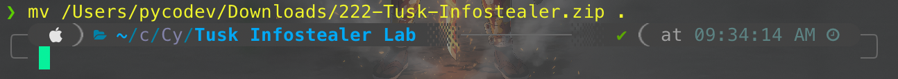

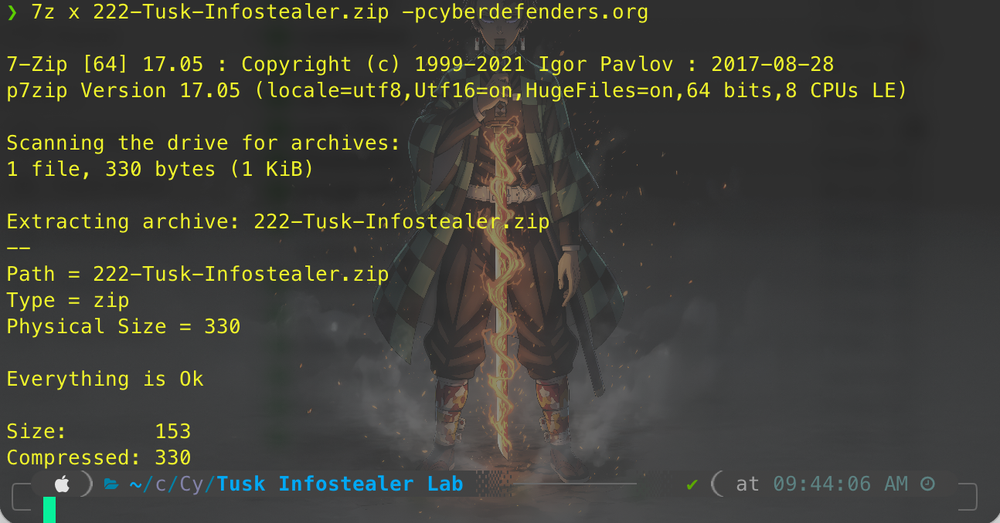

Hasil ekstraksi menghasilkan sebuah file `hash.txt` yang berisi MD5 hash dari malicious file:

```bash
cat temp_extract_dir/hash.txt
# MD5: E5B8B2CF5B244500B22B665C87C11767
```

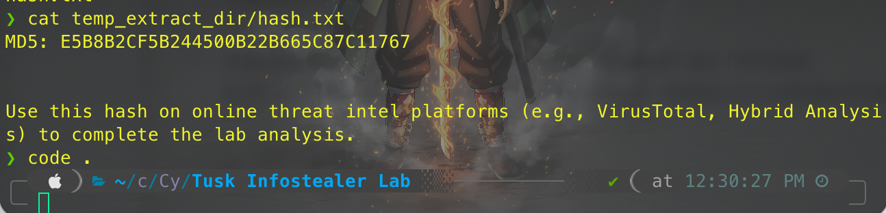

Hash MD5 ini kemudian dipakai untuk lookup di VirusTotal. Dari situ, didapat SHA256 lengkap dari sample:

```
523d4eb71af86090d2d8a6766315a027f6ec842041d668971bfbbd1fe826722
```

SHA256 ini kemudian dicari di Google, yang mengarah ke laporan Kaspersky di [securelist.com](https://securelist.com/tusk-infostealers-campaign/113367/). Laporan inilah yang menjadi referensi utama untuk menjawab semua pertanyaan berikutnya.

---

### 1. In KB, what is the size of the malicious file?

VirusTotal menampilkan metadata file `madHcNet.dll` — terdeteksi 43/70 vendor sebagai malicious dengan size yang tertera jelas di panel kanan.

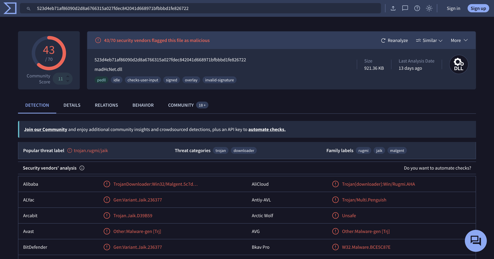

**Jawaban:** `921.36`

---

### 2. What word do the threat actors use in log messages to describe their victims?

Di laporan Kaspersky, disebutkan bahwa threat actor menggunakan kata **"Mammoth"** dalam log messages untuk merujuk pada korban. Mammoth adalah hewan purba yang dikenal sebagai target buruan — metafora yang dipakai untuk menggambarkan victim mereka.

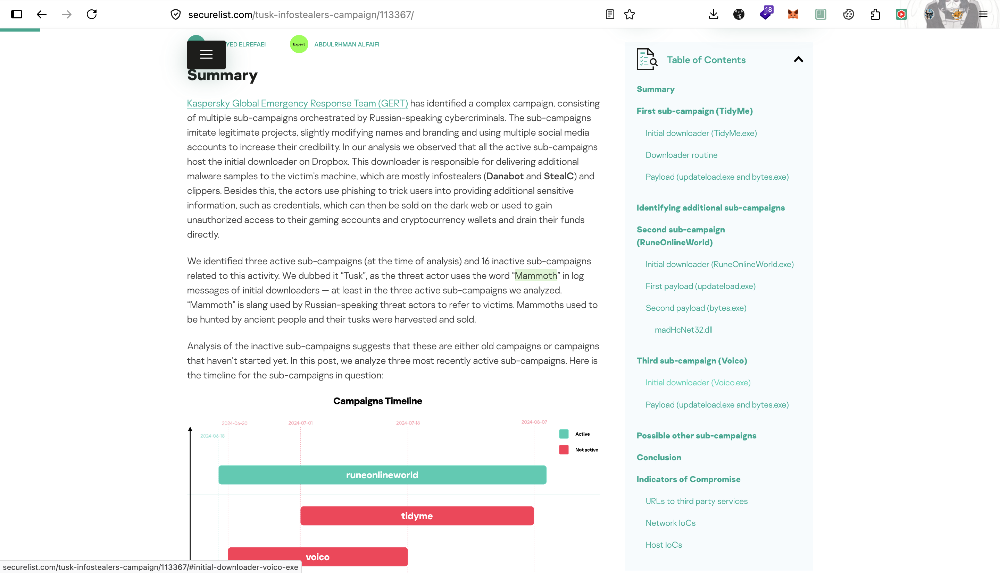

**Jawaban:** `Mammoth`

---

### 3. What is the name of the malicious website that mimics peerme.io?

Sub-campaign pertama (TidyMe) menarget pengguna platform peerme.io — sebuah platform manajemen DAO di blockchain MultiversX. Threat actor membuat tiruan situs yang nyaris identik untuk menjebak korban agar mengunduh file berbahaya.

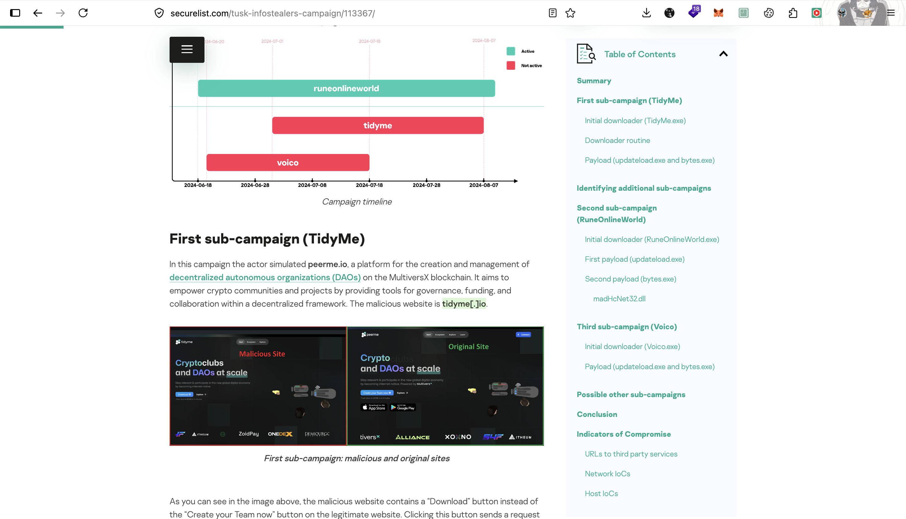

**Jawaban:** `tidyme.io`

---

### 4. Which cloud storage service did the campaign operators use?

Laporan menyebutkan bahwa semua malware samples — baik untuk macOS maupun Windows — di-host di Dropbox. Ini memungkinkan threat actor memanfaatkan reputasi layanan legitimate untuk bypass filtering.

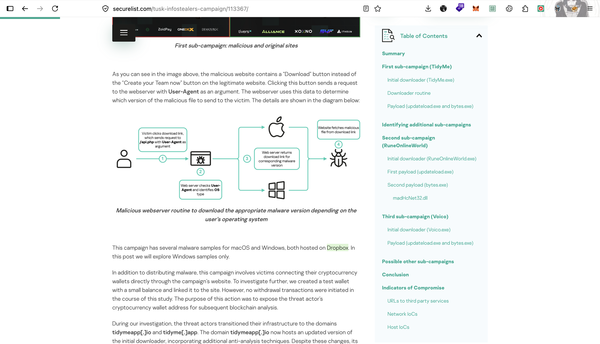

**Jawaban:** `DropBox`

---

### 5. What is the password for decompression found in the configuration file?

Malicious executable mengandung file konfigurasi `config.json` yang berisi base64-encoded URLs dan sebuah password untuk dekompresi payload RAR. Password ini digunakan oleh fungsi downloader untuk mengekstrak second-stage payload.

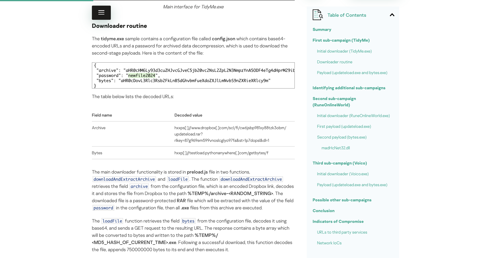

**Jawaban:** `newfile2024`

---

### 6. What is the name of the function responsible for retrieving the field archive?

Laporan Kaspersky mendeskripsikan dua fungsi utama di dalam `preload.js`. Fungsi `downloadAndExtractArchive` bertugas mengambil field `archive` dari config, men-decode URL Dropbox-nya, lalu mendownload dan mengekstrak RAR dengan password yang sudah ada di config.

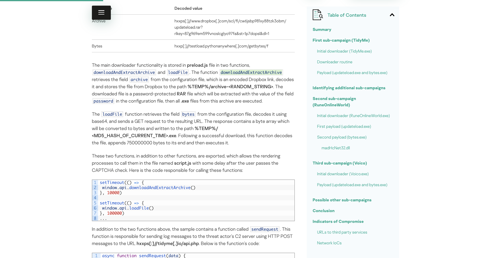

**Jawaban:** `downloadAndExtractArchive`

---

### 7. What is the name of the legitimate and malicious translator in the third sub-campaign?

Sub-campaign ketiga (Voico) meniru sebuah proyek AI translator. Threat actor mengkloning tampilan `yous.ai` — layanan translator AI yang legitimate — dan membuat versi palsu di domain `voico.io`.

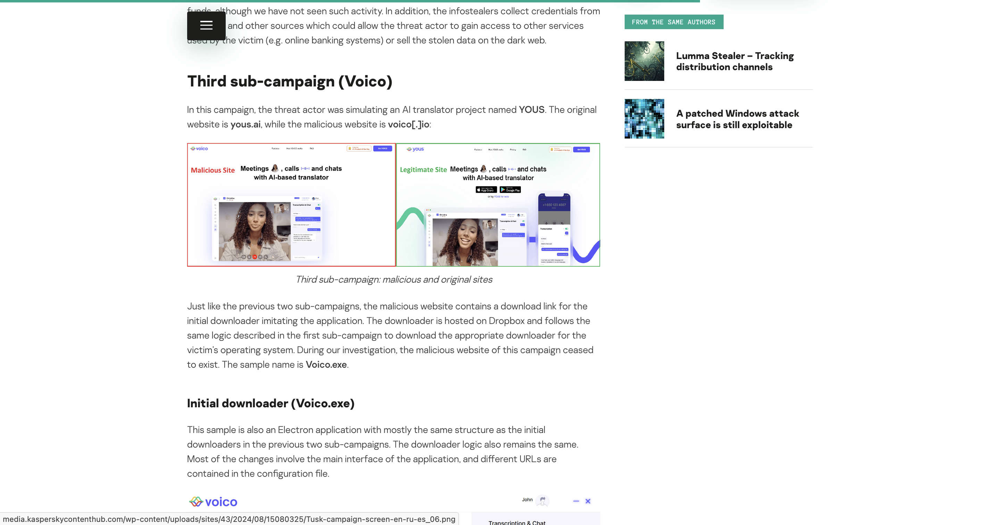

**Jawaban:** `yous.ai, voico.io`

---

### 8. What are the IP addresses of the StealC C2 servers?

Di bagian Network IoCs laporan Kaspersky, dua IP address secara eksplisit dilabeli sebagai StealC C2 Server.

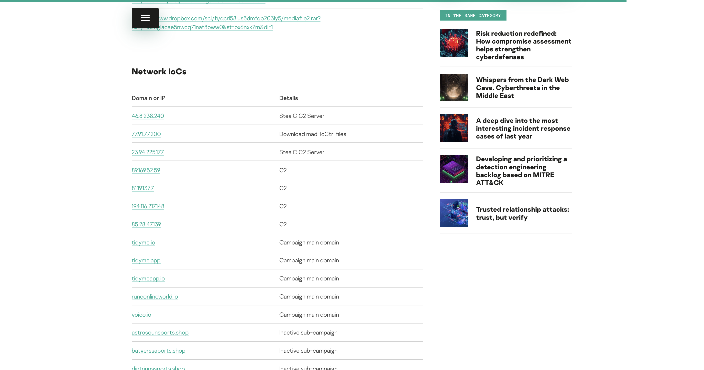

**Jawaban:** `46.8.238.240, 23.94.225.177`

---

### 9. What is the address of the Ethereum cryptocurrency wallet?

Di bagian bawah laporan, tercantum daftar cryptocurrency wallet addresses yang digunakan dalam kampanye ini. ETH wallet yang teridentifikasi adalah:

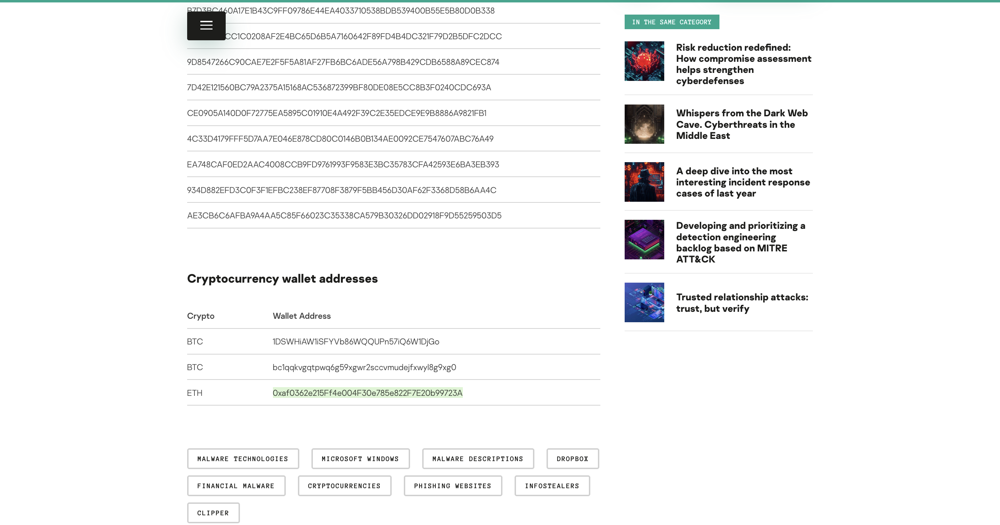

**Jawaban:** `0xaf0362e215Ff4e004F30e785e822F7E20b99723A`

---

## 🚨 Key Findings / IOCs

| Tipe | Value | Keterangan |
|------|-------|------------|
| IP Address | `46.8.238.240` | StealC C2 Server |
| IP Address | `23.94.225.177` | StealC C2 Server |
| ETH Wallet | `0xaf0362e215Ff4e004F30e785e822F7E20b99723A` | Crypto wallet threat actor |
| Domain | `tidyme.io` | Malicious DAO site (clone peerme.io) |
| Domain | `voico.io` | Malicious AI translator (clone yous.ai) |
| File Hash (MD5) | `E5B8B2CF5B244500B22B665C87C11767` | Hash dari sample awal |
| File Hash (SHA256) | `523d4eb71af86090d2d8a6766315a027f6ec842041d668971bfbbd1fe826722` | Hash file `madHcNet.dll` |

---

## 🗺️ MITRE ATT&CK Mapping

| Tactic | Technique | ID | Keterangan |
|--------|-----------|----|------------|
| Initial Access | Spearphishing Link | T1566.002 | Situs palsu yang menyerupai platform legitimate |
| Execution | User Execution: Malicious File | T1204.002 | Victim mengeksekusi downloader setelah "download" dari situs palsu |
| Defense Evasion | Virtualization/Sandbox Evasion | T1497.001 | CAPTCHA digunakan sebagai anti-sandbox check sebelum payload dikirim |
| Defense Evasion | Indicator Removal: File Deletion | T1070.004 | Dropper dihapus via `cmd.exe` setelah payload di-drop |
| Command & Control | Ingress Tool Transfer | T1105 | Payload second-stage didownload dari Dropbox |
| Collection | Data from Local System | T1005 | Infostealer mengumpulkan kredensial dan data lokal |
| Exfiltration | Exfiltration Over C2 Channel | T1041 | Data dikirim ke StealC C2 server |
| Impact | Financial Theft | T1657 | Cryptocurrency wallet victim dikuras |

---

## 📋 Summary — Attacker Behavior & Todo

### Attacker Behavior

Kampanye Tusk Infostealer adalah operasi multi-sub-campaign yang menarget user kripto dan blockchain. Setidaknya ada tiga sub-campaign aktif yang teridentifikasi, masing-masing meniru platform legitimate yang berbeda:

- **Sub-campaign 1 — TidyMe:** Meniru peerme.io, platform manajemen DAO di MultiversX. Korban diarahkan ke `tidyme.io` yang tampak identik, lalu diminta mengunduh sebuah file executable.
- **Sub-campaign 2 — RuneOnlineWorld:** Meniru game online, dengan mekanisme serangan yang serupa.
- **Sub-campaign 3 — Voico:** Meniru `yous.ai`, sebuah AI translator, menggunakan domain `voico.io`.

Pola serangan di ketiga sub-campaign ini konsisten: korban mengeksekusi initial downloader (Electron app), lalu melewati CAPTCHA check — yang sekaligus berfungsi sebagai anti-sandbox. Setelah CAPTCHA diverifikasi, downloader membaca `config.json`, men-decode URL Dropbox, lalu mengunduh payload RAR yang diproteksi password `newfile2024`. Payload diekstrak ke `%TEMP%`, dieksekusi via `cmd.exe`, dan file dropper asli dihapus sebagai langkah defense evasion. Payload final adalah infostealer (StealC / Danabot) yang mengeksfiltrasi data dan credentials ke C2 server.

> Cmiiw — interpretasi di atas berdasarkan laporan Kaspersky. Kemungkinan ada detail tambahan untuk sub-campaign 2 dan 3 yang berbeda di level payload-nya.

### Todo / Follow-up

- [ ] Telusuri lebih detail sub-campaign RuneOnlineWorld — apa yang membedakan targetnya dari dua sub-campaign lain
- [ ] Pelajari lebih dalam cara kerja StealC dan Danabot sebagai infostealer — apa saja yang mereka kumpulkan
- [ ] Lacak ETH wallet `0xaf0362e215...` via Etherscan untuk melihat pergerakan dana
- [ ] Eksplorasi teknik CAPTCHA sebagai anti-sandbox — bagaimana cara mendeteksi atau membypassnya dalam analisis malware

---

## 📚 References

- [Kaspersky — Tusk: unraveling a complex infostealer campaign](https://securelist.com/tusk-infostealers-campaign/113367/)
- [MITRE ATT&CK — Infostealer TTPs](https://attack.mitre.org/)
- [MultiversX / peerme.io](https://peerme.io/)

---

*Writeup ini dibuat sebagai bagian dari perjalanan belajar Blue Team / SOC Analyst.*
