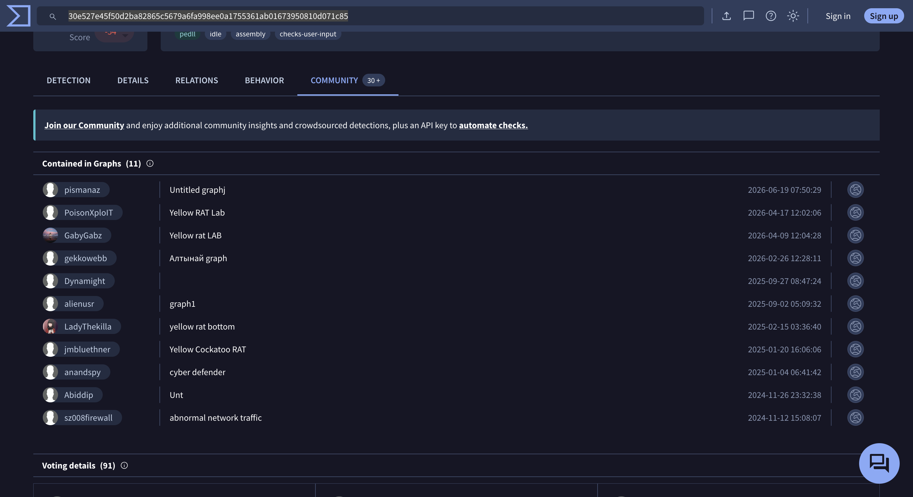
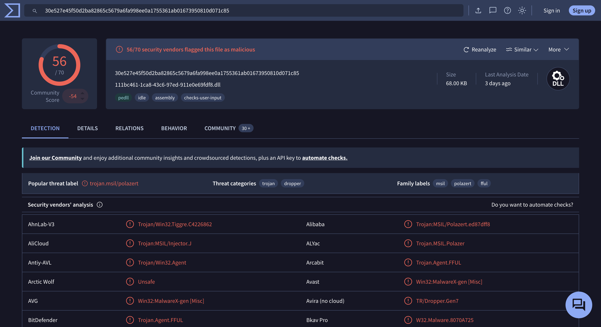
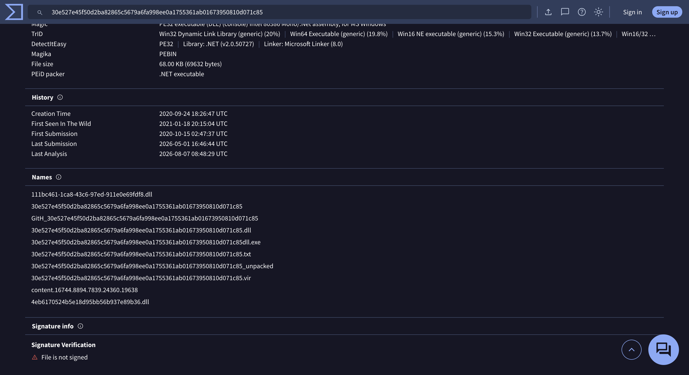
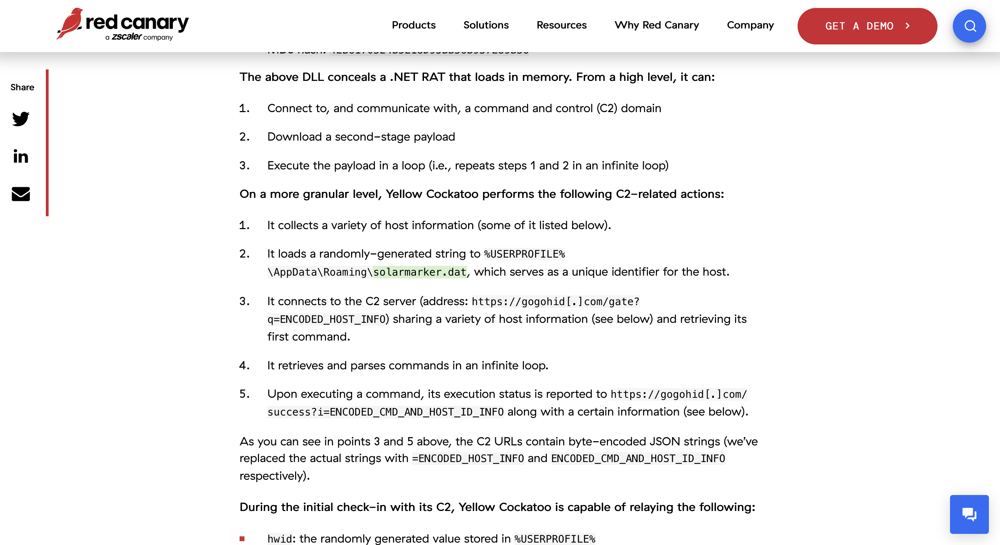

# Yellow RAT Lab — CyberDefenders

> **Platform:** CyberDefenders  
> **Category:** Threat Intelligence  
> **Difficulty:** Easy  
> **Status:** ✅ Completed  
> **Date:** 2026-08-10  
> **Time Spent:** ~30 menit  

---

## 📌 Prolog

Lab ini fokus menganalisis artifact malware pakai threat intelligence platform seperti VirusTotal untuk mengidentifikasi IOCs, C2 server, dan memahami tactics yang dipakai adversary.

---

## 🎯 Scenario

Saat pengecekan IT security rutin di GlobalTech Industries, terdeteksi network traffic yang abnormal dari beberapa workstation. Investigasi awal menemukan bahwa search query beberapa karyawan ter-redirect ke website yang nggak dikenal. Temuan ini memicu investigasi yang lebih mendalam. Tugasnya adalah menginvestigasi insiden ini dan mengumpulkan sebanyak mungkin informasi terkait.

---

## ❓ Questions

1. Understanding the adversary helps defend against attacks. What is the name of the malware family that causes abnormal network traffic?
2. As part of our incident response, knowing common filenames the malware uses can help scan other workstations for potential infection. What is the common filename associated with the malware discovered on our workstations?
3. Determining the compilation timestamp of malware can reveal insights into its development and deployment timeline. What is the compilation timestamp of the malware that infected our network?
4. Understanding when the broader cybersecurity community first identified the malware could help determine how long the malware might have been in the environment before detection. When was the malware first submitted to VirusTotal?
5. To completely eradicate the threat from Industries' systems, we need to identify all components dropped by the malware. What is the name of the .dat file that the malware dropped in the AppData folder?
6. It is crucial to identify the C2 servers with which the malware communicates to block its communication and prevent further data exfiltration. What is the C2 server that the malware is communicating with?

---

## 🔍 Answer & Walkthrough

### Starting Point — Lookup Hash di VirusTotal

Lab ngasih SHA256 hash dari sample yang dicurigai (`30e527e45f50d2ba82865c5679a6fa998ee0a1755361ab01673950810d071c85`). Tinggal search hash ini di [VirusTotal](https://www.virustotal.com/gui/file/30e527e45f50d2ba82865c5679a6fa998ee0a1755361ab01673950810d071c85/community) buat mulai investigasi — 56 dari 70 vendor security langsung flag file ini sebagai malicious.

---

### 1. Name of the malware family?

VirusTotal sendiri kasih *popular threat label* `trojan.msil/polazert`, tapi label itu generic banget. Cek tab **Community**, banyak analyst lain yang udah bikin graph dengan nama eksplisit kayak "Yellow Cockatoo RAT", "Yellow RAT Lab", dan "yellow rat bottom" buat sample hash yang sama.

Cross-reference nama ini + hash-nya ke Google, ketemu artikel [Red Canary — Yellow Cockatoo](https://redcanary.com/blog/threat-intelligence/yellow-cockatoo/) yang bahas malware family ini secara detail, plus dikonfirmasi juga di [Hybrid Analysis](https://hybrid-analysis.com/sample/30e527e45f50d2ba82865c5679a6fa998ee0a1755361ab01673950810d071c85/5fd004f2f760b679ae373bb3) pakai hash yang sama persis.

**Jawaban:** `Yellow Cockatoo RAT`

---

### 2. Common filename associated with the malware?

Di tab **Detection** VirusTotal, file ini terdeteksi sebagai `.dll` (DLL, bukan EXE) dengan nama file:

**Jawaban:** `111bc461-1ca8-43c6-97ed-911e0e69fdf8.dll`

---

### 3. Compilation timestamp of the malware?

Pindah ke tab **Details** VirusTotal, di bagian **History** ada field `Creation Time` — ini compilation timestamp-nya.

**Jawaban:** `2020-09-24 18:26`

---

### 4. When was the malware first submitted to VirusTotal?

Masih di tab yang sama, field `First Submission` nunjukkin kapan pertama kali sample ini di-upload ke VirusTotal oleh siapapun.

**Jawaban:** `2020-10-15 02:47`

---

### 5. Name of the .dat file dropped in AppData?

Dari artikel Red Canary, dijelasin kalau Yellow Cockatoo bakal generate random string dan simpen ke `%USERPROFILE%\AppData\Roaming\solarmarker.dat` — dipakai sebagai unique identifier buat host yang kena infeksi.

**Jawaban:** `solarmarker.dat`

---

### 6. C2 server the malware communicates with?

Masih dari artikel yang sama, Yellow Cockatoo connect ke C2 di `https://gogohid[.]com` — dipakai buat dua endpoint: `/gate` (kirim host info & minta command pertama) dan `/success` (report status eksekusi command).

**Jawaban:** `https://gogohid.com`

---

## 🚨 Key Findings / IOCs

| Tipe | Value | Keterangan |
|------|-------|------------|
| File Hash (SHA256) | `30e527e45f50d2ba82865c5679a6fa998ee0a1755361ab01673950810d071c85` | Sample DLL Yellow Cockatoo RAT |
| File Name | `111bc461-1ca8-43c6-97ed-911e0e69fdf8.dll` | Common filename malware di workstation korban |
| Dropped File | `solarmarker.dat` | Disimpan di `%USERPROFILE%\AppData\Roaming\`, unique host identifier |
| Domain (C2) | `gogohid.com` | C2 server — endpoint `/gate` dan `/success` |
| Malware Family | Yellow Cockatoo RAT (aka `trojan.msil/polazert`) | .NET RAT, loads in-memory |
| Compilation Timestamp | `2020-09-24 18:26:47 UTC` | Waktu compile sample |
| First Submission (VT) | `2020-10-15 02:47:37 UTC` | Pertama kali sample di-submit ke VirusTotal |
| Persistence Artifact | `.lnk` shortcut di Startup folder | Trigger `cmd.exe` → PowerShell buat reflectively load ulang DLL ke memory tiap login |

---

## 🗺️ MITRE ATT&CK Mapping

| Tactic | Technique | ID | Keterangan |
|--------|-----------|----|------------|
| Execution | User Execution: Malicious File | T1204.002 | Korban download & jalanin installer palsu setelah search query di-redirect |
| Persistence, Privilege Escalation | Boot or Logon Autostart Execution: Registry Run Keys / Startup Folder | T1547.001 | `.lnk` shortcut di Startup folder buat re-trigger malware tiap user login |
| Execution | Command and Scripting Interpreter: PowerShell | T1059.001 | PowerShell pakai `System.Reflection.Assembly` buat reflectively load DLL RAT ke memory |
| Discovery | System Information Discovery | T1082 | Malware kumpulin host info sebelum check-in ke C2 |
| Command and Control | Application Layer Protocol: Web Protocols | T1071.001 | Komunikasi C2 via HTTP GET ke `gogohid.com` |
| Command and Control | Data Encoding | T1132 | Host info & command status dikirim sebagai byte-encoded JSON string di URL |
| Command and Control | Ingress Tool Transfer | T1105 | Malware download second-stage payload dari C2 |

---

## 📋 Summary — Attacker Behavior & Todo

### Attacker Behavior

Yellow Cockatoo adalah .NET RAT yang tereksekusi di memory, biasa didistribusikan lewat teknik semacam malvertising/SEO poisoning — korban nyari sesuatu di search engine, tapi hasil pencarian mereka di-redirect ke situs yang nawarin fake installer. Ini persis sama pola yang disebut di scenario lab ini: "search query karyawan ter-redirect ke website yang nggak dikenal".

Begitu installer palsu dijalanin, malware bikin **persistence** dulu sebelum mulai beraksi — drop file `.lnk` (shortcut) ke Startup folder Windows. Shortcut inilah yang bikin malware ini nyala lagi otomatis tiap kali user login: `.lnk` trigger `cmd.exe`, yang lanjut manggil PowerShell, dan PowerShell inilah yang pakai `System.Reflection.Assembly` buat reflectively load DLL RAT-nya (dalam bentuk obfuscated) langsung ke memory — nggak nulis payload utama dalam bentuk plain ke disk.

Setelah RAT-nya aktif di memory, alur C2-nya kurang lebih gini:

1. **Kumpulin host information** dari mesin korban
2. **Generate random string** dan simpen ke `%USERPROFILE%\AppData\Roaming\solarmarker.dat` — dipakai sebagai unique identifier (`hwid`) host tersebut, biar C2 bisa ngenalin host yang sama tiap kali check-in ulang
3. **Connect ke C2** di `gogohid[.]com/gate?q=ENCODED_HOST_INFO` — kirim host info + `hwid` (encoded), lalu C2 balikin command yang udah di-stage buat host itu
4. **Retrieve & parse command** dari C2 dalam infinite loop — ini model *polling/beacon*, bukan interaktif real-time. Malware yang inisiatif nanya duluan ke C2, bukan attacker yang push command kapan aja dia mau
5. Setiap command yang dieksekusi, status-nya di-report balik ke `gogohid[.]com/success?i=ENCODED_CMD_AND_HOST_ID_INFO`
6. Download **second-stage payload** dan eksekusi — lalu ulangi loop dari langkah 3

Karena payload utamanya cuma ada di memory (bukan plain di disk) dan komunikasi C2-nya di-encode, Yellow Cockatoo cukup susah dideteksi cuma dari static file analysis — jejak paling jelas yang ketinggalan di disk cuma `.lnk` di Startup folder dan `solarmarker.dat`. Butuh kombinasi network monitoring (traffic ke domain C2) sama behavioral/memory analysis buat deteksi yang lebih reliable.

### Todo / Follow-up

- [ ] Baca full artikel Red Canary buat pahami format encoding yang dipakai di URL C2 (`ENCODED_HOST_INFO`, `ENCODED_CMD_AND_HOST_ID_INFO`)
- [ ] Pelajari kenapa nama file `.dat`-nya `solarmarker.dat` — apakah ada overlap/relasi sama malware family lain bernama SolarMarker
- [ ] Latihan bikin detection rule (Sigma/YARA) berdasarkan pola network traffic ke `gogohid.com` atau file artifact `solarmarker.dat` di `%USERPROFILE%\AppData\Roaming\`
- [ ] Eksplorasi teknik malvertising/SEO poisoning sebagai delivery vector — gimana cara deteksi di sisi user/browser sebelum sempat download installer palsu

---

## 📚 References

- [VirusTotal — Sample Analysis](https://www.virustotal.com/gui/file/30e527e45f50d2ba82865c5679a6fa998ee0a1755361ab01673950810d071c85/community)
- [Red Canary — Yellow Cockatoo](https://redcanary.com/blog/threat-intelligence/yellow-cockatoo/)
- [Hybrid Analysis — Sample Report](https://hybrid-analysis.com/sample/30e527e45f50d2ba82865c5679a6fa998ee0a1755361ab01673950810d071c85/5fd004f2f760b679ae373bb3)
- [CyberDefenders — Yellow RAT Lab](https://cyberdefenders.org/)
- [MITRE ATT&CK](https://attack.mitre.org/)

---

*Writeup ini dibuat sebagai bagian dari perjalanan belajar Blue Team / SOC Analyst.*
