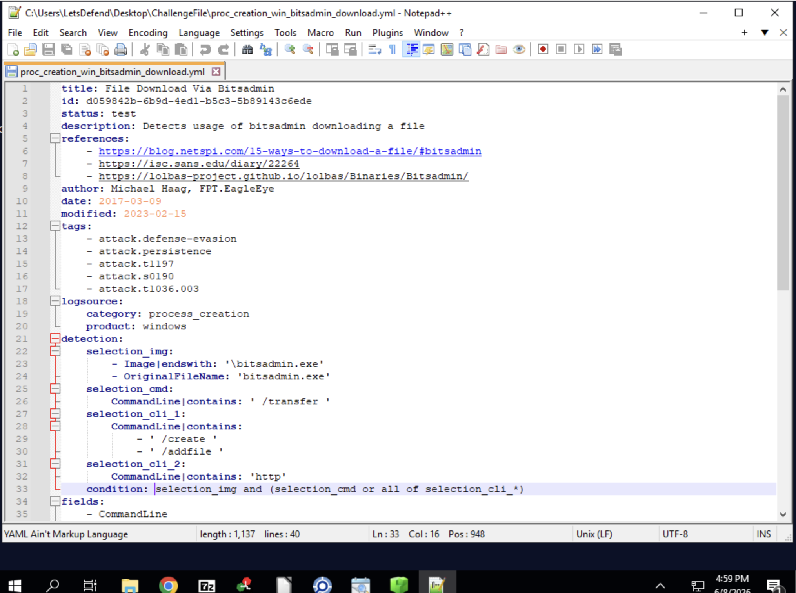
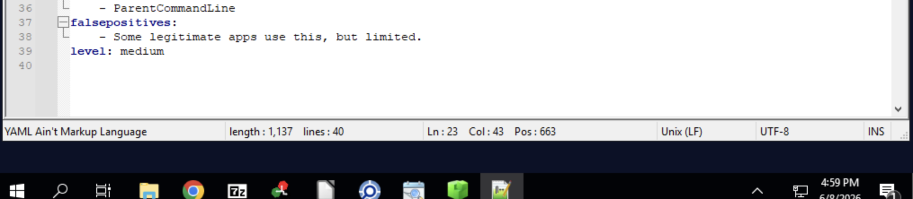

# Learn Sigma — LetsDefend

> **Platform:** LetsDefend  
> **Category:** Threat Detection / Sigma Rules  
> **Difficulty:** Easy  
> **Status:** ✅ Completed  
> **Date:** 2026-06-09  
> **Time Spent:** ~X jam  

---

## 🎯 Scenario

Organisasi mendeteksi infeksi ransomware pada salah satu sistem kritisnya. Ransomware ini mencari file berharga — dokumen sensitif, configuration file — lalu mengenkripsinya dengan algoritma enkripsi kuat. Investigasi mengungkapkan bahwa ransomware kemungkinan menggunakan Windows utility `bitsadmin.exe` untuk mengunduh payload tambahan atau berkomunikasi dengan C2 server.

Tugas kita: review Sigma rule yang sudah ada, jawab pertanyaan terkait, dan pahami bagaimana berbagai section rule (selection, condition, fields, tags, logsource) bekerja bersama untuk mendeteksi aktivitas berbahaya ini.

**File Location:** `C:\Users\LetsDefend\Desktop\ChallengeFile\proc_creation_win_bitsadmin_download.yml`

---

## ❓ Questions

1. Which executable file was specifically targeted by this Sigma rule?
2. What command-line option is used to indicate a file transfer in this rule?
3. What logical expression in the condition field combined the criteria to trigger this rule?
4. Which specific field did this rule capture that shows the command being executed?
5. Which single ATT&CK tactic tag is listed first in this rule?
6. What is the primary category of events that this Sigma rule was written to monitor?
7. What specific command-line argument did this rule look for to identify HTTP-based downloads?
8. Which command-line option must be present to create a new transfer using bitsadmin?

---

## 🔍 Answer & Walkthrough

Semua jawaban bisa langsung dibaca dari isi file Sigma rule `proc_creation_win_bitsadmin_download.yml`. Cukup buka file-nya, petakan setiap section ke pertanyaan yang ada — tidak perlu analisis tambahan. Dua screenshot berikut sudah mencakup seluruh konten rule yang relevan.

---

### 1. Which executable file was specifically targeted by this Sigma rule?

Tertulis di field `selection_img` — binary yang dipantau oleh rule ini.

**Jawaban:** `bitsadmin.exe`

---

### 2. What command-line option is used to indicate a file transfer in this rule?

Ada di `selection_cmd` dalam section `detection`.

**Jawaban:** `/transfer`

---

### 3. What logical expression in the condition field combined the criteria to trigger this rule?

Tertulis langsung di field `condition`.

**Jawaban:** `selection_img and (selection_cmd or all of selection_cli_*)`

---

### 4. Which specific field did this rule capture that shows the command being executed?

Ada di section `fields`.

**Jawaban:** `CommandLine`

---

### 5. Which single ATT&CK tactic tag is listed first in this rule?

Tertulis di section `tags`.

**Jawaban:** `attack.defense-evasion`

---

### 6. What is the primary category of events that this Sigma rule was written to monitor?

Ada di section `logsource` — field `category`.

**Jawaban:** `process_creation`

---

### 7. What specific command-line argument did this rule look for to identify HTTP-based downloads?

Ada di salah satu field `selection_cli_*` dalam `detection`.

**Jawaban:** `http`

---

### 8. Which command-line option must be present to create a new transfer using bitsadmin?

Ada di `selection_cli_*` — argumen yang dipakai untuk inisiasi transfer baru.

**Jawaban:** `/create`

---

## 🚨 Key Findings / IOCs

| Tipe | Value | Keterangan |
|------|-------|------------|
| Executable | `bitsadmin.exe` | LOLBin yang dieksploitasi |
| CommandLine | `/transfer` | Indikator file transfer |
| CommandLine | `/create` | Inisiasi BITS job baru |
| CommandLine | `http` | Indikator download via HTTP |
| Log Source | `process_creation` | Kategori event yang dipantau |

---

## 🗺️ MITRE ATT&CK Mapping

| Tactic | Technique | ID | Keterangan |
|--------|-----------|----|------------|
| Defense Evasion | BITS Jobs | T1197 | Gunakan bitsadmin.exe sebagai LOLBin untuk bypass deteksi |
| Command and Control | Ingress Tool Transfer | T1105 | Download payload tambahan dari C2 via BITS |

---

## 📋 Summary — Attacker Behavior & Todo

### Attacker Behavior

Malware ini memanfaatkan `bitsadmin.exe` — binary legitim bawaan Windows yang biasa dipakai untuk background file transfer — sebagai LOLBin (Living Off the Land Binary) untuk menghindari deteksi berbasis signature (T1197 - BITS Jobs).

Alurnya cukup sederhana tapi efektif: attacker membuat BITS job baru dengan `/create`, menambahkan file target dengan `/addfile`, lalu mengeksekusi transfer ke URL C2 menggunakan `/transfer`. Karena `bitsadmin.exe` adalah binary legitim Windows, aktivitas ini sering lolos dari endpoint protection yang hanya memantau proses berdasarkan reputasi binary-nya — bukan perilakunya.

Sigma rule `proc_creation_win_bitsadmin_download.yml` mendeteksi pola ini dengan mengkombinasikan tiga kondisi: proses `bitsadmin.exe` harus ada (`selection_img`), dikombinasikan dengan kehadiran `/transfer` (`selection_cmd`) atau semua argumen `selection_cli_*` seperti `/create` dan `http`. Ini adalah contoh rule berbasis behavioral detection, bukan signature.

### Todo / Follow-up

- [ ] Pelajari lebih dalam anatomi Sigma rule — pahami perbedaan antara `all of`, `any of`, dan wildcard `*` di field condition
- [ ] Eksplorasi LOLBin lain yang sering dieksploitasi attacker: `certutil.exe`, `mshta.exe`, `regsvr32.exe` — semua punya pola Sigma rule yang mirip
- [ ] Coba buat Sigma rule sendiri untuk mendeteksi abuse binary lain di [LOLBAS Project](https://lolbas-project.github.io/)
- [ ] Pelajari cara konversi Sigma rule ke query SIEM spesifik (Splunk, Elastic, Microsoft Sentinel) menggunakan `sigma-cli`

---

## 📚 References

- [Sigma Rules Documentation](https://sigmahq.io/)
- [MITRE ATT&CK - T1197 BITS Jobs](https://attack.mitre.org/techniques/T1197/)
- [MITRE ATT&CK - T1105 Ingress Tool Transfer](https://attack.mitre.org/techniques/T1105/)
- [bitsadmin.exe - LOLBAS Project](https://lolbas-project.github.io/lolbas/Binaries/Bitsadmin/)

---

*Writeup ini dibuat sebagai bagian dari perjalanan belajar Blue Team / SOC Analyst.*
