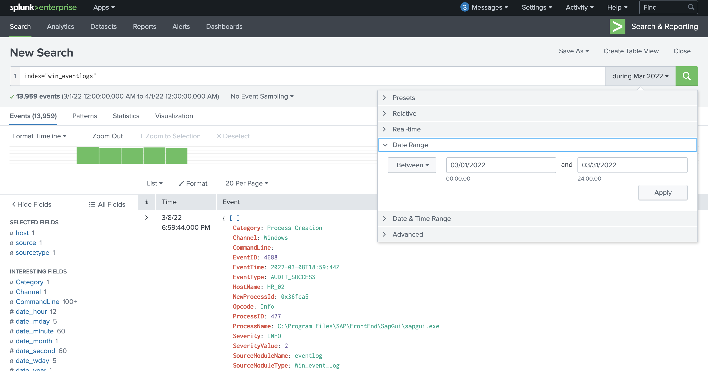
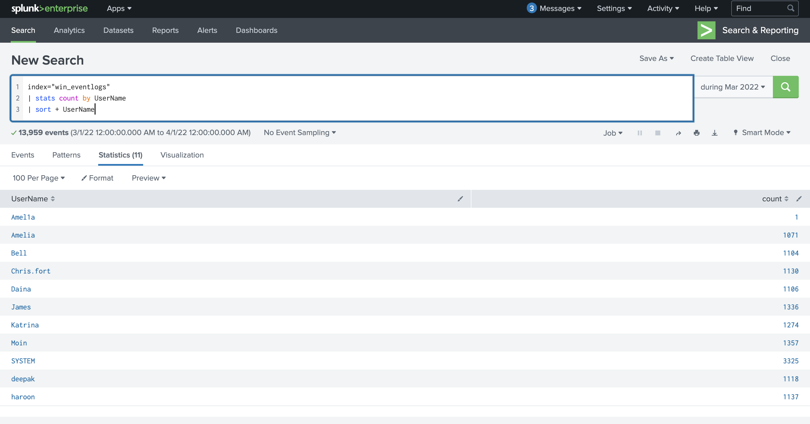
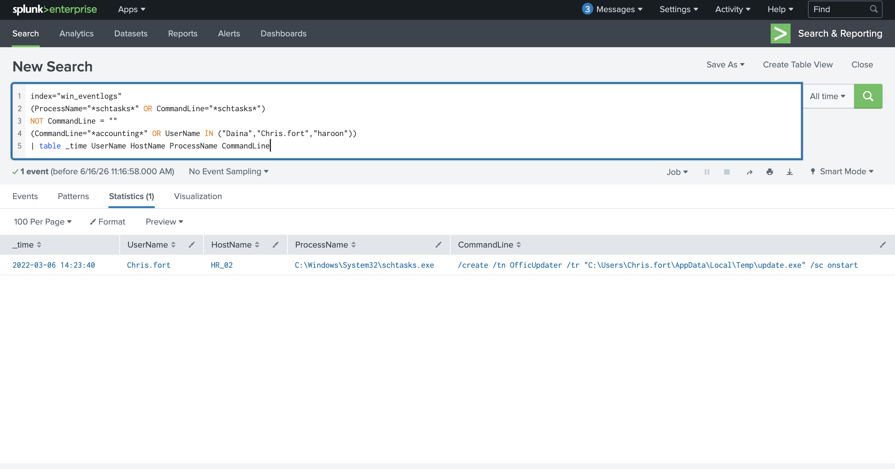
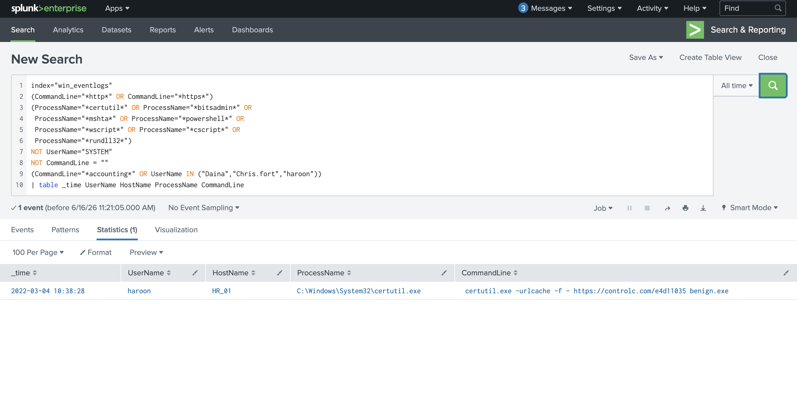
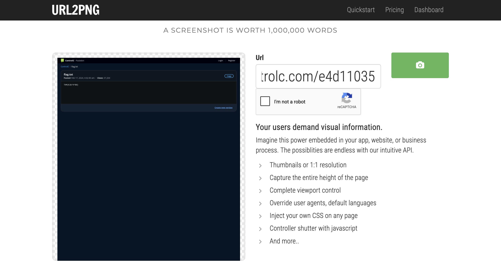
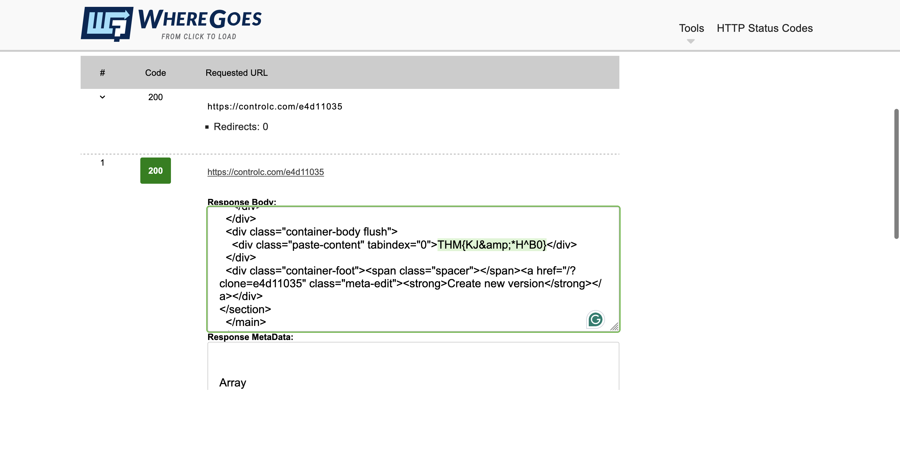

# Benign — TryHackMe

> **Platform:** TryHackMe  
> **Category:** SIEM / Log Analysis / Threat Hunting  
> **Difficulty:** Medium  
> **Status:** ✅ Completed  
> **Date:** 2026-06-16  
> **Time Spent:** ~X jam  

---

## 📌 Prolog

Challenge ini mengharuskan kita menelusuri process execution logs dari sebuah host yang dicurigai terkompromi. Tools yang digunakan adalah **Splunk** — semua log sudah di-ingest ke dalam index `win_eventlogs` dan siap dianalisis. Untuk yang belum familiar dengan Splunk, TryHackMe menyediakan room splunk101 dan splunk201 sebagai prerequisite.

---

## 🎯 Scenario

IDS salah satu klien mendeteksi eksekusi proses yang mencurigakan dari host di departemen HR. Beberapa tools terkait network information gathering dan scheduled tasks ikut tereksekusi, yang semakin memperkuat dugaan adanya kompromi.

Karena keterbatasan resource, hanya **process execution logs** dengan **Event ID: 4688** yang berhasil dikumpulkan dan di-ingest ke Splunk di index `win_eventlogs`.

Jaringan klien terbagi dalam tiga segmen:

| Departemen | User |
|------------|------|
| IT | James, Moin, Katrina |
| HR | Haroon, Chris, Diana |
| Marketing | Bell, Amelia, Deepak |

---

## ❓ Questions

1. How many logs are ingested from the month of March, 2022?
2. Imposter Alert: There seems to be an imposter account observed in the logs, what is the name of that user?
3. Which user from the HR department was observed to be running scheduled tasks?
4. Which user from the HR department executed a system process (LOLBIN) to download a payload from a file-sharing host?
5. To bypass the security controls, which system process (lolbin) was used to download a payload from the internet?
6. What was the date that this binary was executed by the infected host? format (YYYY-MM-DD)
7. Which third-party site was accessed to download the malicious payload?
8. What is the name of the file that was saved on the host machine from the C2 server during the post-exploitation phase?
9. The suspicious file downloaded from the C2 server contained malicious content with the pattern THM{..........}; what is that pattern?
10. What is the URL that the infected host connected to?

---

## 🔍 Answer & Walkthrough

### 1. How many logs are ingested from the month of March, 2022?

Set time range di Splunk ke **March 1–31, 2022** dengan index `win_eventlogs`. Total hit langsung terbaca dari hasil pencarian.

**Jawaban:** `13959`

---

### 2. Imposter Alert — siapa nama user tersebut?

Dari semua username yang muncul di log, ada satu nama yang janggal: `Amel1a` — huruf `l` diganti angka `1`, menyerupai username asli `Amelia` dari departemen Marketing. Teknik klasik typosquatting untuk membuat akun palsu yang sulit dideteksi sekilas.

**Jawaban:** `Amel1a`

---

### 3. User HR yang menjalankan scheduled task?

Filter log dengan keyword `schtasks` atau `Task Scheduler`, lalu lihat kolom user. Ditemukan `Chris.fort` dari departemen HR menjalankan scheduled task — dan yang bikin red flag, task tersebut berlokasi di folder `AppData\Local\Temp`, direktori yang tidak seharusnya jadi tempat task legitimate.

**Jawaban:** `Chris.fort`

---

### 4–6. User HR yang pakai LoLBin, binary apa, dan kapan dieksekusi?

Filter log dengan keyword `certutil` — langsung ketemu. User `haroon` dari HR menjalankan `certutil.exe` untuk mendownload payload dari internet. `certutil` adalah Windows binary legitimate yang sering disalahgunakan sebagai LoLBin karena bisa decode dan download file tanpa trigger antivirus. Eksekusi tercatat pada **4 Maret 2022**.

**Jawaban:**
- User: `haroon`
- Binary (LoLBin): `certutil.exe`
- Tanggal eksekusi: `2022-03-04`

---

### 7–10. C2 site, nama file, flag, dan URL lengkap

Dari log eksekusi `certutil` di atas, terlihat koneksi ke **controlc.com** — sebuah platform berbagi teks online, mirip Pastebin. Path yang diakses adalah `/e4d11035`.

Untuk memverifikasi konten URL tersebut, digunakan dua pendekatan:
- **Url2Png** — untuk screenshot tampilan halaman tanpa harus membuka langsung
- **wheregoes.com** — link checker untuk menelusuri redirect dan konten akhir dari URL

Dari sana ditemukan file bernama `benign.exe` yang tersimpan ke host, beserta flag tersembunyi di dalam kontennya.

**Jawaban:**
- Third-party site: `controlc.com`
- Nama file: `benign.exe`
- Flag: `THM{KJ&*H^B0}`
- Full URL: `https://controlc.com/e4d11035`

---

## 🚨 Key Findings / IOCs

| Tipe | Value | Keterangan |
|------|-------|------------|
| Username | `Amel1a` | Akun impostor — typosquatting dari `Amelia` |
| Username | `haroon` | User HR yang mengeksekusi LoLBin |
| Username | `Chris.fort` | User HR dengan scheduled task mencurigakan |
| Binary | `certutil.exe` | LoLBin yang dipakai untuk download payload dari C2 |
| Domain | `controlc.com` | C2 server — platform text-sharing yang disalahgunakan |
| URL | `https://controlc.com/e4d11035` | URL C2 lengkap |
| File | `benign.exe` | Payload yang di-drop ke host dari C2 |
| Path | `AppData\Local\Temp` | Lokasi drop payload dan scheduled task |

---

## 🗺️ MITRE ATT&CK Mapping

| Tactic | Technique | ID | Keterangan |
|--------|-----------|----|------------|
| Persistence | Create Account: Local Account | T1136.001 | Pembuatan akun impostor `Amel1a` via typosquatting |
| Defense Evasion / Command & Control | Ingress Tool Transfer | T1105 | `certutil.exe` dipakai untuk download `benign.exe` dari `controlc.com` |
| Execution | Scheduled Task/Job: Scheduled Task | T1053.005 | `Chris.fort` menjalankan scheduled task dari `AppData\Local\Temp` |

---

## 📋 Summary — Attacker Behavior & Todo

### Attacker Behavior

Lab ini hanya menyediakan Event ID 4688 (process creation), sehingga rekonstruksi full kill chain tidak bisa dilakukan — tidak ada artifact jaringan, memory, atau endpoint lain. Namun dari log yang ada, pola serangan bisa ditelusuri secara kronologis:

**4 Maret 2022** — User `haroon` mengeksekusi `certutil.exe` untuk mendownload payload dari `https://controlc.com/e4d11035`. `certutil` dipilih karena merupakan Windows binary bawaan yang jarang di-flag oleh antivirus — teknik klasik *Living off the Land Binary (LoLBin)*. Payload yang diunduh adalah `benign.exe`, sebuah nama yang sengaja dibuat terlihat tidak berbahaya. File ini di-drop ke direktori `AppData\Local\Temp` milik `Chris.fort` — bukan folder milik `haroon` sendiri, yang mengindikasikan adanya aksi lateral atau pre-staged access.

**6 Maret 2022** — `Chris.fort` menjalankan scheduled task yang berlokasi di `AppData\Local\Temp`, folder yang sama tempat `benign.exe` di-drop dua hari sebelumnya. Ini red flag yang kuat: task legitimate tidak seharusnya di-store di Temp.

Sepanjang periode ini juga muncul akun `Amel1a` — typosquatting dari nama asli `Amelia` di departemen Marketing. Kemungkinan dibuat untuk persistence atau lateral movement dengan menyamar sebagai user yang legitimate.

Korelasi yang paling mungkin: `haroon` adalah titik kompromi awal, `Chris.fort` adalah target pivot, dan `Amel1a` adalah persistence mechanism yang disiapkan.

### Todo / Follow-up

- [ ] Pelajari lebih dalam teknik LoLBin lainnya selain `certutil` — referensi: [LOLBAS Project](https://lolbas-project.github.io/)
- [ ] Eksplorasi deteksi scheduled task dari direktori non-standard (`AppData`, `Temp`) menggunakan Splunk
- [ ] Pelajari cara threat actors menyalahgunakan platform legitimate (controlc, pastebin, discord) sebagai C2 — teknik *Living off Trusted Sites (LoTS)*
- [ ] Latihan korelasi antar event di Splunk: gabungkan Event ID 4688 (process creation) dengan 4624/4625 (logon) untuk bangun timeline lebih lengkap

---

## 📚 References

- [MITRE ATT&CK — T1136.001: Create Account: Local Account](https://attack.mitre.org/techniques/T1136/001/)
- [MITRE ATT&CK — T1105: Ingress Tool Transfer](https://attack.mitre.org/techniques/T1105/)
- [MITRE ATT&CK — T1053.005: Scheduled Task](https://attack.mitre.org/techniques/T1053/005/)
- [LOLBAS Project — certutil](https://lolbas-project.github.io/lolbas/Binaries/Certutil/)
- [Windows Event ID 4688 — Process Creation](https://learn.microsoft.com/en-us/windows/security/threat-protection/auditing/event-4688)
- [Living off Trusted Sites (LoTS)](https://lots-project.com/)

---

*Writeup ini dibuat sebagai bagian dari perjalanan belajar Blue Team / SOC Analyst.*
