# Extracted — TryHackMe

> **Platform:** TryHackMe  
> **Category:** Digital Forensics / Network Forensics / Malware Analysis  
> **Difficulty:** Medium  
> **Status:** ✅ Completed  
> **Date:** 2026-06-22  
> **Time Spent:** ~3 jam  

---

## 🎯 Scenario

Challenge berbasis file — bukan VM. Sebagai senior DFIR specialist, kamu diminta menangani laporan dari kolega junior yang mencurigai adanya traffic anomali dari salah satu workstation. Sayangnya, SIEM sedang bermasalah dalam mengingesti network traffic, namun perangkat network capture masih berjalan normal.

File yang tersedia adalah hasil tangkapan network (PCAP). Tugasmu adalah menganalisis file tersebut untuk menemukan apa yang sebenarnya terjadi.

---

## ❓ Questions

1. What's the initial part of the password?
2. What's the initial part of the password?
3. What's the flag?

---

## 🔍 Answer & Walkthrough

### Setup — Extract & Recon Awal

File zip diekstrak, didapat satu file `Traffic.pcapng`.

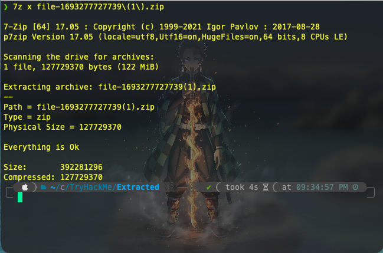

Langkah pertama jalankan Zeek untuk parsing log dari PCAP:

```bash
zeek -r Traffic.pcapng
```

Output `_path` yang relevan:
- `files` — 1 file terdeteksi
- `http` — 1 transaksi HTTP
- `conn` — 3 koneksi TCP
- `known_hosts` — 2 host aktif
- `software` — 2 software signature terdeteksi

---

### 1. What's the initial part of the password?

**Cek files.log** — ada satu file dengan MD5 `9010749735dfad6afe2fd1fe2b84b9bf`.

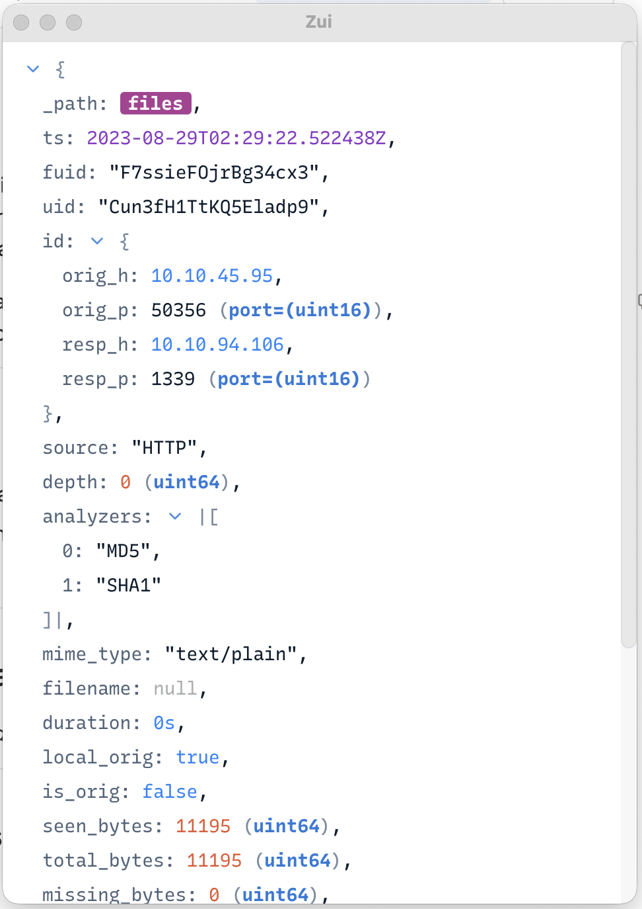

Cek hash di VirusTotal → malware dengan family `genscript`, threat type `trojan`, nama file umum `xxxmmdcclxxxiv.ps1`.

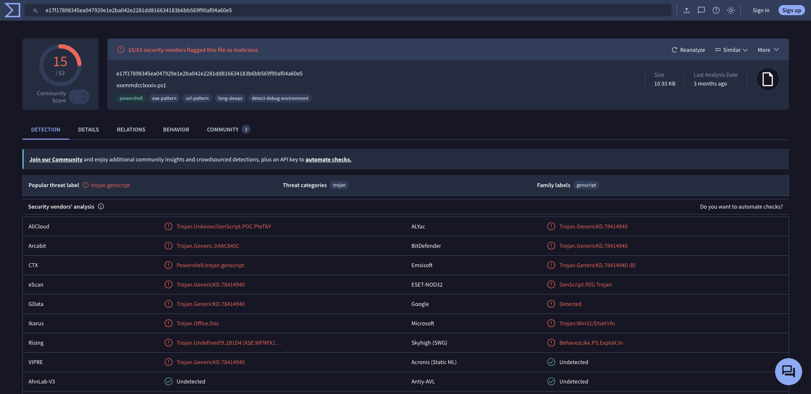

Di http.log terlihat file tersebut diunduh dari:

```
hxxp[://]10[.]10[.]94[.]106:1339//xxxmmdcclxxxiv[.]ps1
```

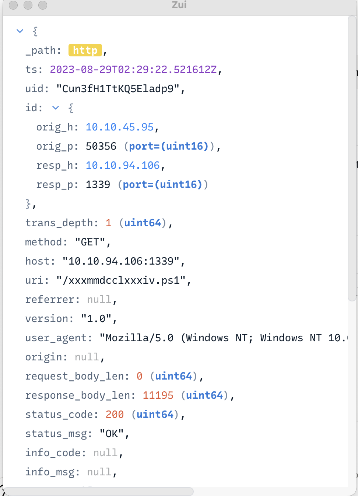

Dari `_path == "software"`, server menggunakan `SimpleHTTP` berbasis `Python/3` — ini C2 sederhana yang di-host manual oleh attacker.

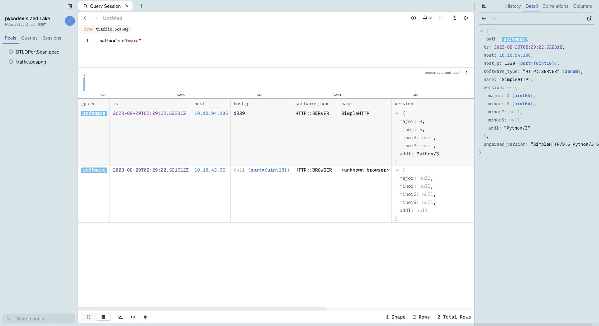

**Export malware dari PCAP:**

```bash
tshark -r Traffic.pcapng --export-objects http,.
```

Didapat file `xxxmmdcclxxxiv.ps1`. Setelah dibedah, alur kerjanya:

1. Cek apakah `procdump.exe` ada di `C:\Tools\` — kalau tidak, download dari Sysinternals lalu extract
2. Cek apakah KeePass sedang berjalan
3. Dump memory KeePass ke file bernama `1337` (tanpa extension) di Desktop
4. Enkripsi file dump dengan XOR key `0x41` (`A`), encode ke base64
5. Kirim ke `10.10.94.106` port `1337`
6. Lakukan hal yang sama untuk `Database1337.kdbx` dengan XOR key `0x42` (`B`), kirim ke port `1338`

Cek TCP conversations di Wireshark — 3 port digunakan: `1337`, `1338`, `1339`. Port `1337` memiliki total byte terbesar (~390 MB), berisi memory dump.

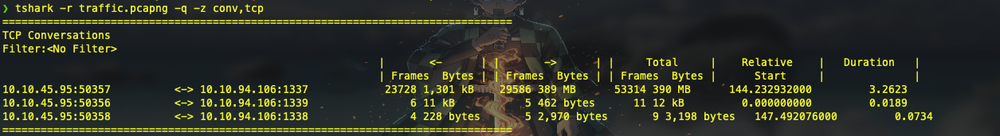

**Extract TCP payload port 1337:**

```bash
tshark -r Traffic.pcapng -Y "tcp.dstport == 1337" -T fields -e data > payload_1337.hex
```

Convert hex ke binary, lalu decode base64 dan XOR decrypt dengan key `0x41`:

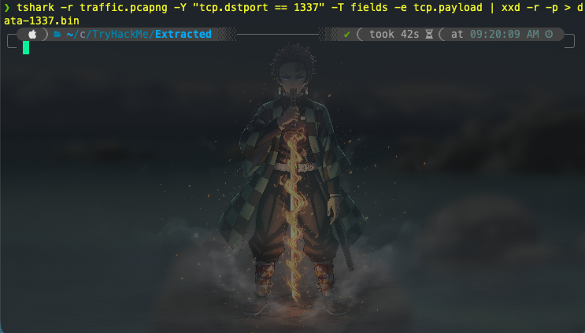

```python
# decode base64 → decrypt XOR 0x41
with open("payload_1337.bin", "rb") as f:
    raw = base64.b64decode(f.read())

decrypted = bytes([b ^ 0x41 for b in raw])

with open("data-1337_decrypted.dmp", "wb") as f:
    f.write(decrypted)
```

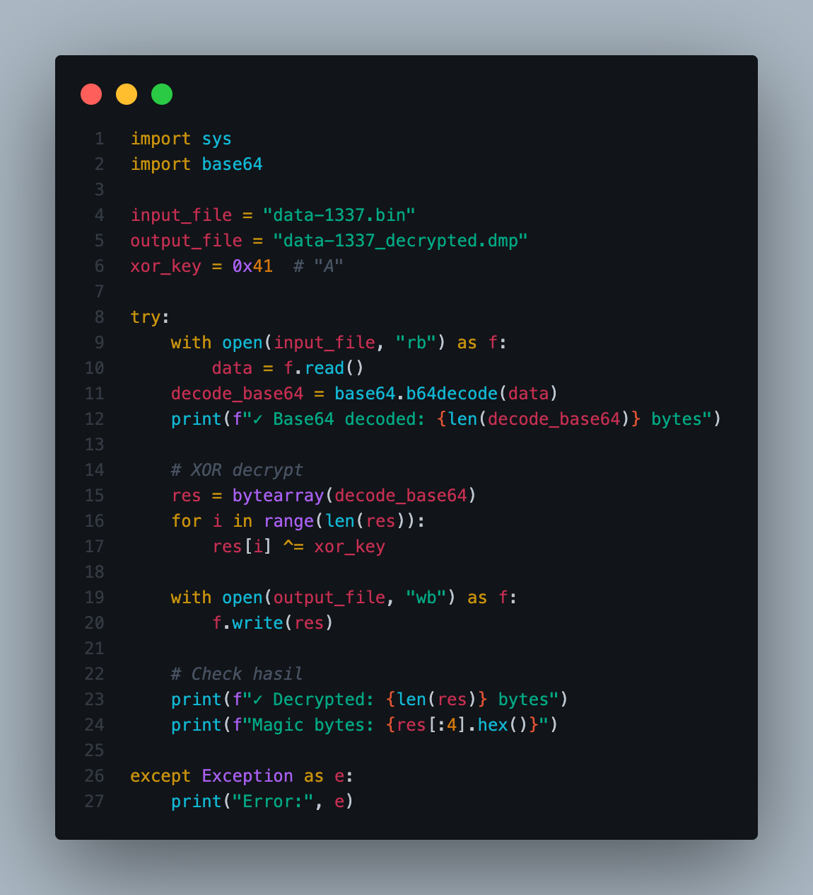

Hasil: file bertipe **MiniDump Crash Report** — valid memory dump dari KeePass.

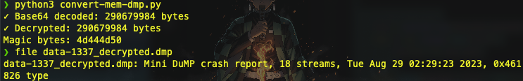

Gunakan tool [keepass-dump-extractor](https://github.com/matro7sh/keepass-dump-extractor) untuk mengekstrak password dari memory dump:

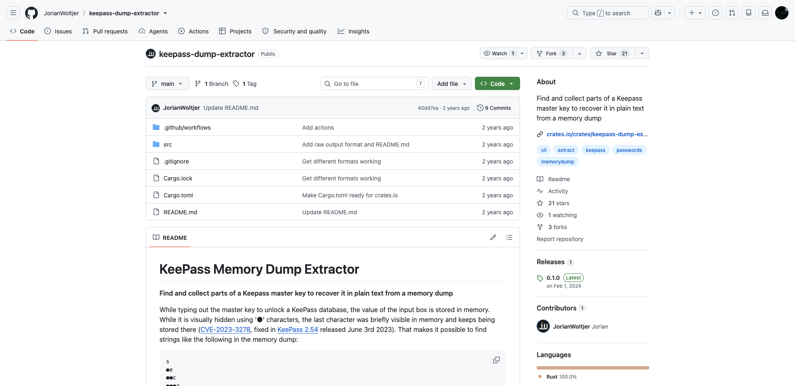

```bash
keepass-dump-extractor data-1337_decrypted.dmp
```

Didapat password parsial: `NoWaYIcanF0rGetThis123` — tapi karakter pertamanya hilang.

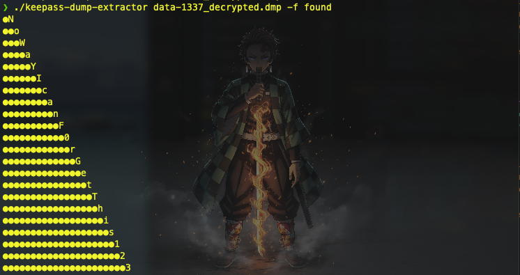

**Jawaban:** `NoWaYIcanF0rGetThis123`

---

### 2. What's the initial part of the password?

Generate wordlist dari semua kemungkinan karakter pertama:

```bash
keepass-dump-extractor data-1337_decrypted.dmp -f all > wordlist.txt
```

Crack menggunakan John the Ripper terhadap hash KeePass:

```bash
keepass2john Database1337.kdbx > hash.txt
john hash.txt --wordlist=wordlist.txt
```

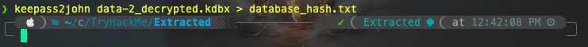

Karakter yang hilang ditemukan.

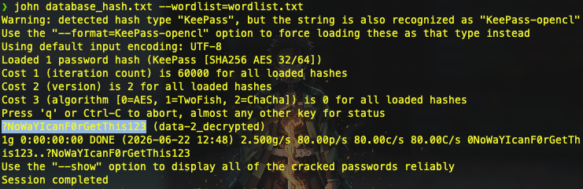

**Jawaban:** `?`

---

### 3. What's the flag?

**Extract TCP payload port 1338** (berisi file KDBX terenkripsi):

```bash
tshark -r Traffic.pcapng -Y "tcp.dstport == 1338" -T fields -e data > payload_1338.b64
```

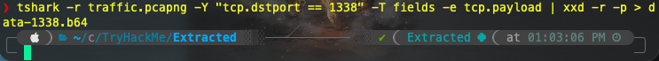

Decode base64 lalu XOR decrypt dengan key `0x42`:

```python
with open("payload_1338.b64", "r") as f:
    raw = base64.b64decode(f.read())

decrypted = bytes([b ^ 0x42 for b in raw])

with open("Database1337.kdbx", "wb") as f:
    f.write(decrypted)
```


File berhasil jadi KeePass password database yang valid.

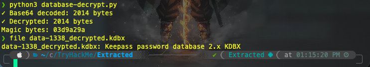

Buka database menggunakan password lengkap (`?NoWaYIcanF0rGetThis123`) via script Python:

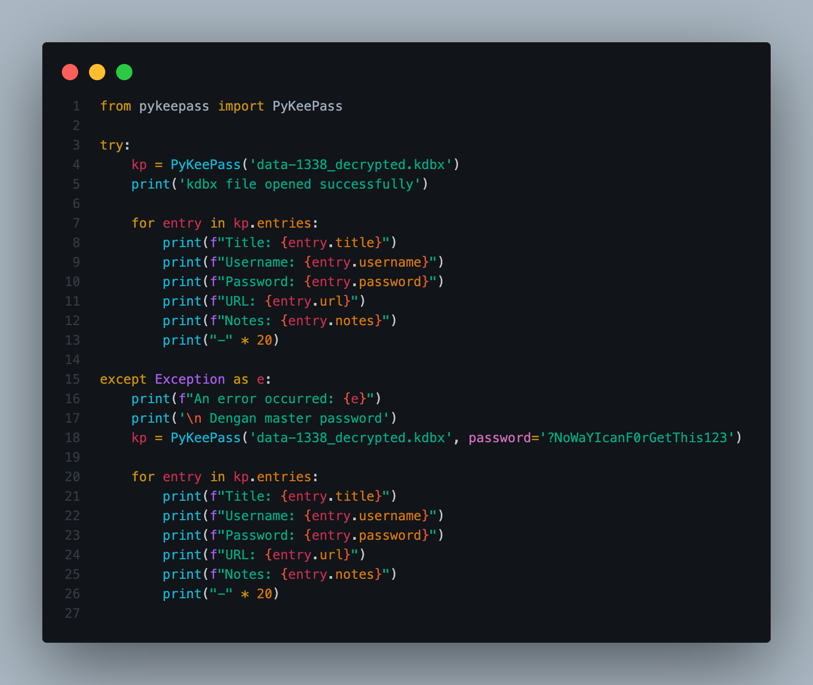

Flag ditemukan di dalam database.

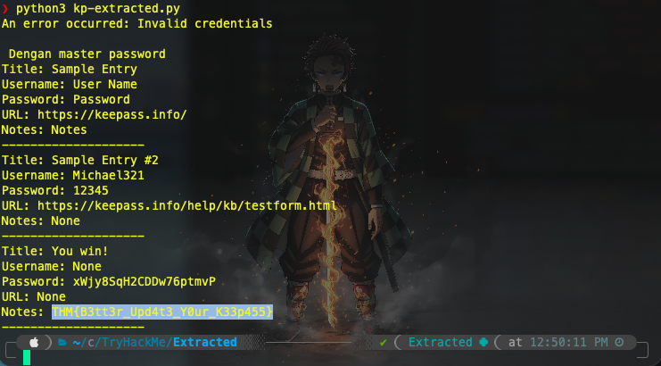

**Jawaban:** `THM{B3tt3r_Upd4t3_Y0ur_K33p455}`

---

## 🚨 Key Findings / IOCs

| Tipe | Value | Keterangan |
|------|-------|------------|
| IP Address | `10.10.94.106` | Attacker / C2 server |
| IP Address | `10.10.45.95` | Victim workstation |
| URL | `hxxp[://]10[.]10[.]94[.]106:1339//xxxmmdcclxxxiv[.]ps1` | Download URL malware |
| File Hash (MD5) | `9010749735dfad6afe2fd1fe2b84b9bf` | Malware `xxxmmdcclxxxiv.ps1` |
| Filename | `xxxmmdcclxxxiv.ps1` | PowerShell malware, family genscript |
| Port | `1337` | Exfil memory dump KeePass (XOR 0x41) |
| Port | `1338` | Exfil KeePass database (XOR 0x42) |
| Port | `1339` | Delivery malware via SimpleHTTP/Python |

---

## 🗺️ MITRE ATT&CK Mapping

| Tactic | Technique | ID | Keterangan |
|--------|-----------|----|------------|
| Execution | Command and Scripting Interpreter: PowerShell | T1059.001 | Malware dieksekusi sebagai script PS1 |
| Credential Access | Credentials from Password Stores: Password Managers | T1555.005 | Dump & crack KeePass database |
| Credential Access | OS Credential Dumping | T1003 | Procdump dipakai untuk dump memory KeePass |
| Collection | Data from Local System | T1005 | Ambil file `.kdbx` dari Desktop victim |
| Command and Control | Non-Standard Port | T1571 | C2 menggunakan port 1337, 1338, 1339 |
| Exfiltration | Exfiltration Over C2 Channel | T1041 | Data dikirim lewat koneksi TCP ke C2 |
| Defense Evasion | Obfuscated Files or Information | T1027 | Variable name obfuscation di PowerShell, XOR encoding |

---

## 📋 Summary — Attacker Behavior & Todo

### Attacker Behavior

Attacker menyiapkan C2 server sederhana (`SimpleHTTP/Python`) di `10.10.94.106` dan meng-host malware PowerShell obfuscated (`xxxmmdcclxxxiv.ps1`) di port `1339`. Malware dieksekusi di workstation korban (`10.10.45.95`).

Setelah berjalan, malware pertama mengecek keberadaan `procdump.exe` di `C:\Tools\` — jika tidak ada, didownload dari Sysinternals. Kemudian mengecek apakah KeePass sedang aktif. Jika ya, procdump digunakan untuk dump memory KeePass ke file `1337` di Desktop.

File dump di-XOR encrypt dengan key `0x41`, di-encode base64, lalu dikirim ke C2 lewat port `1337`. Secara paralel, file `Database1337.kdbx` di Desktop juga dicuri — di-XOR encrypt dengan key `0x42` lalu dikirim ke port `1338`. Total data yang dieksfiltrasi dari memory dump saja mencapai ~390 MB.

Di sisi investigator: TCP payload dari port 1337 diekstrak, didekripsi, dan dianalisis dengan `keepass-dump-extractor` untuk mendapatkan password parsial dari memory. Karakter pertama yang hilang ditemukan dengan `keepass2john` + John the Ripper. KeePass database dari port 1338 juga didekripsi, lalu dibuka dengan password lengkap untuk mendapatkan flag.

### Todo / Follow-up

- [ ] Pelajari lebih lanjut teknik XOR encoding untuk exfiltration dan cara deteksinya di level network
- [ ] Eksplorasi `keepass-dump-extractor` lebih jauh — seberapa reliable untuk berbagai versi KeePass?
- [ ] Latihan analisis obfuscated PowerShell — variable renaming, string concatenation patterns
- [ ] Coba setup lab simulasi: SimpleHTTP C2 + procdump + KeePass untuk defensive testing

---

## 📚 References

- [keepass-dump-extractor — matro7sh](https://github.com/matro7sh/keepass-dump-extractor)
- [Procdump — Sysinternals](https://docs.microsoft.com/en-us/sysinternals/downloads/procdump)
- [MITRE ATT&CK T1555.005 — Password Managers](https://attack.mitre.org/techniques/T1555/005/)
- [MITRE ATT&CK T1059.001 — PowerShell](https://attack.mitre.org/techniques/T1059/001/)

---

*Writeup ini dibuat sebagai bagian dari perjalanan belajar Blue Team / SOC Analyst.*
