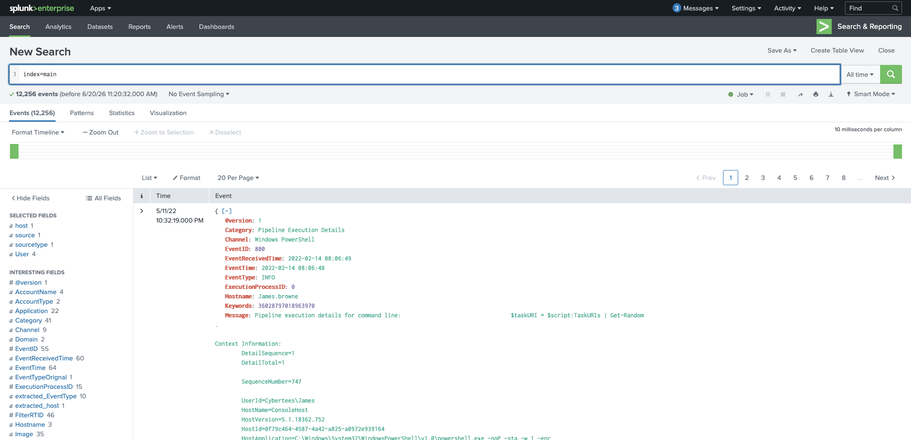
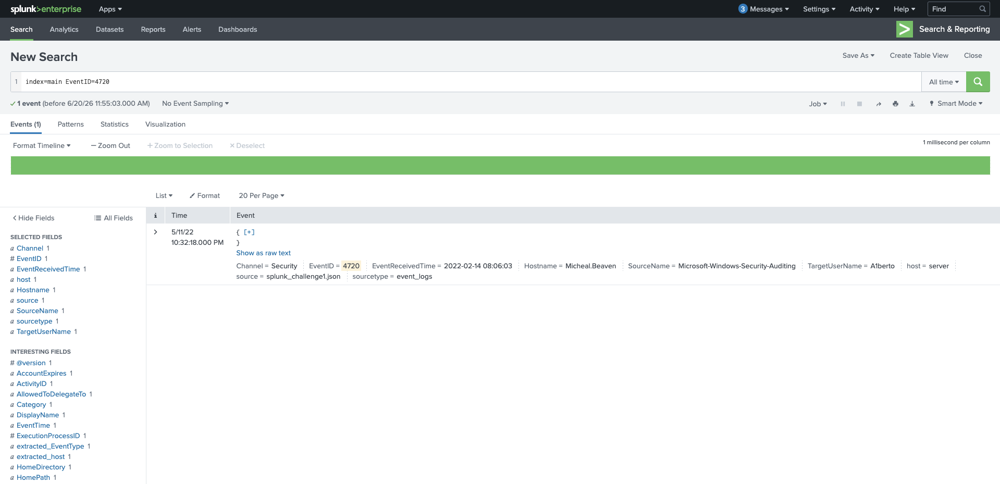
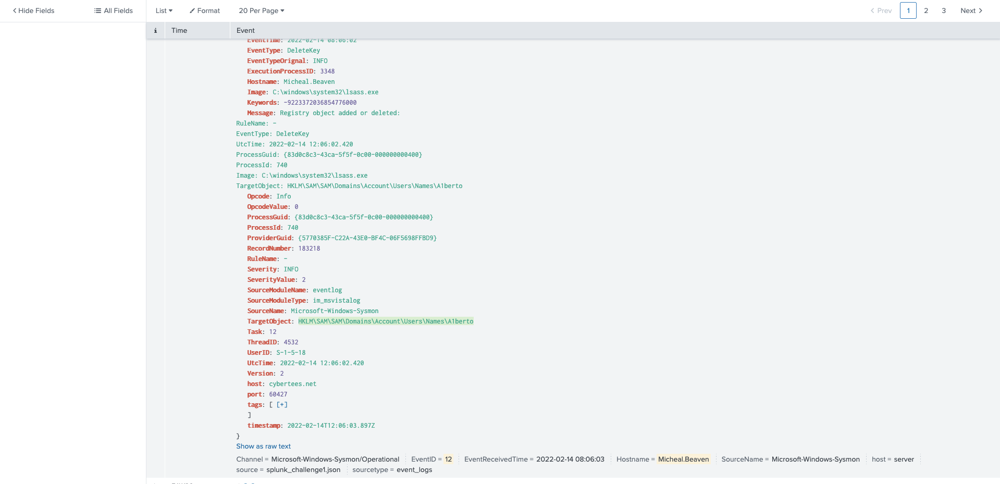
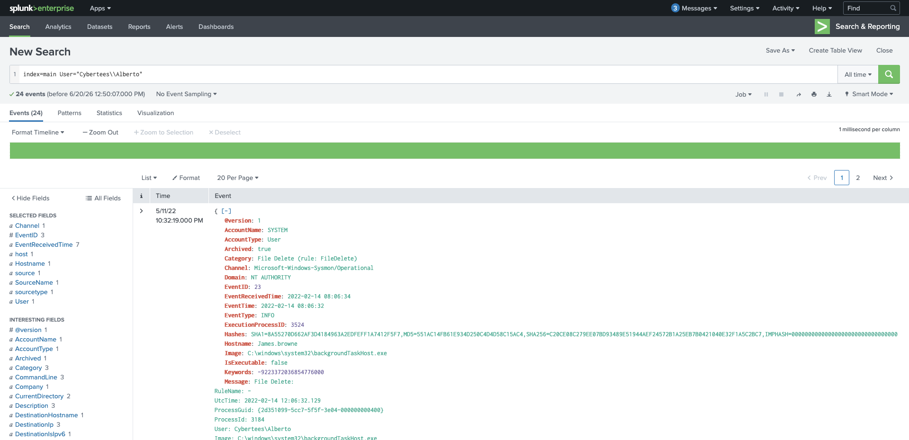
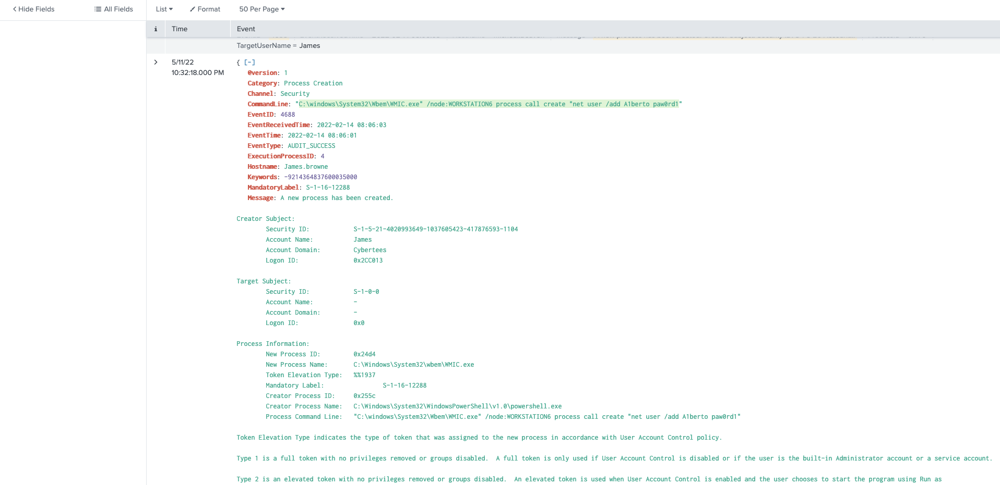
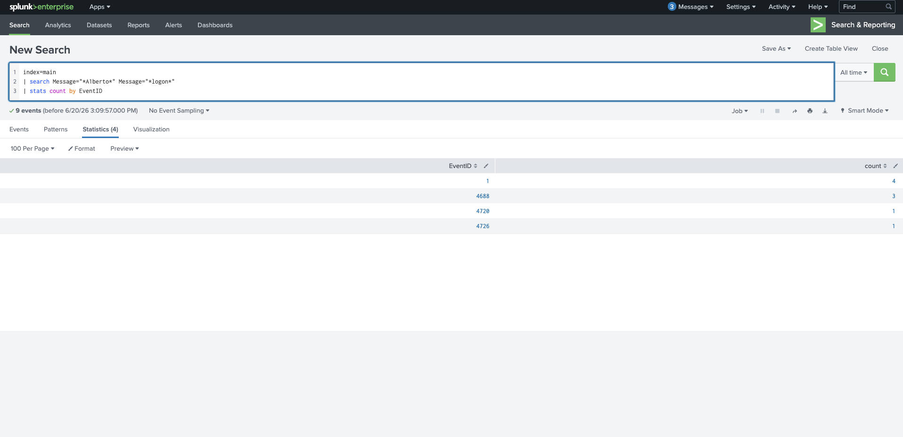
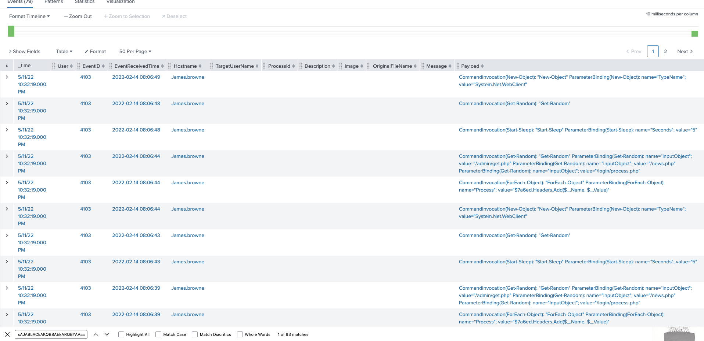
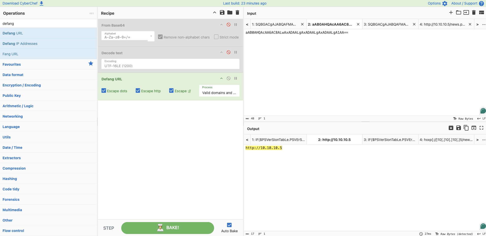
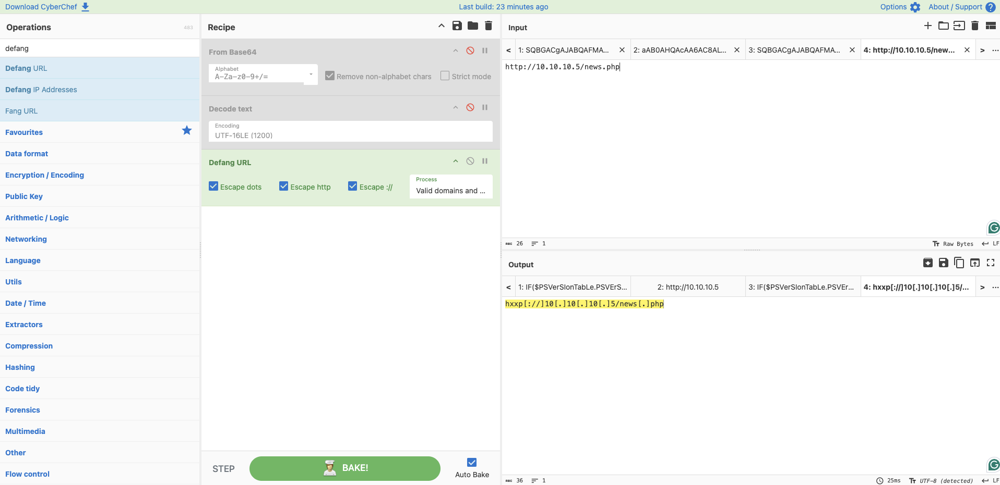

# Investigating with Splunk — TryHackMe

> **Platform:** TryHackMe  
> **Category:** SIEM / Log Analysis / Threat Hunting  
> **Difficulty:** Medium  
> **Status:** ✅ Completed  
> **Date:** 2026-06-20  
> **Time Spent:** ~X jam  

---

## 📌 Prolog

Challenge ini melanjutkan seri investigasi Splunk di TryHackMe. Skenarionya lebih konkret — beberapa mesin Windows terdeteksi berperilaku anomali, dan adversary diduga berhasil membuat backdoor di beberapa host tersebut. Log dari host-host yang dicurigai sudah dikumpulkan dan di-ingest ke Splunk di index `main`. Tugas kita: telusuri log, identifikasi anomali, dan ungkap apa yang sebenarnya terjadi.

---

## 🎯 Scenario

SOC Analyst Johny mendeteksi perilaku anomali di log beberapa mesin Windows. Dugaannya, adversary sudah berhasil mendapatkan akses ke mesin-mesin tersebut dan membuat backdoor. Manajernya meminta Johny untuk mengumpulkan log dari host-host yang dicurigai dan meng-ingest-nya ke Splunk untuk investigasi cepat.

Semua log sudah tersedia di index `main`. Untuk yang ingin memperdalam penggunaan Splunk, TryHackMe menyediakan room `splunk101` dan `splunk201` sebagai referensi.

---

## ❓ Questions

1. How many events were collected and Ingested in the index main?
2. On one of the infected hosts, the adversary was successful in creating a backdoor user. What is the new username?
3. On the same host, a registry key was also updated regarding the new backdoor user. What is the full path of that registry key?
4. Examine the logs and identify the user that the adversary was trying to impersonate.
5. What is the command used to add a backdoor user from a remote computer?
6. How many times was the login attempt from the backdoor user observed during the investigation?
7. What is the name of the infected host on which suspicious Powershell commands were executed?
8. PowerShell logging is enabled on this device. How many events were logged for the malicious PowerShell execution?
9. An encoded Powershell script from the infected host initiated a web request. What is the full URL?

---

## 🔍 Answer & Walkthrough

### 1. How many events were collected and Ingested in the index main?

Query paling dasar: `index=main` tanpa filter apapun. Total event langsung terbaca di header hasil pencarian.



**Jawaban:** `12256`

---

### 2. What is the new backdoor username?

Filter dengan `EventID=4720` — event khusus untuk pembuatan user account baru di Windows. Ditemukan satu event, dari host `Micheal.Beaven`, dengan `TargetUserName = A1berto`. Nama ini dibuat menyerupai akun legit `Alberto`, dengan huruf `l` diganti angka `1`.



**Jawaban:** `A1berto`

---

### 3. What is the full path of the registry key updated for the backdoor user?

Setelah akun `A1berto` dibuat, Sysmon mencatat perubahan registry dengan EventID 12 (Registry object added or deleted). Field `TargetObject` menunjukkan path lengkap registry yang dimodifikasi: `HKLM\SAM\SAM\Domains\Account\Users\Names\A1berto`. Event ini juga berasal dari host `Micheal.Beaven`.



**Jawaban:** `HKLM\SAM\SAM\Domains\Account\Users\Names\A1berto`

---

### 4. What is the user that the adversary was trying to impersonate?

Dari nama backdoor `A1berto`, jelas ini typosquatting dari akun legit `Alberto` yang terdaftar di sistem (`Cybertees\Alberto`). Untuk memverifikasi, filter log dengan `User="Cybertees\\Alberto"` menampilkan 24 event — akun ini memang ada dan aktif di environment.



**Jawaban:** `Alberto`

---

### 5. What is the command used to add a backdoor user from a remote computer?

Search dengan keyword `A1berto` dan filter EventID 4688 (process creation). Ditemukan command yang dieksekusi dari host `James.browne` menggunakan WMIC untuk meremote ke `WORKSTATION6` dan membuat user di sana — teknik lateral movement yang rapi karena memanfaatkan tool bawaan Windows.



**Jawaban:** `C:\windows\System32\Wbem\WMIC.exe" /node:WORKSTATION6 process call create "net user /add A1berto paw0rd1`

---

### 6. How many times was the login attempt from the backdoor user observed?

Query `index=main | search Message="*Alberto*" Message="*logon*" | stats count by EventID` menunjukkan bahwa tidak ada EventID 4624 atau 4625 (successful/failed logon) yang muncul. Event yang ada hanya seputar process creation dan account management — artinya `A1berto` berhasil dibuat tapi tidak pernah dipakai untuk login.



**Jawaban:** `0`

---

### 7. What is the name of the infected host on which suspicious Powershell commands were executed?

Di screenshot pertama (total events), salah satu event yang tampil adalah EventID 800 dengan `Category: Pipeline Execution Details` dan `Channel: #Windows PowerShell` — berasal dari host `James.browne`. Investigasi lebih lanjut ke EventID 4103 (PowerShell script block logging) juga semuanya mengarah ke host yang sama.



**Jawaban:** `James.browne`

---

### 8. How many events were logged for the malicious PowerShell execution?

Filter log di host `James.browne` dengan EventID 4103 (PowerShell Module Logging). Total event yang tercatat untuk eksekusi PowerShell berbahaya ini adalah 79.

**Jawaban:** `79`

---

### 9. What is the full URL initiated by the encoded PowerShell script?

PowerShell dijalankan dengan flag `-enc` — artinya payload-nya di-encode dalam Base64. Untuk mendecode, ambil string Base64 dari field `HostApplication` lalu masukkan ke CyberChef dengan recipe: **From Base64 → Decode text (UTF-16LE) → Defang URL**.

Hasilnya mengungkap URL C2 yang diakses oleh script tersebut.





**Jawaban:** `hxxp[://]10[.]10[.]10[.]5/news[.]php`

---

## 🚨 Key Findings / IOCs

| Tipe | Value | Keterangan |
|------|-------|------------|
| Username | `A1berto` | Backdoor account — typosquatting dari `Alberto` |
| Username | `Alberto` | Akun legit yang diimpersonate |
| Hostname | `Micheal.Beaven` | Host tempat backdoor user dibuat |
| Hostname | `James.browne` | Host dengan eksekusi PowerShell berbahaya |
| Hostname | `WORKSTATION6` | Target remote user creation via WMIC |
| Registry | `HKLM\SAM\SAM\Domains\Account\Users\Names\A1berto` | Registry entry untuk backdoor user |
| URL | `hxxp[://]10[.]10[.]10[.]5/news[.]php` | C2 URL — target web request dari encoded PowerShell |
| Binary | `WMIC.exe` | LoLBin untuk remote user creation |
| Process | `powershell.exe -noP -sta -w 1 -enc` | Encoded PowerShell stager |

---

## 🗺️ MITRE ATT&CK Mapping

| Tactic | Technique | ID | Keterangan |
|--------|-----------|----|------------|
| Persistence | Create Account: Local Account | T1136.001 | Pembuatan backdoor user `A1berto` via typosquatting |
| Defense Evasion | Valid Accounts | T1078 | Impersonate akun legit `Alberto` |
| Lateral Movement / Execution | Windows Management Instrumentation | T1047 | WMIC dipakai untuk buat user di remote host `WORKSTATION6` |
| Execution | Command and Scripting Interpreter: PowerShell | T1059.001 | Encoded PowerShell dijalankan di `James.browne` |
| Defense Evasion | Obfuscated Files or Information | T1027 | PowerShell payload di-encode dengan Base64 |
| Command & Control | Ingress Tool Transfer | T1105 | Web request ke C2 `10.10.10.5/news.php` untuk download stager |

---

## 📋 Summary — Attacker Behavior & Todo

### Attacker Behavior

Dari hasil investigasi, adversary berhasil mengkompromi setidaknya dua host: `Micheal.Beaven` dan `James.browne`.

**Di `Micheal.Beaven`**, attacker membuat backdoor account `A1berto` — typosquatting dari akun legit `Alberto` — menggunakan EventID 4720 (user account created). Setelah akun dibuat, Sysmon mencatat perubahan registry di `HKLM\SAM\SAM\Domains\Account\Users\Names\A1berto`. Meski akun berhasil dibuat, tidak ada satu pun login yang tercatat dari `A1berto` selama investigasi — kemungkinan akun ini disiapkan sebagai persistence yang belum sempat dipakai, atau sengaja tidak digunakan agar tidak menarik perhatian.

**Dari `James.browne`**, attacker menjalankan WMIC untuk secara remote membuat user yang sama di `WORKSTATION6`:
```
C:\windows\System32\Wbem\WMIC.exe /node:WORKSTATION6 process call create "net user /add A1berto paw0rd1"
```

Selain itu, di host yang sama ditemukan eksekusi PowerShell yang di-encode dalam Base64 dengan flag `-noP -sta -w 1 -enc`. Total 79 event tercatat di PowerShell logging (EventID 4103). Setelah didecode via CyberChef, script tersebut melakukan web request ke `hxxp[://]10[.]10[.]10[.]5/news[.]php` — kemungkinan besar sebagai stager untuk download payload lanjutan atau komunikasi C2.

Pola yang terlihat: attacker menggunakan living-off-the-land approach — memanfaatkan `WMIC.exe` dan `powershell.exe` yang merupakan binary bawaan Windows agar tidak mudah dideteksi.

### Todo / Follow-up

- [ ] Pelajari lebih dalam PowerShell obfuscation dan teknik decode — referensi: [CyberChef](https://gchq.github.io/CyberChef/)
- [ ] Eksplorasi EventID Windows yang relevan untuk deteksi backdoor: 4720 (user created), 4726 (user deleted), 4624/4625 (logon)
- [ ] Pelajari cara membuat Splunk alert untuk deteksi WMIC lateral movement (`/node:` + `process call create`)
- [ ] Deep dive Sysmon EventID 12/13 untuk monitoring perubahan registry key sensitif seperti SAM

---

## 📚 References

- [MITRE ATT&CK — T1136.001: Create Account: Local Account](https://attack.mitre.org/techniques/T1136/001/)
- [MITRE ATT&CK — T1047: Windows Management Instrumentation](https://attack.mitre.org/techniques/T1047/)
- [MITRE ATT&CK — T1059.001: PowerShell](https://attack.mitre.org/techniques/T1059/001/)
- [MITRE ATT&CK — T1027: Obfuscated Files or Information](https://attack.mitre.org/techniques/T1027/)
- [MITRE ATT&CK — T1105: Ingress Tool Transfer](https://attack.mitre.org/techniques/T1105/)
- [Windows Event ID 4720 — User Account Created](https://learn.microsoft.com/en-us/windows/security/threat-protection/auditing/event-4720)
- [Sysmon EventID 12/13 — Registry Events](https://learn.microsoft.com/en-us/sysinternals/downloads/sysmon)
- [TryHackMe — Splunk 101](https://tryhackme.com/room/splunk101)
- [TryHackMe — Splunk 201](https://tryhackme.com/room/splunk201)

---

*Writeup ini dibuat sebagai bagian dari perjalanan belajar Blue Team / SOC Analyst.*
