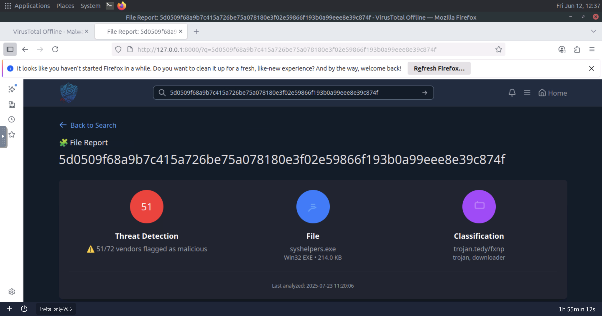
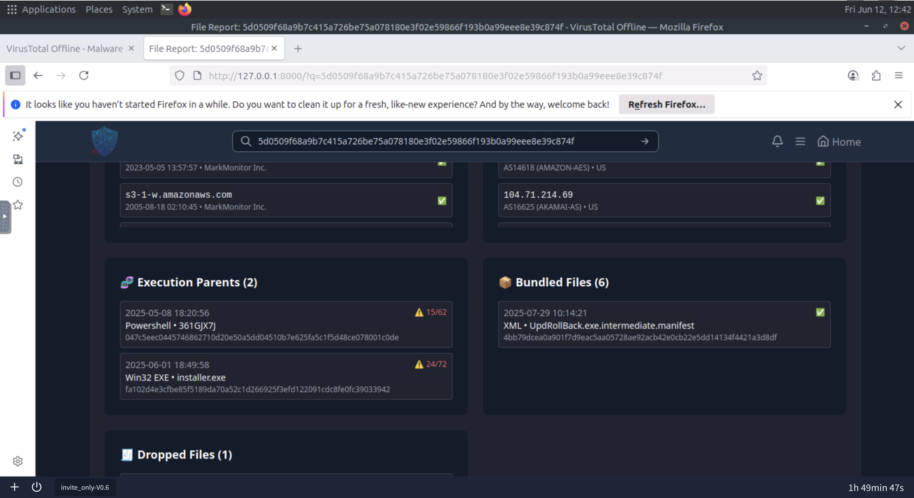
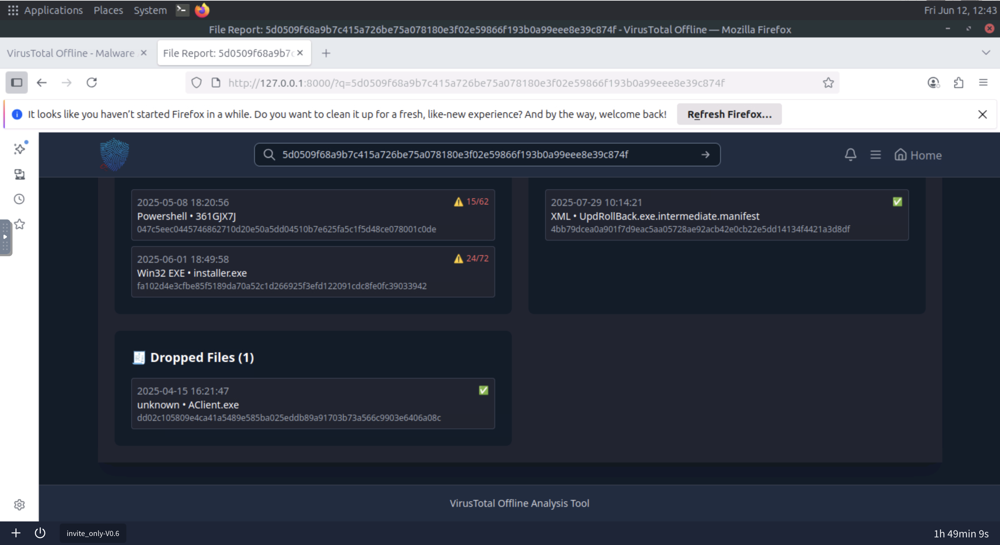
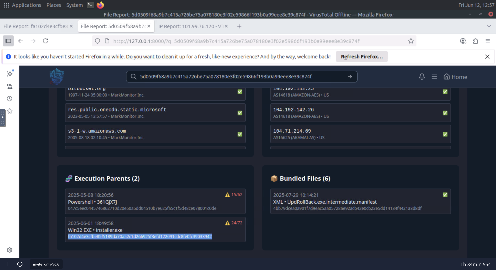
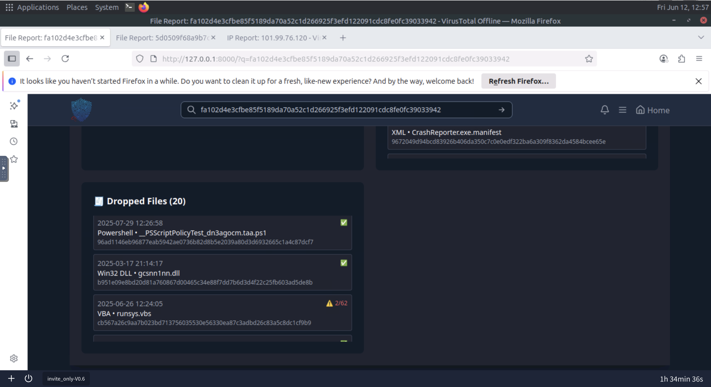
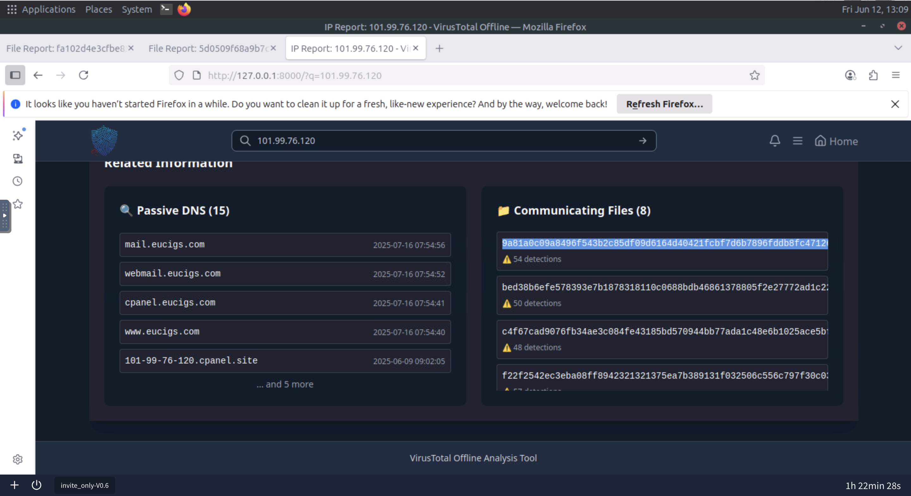
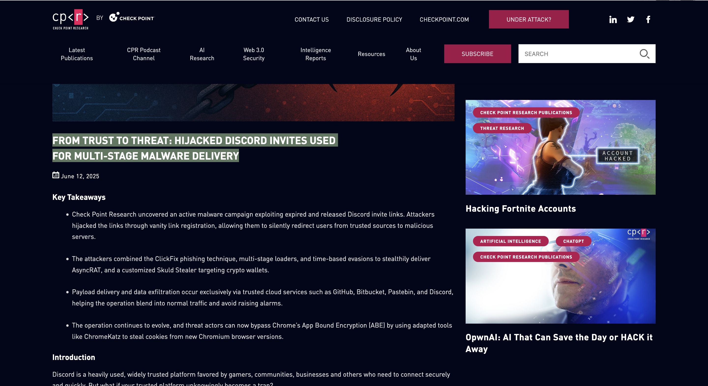
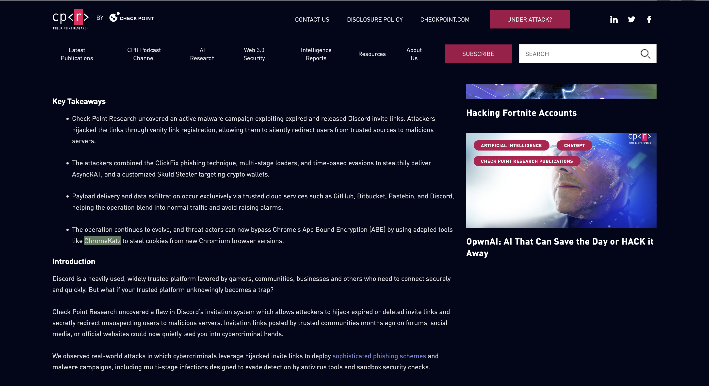
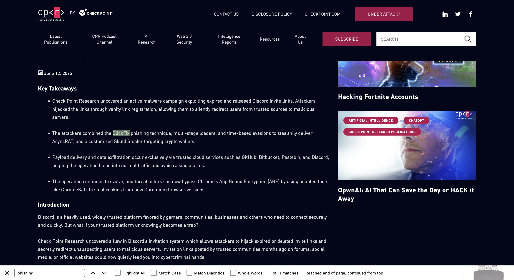

# Invite Only — TryHackMe

> **Platform:** TryHackMe  
> **Category:** Threat Intelligence  
> **Difficulty:** Medium  
> **Status:** ✅ Completed  
> **Date:** 2026-06-12  
> **Time Spent:** ~2 jam  

---

## 🎯 Scenario

Kamu adalah SOC analyst di tim SOC Managed Server Provider bernama TrySecureMe. Hari ini, kamu mendukung L3 analyst dalam investigasi flagged IPs, hash, URL, dan domain sebagai bagian dari aktivitas IR. Seorang L1 analyst mengeskalasi dua temuan mencurigakan di pagi hari — tugasmu adalah menganalisis lebih lanjut dan mengolahnya menjadi threat intelligence yang bisa digunakan.

**Flagged Indicators:**
- IP: `101[.]99[.]76[.]120`
- SHA256: `5d0509f68a9b7c415a726be75a078180e3f02e59866f193b0a99eee8e39c874f`

Tools yang digunakan: **TryDetectThis2.0** — aplikasi threat intelligence search yang baru dibeli tim.

---

## ❓ Questions

1. What is the name of the file identified with the flagged SHA256 hash?
2. What is the file type associated with the flagged SHA256 hash?
3. What are the execution parents of the flagged hash? List the names chronologically, using a comma as a separator. Note down the hashes for later use.
4. What is the name of the file being dropped? Note down the hash value for later use.
5. Research the second hash in question 3 and list the four malicious dropped files in the order they appear (from up to down), separated by commas.
6. Analyse the files related to the flagged IP. What is the malware family that links these files?
7. What is the title of the original report where these flagged indicators are mentioned? Use Google to find the report.
8. Which tool did the attackers use to steal cookies from the Google Chrome browser?
9. Which phishing technique did the attackers use? Use the report to answer the question.
10. What is the name of the platform that was used to redirect a user to malicious servers?

---

## 🔍 Answer & Walkthrough

### 1 & 2. Nama file dan tipe file dari flagged SHA256

Input flagged SHA256 ke TryDetectThis2.0 (local VirusTotal). Dari hasil scan, file teridentifikasi sebagai `syshelpers.exe` bertipe Win32 EXE — dan 51 dari 72 vendor menandainya sebagai malicious.

**Jawaban Q1:** `syshelpers.exe`  
**Jawaban Q2:** `Win32 EXE`

---

### 3. Execution parents dari flagged hash

Di tab Relations/Execution di TryDetectThis2.0, ada dua execution parent secara kronologis: `361GJX7J` sebagai parent pertama, lalu `installer.exe`. Catat hash keduanya — hash `installer.exe` akan dipakai di Q5.

**Jawaban:** `361GJX7J, installer.exe`

---

### 4. File yang di-drop

Masih dari halaman detail `syshelpers.exe`, lihat bagian dropped files. File yang di-drop adalah `AClient.exe`. Catat hash-nya untuk referensi.

**Jawaban:** `AClient.exe`

---

### 5. Empat dropped files dari installer.exe

Cari hash `installer.exe` (dari Q3) di TryDetectThis2.0. Di tab dropped files, ada 4 file malicious yang muncul secara berurutan dari atas ke bawah.

**Jawaban:** `searchhost.exe, syshelpers.exe, nat.vbs, runsys.vbs`

---

### 6. Malware family yang terhubung ke flagged IP

Buka tab Communications/Files di halaman flagged IP `101[.]99[.]76[.]120`. Dari daftar file yang berkomunikasi dengan IP ini, ambil salah satu hash dan cek di TryDetectThis2.0. Hasilnya: file diidentifikasi sebagai family **AsyncRAT** — mengonfirmasi bahwa IP ini adalah C2 server yang digunakan malware.

**Jawaban:** `asyncrat`

---

### 7 – 10. Dari laporan original

Dengan informasi AsyncRAT + flagged IP, cari di Google kombinasi keduanya. Laporan yang muncul adalah dari Check Point Research: **"From Trust to Threat: Hijacked Discord Invites Used for Multi-Stage Malware Delivery"**.

Dari laporan ini:
- Tool steal cookies Chrome → **ChromeKatz**
- Phishing technique → **ClickFix**
- Platform redirect → **Discord**

**Jawaban Q7:** `From Trust to Threat: Hijacked Discord Invites Used for Multi-Stage Malware Delivery`  
**Jawaban Q8:** `ChromeKatz`  
**Jawaban Q9:** `ClickFix`  
**Jawaban Q10:** `Discord`

---

## 🚨 Key Findings / IOCs

| Tipe | Value | Keterangan |
|------|-------|------------|
| IP Address | `101[.]99[.]76[.]120` | C2 server AsyncRAT |
| File Hash (SHA256) | `5d0509f68a9b7c415a726be75a078180e3f02e59866f193b0a99eee8e39c874f` | syshelpers.exe — AsyncRAT |
| Filename | `syshelpers.exe` | Payload utama AsyncRAT |
| Filename | `installer.exe` | Dropper — parent dari 4 payload |
| Filename | `AClient.exe` | Payload tambahan yang di-drop |
| Filename | `searchhost.exe` | Dropped file dari installer.exe |
| Filename | `nat.vbs` | Dropped VBScript dari installer.exe |
| Filename | `runsys.vbs` | Dropped VBScript dari installer.exe |

---

## 🗺️ MITRE ATT&CK Mapping

| Tactic | Technique | ID | Keterangan |
|--------|-----------|----|------------|
| Initial Access | Phishing: Spearphishing Link | T1566.002 | Hijacked Discord invite link sebagai entry point |
| Execution | Command and Scripting Interpreter: PowerShell | T1059.001 | ClickFix — korban menjalankan PowerShell secara manual |
| Execution | Command and Scripting Interpreter: Visual Basic | T1059.005 | nat.vbs dan runsys.vbs dijalankan post-infection |
| Credential Access | Steal Web Session Cookie | T1539 | ChromeKatz mencuri session cookie dari Chrome |
| Command and Control | Remote Access Software | T1219 | AsyncRAT berkomunikasi ke C2 `101[.]99[.]76[.]120` |

---

## 📋 Summary — Threat Intel Enrichment Process

Lab ini bukan soal rekonstruksi serangan dari log, tapi soal proses **enrichment** dari dua indicator yang diberikan: satu IP dan satu SHA256 hash. Proses verifikasinya langsung pakai data yang tersedia di tool, bukan dari artifact live.

### Enrichment Flow

**Hash → File → Execution Chain**

Hash SHA256 diidentifikasi sebagai `syshelpers.exe` — binary Win32 EXE yang 51 dari 72 vendor tandai sebagai malicious. Dari relasi execution parent-nya, file ini bisa dieksekusi via dua jalur: `361GJX7J` dan `installer.exe`. Dari `installer.exe` sendiri, ketika dicari hash-nya, terlihat bahwa file ini adalah dropper yang menjatuhkan 4 payload sekaligus: `searchhost.exe`, `syshelpers.exe`, `nat.vbs`, dan `runsys.vbs`. Plus satu payload tambahan yang di-drop langsung dari `syshelpers.exe`: `AClient.exe`.

**IP → C2 Confirmation → Report**

Flagged IP dicek via tab communications/files — file yang berkomunikasi ke IP ini teridentifikasi sebagai family **AsyncRAT**. Artinya, IP ini adalah C2 server. Dari sini, pencarian Google dengan kombinasi IP + AsyncRAT mengarah ke laporan Check Point Research.

**Dari Report: Konteks Serangan**

Laporan Check Point mengungkap bahwa kampanye ini memanfaatkan **Discord** sebagai platform redirect — attacker menyebarkan invite Discord yang sudah di-hijack. Ketika korban klik link-nya, mereka diarahkan ke halaman malicious yang menampilkan teknik **ClickFix**: korban diminta menjalankan PowerShell command secara manual dengan dalih "fix" masalah di halaman tersebut. Command itu mendownload `installer.exe` sebagai dropper utama. Setelah payload tertanam, attacker menggunakan **ChromeKatz** untuk mencuri session cookies dari browser Chrome — ini yang jadi tujuan akhir dari credential theft-nya.

### Todo / Follow-up

- [ ] Pelajari cara kerja ClickFix lebih detail — terutama bagaimana social engineering-nya dikemas agar korban mau eksekusi command
- [ ] Cari Sigma rules untuk deteksi pola ClickFix (user-initiated PowerShell dari browser context)
- [ ] Explore ChromeKatz: cara kerja, artifact yang ditinggalkan, dan cara deteksi
- [ ] Buat hunting query untuk komunikasi AsyncRAT di jaringan berdasarkan port/pattern yang umum dipakai

---

## 📚 References

- [Check Point Research — From Trust to Threat: Hijacked Discord Invites Used for Multi-Stage Malware Delivery](https://research.checkpoint.com/2025/from-trust-to-threat-hijacked-discord-invites-used-for-multi-stage-malware-delivery/)
- [MITRE ATT&CK — T1566.002 Spearphishing Link](https://attack.mitre.org/techniques/T1566/002/)
- [MITRE ATT&CK — T1539 Steal Web Session Cookie](https://attack.mitre.org/techniques/T1539/)
- [MITRE ATT&CK — T1219 Remote Access Software](https://attack.mitre.org/techniques/T1219/)

---

*Writeup ini dibuat sebagai bagian dari perjalanan belajar Blue Team / SOC Analyst.*
