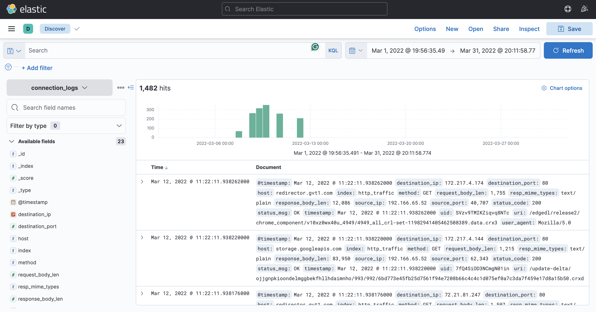
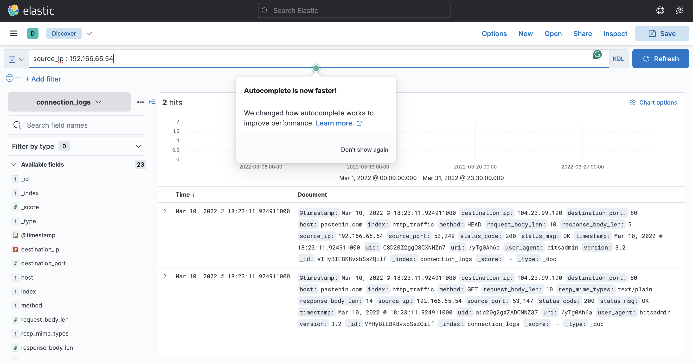
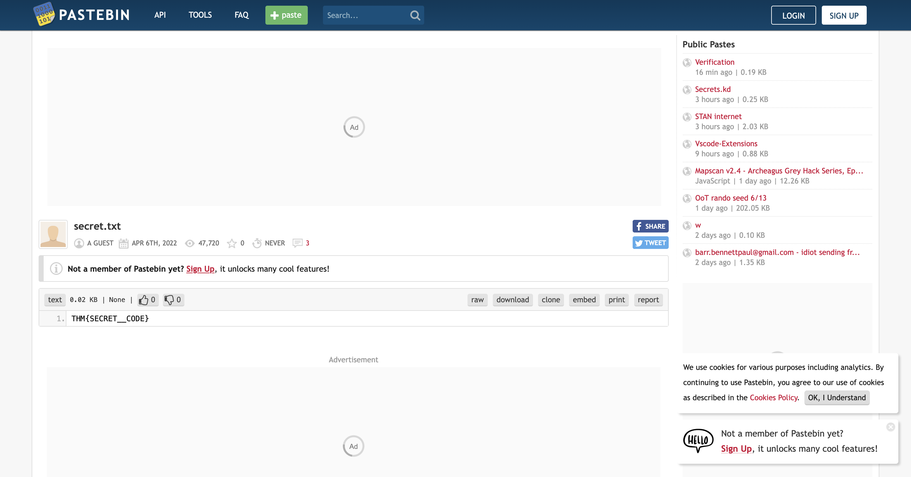

# ItsyBisy — TryHackMe

> **Platform:** TryHackMe  
> **Category:** Network Analysis / SIEM / Log Analysis  
> **Difficulty:** Medium  
> **Status:** ✅ Completed  
> **Date:** 2026-06-15  
> **Time Spent:** ~X jam  

---

## 📌 Prolog

Challenge ini datang dari alert IDS yang mendeteksi potensi komunikasi C2 dari salah satu user di departemen HR. Investigasi dilakukan menggunakan Kibana — menelusuri HTTP connection logs selama satu minggu untuk menemukan file yang diakses, URL C2, dan secret code yang tersembunyi di dalamnya.

---

## 🎯 Scenario

Selama monitoring rutin, analis SOC bernama John mendeteksi alert dari IDS yang mengindikasikan kemungkinan komunikasi C2 dari user bernama Browne di departemen HR. Ditemukan sebuah file mencurigakan yang diakses dan mengandung pola malicious dengan format `THM:{ ________ }`.

Sebagai langkah investigasi, log koneksi HTTP selama satu minggu berhasil dikumpulkan dan di-ingest ke dalam index `connection_logs` di Kibana. Karena keterbatasan resource, hanya connection logs yang tersedia — tidak ada artifact lain.

Tugas kita: telusuri log koneksi jaringan user tersebut, temukan link dan konten file yang diakses, lalu jawab pertanyaan-pertanyaan berikut.

---

## ❓ Questions

1. How many events were returned for the month of March 2022?
2. What is the IP associated with the suspected user in the logs?
3. The user's machine used a legit windows binary to download a file from the C2 server. What is the name of the binary?
4. The infected machine connected with a famous filesharing site in this period, which also acts as a C2 server used by the malware authors to communicate. What is the name of the filesharing site?
5. What is the full URL of the C2 to which the infected host is connected?
6. A file was accessed on the filesharing site. What is the name of the file accessed?
7. The file contains a secret code with the format THM{_____}.

---

## 🔍 Answer & Walkthrough

### 1. How many events were returned for the month of March 2022?

Buka Kibana Discover, set time range ke **March 1–31, 2022**, index `connection_logs`. Total event yang muncul langsung terbaca dari hit counter di bagian atas.

**Jawaban:** `1482`

---

### 2–5. IP yang dicurigai, binary yang dipakai, filesharing site, dan full URL C2

Dari total 1482 event, hanya ada **dua IP user** yang tercatat: `192.166.65.54` dan `192.166.65.52`. IP `65.52` mendominasi dengan 1480 koneksi — tapi setelah dicek, semua traffic-nya mengarah ke host legitimate seperti Google, Microsoft, dan vendor-vendor umum. Tidak ada yang mencurigakan.

Fokus pindah ke `192.166.65.54` — hanya 2 event, tapi langsung ketahuan mencurigakan. Terlihat penggunaan **bitsadmin**, sebuah Windows binary legitimate yang dipakai sebagai Living off the Land Binary (LoLBin) untuk download file dari C2. Koneksi mengarah ke **pastebin.com** dengan path `/yTg0Ah6a`.

**Jawaban:**
- IP suspected user: `192.166.65.54`
- Binary: `bitsadmin`
- Filesharing site: `pastebin.com`
- Full URL C2: `pastebin.com/yTg0Ah6a`

---

### 6–7. Nama file yang diakses dan secret code

Dengan mengakses URL C2 tersebut, ditemukan sebuah file bernama `secret.txt` yang berisi secret code dalam format yang dicari.

**Jawaban:**
- Nama file: `secret.txt`
- Secret code: `THM{SECRET__CODE}`

---

## 🚨 Key Findings / IOCs

| Tipe | Value | Keterangan |
|------|-------|------------|
| IP Address | `192.166.65.54` | Host terkompromi milik user Browne (HR) |
| Domain | `pastebin.com` | C2 server — disamarkan sebagai filesharing site |
| URL | `pastebin.com/yTg0Ah6a` | Full URL C2 yang diakses |
| File | `secret.txt` | File yang diakses dari C2 |
| Binary | `bitsadmin` | LoLBin yang dipakai untuk download dari C2 |

---

## 🗺️ MITRE ATT&CK Mapping

| Tactic | Technique | ID | Keterangan |
|--------|-----------|----|------------|
| Defense Evasion | BITS Jobs | T1197 | `bitsadmin` dipakai untuk download payload dari C2 — menyamar sebagai proses Windows yang legitimate |

---

## 📋 Summary — Attacker Behavior & Todo

### Attacker Behavior

Tidak ada informasi cukup untuk merekonstruksi initial access — scope lab memang terbatas pada connection logs di Kibana, bukan endpoint forensics. Yang bisa diamati dari log:

Dari dua IP yang tercatat di Kibana selama Maret 2022, IP `192.166.65.52` terlihat normal — traffic tinggi tapi semua ke host legitimate. IP `192.166.65.54` justru sebaliknya: sedikit koneksi, tapi langsung red flag. Mesin ini menggunakan `bitsadmin` — sebuah Windows binary bawaan yang sering disalahgunakan sebagai LoLBin — untuk melakukan koneksi keluar ke `pastebin.com/yTg0Ah6a`. Di sana tersimpan file `secret.txt` berisi secret code. Pastebin dipakai sebagai C2 karena traffic ke domain ini terlihat normal dan sulit dicurigai.

### Todo / Follow-up

- [ ] Pelajari lebih lanjut tentang BITS Jobs dan teknik LoLBin lainnya di Windows
- [ ] Eksplorasi cara mendeteksi penggunaan `bitsadmin` yang abnormal di SIEM (anomaly detection, rate, destination)
- [ ] Pelajari teknik threat actors memanfaatkan platform legitimate (pastebin, github, discord) sebagai C2 — teknik ini dikenal sebagai *Living off Trusted Sites* (LoTS)

---

## 📚 References

- [MITRE ATT&CK — T1197: BITS Jobs](https://attack.mitre.org/techniques/T1197/)
- [Kibana — Discover Tab Documentation](https://www.elastic.co/guide/en/kibana/current/discover.html)
- [Living off Trusted Sites (LoTS)](https://lots-project.com/)

---

*Writeup ini dibuat sebagai bagian dari perjalanan belajar Blue Team / SOC Analyst.*
