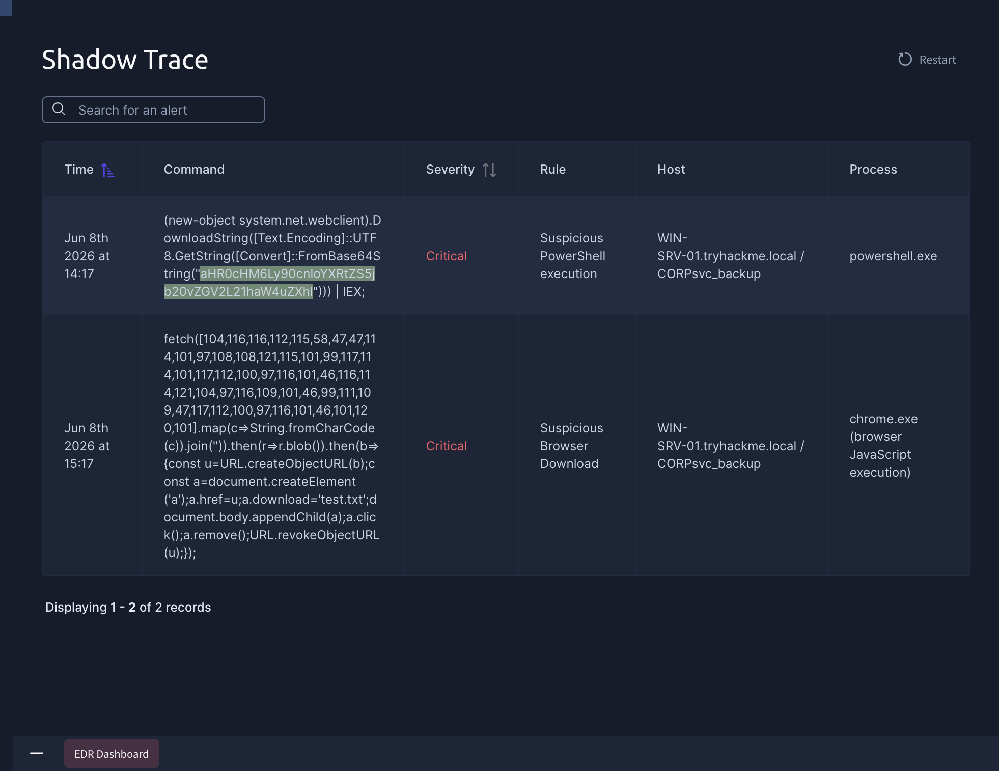
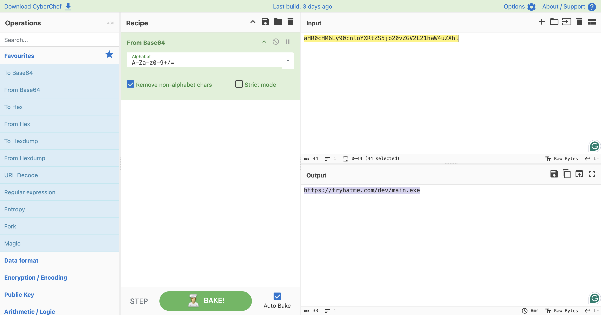
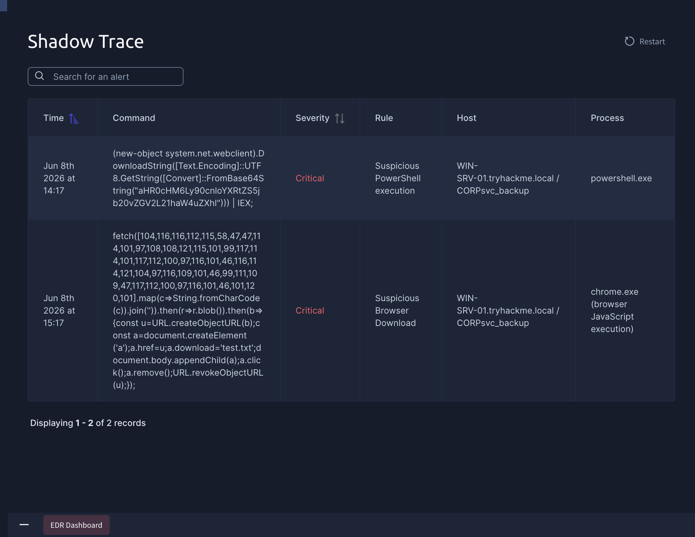
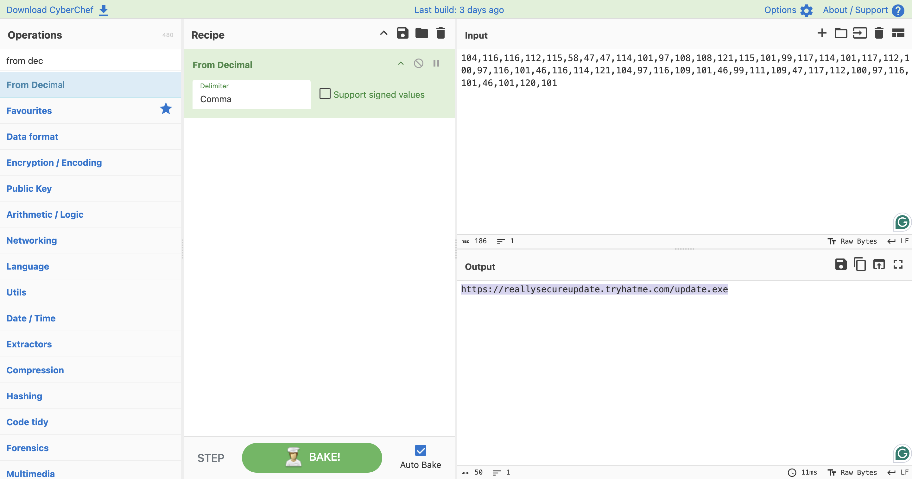
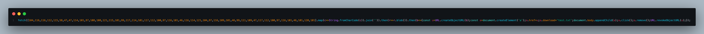

# Shadow Trace — Alert Analysis

> **Parent:** [Shadow Trace](../)  
> **Lab:** Alert Analysis  
> **Status:** ✅ Completed  

---

## 🎯 Scenario

EDR melempar beberapa alert yang berkaitan dengan proses `powershell.exe` dan `chrome.exe`. Tugas kita mengkorelasikan alert-alert ini, mengidentifikasi URL berbahaya yang terlibat, dan memahami teknik obfuscation yang dipakai attacker untuk menyembunyikan aktivitasnya.

---

## ❓ Questions

1. Can you identify the malicious URL from the alert triggered by process powershell.exe?
2. Can you identify the malicious URL from the alert triggered by chrome.exe?
3. What's the name of the file saved in the alert triggered by chrome.exe?

---

## 🔍 Answer & Walkthrough

Dua alert dari EDR perlu dikorelasikan: satu dari `powershell.exe` dan satu dari `chrome.exe`. Keduanya menggunakan teknik obfuscation berbeda untuk menyembunyikan URL target — encoded URL pada PowerShell dan ASCII obfuscation pada JavaScript di Chrome.

---

### 1. Can you identify the malicious URL from the alert triggered by process powershell.exe?

Alert menunjukkan `powershell.exe` melakukan request ke sebuah URL — kemungkinan mengarah ke C2 server untuk mengunduh payload. URL tersebut dalam kondisi encoded, sehingga perlu di-decode terlebih dahulu untuk mendapatkan nilai aslinya.

**Jawaban:** `https://tryhatme.com/dev/main.exe`

---

### 2. Can you identify the malicious URL from the alert triggered by chrome.exe?

Alert dari `chrome.exe` menunjukkan eksekusi JavaScript code yang menggunakan teknik **ASCII obfuscation** — URL disembunyikan dalam bentuk numeric array. Fokus ke bagian array numerik tersebut, decode untuk mengungkap URL aslinya.

**Jawaban:** `https://reallysecureupdate.tryhatme.com/update.exe`

---

### 3. What's the name of the file saved in the alert triggered by chrome.exe?

Alert dari `chrome.exe` menyertakan flag yang menunjukkan bahwa setelah download berhasil, nama file di-force ke nama tertentu — teknik ini dikenal sebagai **masquerading**, menyamarkan file agar terlihat tidak berbahaya.

**Jawaban:** `test.txt`

---

## 🚨 Key Findings / IOCs

| Tipe | Value | Keterangan |
|------|-------|------------|
| URL | `https://tryhatme.com/dev/main.exe` | C2 URL dari alert powershell.exe |
| URL | `https://reallysecureupdate.tryhatme.com/update.exe` | Download URL dari alert chrome.exe |
| Filename | `test.txt` | Nama file hasil masquerading |
| Technique | ASCII Obfuscation | Digunakan di JavaScript untuk sembunyikan URL |

---

## 🗺️ MITRE ATT&CK Mapping

| Tactic | Technique | ID | Keterangan |
|--------|-----------|----|------------|
| Defense Evasion | Obfuscated Files or Information | T1027 | ASCII obfuscation pada JavaScript payload |
| Defense Evasion | Masquerading | T1036 | File di-force rename ke `test.txt` |
| Command and Control | Ingress Tool Transfer | T1105 | Download payload via `powershell.exe` dan `chrome.exe` |
| Execution | Command and Scripting Interpreter: PowerShell | T1059.001 | PowerShell digunakan untuk fetch payload dari C2 |

---

## 📋 Summary

Lab Alert Analysis ini melatih korelasi EDR alert dari dua proses berbeda. `powershell.exe` melakukan download dari C2 `tryhatme.com/dev/main.exe` menggunakan URL yang di-encode — teknik umum untuk bypass basic URL filtering. Sementara `chrome.exe` mengeksekusi JavaScript yang menyembunyikan URL download dalam numeric ASCII array, mengarah ke `reallysecureupdate.tryhatme.com/update.exe`. File yang diunduh kemudian di-rename ke `test.txt` sebagai teknik masquerading — menyamarkan file executable agar tampak seperti dokumen biasa.

Dua teknik obfuscation berbeda dalam satu skenario — poin utama lab ini adalah mengenali bahwa alert tidak selalu datang dalam bentuk yang langsung terbaca, dan kemampuan men-decode obfuscated payload adalah skill dasar yang harus dimiliki SOC analyst.

### Todo / Follow-up

- [ ] Pelajari lebih dalam teknik ASCII obfuscation pada JavaScript — bagaimana cara mendeteksinya secara otomatis di SIEM
- [ ] Eksplorasi PowerShell logging (ScriptBlock Logging, Module Logging) untuk meningkatkan visibilitas command yang di-encode
- [ ] Pelajari teknik masquerading lebih lanjut — extension spoofing, double extension, dan cara deteksinya
- [ ] Coba implementasi rule YARA atau Sigma untuk mendeteksi pola numeric array obfuscation di JavaScript

---

## 📚 References

- [MITRE ATT&CK - T1027 Obfuscated Files or Information](https://attack.mitre.org/techniques/T1027/)
- [MITRE ATT&CK - T1036 Masquerading](https://attack.mitre.org/techniques/T1036/)
- [MITRE ATT&CK - T1059.001 PowerShell](https://attack.mitre.org/techniques/T1059/001/)
- [MITRE ATT&CK - T1105 Ingress Tool Transfer](https://attack.mitre.org/techniques/T1105/)

---

*Writeup ini dibuat sebagai bagian dari perjalanan belajar Blue Team / SOC Analyst.*
