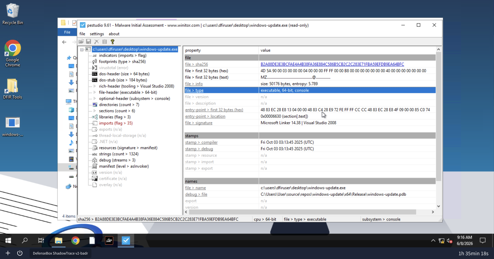
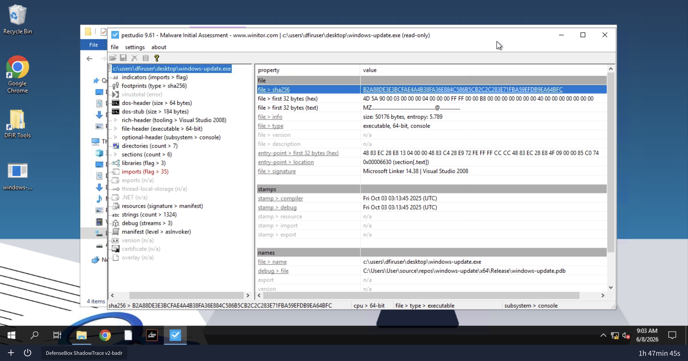
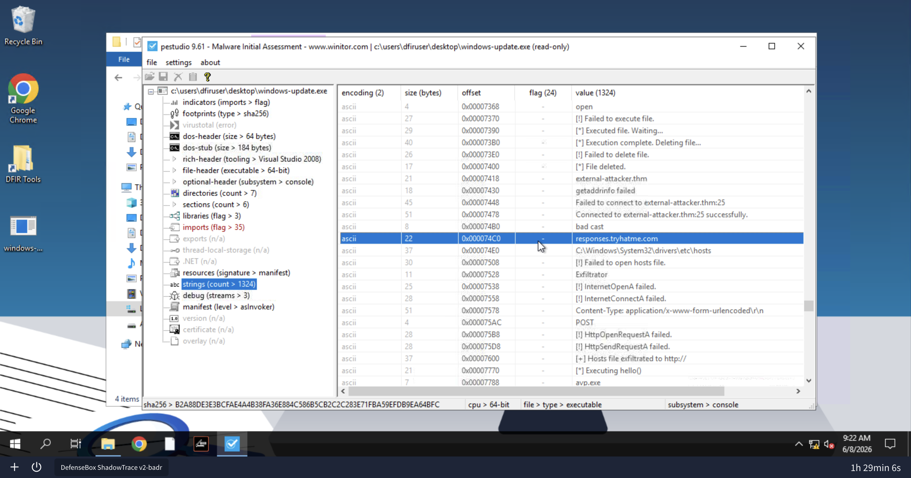
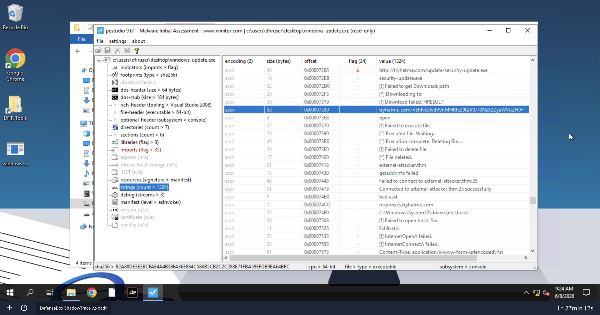
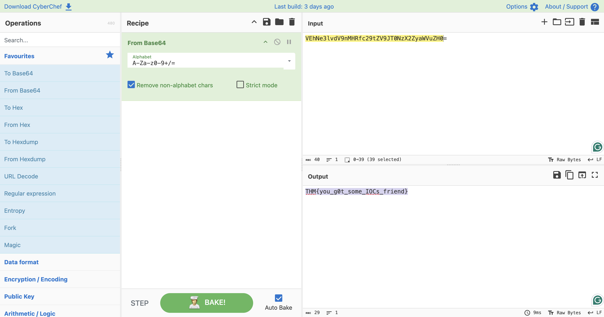
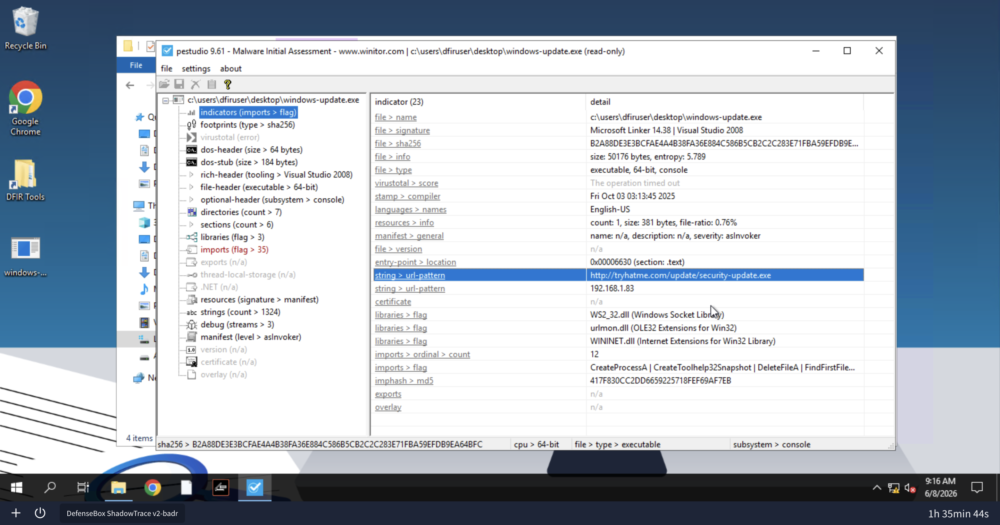

# Shadow Trace — File Analysis

> **Parent:** [Shadow Trace](../)  
> **Lab:** File Analysis  
> **Target:** `C:\Users\DFIRUser\Desktop\windows-update.exe`  
> **Tool:** PEStudio 9.61  
> **Status:** ✅ Completed  

---

## 🎯 Scenario

Analisis static binary `windows-update.exe` yang ditemukan di desktop mesin pengguna. File ini menyamar sebagai Windows Update — tugas kita membuktikan sebaliknya dan mengekstrak semua IOC yang bisa digunakan untuk deteksi dan reporting.

Tools tersedia di `C:\Users\DFIRUser\DFIR Tools`.

---

## ❓ Questions

1. What is the architecture of the binary file windows-update.exe?
2. What is the hash (sha-256) of the file windows-update.exe?
3. Identify the URL within the file to use it as an IOC
4. With the URL identified, can you spot a domain that can be used as an IOC?
5. Input the decoded flag from the suspicious domain
6. What library related to socket communication is loaded by the binary?

---

## 🔍 Answer & Walkthrough

Target adalah `windows-update.exe` — nama yang sengaja dipilih untuk menyerupai proses Windows Update yang legitim. Analisis dilakukan secara static menggunakan PEStudio 9.61.

File ini tidak di-pack (entropy 5.789), sehingga strings langsung bisa dibaca tanpa perlu unpack. Debug path yang bocor (`windows-update\x64\Release\windows-update.pdb`) mengonfirmasi file ini custom compiled dan bukan binary Windows yang asli.

Dari tab `indicators` dan `strings`, behavior malware terlihat jelas: download payload tambahan dari URL remote, eksekusi, exfiltrate hosts file ke C2, lalu self-delete.

---

### 1. What is the architecture of the binary file windows-update.exe?

Dilihat dari tab **File > Type** di PEStudio — binary ini menggunakan architecture 64-bit.

**Jawaban:** `64-bit`

---

### 2. What is the hash (sha-256) of the file windows-update.exe?

Tab **File > SHA256** di PEStudio menampilkan signature hash binary.

**Jawaban:** `B2A88DE3E3BCFAE4A4B38FA36E884C586B5CB2C2C283E71FBA59EFDB9EA64BFC`

---

### 3. Identify the URL within the file to use it as an IOC

Tab **Strings > URL Pattern** menampilkan URL yang akan dituju binary saat dieksekusi. URL ini juga terlihat di section strings secara langsung.

**Jawaban:** `http://tryhatme.com/update/security-update.exe`

---

### 4. With the URL identified, can you spot a domain that can be used as an IOC?

Dengan scroll ke bagian bawah section strings di PEStudio, ditemukan domain endpoint C2 yang ter-embed pada binary.

**Jawaban:** `responses.tryhatme.com`

---

### 5. Input the decoded flag from the suspicious domain

Masih di section strings, ditemukan path base64 yang ter-embed pada domain:
`tryhatme.com/VEhNe3lvdV9nMHRfc29tZV9JT0NzX2ZyaWVuZH0=`

Base64 di-decode menggunakan CyberChef.

**Jawaban:** `THM{you_g0t_some_IOCs_friend}`

---

### 6. What library related to socket communication is loaded by the binary?

Tab **Libraries** di PEStudio menampilkan semua DLL yang di-load oleh binary. Di sini terlihat Windows API yang digunakan untuk membuat koneksi jaringan.

**Jawaban:** `WS2_32.dll`

---

## 🚨 Key Findings / IOCs

| Tipe | Value | Keterangan |
|------|-------|------------|
| SHA-256 | `B2A88DE3E3BCFAE4A4B38FA36E884C586B5CB2C2C283E71FBA59EFDB9EA64BFC` | Hash windows-update.exe |
| URL | `http://tryhatme.com/update/security-update.exe` | URL download payload tambahan |
| Domain | `responses.tryhatme.com` | Endpoint C2 |
| Library | `WS2_32.dll` | Windows Socket Library untuk koneksi jaringan |
| Library | `urlmon.dll` | Operasi HTTP |
| Library | `WININET.dll` | Operasi HTTP |
| Debug Path | `windows-update\x64\Release\windows-update.pdb` | Bukti custom compiled |

---

## 📋 Summary

`windows-update.exe` adalah malware custom-compiled yang menyamar sebagai Windows Update. Analisis static dengan PEStudio menunjukkan binary 64-bit dengan entropy rendah (5.789) — tidak di-pack, strings langsung terbaca.

Dari strings dan indicators, behavior malware terpetakan: mengunduh payload tambahan dari `http://tryhatme.com/update/security-update.exe`, berkomunikasi ke C2 di `responses.tryhatme.com`, meload `WS2_32.dll` + `urlmon.dll` + `WININET.dll` untuk operasi jaringan, lalu self-delete setelah eksekusi. Debug path yang bocor mengonfirmasi file ini sengaja di-craft untuk menyerupai proses Windows yang legitim.

Lab ini adalah contoh klasik static analysis: tanpa menjalankan binary sekalipun, cukup dari metadata PE dan strings, kita sudah bisa mengekstrak IOC yang actionable.

---

## 📚 References

- [PEStudio](https://www.winitor.com/)
- [CyberChef](https://gchq.github.io/CyberChef/)
- [MITRE ATT&CK - T1027 Obfuscated Files or Information](https://attack.mitre.org/techniques/T1027/)

---

*Writeup ini dibuat sebagai bagian dari perjalanan belajar Blue Team / SOC Analyst.*
